ORIGINAL RESEARCH

# Relationship Between the Redox Reactions on a Bipolar Plate and Reverse Current After Alkaline Water Electrolysis

Yosuke Uchino1,2 & Takayuki Kobayashi 2 & Shinji Hasegawa1 & Ikuo Nagashima3 & Yoshio Sunada4 & Akiyoshi Manabe5 & Yoshinori Nishiki5 & Shigenori Mitsushima2

Published online: 1 October 2017 $©$ Springer Science+Business Media, LLC 2017

Abstract In order to efficiently operate the alkaline water electrolyzers with renewable energy, behaviors of the electrolyzer during start-up or shut-down must be unveiled, because they might be suffered by reverse current that naturally flows. The mechanism of the reverse current in alkaline water electrolyzer having relation between the electrolyzer operating conditions and cell voltage has been investigated using a bipolar-type electrolyzer which consists of two cells. The electrodes were nickel mesh, which are conventional electrodes for alkaline water electrolyzer. The amount of natural reverse current measured during off-load was proportional to the current loaded until just before stopping the operation. The increase in the charge would result from the increasing oxide on the anode of the bipolar plate. Cell voltages were above $1 . 4 \mathrm { V }$ at all cases just when the electrolyzer is forcibly opened the circuit to stop. The major redox couple of the reverse current would be $\mathrm { [ N i O _ { 2 } / N i O O H ] }$ and $\mathrm { [ H } _ { 2 } / \mathrm { H } _ { 2 } \mathrm { O } ]$ due to the cell voltage and the redox couples. The open circuit cell voltage of the cathode terminal side cell gradually decreased to $0 . 3 ~ \mathrm { V } ,$ , while that of the anode terminal side cell was

maintained above 1.1 V. Therefore, nickel oxides on the anode of the bipolar plate would be reduced, and the cathodic active material of hydrogen and nickel for the cathode side of the bipolar plate would be oxidized during the reverse current flows. Ultimately, the reverse current would stop when the redox state of both sides of the bipolar plate had the same oxidation state.

Keywords Alkaline water electrolysis $\cdot$ Reverse current . Bipolar plate $\cdot$ Renewable energy $\cdot$ Ni electrode

# Introduction

In order to solve global warming due to $\mathrm { C O } _ { 2 }$ emissions, the introduction of renewable energies, such as solar and wind powers, has been promoted all over the world. Because renewable energies generally accompany intermittent fluctuations, utilizing them for the electric power generation has been less commonly. The technology of energy conversion from electric power to hydrogen by water electrolysis has been expected as likely solution thanks to easier storage or transportation of hydrogen. The water electrolysis is mostly committed by water alkaline and polymer electrolyte water. For large-scale energy plants, alkaline water electrolysis has been considered cost-effective than polymer electrolyte water electrolysis, because inexpensive materials are applicable to alkaline water electrolyzer. While at the same time, the electrolyzer must be enough durable under the unsteady condition given renewable energy [1].

In chlor-alkali electrolysis, the electrolyzer is divided into two types, one is monopolar type and another is bipolar type, based on electrical connection way to them [2]. Most of

electrolyzers build up a number of cells which consist of anode, cathode, and ion exchange membrane. The electrolyzer is called monopolar type when the elements are electrically connected in parallel. The electrolyzer is called bipolar type, when elements are connected in series. In most of conventional monopolar electrolyzers, since the anodes and cathodes are electronically separated, the internal structure, production, and maintenance are simple. Instead, they are hardly acceptable high current density operation comparing to bipolar electrolyzers newly developed. On the other hand, the bipolar type directly connects the anode and cathode as a bipolar plate, which works as a separator to separate the anode chamber and cathode chamber, with twice the number of nozzles, which are the inlet and outlet of the reactant and products, of the monopolar type. At the cell design, reduction of electrical resistance of electrolyte is important because it likely increases corresponding to current density. Therefore, minimizing the gap between electrode and ion exchange membrane has been tried in order to reduce the cell voltage loss. Thanks to improvement of the cell design and performance of ion exchange membranes, higher current density operations of $5 { - } 6 \operatorname { k A } \mathrm { m } ^ { - 2 }$ were achieved with bipolar electrolyzers. As a result, the bipolar-type electrolyzer has rapidly increased in popularity since the 1990s [2]. Also, the alkaline water electrolyzer is typically the bipolar type.

In the bipolar-type alkaline water electrolysis, the electrolyte is fed via manifolds to the anode and cathode chambers. The leak circuit through the ionic conduction path of the manifolds leads to several problems. During the operation, the leak circuit allows passing the small amount of current applied to the electrolyzer through electrolyte flow in manifolds and will decrease the current efficiency [1]. For alkaline water electrolyzers, the leak current models with the equivalent circuit of the electrolyzer using Ohmic Kirchhoff were proposed in the 1990s [3, 4]. Using the models, studies of the leak current have been mostly conducted for redox flow batteries and regenerative fuel cells [5–9].

After current supply for electrolysis to the electrolyzer is cut, some amount of current naturally starts flowing through the bipolar plates in the opposite direction to the electrolysis with self-discharge of the electrodes on the bipolar plates. [1, 10–12]. This self-discharge is typically called Breverse current^ since the current in the electrolyzer is in the opposite direction to the current direction during electrolysis. This current is considered a cause of degradation of the electrodes. Therefore, the inhibition of the reverse current has been considered in the industrial electrolysis field [13, 14].

However, the mechanism of the reverse current in the alkaline water electrolyzer has hardly been investigated. Particularly, the relations with the redox reaction of an oxidant and a reductant have never been investigated. Therefore, in fact, the design of the electrolyzer for improvement of its

durability has depended on experience in the industrial electrolysis field.

In this study, we have investigated the relationship among the operating conditions of the alkaline water electrolyzer, the cell voltage, and reverse current to clarify its mechanism.

# Experiment Method and Analytical Model

# Experiment Method

Figure 1 shows the experimental electrolysis system. The electrolyzer consisted of two cells which were electrically connected in series and connected to external manifolds.

All the plumbings individually connecting A–C, B–D, G–I, and H–J used Teflon tube of $8 5 0 ~ \mathrm { m m }$ in length and $4 ~ \mathrm { m m }$ in internal diameter. The anodes and cathodes were Ni mesh. Nafion membranes (NRE212CS) were used as the separators. The projected area of the electrodes was $2 7 . 8 \ \mathrm { c m } ^ { 2 }$ . The volume of each electrode chamber was $5 0 ~ \mathrm { m L }$ . The 7.0 M (= mol dm−3 ) NaOH electrolyte solution was fed to each electrode chamber at a rate of $2 5 \mathrm { \ m L \ m i n ^ { - 1 } }$ . The temperature of the inlet electrolyte was controlled at $2 5 ~ ^ { \circ } \mathrm { C }$ using a heat exchanger. The generated hydrogen and oxygen gases in the cells were led to the tanks, which were provided for anode and cathode sides, respectively. Since gas accompanies electrolyte, tank functions as gas and liquid separator.

Before measuring reverse current from the cells, electrolysis was conducted for $6 0 ~ \mathrm { { m i n } }$ under the current density between 100 and $6 0 0 \mathrm { m A c m } ^ { - 2 }$ . By the timing of cutting current supply to the electrolyzer with the circuit breaker, measurement of reverse current as flowing ionic current through the plumbing and cell voltages was started. $U _ { 1 }$ and $U _ { 2 }$ are the cell voltages measured the anode and cathode terminals on cells, respectively. The reverse current was measured with a DC milliampere clamp meter (KEW 2500) at a, b, g, and h in Fig. 1.

The internal resistances of the cells, $R _ { \mathrm { i n t } } ,$ were measured by the AC impedance method with the AC amplitude of $1 0 \mathrm { m V }$ in the frequency range of $1 0 0 \mathrm { k H z }$ to $1 0 0 ~ \mathrm { { m H z } }$ at 1.8, 2.0, and $2 . 3 \mathrm { ~ V ~ }$ cell voltages. $R _ { \mathrm { a - c } }$ , $R _ { \mathrm { b - d . } }$ , $R _ { \mathrm { g - i } } ,$ , and $R _ { \mathrm { h - j } }$ are the ionic resistances of each plumbing (A–C, B–D, G–I, and H–J). The $R _ { \mathrm { g - i } }$ and $R _ { \mathrm { h - j } }$ increase with a decrease in the electrolyte fill level in their tubes by gas evolution during electrolysis. During the shutdown condition, their resistances are the same because the tubes filled with the same electrolyte have the same length. Therefore, the resistances of these plumbings of $R _ { \mathrm { a - c } }$ , $R _ { \mathrm { b - d } }$ , $R _ { \mathrm { g - i } } .$ , and $R _ { \mathrm { h - j } }$ are defined as $R _ { \mathrm { m } }$ . In order to determine $R _ { \mathrm { m } }$ , the electrolyte filled tube was also measured using an H-shaped cell.

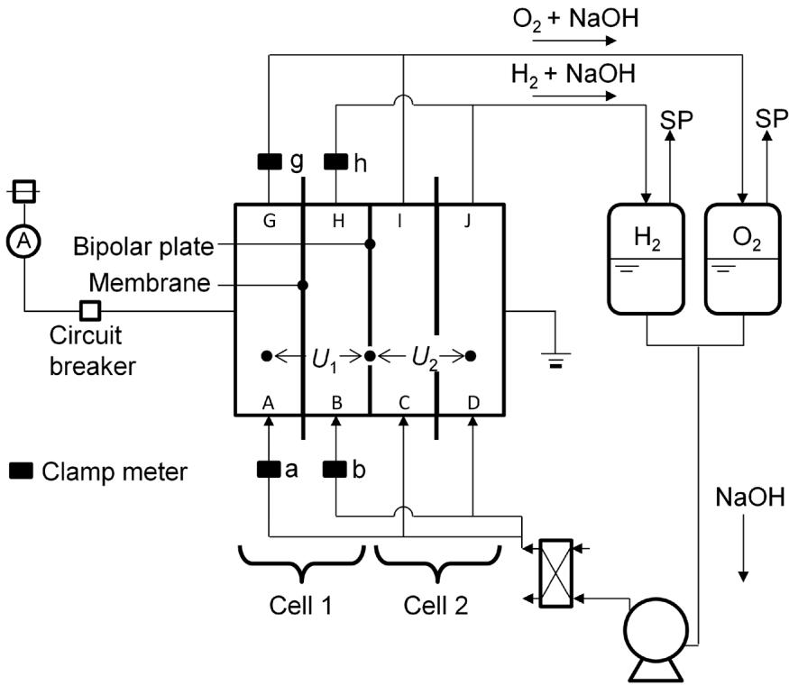
Fig. 1 Schematic drawing of the experimental system

# Potential Profile Model

The potential distribution of the water electrolyzer has been well studied [1, 15, 16]. Divisek et al. described a onedimensional potential profile of a bipolar electrolyzer during electrolysis [1]. However, a one-dimensional profile of a bipolar electrolyzer after electrolysis has not been proposed. We propose the one-dimensional profile of a bipolar electrolyzer after electrolysis in Fig. 2 during electrolysis (a) and after electrolysis at open circuit (b). This potential profile is based on the electrode potential at the cathode of cell 2 as reference.

The symbols in Fig. 2 are defined as follows. $U _ { 1 }$ and $U _ { 2 }$ are the cell voltages of the anode terminal and the cathode terminal sides, respectively. Especially, $U _ { \mathrm { 1 ~ i n i t i a l } }$ and $U _ { 2 \underline { { { \mathrm { ~ i n i t i a l } } } } }$ show the initial voltages just after electrolysis. $U _ { 0 }$ shows the standard electrode potential difference between the anode and cathode, which is the electromotive force for the reverse current after electrolysis. The anode and the cathode are named for the water electrolysis, although the same terms are used even for the reverse current condition. $\varPhi$ is the inner potentials, and the subscripts of s, c, a, t, and b are the solution (electrolyte), cathode side, anode side, terminal side, and bipolar plate side, respectively. The $\eta _ { \mathrm { c } }$ and $\eta _ { \mathrm { a } }$ are the overpotentials of the cathode side and the anode side on the bipolar plate, respectively. If the ohmic drop is negligible, $\varPhi _ { \mathrm { m , c , b } }$ is the same as $\phi _ { \mathrm { m , a , b } }$ , so that $U _ { 1 }$ and $U _ { 2 }$ are $\varPhi _ { \mathrm { m , a , t } } - \varPhi _ { \mathrm { m , c , b } }$ and $\phi _ { \mathrm { m , a , b } } - \phi _ { \mathrm { m , c , t } } ,$ respectively.

When the ionic conduction circuit of the manifold opens, the reverse current is 0; therefore, $\eta _ { \mathrm { c } }$ and $\eta _ { \mathrm { a } } = 0$ ; $U _ { \mathrm { 1 \ m i t i a l } } = U _ { \mathrm { 2 \ m i t i a l } } = \phi _ { \mathrm { m , a , t } } - \phi _ { \mathrm { m , c , b } } = \phi _ { \mathrm { m , a , b } } - \phi _ { \mathrm { m , c , t } } = U _ { 0 }$ .

When the conduction circuit closes, the reverse current flows; therefore, $\eta _ { \mathrm { c } }$ and $\eta _ { \mathrm { a } }$ have positive values

$$
U _ {1} = \Phi_ {\mathrm {m}, \mathrm {a}, \mathrm {t}} - \Phi_ {\mathrm {m}, \mathrm {c}, \mathrm {b}} = U _ {0} - \eta_ {\mathrm {c}} \tag {1}
$$

$$
U _ {2} = \Phi_ {\mathrm {m}, \mathrm {a}, \mathrm {b}} - \Phi_ {\mathrm {m}, \mathrm {c}, \mathrm {t}} = U _ {0} - \eta_ {\mathrm {a}} \tag {2}
$$

$$
\eta_ {\mathrm {c}} = \Phi_ {\mathrm {m}, \mathrm {c}, \mathrm {b}} - \Phi_ {\mathrm {s}, \mathrm {c}, \mathrm {b}} = U _ {1 \_ i n i t i a l} - U _ {1} \tag {3}
$$

$$
\eta_ {\mathrm {a}} = U _ {0} - U _ {2} \tag {4}
$$

Here, we suggest that the reverse current occurs due to the potential difference: $\Delta U = \varPhi _ { \mathrm { s , c , b } } - \varPhi _ { \mathrm { s , a , b } }$ , of both sides on the bipolar plate.

$$
\begin{array}{l} \Delta U = \Phi_ {\mathrm {s}, \mathrm {c}, \mathrm {b}} - \Phi_ {\mathrm {s}, \mathrm {a}, \mathrm {b}} = U _ {0} - \eta_ {\mathrm {c}} - \eta_ {\mathrm {a}} \\ = U _ {0} - \left(U _ {1, \text {i n i t i a l}} - U _ {1}\right) - \left(U _ {0} - U _ {2}\right) \\ = U _ {2} - \left(U _ {1, \text {i n i t i a l}} - U _ {1}\right) \tag {5} \\ \end{array}
$$

# Equivalent Circuit Model

Figure 3 shows an equivalent circuit for the experimental system. The $\eta _ { \mathrm { a } }$ and $\eta _ { \mathrm { c } }$ values are the anode and cathode overvoltages, respectively. $U _ { 0 }$ is the theoretical decomposition voltage of $1 . 2 3 \mathrm { ~ V ~ }$ during electrolysis, and the electromotive force voltage after electrolysis. $R _ { \mathrm { i n t } }$ is the internal resistance between the anode and cathode.

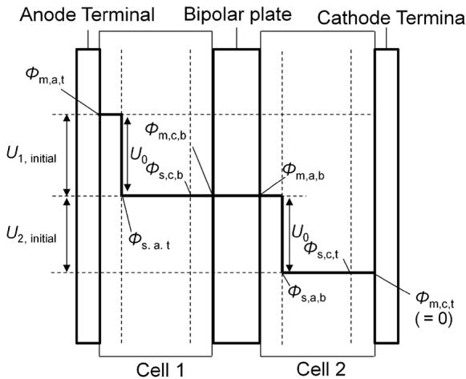
a

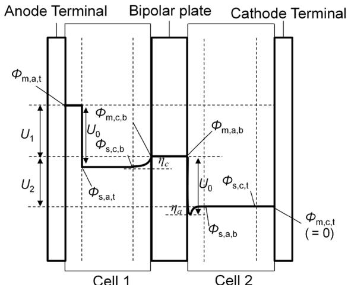
b
Fig. 2 One-dimensional potential profile of a bipolar electrolyzer after electrolysis without (a) and with (b) ionic conduction between cells 1 and 2 through the manifolds

The electronic reverse current flows only through the bipolar plate. Since the bipolar plate electrically shorts between both sides, the terminal plates are electronically isolated from any of the other parts. The ionic reverse current flows via $R _ { \mathrm { m } }$ and $R _ { \mathrm { i n t } }$ . Therefore, the measured reverse currents of $I _ { \mathrm { r \_ a c } }$ , Ir_bd, $I _ { \mathrm { r \_ g i } }$ , and $I _ { \mathrm { r \_ h j } }$ are shown as Eq. (6).

$$
\begin{array}{l} I _ {\mathrm {r} \_ \mathrm {a c}} = I _ {\mathrm {r} \_ \mathrm {b d}} = I _ {\mathrm {r} \_ \mathrm {g i}} = I _ {\mathrm {r} \_ \mathrm {h j}} = \Delta U / \left(R _ {\mathrm {m}} + R _ {\mathrm {i n t}}\right) \\ = \left\{U _ {2} - \left(U _ {1 \_ i n i t i a l} - U _ {1}\right) \right\} / \left(R _ {\mathrm {m}} + R _ {\mathrm {i n t}}\right) \tag {6} \\ \end{array}
$$

As a result, the total reverse current, $I _ { \mathrm { r } } ,$ is described by Eq. (7).

$$
\begin{array}{l} I _ {\mathrm {r}} = I _ {\mathrm {r} \cdot \mathrm {a c}} + I _ {\mathrm {r} \cdot \mathrm {b d}} + I _ {\mathrm {r} \cdot \mathrm {g i}} + I _ {\mathrm {r} \cdot \mathrm {h j}} \\ = 4 \Delta U / \left(R _ {\mathrm {m}} + R _ {\text {i n t}}\right) = 4 \left\{U _ {2} - \left(U _ {1, \text {i n i t i a l}} - U _ {1}\right) \right\} / \left(R _ {\mathrm {m}} + R _ {\text {i n t}}\right) \tag {7} \\ \end{array}
$$

# Results and Discussion

Figure 4 shows the relationship between the loading current density and cell voltages of the electrolyzer with a constant current measurement. The two cells showed almost the same

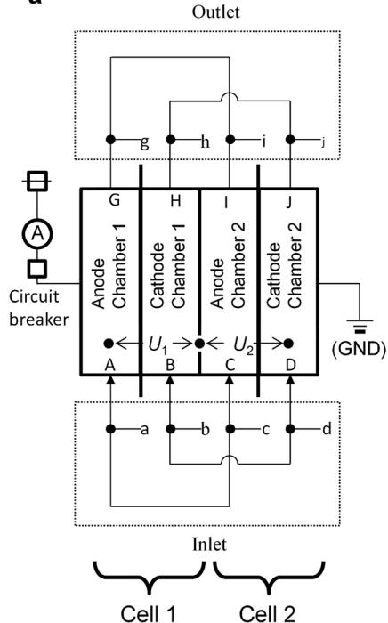
a

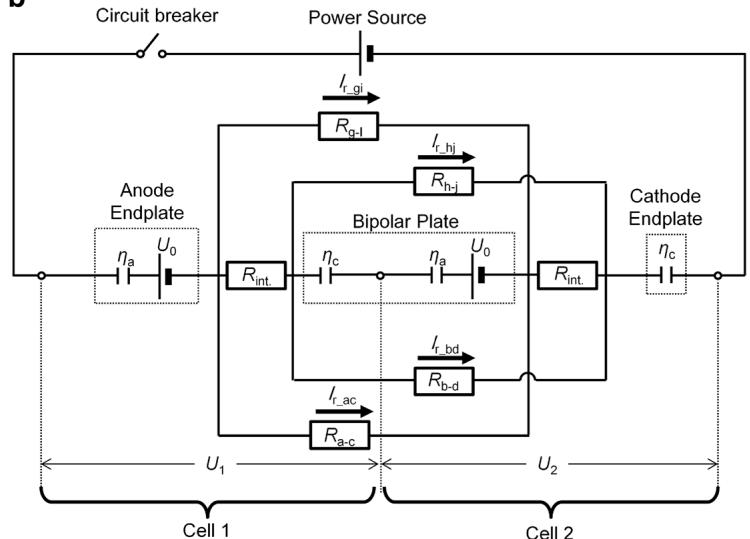
b
Fig. 3 Simplified experimental system (a) and model of the equivalent circuit of the experimental system (b)

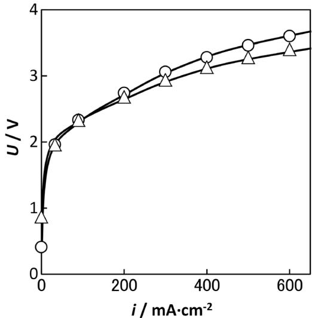
Fig. 4 Relationship between loading current density and cell voltages: $U _ { 1 }$ (circles) and $U _ { 2 }$ (triangles)

polarization curves. They have the typical shape for water electrolysis, and the voltage can be described as $U = U ^ { \circ } +$ $( a + b \log i ) + i R$ , where the first, second, and third terms are the theoretical decomposition voltage, cumulative overpotential of the electrode reactions, and ohmic polarization of the internal resistance, respectively. In the low current density region, the overvoltage dominates the cell voltage behavior, and the ohmic polarization dominates the slope of the cell voltage in the high current density region. Therefore, the slightly different behavior between $U _ { 1 }$ and $U _ { 2 }$ would be affected by the iR term such as placing of the membrane in the cells. This difference would be low enough to discuss the mechanism of the reverse current.

Figure 5 shows the high-frequency intercept on the real axis of the AC impedance measurement for the cells. The impedances were almost constant above $2 . 5 \ \mathrm { k H z }$ for all the

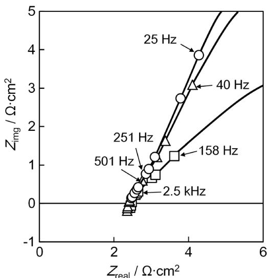
Fig. 5 High-frequency intercept on real axis in Cole-Cole plot of the cells at 1.8 V (circles), 2.0 V (triangles), and 2.3 V (squares)

cell voltages as parallel resistance of $R _ { \mathrm { m } }$ and $R _ { \mathrm { i n t } }$ . Assuming that the $R _ { \mathrm { m } }$ is excessively bigger than $R _ { \mathrm { e } }$ , $R _ { \mathrm { i n t } }$ is presumed to be almost same as $R _ { \mathrm { e } }$ . Therefore, this value should be considered as the internal resistance, $R _ { \mathrm { i n t } } ,$ which is the sum of the ionic and electronic resistances. In gas evolution electrolyzers, the ionic resistance increases with the gas bubble generation because the gas bubbles between the electrodes increase with the current. Therefore, the internal resistance increases with the cell voltage for the electrolyzer. In these experiments, the average of $R _ { \mathrm { i n t } }$ of cell 1 and cell 2 was $2 . 4 ~ \Omega ~ \mathrm { c m } ^ { 2 }$ in the cell voltage region from 1.8 to $2 . 0 \mathrm { V } .$ The resistance of the plumbing was $1 8 . 9 \Omega \mathrm { c m } ^ { - 1 }$ , and cells 1 and 2 had 85 cm of inlet and outlet-connected plumbing. Therefore, the ionic resistance of the manifold excluding bubbles, $R _ { \mathrm { m } } .$ , was $1 . 6 1 \times 1 0 ^ { 3 } \Omega$ .

Figure 6 shows the measured (solid line) and calculated (dashed line) reverse current using Eq. (7) (a) and the cell voltages (b) as a function of time after various electrolysis currents for $6 0 \mathrm { { m i n } }$ . After the electrolysis, the reverse current flowed for around 80 min for all the loading currents. $U _ { 1 }$ and $U _ { 2 }$ were about $1 . 6 \mathrm { V }$ immediately after the electrolysis regardless of the current density. $U _ { 1 }$ was almost constant around $1 . 2 \mathrm { ~ V ~ }$ from 10 to $1 4 0 ~ \mathrm { m i n }$ . On the other hand, $U _ { 2 }$ gradually

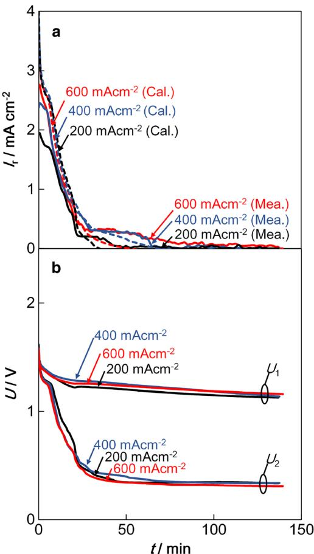
Fig. 6 Reverse current of measured (solid line) and calculated (dashed line) with Eq. (7) (a) and cell voltages (b) as a function of time after 60 min of electrolysis at 200, 400, and $6 0 0 \mathrm { m A c m } ^ { - 2 }$ b

decreased to around $0 . 4 \mathrm { V }$ after $4 0 \mathrm { { m i n } }$ , and then, the reverse current stopped around $1 0 0 \mathrm { m i n }$ . $U _ { 1 }$ and $U _ { 2 }$ were then around 1.15 and $0 . 3 ~ \mathrm { V } ,$ respectively.

The dashed line of the calculated current was almost the same as the solid line of the measured current from a few minutes to 40 min. During the electrolysis, the outlet plumbing of the manifolds was a two-phase flow of the electrolyte and the generated gas bubbles, while the total ionic resistance of the plumbing had the same value of the $R _ { \mathrm { m } }$ that was assumed to be filled with the electrolyte. Therefore, the actual resistance of the outlet plumbing would be greater than the $R _ { \mathrm { m } } .$ so that the measured current was lower than the calculated current. After 40 min, the measured current was greater than the calculated current for all the loading currents. The analytical model estimates the overvoltage with $U _ { \mathrm { 1 ~ i n i t i a l } }$ , because $U _ { \mathrm { 1 \_ i n i t i a l } }$ was assumed to be the electromotive force for all periods; however, it would slightly decrease with time according to the change in the surface and produce fewer errors of the calculated current.

Figure 7 shows the electric charge of the reverse current: $Q _ { \mathrm { r , t o t l } } ( t ) ~ ( = \int _ { 0 } ^ { t } I _ { \mathrm { r } } d t ~ )$ as a function of the current density. The electric charge of the reverse current increased with the increase in the current density. Equations (8) to (12) shown below should be the possible reactions of the electromotive force of the reverse current, and their active materials would increase with the current density. The dissolved hydrogen and oxygen would be saturated during electrolysis. Thus, they could not affect the increase in the electric charge. The cathode would not change, because the surface of the cathode would be metal. The amount of nickel oxide on the nickel anode would increase with the anode potential that corresponds to the load current [17]. Therefore, the increase in the electric charge with the loading current density would be mainly affected by the increase in the nickel oxide on the anode of the bipolar plate.

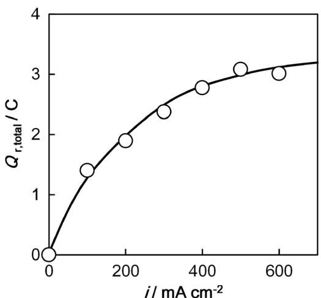
Fig. 7 Electric charge of the reverse current as a function of the current density during 60 min electrolysis

Candidates of the reverse current reaction with the electromotive force of $U _ { 0 }$ were predicted by the Pourbaix diagram [18, 19] as follows. It should be reduction of the oxidized anode surface of $\mathrm { N i O } _ { 2 }$ to NiOOH or NiOOH to $\mathrm { N i } ( \mathrm { O H } ) _ { 2 }$ , and dissolved oxygen to $\mathrm { O H } ^ { - }$ , and the oxidation of the cathode surface of Ni to $\mathrm { N i } ( \mathrm { O H } ) _ { 2 }$ or dissolved hydrogen to $_ \mathrm { H _ { 2 } O }$ .

Anode side (cathodic reactions):

$$
\mathrm {N i O} _ {2} + \mathrm {H} _ {2} \mathrm {O} + \mathrm {e} ^ {-} \rightarrow \mathrm {N i O O H} + \mathrm {O H} ^ {-} \tag {8}
$$

$$
E ^ {\circ} = 1. 4 3 4 - 0. 0 5 9 \mathrm {p H} (\mathrm {V} \text {v s . S H E})
$$

$$
\mathrm {N i O O H} + \mathrm {H} _ {2} \mathrm {O} + \mathrm {e} ^ {-} \rightarrow \mathrm {N i} (\mathrm {O H}) _ {2} + \mathrm {O H} ^ {-} \tag {9}
$$

$$
E ^ {\circ} = 1. 3 0 5 - 0. 0 5 9 \mathrm {p H} (\mathrm {V} \text {v s . S H E})
$$

$$
\mathrm {O} _ {2} + 2 \mathrm {H} _ {2} \mathrm {O} + 4 \mathrm {e} ^ {-} \rightarrow 4 \mathrm {O H} ^ {-} \tag {10}
$$

$$
E ^ {\circ} = 1. 2 2 8 - 0. 0 5 9 \mathrm {p H} (\mathrm {V v s . S H E})
$$

Cathode side (anodic reactions):

$$
\mathrm {N i} + 2 \mathrm {O H} ^ {-} \rightarrow \mathrm {N i} (\mathrm {O H}) _ {2} + 2 \mathrm {e} ^ {-} E ^ {\circ} = 0. 1 1 0 - 0. 0 5 9 \mathrm {p H} (\mathrm {V} \text {v s . S H E}) \tag {11}
$$

$$
\mathrm {H} _ {2} + \mathrm {O H} ^ {-} \rightarrow \mathrm {H} _ {2} \mathrm {O} + 2 \mathrm {e} ^ {-} E ^ {\circ} = 0. 0 0 0 - 0. 0 5 9 \mathrm {p H} (\mathrm {V} \text {v s . S H E}) \tag {12}
$$

Figure 8 is a diagram of the $E ^ { \circ } \mathbf { s }$ for the candidate reactions. The maximum electromotive force is 1.434 V due to the combination of $[ \mathrm { N i O O H N i } ( \mathrm { O H } ) _ { 2 } ]$ and $\mathrm { [ H } _ { 2 } / \mathrm { H } _ { 2 } \mathrm { O } ]$ . $U _ { 1 }$ and $U _ { 2 }$ were about $1 . 6 \mathrm { ~ V ~ }$ immediately after the electrolysis, regardless of the current density. Therefore, the combination of $[ \mathrm { N i O } _ { 2 } /$ NiOOH] and $\mathrm { [ H } _ { 2 } / \mathrm { H } _ { 2 } \mathrm { O } ]$ would be the most possible couple

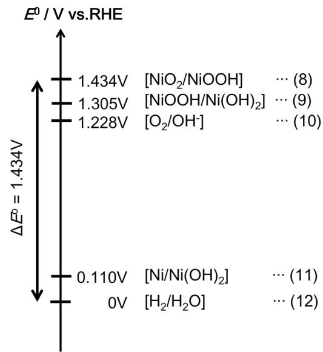
Fig. 8 Diagram of the $E ^ { \circ } \mathbf { s }$ of the candidate reactions of the electromotive force: $U _ { 0 }$ is the reverse current

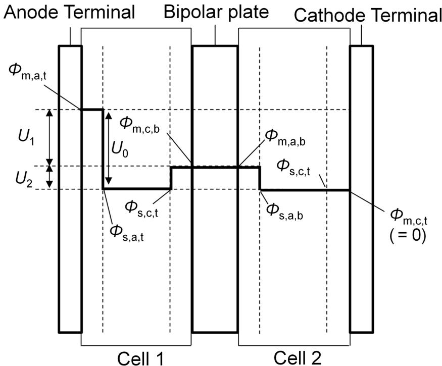
Fig. 9 One-dimensional profile of a bipolar electrolyzer when the reverse current stops

in these reactions immediately after the electrolysis. The oxidation of dissolved hydrogen to $_ \mathrm { H _ { 2 } O }$ would soon finish due to the limited hydrogen, and the oxidation of nickel on the cathode side of the bipolar plate would start. Finally, the reverse current finished after $U _ { 2 }$ became about $0 . 3 \mathrm { ~ V ~ } .$ The nickel on the cathode side would be continuously oxidized, while the nickel oxide of the anode side would be continuously reduced. At this moment, the state of both sides of the bipolar plate must become the same. The one-dimensional profile of a bipolar electrolyzer after electrolysis is shown Fig. 9. The measurement results then suggested that $U _ { 1 }$ , $U _ { 2 }$ , and $U _ { 0 }$ are in the ranges of 1.1– 1.2, 0.3–0.4, and $1 . 4 { \mathrm { - } } 1 . 6 \ \mathrm { V } .$ Therefore, the anode terminal side and the cathode terminal side would be $[ \mathrm { N i O } _ { 2 } /$ NiOOH] and $\mathrm { [ H } _ { 2 } / \mathrm { H } _ { 2 } \mathrm { O } ]$ , respectively, and both sides of the bipolar plate would be an intermediate hydrate of nickel hydroxide.

# Conclusions

The mechanism of the reverse current in alkaline water electrolyzer having relation between the electrolyzer operating conditions and cell voltage has been investigated using a bipolar-type electrolyzer which consists of two cells. The amount of natural reverse current measured during off-load was proportional to the current loaded until just before stopping the operation. The increase in the charge would result from an increase in the oxide on the anode on the bipolar plate. Cell voltages were above $1 . 4 \mathrm { ~ V ~ }$ at all cases just when the electrolyzer is forcibly opened the circuit to stop. Therefore,

the major redox couple of the reverse current would be $[ \mathrm { N i O } _ { 2 } /$ NiOOH] and $\mathrm { [ H } _ { 2 } / \mathrm { H } _ { 2 } \mathrm { O } ]$ . The open circuit cell voltage of the anode terminal cell gradually decreased to 0.3 V, while that of the cathode terminal cell was maintained above $1 . 1 \ \mathrm { V } .$ . Therefore, the anodic active material of the bipolar plate would be reduced, and the cathodic active material of the bipolar plate would be oxidized with the reverse current. Ultimately, it is inferred that the reverse current stopped when the redox state of the both sides of the bipolar plate became the same.

Acknowledgements This work was performed as one of the activities of alkaline water electrolysis research workshop cooperated by Asahi Kasei Co., Kawasaki Heavy Industries Ltd., ThyssenKrupp Uhde Chlorine Engineers (Japan) Ltd., De Nora Permelec Ltd., and Yokohama National University. The authors appreciate the person concerned.

Nomenclature: $U _ { 1 }$ Voltages of anode terminal cell, $U _ { 2 }$ Voltages of cathode terminal cell, $U _ { 0 }$ Theoretical decomposition voltage/electromotive force voltage, $\boldsymbol { \varPhi } _ { \mathrm { s , c , t } }$ Absolute electrostatic potential at the outside of the cathodic double layer on the cathode of the terminal, $\boldsymbol { \varPhi } _ { \mathrm { m . c , t } }$ Absolute electrostatic potential on the cathode of the terminal, $\varPhi _ { \mathrm { s , a , t } }$ Absolute electrostatic potential at the outside of the anodic double layer on the anode of the terminal, $\varPhi _ { \mathrm { m , a , t } }$ Absolute electrostatic potential of the anode on the anode terminal, $\varPhi _ { \mathrm { s , c , b } }$ Absolute electrostatic potential at the outside of the cathodic double layer on the bipolar plate, $\varPhi _ { \mathrm { m . c , b } }$ Absolute electrostatic potential on the cathode of the bipolar plate, $\varPhi _ { \mathrm { s , a , b } }$ Absolute electrostatic potential at the outside of the anodic double layer on the anode of the bipolar plate, $\varPhi _ { \mathrm { m , a , b } }$ Absolute electrostatic potential on the anode of the bipolar plate, $\eta _ { \mathrm { c } }$ , $\eta _ { \mathrm { a } }$ Cathodic or anodic overpotential, $R _ { \mathrm { a - c } } { - } R _ { \mathrm { h - j } }$ Ionic resistance of each manifold, $I _ { \mathrm { r _ { - } a c } } { - } I _ { \mathrm { r _ { - } h j } }$ Measured reverse currents through each manifold, $I _ { \mathrm { r } }$ Total reverse currents, $R _ { \mathrm { i n t } }$ Internal resistance of a cell, $\mathcal { Q } _ { \mathrm { r , t o t l } }$ Charge of reverse current amount, $E ^ { \circ }$ Standard electrode potential

# References
