# Cathodic Protection System against a Reverse-Current after Shutdown in Zero-Gap Alkaline Water Electrolysis

Yoona Kim, $^{\parallel}$ Sang-Mun Jung, $^{\parallel}$ Kyu-Su Kim, Hyun-Yup Kim, Jaesub Kwon, Jinhyeon Lee, Hyun-Seok Cho, and Yong-Tae Kim*

Cite This: JACS Au 2022, 2, 2491-2500

Read Online

ACCESS

Metrics & More

Article Recommendations

Supporting Information

ABSTRACT: Growing the hydrogen economy requires improving the stability, efficiency, and economic value of water-splitting technology, which uses an intermittent power supply from renewable energy sources. Alkaline water electrolysis systems face a daunting challenge in terms of stabilizing hydrogen production under the condition of transient start-up/shut-down operation. Herein, we present a simple but effective solution for the electrode degradation problem induced by the reverse-current under transient power condition based on a fundamental understanding of the degradation mechanism of nickel (Ni). It was clearly demonstrated that the Ni cathode was irreversibly oxidized to

either the $\beta\text{-Ni(OH)}_2$ or NiO phases by the reverse-current flow after shut-down, resulting in severe electrode degradation. It was also determined that the potential of the Ni electrode should be maintained below $0.6\mathrm{V}_{\mathrm{RHE}}$ under the transient condition to keep a reversible nickel phase and an activity for the hydrogen evolution reaction. We suggest a cathodic protection approach in which the potential of the Ni electrode is maintained below $0.6\mathrm{V}_{\mathrm{RHE}}$ by the dissolution of a sacrificial metal to satisfy the above requirement; irreversible oxidation of the cathode is prevented by connecting a sacrificial anode to the Ni cathode. In the accelerated durability test under a simulated reverse-current condition, lead was found to be the most promising candidate for the sacrificial metal, as it is cost effective and demonstrates chemical stability in the alkaline media. A newly defined metric, a reverse-current stability factor, highlights that our system for protecting the cathode against the reverse-current is an efficient strategy for stable and cost effective alkaline hydrogen production.

KEYWORDS: hydrogen energy, alkaline water electrolysis, load fluctuation, reverse current, cathodic protection

# INTRODUCTION

Generation of renewable energy using various mechanisms, such as solar photovoltaics and wind turbines, has been rapidly developing in recent years. Despite their sustainability and environmental responsibility, the intermittency of their activity presents a significant technical barrier to their widespread substitution for fossil fuels. Intermittent renewables, which depend on weather and climate conditions, present challenges because they disrupt the conventional methods for planning the daily operation of electric grids. Thus, the fluctuating power obtained from renewables creates a requirement for large-scale short- and long-term energy storage to ensure stability.

Traditional energy storage systems, such as lithium-ion batteries, cannot cost-effectively store sufficient energy to provide large-scale and long-term energy storage needed to regulate the intermittency of renewables and supply a stable source of electric power.[6,7] Hydrogen production by electricity-driven water-splitting has long been considered an attractive energy storage system.[8,9] Alkaline water electrolysis (AWE) is the most widely used among various water-splitting

technologies in large-scale hydrogen production technology at an industrial level. $^{10}$

Although AWE generates lower current densities and system efficiencies than polymer electrolyte membrane water electrolysis (PEMWE), it functions with earth-abundant non-noble catalysts that are typically unstable in acidic media, and, as such, markedly reduces the electrolyzer system and hydrogen production costs.[11,12] As promising electrocatalysts for hydrogen evolution reactions (HERs), various transition metals, hydroxides, phosphides, sulfides, and nitrides have been examined for their potential to accelerate reaction kinetics as alternatives to noble metals such as platinum.[13-22] Furthermore, the zero-gap cell design required for AWE can be created by compressing two porous electrodes on either side of

Received: May 21, 2022

Revised: August 11, 2022

Accepted: August 11, 2022

Published: August 22, 2022

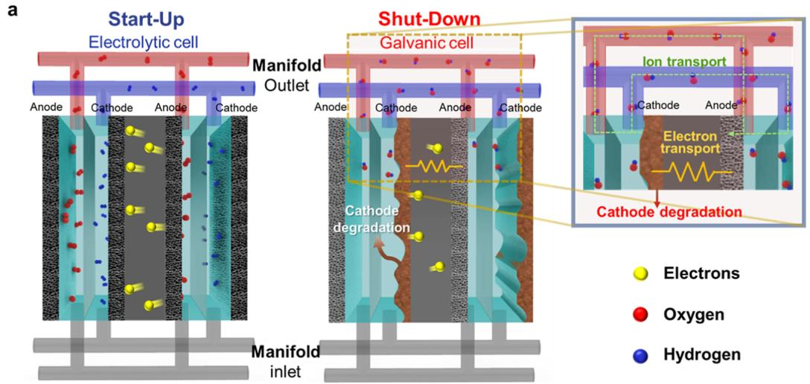

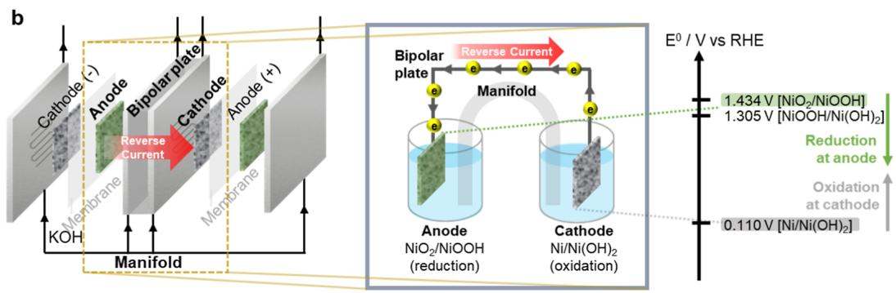
Figure 1. Ni electrode degradation by reverse-current flow after shut-down of the alkaline electrolyzer. (a) A schematic showing the reverse-current flow between the cathode and anode, separated by a bipolar plate, after the shut-down process in the alkaline water-electrolyzer cell. (b) A detailed mechanism of the reverse-current after the shut-down process.

a porous composite diaphragm or a hydroxide ion-conducting membrane. $^{10,23,24}$ It can significantly reduce both the Ohmic and bubble resistance influence on the cell's performance. By stacking many cells in a series, for example, $\sim 100 - 200$ pairs of bipolar plates, the performance of AWE can be brought closer to that of PEMWE. $^{25}$

Despite its cost effectiveness and scalability, the stability of the electrode limits the lifetime of AWE. In particular, bipolar-type zero-gap AWE suffers from a severe stability problem during repetitive start-up/shut-down (SU/SD) operating conditions (Figure 1). The degradation behavior of Ni, a well-established three-dimensional transition-metal electrocatalyst for HER in alkaline water electrolyzers, is as follows. Prior to the shut-down of the zero-gap type electrolytic cells, the cathode and anode sites are in a reductive $\left[\mathrm{H}_{2},\right.$ metallic Ni, $\left.\mathrm{Ni(OH)}_{2}\right]$ and oxidative $\left[\mathrm{O}_{2},\right.$ NiOOH, $\left.\mathrm{NiO}_{2}\right]$ environment, respectively.[26] After the applied current is halted during the shut-down process, a galvanic cell is formed. This is because the reductive species on the cathode and the oxidative species on the anode are electrically connected with the bipolar plate, and unfortunately, the manifold to circulate the electrolyte solution as a unique structural characteristic of AWE provides an ionic path to complete the galvanic cell, which is not any concern in PEMWE having no manifold design. A high interfacial potential difference is created between the cathode and anode, which is separated by the bipolar plate; this instantaneous electromotive force causes a thermodynamically spontaneous self-discharge process (Figure 1a). As a result, a degree of the current immediately flows through the bipolar

plates in the direction opposite to that of the current during normal electrolytic operations, oxidizing the cathode and reducing the anode (Figure 1b). The reverse-current flows until the two electrodes across the bipolar plates reach an equilibrium, eventually causing the deterioration of the performance of the water-electrolyzer system. This durability issue is particularly susceptible to being accelerated when AWE is utilized as an energy storage device for renewable energy sources that experience intermittent power fluctuations.

A small number of studies have investigated reverse-current as one of the degradation mechanisms of bipolar-type electrolyzers.[27-30] White et al. used a circuit analog model to predict the reverse-currents in stacks of bipolar plate cells to survey this undesirable phenomenon.[31] Uchino et al. characterized the relationship between the reverse-current and operating conditions of the alkaline water electrolyzer.[32,33] As one solution for this issue, polarization rectifiers can minimize the negative effect of the reverse-currents.[29,34] Though effective, this system-level approach inevitably adversely affects the balance of systems, requiring additional facilities and increasing operating costs.[35] However, there have been few studies that focus on this mechanism of system deterioration from the perspective of the electrode materials. Furthermore, few practical solutions have been suggested for this degradation issue resulting from shut-down events.

Here, we demonstrate a simple but effective solution to protect the electrodes from the reverse-current under shutdown conditions. We designed a simple system based on the classical cathodic protection method, in which a sacrificial

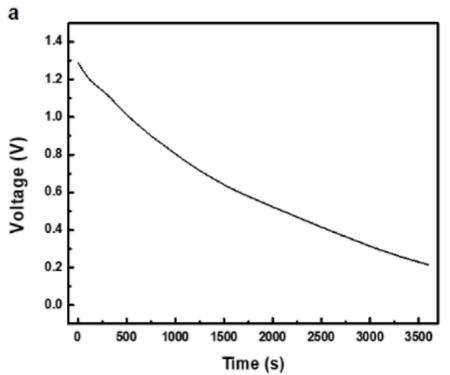

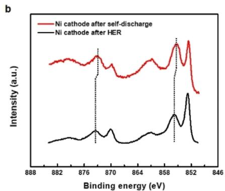

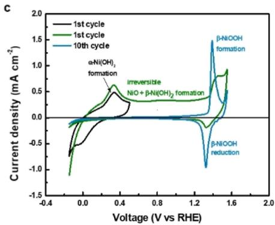
Figure 2. Reverse-current simulation model using OCV measurement. (a) OCV measurement during self-discharge (illustrated in Figure S1) for 1 h. (b) Ni 2p XPS analysis of the Ni cathode after self-discharge and HER. (c) Cyclic voltammograms of the Ni electrode, measured at a scan rate of $50\mathrm{mV}\mathrm{s}^{-1}$ in 1 M KOH.

anode was connected to the Ni cathode, to inhibit the cell degradation of the alkaline water electrolyzer. With a more readily oxidizable metal than Ni used as a sacrificial anode, the dissolution of the sacrificial anode instead of Ni cathode oxidation prevented the deactivation of the cathode materials. The accelerated durability test under a simulated reverse-current condition (RC) demonstrated the effectiveness of this design in preventing cathode degradation resulting from the reverse-current. Specifically, it was determined that lead (Pb), zinc $(\mathrm{Zn})$ , tin $(\mathrm{Sn})$ , and aluminum (Al) were suitable and effective metals for cathodic protection.

# RESULTS AND DISCUSSION

# Reverse-Current Simulation Model

Before discussing solutions to the catalyst deactivation problem caused by the reverse-current, it is necessary to examine the reverse-current flow after shut-down, that is, the self-discharge phenomenon. We begin by considering the reverse-current simulation model to identify the deactivation mechanism from the perspective of the Ni electrode. We used thin-film disk electrodes, manufactured by the drop-casting of a Ni nanoparticle catalyst ink $(0.35\mathrm{mgcm}^{-2})$ on glassy carbon (GC) and 1 M KOH electrolyte. For both three-electrode cells, which were connected to individual potentiostats (PS1 and PS2), the potential for HER $(-0.3\mathrm{V}$ vs RHE) and an oxygen evolution reaction (OER) $(1.6\mathrm{V}$ vs RHE) was simultaneously applied to the Ni cathode and anode, respectively, for $30\mathrm{min}$ (Figure S1). After each electrochemical reaction reached a steady-state condition, two additional cells were integrated into the two-electrode cells using a salt bridge to emulate a water electrolyzer under the self-discharge condition. We observed the potential changes between cathode and anode after the shut-down event by measuring the open-circuit voltage (OCV). The initial OCV for the integrated two-electrode system was $\sim 1.3\mathrm{V}$ , which decreased to $0.2\mathrm{V}$ after $1\mathrm{h}$ , implying a self-discharge due to reverse-current flowing between the two Ni electrodes (Figure 2a).

The reverse-current flowed until the two electrodes across the bipolar plates reached an equilibrium, eventually deteriorating the performance of the water-electrolyzer system. In particular, this reverse-current mechanism led to severe degradation of the Ni cathode. The oxidation process in the cathode Ni electrode, induced by the reverse-current, resulted in the formation of undesirable hydroxide or oxide phases on

the cathode electrode surface, which is an electrochemically irreversible process. The electrodes cannot be recovered to the original metallic Ni phase.[26,36]

We investigated the electronic structure characteristics using X-ray photoemission spectroscopy (XPS) analysis to determine the oxidation state of the Ni cathode surface after the self-discharge process (Figure 2b). In the Ni $2\mathrm{p}$ XPS spectrum of the Ni electrode after HER, the two characteristic peaks at 855.8 and $873.5~\mathrm{eV}$ , for its $\mathrm{Ni}2\mathrm{p}_{3 / 2}$ and $\mathrm{Ni}2\mathrm{p}_{1 / 2}$ levels, respectively, were assigned to the $\mathrm{Ni}^{2 + }$ chemical state for electrochemically reversible $\alpha$ -Ni(OH)2, while those located at 852.8 and $870.1~\mathrm{eV}$ were assigned to the $\mathrm{Ni}^0$ metallic state.[37-39] The signals corresponding to the $\mathrm{Ni}^0$ state were more intense, thereby implying that the state of Ni was close to metallic and included some hydroxide phases. Both characteristic peaks for the $\mathrm{Ni}^{2 + }$ species in the Ni electrode after the self-discharge event were negatively shifted by $0.4 - 0.5\mathrm{eV}$ . This result was attributed to the formation of an electrochemically irreversible $\beta$ -Ni(OH)2 state, with a compact layered structure.[37] The valence state of Ni in $\alpha$ -Ni(OH)2 was higher than $\beta$ -Ni(OH)2, which is ascribed to the presence of intercalated anions or water molecule between $\alpha$ -Ni(OH)2 layers.[40] The increased intensity implied that the valence state of the surface had been shifted to a more oxidized state. In the case of the OER electrode, however, the binding energies for the $\mathrm{Ni}^{2 + }$ species remained unchanged, even after the self-discharge process, suggesting that no phase transformation had taken place after the reverse-current flow (Figure S2).

We also conducted cyclic voltammetry (CV) measurements using a polycrystalline Ni electrode to further investigate the irreversibility of the degradation of the Ni electrode (Figure 2c). A CV image between $-0.15$ and $0.5\mathrm{V}$ versus RHE displays the characteristic reversible $\mathrm{Ni} / \alpha \mathrm{-Ni(OH)}_2$ redox peaks at 0.05 and $0.4\mathrm{V}$ versus RHE (the black line). In contrast, the $\alpha \mathrm{-Ni(OH)}_2$ reduction peak disappeared in the first cycle of CV with the potential range of $-0.15$ to $1.6\mathrm{V}$ versus RHE (the green line), and the $\alpha \mathrm{-Ni(OH)}_2$ formation peak disappeared in the 10th cycle (the emerald line). These profiles indicate that the surface of the Ni electrode changed gradually and irreversibly from a metallic Ni or $\alpha \mathrm{-Ni(OH)}_2$ to hydroxide or oxide phases [such as $\beta \mathrm{-Ni(OH)}_2$ or NiO] during the repetitive positive-going potential scan above $0.6\mathrm{V}$ versus RHE.[41] As $\beta \mathrm{-Ni(OH)}_2$ and NiO have lower catalytic activity than pure Ni,[41] the increased proportion of them could cause marked deterioration of the catalytic activity for HER.[42] The poor conductivity and low durability of Ni hydroxide and the

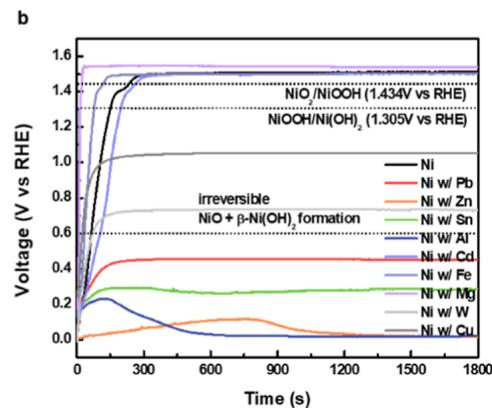

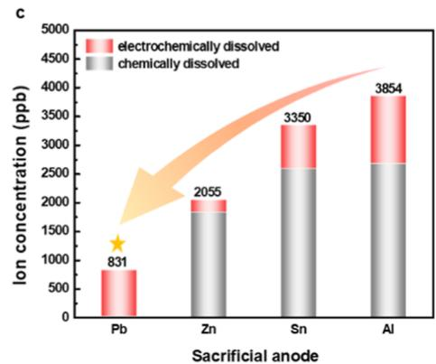

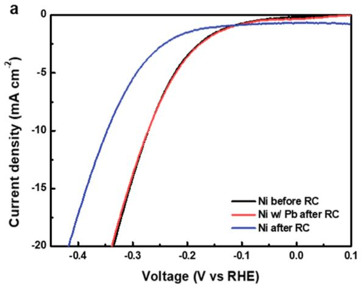
Figure 3. Cathodic protection system for the Ni cathode. (a) The experimental setup scheme for the cathodic protection system. (b) CP measurement of Ni connected with the sacrificial anode (Ni w/M; M = Pb, Zn, Al, Sn, Cd, Fe, Mg, W, and Cu) over 30 min. (c) The dissolved amount of M, with a surface area of 0.3167 cm², as determined using ICP-MS after 30 min. The numbers above the bars are the total amount of each dissolved metal under RC.

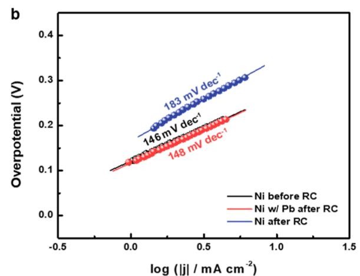

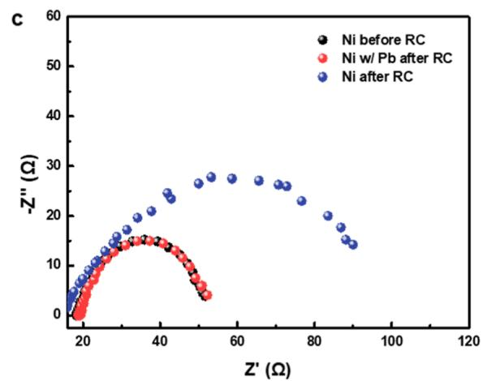

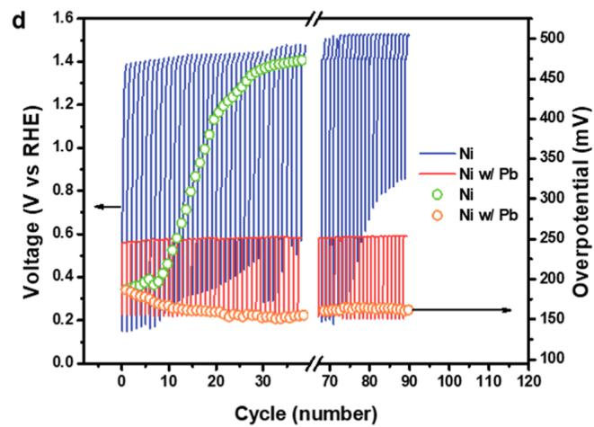
Figure 4. Electrochemical measurement of Ni with sacrificial anodes. (a) The LSV, (b) Tafel slopes, (c) EIS at a negative potential $-0.3\mathrm{V}$ vs RHE for the Ni before RC, Ni w/Pb after RC, and Ni after RC, and (d) alkaline HER stability test for Ni and Ni w/Pb during cycles of dynamic HER-RC, simulating a SU/SD event in an alkaline water electrolyzer. This cycle was repeated 90 times and took approximately $17\mathrm{h}$ to complete. The HER overpotential of each cycle to reach a current density of $5\mathrm{mAcm}^{-2}$ was fitted with yellow green and orange open circles.

oxide phases also contributed to the degeneration of the performance of the water-electrolyzer systems.

In summary, XPS and CV analyses consistently revealed that irreversible hydroxide and oxide phases were formed on the cathode Ni electrode during the self-discharge process due to the reverse-current, resulting in a degradation phenomenon after the shut-down process.

# Mechanism of a Cathodic Protection System against Reverse-Current

We hypothesized that by adopting the cathodic protection concept, in which metal with a stronger tendency to oxidize is sacrificially dissolved, the oxidation of Ni can be prevented, and the Ni cathode can be protected from the reverse-current flow and maintained in an active Ni phase. We began by selecting the candidate sacrificial metals $(\mathbf{M} = \mathbf{Pb}, \mathbf{Zn}, \mathbf{Al}, \mathbf{Sn},$

cadmium [Cd], iron [Fe], magnesium $\mathrm{[Mg]}$ , tungsten $\mathrm{[W]}$ , and copper $\mathrm{[Cu]}$ ), based on the following requirements: (1) a lower standard reduction potential than the potential of irreversible Ni-phase formation (below $0.6\mathrm{V}$ vs RHE);[36] (2) possessing a dissolution (corrosion) region under alkaline media in the Pourbaix diagram (Figure S3).[43] Next, we verified the hypothesis by connecting the sacrificial anode to the working electrode (Ni w/M, where $0.35\mathrm{mgcm}^{-2}$ of Ni is the working electrode and M is the sacrificial anode metal) and simulated the RC using chronopotentiometry (CP) at $0.1\mathrm{mA}$ $\mathrm{cm}^{-2}$ for $30\mathrm{min}$ under 1 M KOH (Figure 3a). Without cathodic protection, the potential of Ni reached $1.5\mathrm{V}$ versus RHE after RC; accordingly, the formation of NiOOH and $\mathrm{NiO}_2$ was inevitable (Figure 3b). The Ni w/Cd, Ni w/Fe, and Ni w/Mg configurations provided no cathodic protection at all. Cu and W slightly alleviated the Ni oxidation but did not prevent the potential from increasing to $0.6\mathrm{V}$ versus RHE (the potential of irreversible NiO and $\beta \text{-Ni(OH)}_2$ phase formation). Only Ni w/Pb, Ni w/Zn, Ni w/Al, and Ni w/Sn configurations maintained a potential below that of irreversible phase formation, suggesting that they could effectively prevent the deactivation of the Ni electrode from the RC while maintaining the reversible Ni phase.

We measured the concentration of dissolved metal ions using inductively coupled plasma mass spectrometry (ICP-MS) to precisely examine the dissolved sacrificial metal ions in the electrolyte during RC, as shown in Figure 3c. The concentration of dissolved Pb $(831\mathrm{ng~mL}^{-1})$ was noticeably lower than that of Zn $(2055\mathrm{ng~mL}^{-1})$ , Sn $(3350\mathrm{ng~mL}^{-1})$ , and Al $(3854\mathrm{ng~mL}^{-1})$ in RC, following the order Ni w/Pb < Ni w/Zn < Ni w/Sn < Ni w/Al. These results showed good agreement with the concentration when the metals were soaked in $1\mathrm{M}$ KOH for $30\mathrm{min}$ and quantified to 27, 1837, 2588, and $2674\mathrm{ng~mL}^{-1}$ for Pb, Zn, Sn, and Al, respectively. The only Pb showed a faster electrochemical than a chemical dissolution rate, in contrast to other metals, implying that Pb protected the Ni cathode most effectively under RC and also provided the most chemically stable property in the alkaline electrolyte (Table S1; the electrochemically dissolved amount of the metal ion was obtained by subtracting the chemically dissolved ions from the total dissolved ions during RC). Regarding the economic considerations, the material cost of Pb $(\\(2.11\mathrm{kg}^{-1}$ , based on the market price in October 2021) was slightly lower than that of Al $(\$ 2.85\mathrm{kg}^{-1}\) and Zn $(\\(3.01\mathrm{kg}^{-1}$ ) and $1/17$ that of Sn $(\$ 36.55\mathrm{kg}^{-1}\). Consequently, the cost of Pb per year due to chemical corrosion was calculated at only \ $7 year\(^{-1}$ , and the cost of Pb per electric charge was low \)(\ $2\mathrm{C}^{-1}$ ), reinforcing the choice of Pb as a representative sacrificial anode. All calculations are summarized in Table S2. Nevertheless, from the environmental aspects, Pb is well known for its toxicity to multiple human body systems and living organisms, including animals and humans. $^{44-46}$ Thus, an additional treatment process for Pb waste should be followed. The adsorption method using nano-scale adsorbents is one of the most widely used methods for gathering heavy metals from wastewater, $^{47,48}$ and we should manage the Pb waste generated as a byproduct after repeated RC events.

We conducted linear sweep voltammetry (LSV) to examine HER activity and calibrate the potential of the reference electrode to further investigate the catalytic characteristics of the Ni electrode, subject to RC (CP @ 0.1 mA cm $^{-2}$ for 30 min) (Figure S4). In 1 M KOH, with a current density of 10 mA cm $^{-2}$ , the Ni electrocatalyst demonstrated 271 mV

overpotential before RC and $346\mathrm{mV}$ overpotential after RC. In contrast to the seriously degraded HER activity of Ni without cathodic protection after RC, the Ni electrode with Pb cathodic protection (Ni w/Pb) exhibited no change in overpotential $(271\mathrm{mV})$ after RC (Figure 4a). The Ni w/Zn, Ni w/Al, and Ni w/Sn configurations also showed promising performance for preventing the oxidation of Ni, as shown in Figure 3b, and exhibited an identical cathodic protection effect, suppressing the HER deactivation of the Ni electrode (Figures S5 and S6). We additionally determined the linear region of a plot of potential versus logjl from HER polarization curves and using Tafel slopes of 146, 148, and $183\mathrm{mV}$ per decade, for Ni before RC, Ni w/Pb after RC, and Ni after RC, respectively (Figure 4b). The large Tafel slope of Ni after RC further confirmed its deactivated HER catalytic activity, while the Ni w/Pb was well-preserved after RC. The effect of cathodic protection on catalytic activity was further characterized by electrochemical impedance spectroscopy (EIS) analysis. The diameter of the semicircles in the Nyquist plot represents the charge-transfer resistance, which is related to the electrocatalytic kinetics. As shown in Figure 4c, while the charge-transfer resistance of Ni w/Pb after RC $(34\Omega)$ was consistent with that from before RC $(34\Omega)$ , that of Ni after RC was substantially increased $(87\Omega)$ . Thus, Ni w/Pb after RC kept its catalytic activity, while Ni after RC shows the sluggish catalytic kinetics for HER due to the oxidation of Ni catalyst by RC. Additionally, we conducted the CP and HER polarization measurements in Fe-purified 1 M KOH (Figure S7). Feimpurities can be produced through industrial production and activate the Ni-based alkaline OER catalysts.[49] Similar to the measurement in commercial unpurified 1 M KOH, the HER activity of Ni w/Pb after RC was maintained as Ni before RC, and the cathodic protection system kept the potential of the Ni cathode below $0.6\mathrm{V}$ versus RHE after RC event in Fe-purified KOH.

The Ni w/Pb configuration also showed excellent stability during the dynamic HER-RC cycles (each cycle containing an LSV curve for HER and CP measurements for Ni and Ni w/Pb at $0.1\mathrm{mAcm}^{-2}$ for 600 s). Dynamic HER-RC cycles, simulating a repetitive SU/SD event in an alkaline electrolyzer, were repeated 90 times over approximately $17\mathrm{h}$ (Figure 4d). During CP measurements in the 90 cycles, the voltage of Ni w/Pb remained below that of the irreversible phase formation $(0.6\mathrm{V}$ vs RHE), while that of Ni rapidly increased to $1.4\mathrm{V}$ versus RHE. As the dynamic HER-RC cycles progressed, the Ni electrode was greatly degraded with a rapidly ascending HER overpotential; however, the Ni w/Pb electrode exhibited slightly enhanced HER activity (Figure S8).

Additionally, as the sacrificial metals were connected to the bipolar plate in our system, the cathodic protection system can make the potential of the anode under $0.6\mathrm{V}$ versus RHE. Therefore, we conducted CP at $-0.1\mathrm{mAcm}^{-2}$ until the potential of the $\mathrm{Ni(OH)_2}$ anode reached $0\mathrm{V}$ versus RHE to simulate the harsh condition in which the potential of the anode was decreased by the system. After that, the OER activity of $\mathrm{Ni(OH)_2}$ was also evaluated from LSV curves under 1 M KOH (Figure S9). The $\mathrm{Ni(OH)_2}$ anode showed $360\mathrm{mV}$ overpotential with a current density of $10\mathrm{mAcm}^{-2}$ both before and after RC. Furthermore, the overpotential was slightly reduced after the 10th OER-CP cycle (each cycle containing an LSV curve for OER and CP measurements at $-0.1\mathrm{mAcm}^{-2}$ ) with $349\mathrm{mV}$ . This result explicitly confirms that the negative effect on the activity of the $\mathrm{Ni(OH)_2}$ anode is

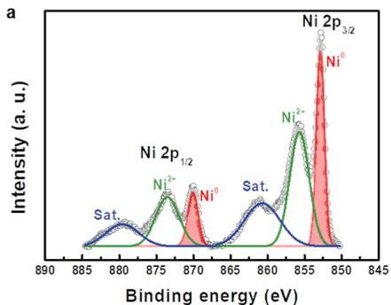

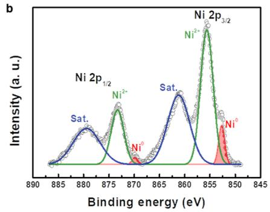

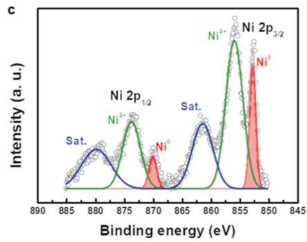
Figure 5. Ni 2p XPS spectra for (a) Ni before RC, (b) Ni after RC, and (c) Ni w/Pb after RC.

negligible compared to the benefit of the cathodic protection system toward the Ni cathode electrode.

For decades, $\mathrm{RuO}_2$ -based cathode electrodes have been utilized as electrocatalysts for hydrogen production in AWE and chlor-alkali production. As with the Ni electrodes discussed previously, $\mathrm{RuO}_2$ -based cathode electrodes are severely damaged by a phase transformation to $\mathrm{RuO(OH)}_2$ and anodic dissolution in the form of $\mathrm{RuO}_4^{-2}$ under the RC.[29,30] With this reason, we also examined the catalytic characteristics of a $0.25\mathrm{mgcm}^{-2}$ of $\mathrm{RuO}_2$ electrode under the RC and confirmed that $\mathrm{RuO}_2$ could also be protected against the reverse-current by cathodic protection from Pb, Zn, Sn, and Al (see Figures S10 and S11).

Considered together, these electrochemical tests demonstrate that the cathodic protection system for the HER catalyst effectively suppressed catalyst degradation induced by the reverse-current. Based on the above electrochemical studies, we additionally confirmed the change in structural and electronic properties of the Ni catalyst under RC. We first considered scanning electron microscopy (SEM) images of protected and oxidized Ni catalysts subject to RC (Figure S12). There were no distinct morphological differences between the catalysts visible in the SEM images. We conducted X-ray diffraction (XRD) measurements to further understand the changes in the crystal structure of the catalysts induced by the RC, as shown in Figure S13. The XRD peaks of the exposed Ni were easily assigned to the face-centered cubic phase of Ni, with $2\theta$ values of 44.4, 51.7, and $76.3^{\circ}$ (JCPDS card no. 04-0850, marked with orange stars). The broad peaks, marked by yellow green circles, indicate carbon derived from the GC substrate (JCPDS card no. 00-012-0212). After being subjected to the RC process, the crystalline Ni peaks became quite weaker, indicating poor crystallinity, caused by the formation of Ni hydroxide and oxide phases. In contrast, the Ni peaks in the configuration with cathodic protection were relatively sustained, with values similar to the original peak intensities, even after RC.

Given that the catalytic activity is predominantly affected by the surface condition of the catalyst, it is necessary to characterize the chemical state of the catalyst surfaces. As shown in Figure 5, XPS analyses were conducted to assess the oxidative state of the Ni electrode, before and after being subjected to RC, in the presence or absence of the cathodic protection system. There was a visible change in the $\mathrm{Ni}^0$ and $\mathrm{Ni}^{2+}$ peak intensity of the Ni electrode after HER and RC in the Ni 2p XPS spectra. Two characteristic peaks of the $\mathrm{Ni}^0$ chemical state at 852.8 and $870.1\mathrm{eV}$ , corresponding to its Ni $2\mathrm{p}_{3/2}$ and Ni $2\mathrm{p}_{1/2}$ levels, substantially decreased in the Ni electrode, and that of $\mathrm{Ni}^{2+}$ became larger after being subjected

to the RC condition, compared with after the HER condition (Figure 5a,b). In contrast, the metallic Ni $(\mathrm{Ni}^{0})$ peak for the Ni electrode protected by Pb was well-preserved under the RC condition; similar results were observed with other cathodic protection systems (Ni w/Zn, Ni w/Sn, and Ni w/Al) (Figures 5c and S14). Moreover, the binding energy of the $\mathrm{Ni}^{2+}$ states for Ni w/Pb after RC (855.8 and 873.5 eV) was consistent with the chemical state of $\alpha$ -phase $\mathrm{Ni(OH)}_{2}$ , suggesting that the cathodic protection system prevented the Ni cathode from being further degraded to the irreversible $\beta$ -phase $\mathrm{Ni(OH)}_{2}$ or NiO (Figure S15). X-ray absorption spectroscopy measurements supported the above findings. As shown in the normalized X-ray absorption near-edge structure (XANES) spectra of the Ni K-edge, the white-line intensity of Ni after RC was higher than that of both the Ni after HER and Ni w/Pb after RC, indicating that the most substantial oxidation of Ni was caused by RC (Figure S16).[50,51] In contrast, the white-line intensity of Ni w/Pb after RC showed a slightly more reduced chemical state than even that of the Ni after HER, indicating that it was protected from further oxidation due to the RC. We concluded that the reverse-current caused electrode degradation due to the irreversible phase transformation from Ni to NiO or $\beta\text{-Ni(OH)}_{2}$ , and the cathodic protection system for the HER electrode effectively inhibited the flow of the reverse-current, maintaining catalytic performance.

The quantitative degree of the stability of the catalysts or systems subjected to a reverse-current can be expressed as the ratio of the rate between the overpotential of a catalyst before the RC $(\eta_{\mathrm{before}})$ and that of the catalyst after CP $(\eta_{\mathrm{after}})$ . This metric is the reverse-current stability factor (RCSF) and is shown as follows

$$
\operatorname {RCSF} (\%) = \left(1 - \frac {\eta_ {\text {after}} - \eta_ {\text {before}}}{\eta_ {\text {before}}} \Bigg | _ {j}\right) \times 100 \tag{1}
$$

at a constant current density $(j = -10\mathrm{mAcm}^{-2})$ . A higher RCSF value denotes a catalyst that is more against the RC effects. Figure 6 shows the RCSF values of the Ni electrodes both with and without cathodic protection systems under constant experimental conditions $(j = -10\mathrm{mAcm}^{-2})$ . The RCSFs of Ni catalysts with cathodic protection systems ranged from $96.94\%$ (Ni w/Sn) to $100.00\%$ (Ni w/Pb), while the RCSF for that without a cathodic protection system was $72.96\%$ . A noticeable difference in the RCSF between Ni w/M and bare Ni was observed ( $N_i \ll N_i w / S_n < N_i w / Al < N_i w / Z_n < N_i w / Pb$ ). Under high current density $(j = -30\mathrm{mAcm}^{-2})$ , the RCSFs of Ni catalysts with cathodic protection also

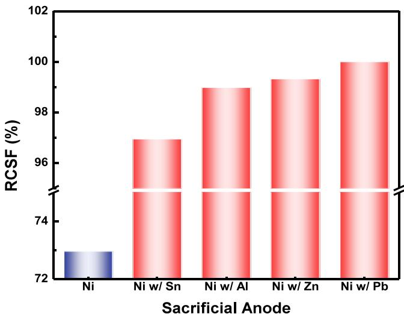
Figure 6. Comparison of the RCSF; the RCSF for Ni and Ni w/M $(\mathrm{M} = \mathrm{Al}, \mathrm{Zn}, \mathrm{Pb},$ and Sn) electrodes are shown. A comparison of the reverse-current stability factor.

surpassed that of bare Ni (Figure S17). The RCSF values provide a quantitative measure of the deterioration of a Ni electrode by a reverse-current, and, consequently, can be used to verify the effectiveness of the cathodic protection system.

We additionally characterized both the stability trends and the cathodic protection effect for $\mathsf{pH}$ change by varying the electrolyte $\mathsf{pH}$ between 12 and 14.7. Conventional industrial AWE is normally operated in saturated conditions, for

example, 5 M KOH, based on its efficiency. $^{52-54}$ We examined the LSV for HER activity with different pH conditions (0.1, 1, and 5 M KOH), without $iR$ correction and confirmed that the cathodic protection system was more effective at a higher pH (see Figure S18). The calculated RCSF values also indicated that the electrode experienced greater deterioration at a higher pH during RC flow, while the cathodic protection system performed successfully in all conditions (Figure S19). While the Ni activity was strongest in 5 M KOH, it also showed the highest susceptibility to the reverse-current with the lowest RCSF value. This result suggested that the transient stability of the catalyst under the shut-down operating condition should be further considered to improve the commercial zero-gap alkaline water electrolyzer's operational longevity.

# Stability of the Alkaline Water-Electrolyzer Stack under Start-Up/Shutdown Conditions

Finally, we examined the degradation phenomenon in a real AWE stack and the effect of the cathodic protection system during repetitive SU/SD events. Considering environmental safety and health, we used Zn as a sacrificial anode instead of Pb in the AWE stack test. We conducted a SU/SD evaluation protocol with a bipolar-type AWE comprising a two-stack cell to analyze SU/SD phenomena in AWE (Figure S20). The SU/SD protocol included two steps per cycle: (1) 10 min of operation with $4.5\mathrm{V}$ applied to the AWE stack (SU); (2) 20 min in a resting state (SD). The SU/SD protocol test was operated for 40 cycles, requiring $20\mathrm{h}$ , under $30\mathrm{wt}\%$ KOH electrolyte at room temperature. Figure 7a shows the relative current $(I / I_0) - t$ and the $V - t$ curves of each cathodic

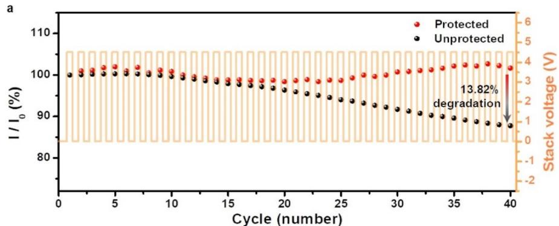

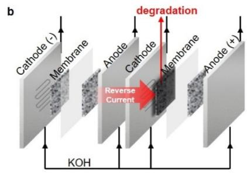

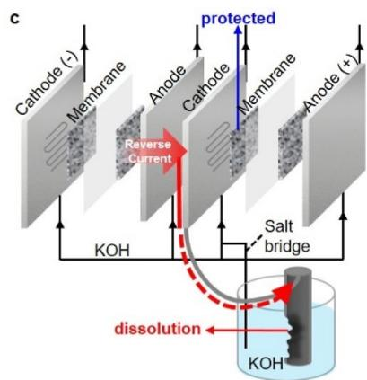
Figure 7. Effect of the Zn cathodic protection system on the performance of an AWE stack during repeated SU/SD. (a) The relative current $(I / I_0)$ - $t$ and the $V - t$ curves with $30\mathrm{wt}\%$ KOH at a feed rate of $160~\mathrm{mL~min}^{-1}$ at room temperature. The alkaline water-electrolyzer stack comprised two single cells. The mean relative current values were plotted for each SU/SD cycle, and 1 SU/SD cycle had a duration of $30\mathrm{min}$ , including 10 min at $4.5\mathrm{V}$ and $20\mathrm{min}$ at the output switched off. Schematics of (b) the degradation of the cathode and (c) protection of the cathode using a sacrificial metal when the reverse-current flows after the shut-down event in the AWE stack.

protection system. As the cycle was repeated, the relative current $(I / I_0, I$ : the mean current value during operation in the cycle; $I_0$ : the mean current value during operation in the first cycle) decayed gradually; only $87.7\%$ of the initial current value was retained in the 40th cycle in the unprotected system. In contrast, the AWE stack, which was protected by a sacrificial metal (Zn), maintained its current during SU/SD cycles and even exhibited a $1.6\%$ higher current (relative current $101.6\%$ ) in the 40th cycle. This suggested that the sacrificial metal completely blocked the oxidation of the cathode by sacrificing itself, although the reverse-current permanently deteriorated the surface of the cathode in a conventional AWE stack, as illustrated in Figure 7b,c. These results demonstrated that the cathodic protection system functioned effectively in a reverse-current simulation test, where the prevention of reverse-current to the catalyst by the sacrificial electrode resulted in the retention of full performance throughout the repeated SU/SD events.

# CONCLUSIONS

In summary, we clarified the deactivation mechanism of the Ni cathode under a reverse-current flow in AWE systems. The Ni cathode was oxidized to irreversible $\beta\text{-Ni}(\mathrm{OH})_2$ or NiO phases at a potential above $0.6\mathrm{V}$ versus RHE under the reverse-current flow that occurred after the shut-down of the AWE, resulting in severe electrode degradation. We verified that the cathodic protection systems effectively protected the Ni cathode against RC, maintaining the chemical state, morphology, and catalytic activity of the protected cathode. Among various candidate metals for the cathodic protection system, Pb was the most ideal for the sacrificial anode material due to its minimal electrochemical dissolution rate, chemical stability in alkaline medium, and low cost. Furthermore, RCSF, as a metric for the stability of a catalyst under RC, should be considered for the evaluation of the transient stability of catalysts in AWE. An AWE stack with the cathodic protection system maintained a stable performance with little loss of current for $20\mathrm{h}$ during repetitive SU/SD events, while the performance of a conventional AWE stack was degraded by $13.82\%$ . We firmly believe that this straightforward and feasible system can solve the cathode deactivation problem in AWE that is subjected to repetitive SU/SD events. We anticipate that this work will trigger several follow-up studies from the perspective of the catalyst on the reverse-current phenomenon in water electrolysis.

# ASSOCIATED CONTENT

# Supporting Information

The Supporting Information is available free of charge at https://pubs.acs.org/doi/10.1021/jacsau.2c00314.

Experimental methods; schematic of the reverse-current simulation model experiment; Ni 2p XPS spectra; standard reduction potentials of various metals; calibration curve for the $\mathrm{Hg / HgO}$ reference electrode; HER polarization curves, comparison of the overpotentials; CP measurements; OER polarization curves; SEM images; XRD profiles; Ni K-edge ex situ XANES spectra; comparison of the RCSF; evaluation protocols; chemical and electrochemical dissolution amounts and rates; and Pb, Zn, Sn, and Al prices (PDF)

# AUTHOR INFORMATION

# Corresponding Author

Yong-Tae Kim - Department of Materials Science and Engineering (MSE), Pohang University of Science and Technology (POSTECH), Pohang 37673, Republic of Korea; orcid.org/0000-0001-9232-6558; Email: yongtae@postech.ac.kr

# Authors

Yoona Kim - Department of Materials Science and Engineering (MSE), Pohang University of Science and Technology (POSTECH), Pohang 37673, Republic of Korea
Sang-Mun Jung - Department of Materials Science and Engineering (MSE), Pohang University of Science and Technology (POSTECH), Pohang 37673, Republic of Korea; orcid.org/0000-0003-0422-2359
Kyu-Su Kim - Department of Materials Science and Engineering (MSE), Pohang University of Science and Technology (POSTECH), Pohang 37673, Republic of Korea; orcid.org/0000-0002-6972-8003
Hyun-Yup Kim - Graduate Institute of Ferrous & Energy Materials Technology (GIFT), Pohang University of Science and Technology (POSTECH), Pohang 37673, Republic of Korea
Jaesub Kwon - Department of Materials Science and Engineering (MSE), Pohang University of Science and Technology (POSTECH), Pohang 37673, Republic of Korea
Jinhyeon Lee - Department of Materials Science and Engineering (MSE), Pohang University of Science and Technology (POSTECH), Pohang 37673, Republic of Korea
Hyun-Seok Cho - Hydrogen Research Department, Korea Institute of Energy Research, Daejeon 34129, Republic of Korea; orcid.org/0000-0001-8356-4490
Complete contact information is available at: https://pubs.acs.org/10.1021/jacsau.2c00314

# Author Contributions

Y.K., and S.-M.J. contributed equally to this work.

# Notes

The authors declare no competing financial interest.

# ACKNOWLEDGMENTS

This work was supported by the National Research Foundation (NRF) of Korea grants (nos. 2019M3D1A1079306 and 2019M3E6A1064521).

# REFERENCES

(1) Tour, J. M.; Kittrell, C.; Colvin, V. L. Green carbon as a bridge to renewable energy. Nat. Mater. 2010, 9, 871-874.
(2) Khare, V.; Nema, S.; Baredar, P. Solar-wind hybrid renewable energy system: A review. Renew. Sustain. Energy Rev. 2016, 58, 23-33.
(3) Turner, J. A. A Realizable Renewable Energy Future. Science 1999, 285, 687-689.
(4) Barton, J. P.; Infield, D. G. Energy Storage and Its Use With Intermittent Renewable Energy. IEEE Trans. Energy Convers. 2004, 19, 441-448.
(5) Brouwer, A. S.; van den Broek, M.; Seebregts, A.; Faaij, A. Impacts of large-scale Intermittent Renewable Energy Sources on electricity systems, and how these can be modeled. Renew. Sustain. Energy Rev. 2014, 33, 443-466.
(6) Kwabi, D. G.; Lin, K.; Ji, Y.; Kerr, E. F.; Goulet, M.-A.; De Porcellinis, D.; Tabor, D. P.; Pollack, D. A.; Aspuru-Guzik, A.;

Gordon, R. G.; Aziz, M. J. Alkaline Quinone Flow Battery with Long Lifetime at pH 12. Joule 2018, 2, 1894-1906.
(7) Zhang, Y.; Hua, Q. S.; Sun, L.; Liu, Q. Life Cycle Optimization of Renewable Energy Systems Configuration with Hybrid Battery/Hydrogen Storage: A Comparative Study. J. Energy Storage 2020, 30, 101470.
(8) Kibsgaard, J.; Chorkendorff, I. Considerations for the scaling-up of water splitting catalysts. Nat. Energy 2019, 4, 430-433.
(9) Abbasi, R.; Setzler, B. P.; Lin, S.; Wang, J.; Zhao, Y.; Xu, H.; Pivovar, B.; Tian, B.; Chen, X.; Wu, G.; Yan, Y. A Roadmap to Low-Cost Hydrogen with Hydroxide Exchange Membrane Electrolyzers. Adv. Mater. 2019, 31, No. e1805876.
(10) Marini, S.; Salvi, P.; Nelli, P.; Pesenti, R.; Villa, M.; Berrettoni, M.; Zangari, G.; Kiros, Y. Advanced alkaline water electrolysis. Electrochim. Acta 2012, 82, 384-391.
(11) Ursua, A.; Gandia, L. M.; Sanchis, P. Hydrogen Production From Water Electrolysis: Current Status and Future Trends. Proc. IEEE 2012, 100, 410-426.
(12) Vij, V.; Sultan, S.; Harzandi, A. M.; Meena, A.; Tiwari, J. N.; Lee, W.-G.; Yoon, T.; Kim, K. S. Nickel-Based Electrocatalysts for Energy-Related Applications: Oxygen Reduction, Oxygen Evolution, and Hydrogen Evolution Reactions. ACS Catal. 2017, 7, 7196-7225.
(13) Lu, Q.; Hutchings, G. S.; Yu, W.; Zhou, Y.; Forest, R. V.; Tao, R.; Rosen, J.; Yonemoto, B. T.; Cao, Z.; Zheng, H. J. N. c.; Xiao, J. Q.; Jiao, F.; Chen, J. G. Highly porous non-precious bimetallic electrocatalysts for efficient hydrogen evolution. Nat. Commun. 2015, 6, 6567.
(14) Cao, L.; Luo, Q.; Liu, W.; Lin, Y.; Liu, X.; Cao, Y.; Zhang, W.; Wu, Y.; Yang, J.; Yao, T.; Wei, S. Identification of single-atom active sites in carbon-based cobalt catalysts during electrocatalytic hydrogen evolution. Nat. Catal. 2018, 2, 134–141.
(15) Zhu, J.; Hu, L.; Zhao, P.; Lee, L. Y. S.; Wong, K. Y. Recent Advances in Electrocatalytic Hydrogen Evolution Using Nanoparticles. Chem. Rev. 2020, 120, 851-918.
(16) Chen, Z.; Duan, X.; Wei, W.; Wang, S.; Ni, B.-J. Recent advances in transition metal-based electrocatalysts for alkaline hydrogen evolution. J. Mater. Chem. A 2019, 7, 14971-15005.
(17) Kim, J.; Jung, H.; Jung, S.-M.; Hwang, J.; Kim, D. Y.; Lee, N.; Kim, K.-S.; Kwon, H.; Kim, Y.-T.; Han, J. W.; Kim, J. K. Tailoring Binding Abilities by Incorporating Oxophilic Transition Metals on 3D Nanostructured Ni Arrays for Accelerated Alkaline Hydrogen Evolution Reaction. J. Am. Chem. Soc. 2021, 143, 1399.
(18) Li, Y.; Tan, X.; Hocking, R. K.; Bo, X.; Ren, H.; Johannessen, B.; Smith, S. C.; Zhao, C. Implanting Ni-O-VOx sites into Cu-doped Ni for low-overpotential alkaline hydrogen evolution. Nat. Commun. 2020, 11, 2720.
(19) Sultan, S.; Tiwari, J. N.; Singh, A. N.; Zhumagali, S.; Ha, M.; Myung, C. W.; Thangavel, P.; Kim, K. S. Single Atoms and Clusters Based Nanomaterials for Hydrogen Evolution, Oxygen Evolution Reactions, and Full Water Splitting. Adv. Energy Mater. 2019, 9, 1900624.
(20) Tiwari, J. N.; Singh, A. N.; Sultan, S.; Kim, K. S. Recent Advancement of p- and d-Block Elements, Single Atoms, and Graphene-Based Photoelectrochemical Electrodes for Water Splitting. Adv. Energy Mater. 2020, 10, 2000280.
(21) Tiwari, J. N.; Sultan, S.; Myung, C. W.; Yoon, T.; Li, N.; Ha, M.; Harzandi, A. M.; Park, H. J.; Kim, D. Y.; Chandrasekaran, S. S.; Lee, W. G.; Vij, V.; Kang, H.; Shin, T. J.; Shin, H. S.; Lee, G.; Lee, Z.; Kim, K. S. Multicomponent electrocatalyst with ultralow Pt loading and high hydrogen evolution activity. Nat. Energy 2018, 3, 773-782.
(22) Tiwari, J. N.; Dang, N. K.; Sultan, S.; Thangavel, P.; Jeong, H. Y.; Kim, K. S. Multi-heteroatom-doped carbon from waste-yeast biomass for sustained water splitting. Nat. Sustain. 2020, 3, 556–563. (23) Costa, R.; Grimes, P. Electrolysis as a Source of Hydrogen and Oxygen; Allis-Chalmers Mfg. Co.: Milwaukee, 1967.
(24) Wendt, H.; Hofmann, H. Cermet diaphragms and integrated electrode-diaphragm units for advanced alkaline water electrolysis. Int. J. Hydrogen Energy 1985, 10, 375-381.

(25) Phillips, R.; Dunnill, C. W. Zero gap alkaline electrolysis cell design for renewable energy storage as hydrogen gas. RSC Adv. 2016, 6, 100643-100651.
(26) Alsabet, M.; Grden, M.; Jerkiewicz, G. Electrochemical Growth of Surface Oxides on Nickel. Part 3: Formation of $\beta$ -NiOOH in Relation to the Polarization Potential, Polarization Time, and Temperature. Electrocatalysis 2015, 6, 60-71.
(27) Divisek, J.; Jung, R.; Britz, D. Potential distribution and electrode stability in a bipolar electrolysis cell. J. Appl. Electrochem. 1990, 20, 186-195.
(28) Kuhn, A.; Booth, J. Electrical leakage currents in bipolar cell stacks. J. Appl. Electrochem. 1980, 10, 233-237.
(29) Holmin, S.; Naslund, L.-Å.; Ingason, Å. S.; Rosen, J.; Zimmerman, E. Corrosion of ruthenium dioxide based cathodes in alkaline medium caused by reverse currents. Electrochim. Acta 2014, 146, 30-36.
(30) Naslund, L. Å.; Ingason, A. S.; Holmin, S.; Rosen, J. Formation of RuO(OH)2 on RuO2-Based Electrodes for Hydrogen Production. J. Phys. Chem. C 2014, 118, 15315-15323.
(31) White, R. E.; Walton, C. W.; Burney, H. S.; Beaver, R. N. Predicting Shunt Currents in Stacks of Bipolar Plate Cells. J. Electrochem. Soc. 1986, 133, 485-492.
(32) Uchino, Y.; Kobayashi, T.; Hasegawa, S.; Nagashima, I.; Sunada, Y.; Manabe, A.; Nishiki, Y.; Mitsushima, S. Relationship Between the Redox Reactions on a Bipolar Plate and Reverse Current After Alkaline Water Electrolysis. Electrocatalysis 2018, 9, 67-74.
(33) Uchino, Y.; Kobayashi, T.; Hasegawa, S.; Nagashima, I.; Sunada, Y.; Manabe, A.; Nishiki, Y.; Mitsushima, S. Dependence of the Reverse Current on the Surface of Electrode Placed on a Bipolar Plate in an Alkaline Water Electrolyzer. Electrochemistry 2018, 86, 138-144.
(34) Doughty, R. L.; Ionata, V. J.; Dye, T. E.; Wirant, J. A. Optimum electrical system design for a modern chlor-alkali plant. IEEE Trans. Ind. Appl. 1989, 25, 928-938.
(35) Silver, M. M.; Spore, E. M.; Division, E. S. I. E. Proceedings of the Symposium on Advances in the Chlor-Alkali and Chlorate Industry; Industrial Electrolytic Division, Electrochemical Society, 1984.
(36) Alsabet, M.; Grden, M.; Jerkiewicz, G. Electrochemical Growth of Surface Oxides on Nickel. Part 2: Formation of $\beta$ -Ni(OH)2 and NiO in Relation to the Polarization Potential, Polarization Time, and Temperature. Electrocatalysis 2013, S, 136-147.
(37) Yu, X.; Zhao, J.; Zheng, L.-R.; Tong, Y.; Zhang, M.; Xu, G.; Li, C.; Ma, J.; Shi, G. Hydrogen Evolution Reaction in Alkaline Media: Alpha- or Beta-Nickel Hydroxide on the Surface of Platinum? ACS Energy Lett. 2017, 3, 237–244.
(38) Wang, D.; Li, Q.; Han, C.; Lu, Q.; Xing, Z.; Yang, X. Atomic and electronic modulation of self-supported nickel-vanadium layered double hydroxide to accelerate water splitting kinetics. Nat. Commun. 2019, 10, 3899.
(39) Zhang, D.; Shi, J.; Qi, Y.; Wang, X.; Wang, H.; Li, M.; Liu, S.; Li, C. Quasi-Amorphous Metallic Nickel Nanopowder as an Efficient and Durable Electrocatalyst for Alkaline Hydrogen Evolution. Adv. Sci. 2018, 5, 1801216.
(40) He, W.; Li, X.; An, S.; Li, T.; Zhang, Y.; Cui, J. 3D beta-Ni(OH)2 nanowires/RGO composite prepared by phase transformation method for superior electrochemical performance. Sci. Rep. 2019, 9, 10838.
(41) Grden, M.; Klimek, K. EQCM studies on oxidation of metallic nickel electrode in basic solutions. J. Electroanal. Chem. 2005, 581, 122-131.
(42) Faid, A. Y.; Barnett, A. O.; Seland, F.; Sunde, S. Ni/NiO nanosheets for alkaline hydrogen evolution reaction: In situ electrochemical-Raman study. Electrochim. Acta 2020, 361, 137040.
(43) Pourbaix, M. Atlas of Electrochemical Equilibria in Aqueous Solutions; National Association of Corrosion Engineers, 1974.
(44) Panda, P. K. Review: environmental friendly lead-free piezoelectric materials. J. Mater. Sci. 2009, 44, 5049-5062.

(45) Wu, J.; Xiao, D.; Zhu, J. Potassium-sodium niobate lead-free piezoelectric materials: past, present, and future of phase boundaries. Chem. Rev. 2015, 115, 2559-2595.
(46) Jung, S.-M.; Kwon, J.; Lee, J.; Lee, B.-J.; Kim, K.-S.; Yu, D.-S.; Kim, Y.-T. Hybrid thermo-electrochemical energy harvesters for conversion of low-grade thermal energy into electricity via tungsten electrodes. Appl. Energy 2021, 299, 117334.
(47) Hua, M.; Zhang, S.; Pan, B.; Zhang, W.; Lv, L.; Zhang, Q. Heavy metal removal from water/wastewater by nanosized metal oxides: a review. J. Hazard. Mater. 2012, 211-212, 317-331.
(48) Sounthararajah, D. P.; Loganathan, P.; Kandasamy, J.; Vigneswaran, S. Removing heavy metals using permeable pavement system with a titanate nano-fibrous adsorbent column as a post treatment. Chemosphere 2017, 168, 467-473.
(49) Trotochaud, L.; Young, S. L.; Ranney, J. K.; Boettcher, S. W. Nickel-iron oxyhydroxide oxygen-evolution electrocatalysts: the role of intentional and incidental iron incorporation. J. Am. Chem. Soc. 2014, 136, 6744-6753.
(50) Fang, S.; Zhu, X.; Liu, X.; Gu, J.; Liu, W.; Wang, D.; Zhang, W.; Lin, Y.; Lu, J.; Wei, S.; Li, Y.; Yao, T. Uncovering near-free platinum single-atom dynamics during electrochemical hydrogen evolution reaction. Nat. Commun. 2020, 11, 1029.
(51) Li, Y. K.; Zhang, G.; Lu, W. T.; Cao, F. F. Amorphous Ni-FeMo Suboxides Coupled with Ni Network as Porous Nanoplate Array on Nickel Foam: A Highly Efficient and Durable Bifunctional Electrode for Overall Water Splitting. Adv. Sci. 2020, 7, 1902034.
(52) Liu, Y.; Liang, X.; Gu, L.; Zhang, Y.; Li, G. D.; Zou, X.; Chen, J. S. Corrosion engineering towards efficient oxygen evolution electrodes with stable catalytic activity for over 6000 hours. Nat. Commun. 2018, 9, 2609.
(53) Pavel, C. C.; Cecconi, F.; Emiliani, C.; Santiccioli, S.; Scaffidi, A.; Catanorchi, S.; Comotti, M. Highly Efficient Platinum Group Metal Free Based Membrane-Electrode Assembly for Anion Exchange Membrane Water Electrolysis. Angew. Chem., Int. Ed. 2014, 53, 1378-1381.
(54) Hall, D. E. Alkaline Water Electrolysis Anode Materials. J. Electrochem. Soc. 1985, 132, 41C-48C.

CAS BIOFINDER DISCOVERY PLATFORMTM

# CAS BIOFINDER HELPS YOU FIND YOUR NEXT BREAKTHROUGH FASTER

Navigate pathways, targets, and diseases with precision

Explore CAS BioFinder

A division of the American Chemical Society
