# Effects of operation and shutdown parameters and electrode materials on the reverse current phenomenon in alkaline water analyzers

Ashraf Abdel Haleem a,\*, Jinlei Huyan b, Kensaku Nagasawa a, Yoshiyuki Kuroda c, Yoshinori Nishiki d, Akihiro Kato d, Takaaki Nakai d, Takuto Araki b, Shigenori Mitsushima a,c

a Institute of Advanced Sciences, Yokohama National University, 79-5 Tokiwadai, Hodogaya-ku, Yokohama, 240-8501, Japan
b Graduate School of Engineering, Yokohama National University, 79-5 Tokiwadai, Hodogaya, Yokohama, $24 + 0 - 8501$ , Japan
c Graduate School of Engineering Science, Yokohama National University, 79-5 Tokiwadai, Hodogaya-ku, Yokohama, 240-8501, Japan
$^{\mathrm{d}}$ De Nora Permelec, Ltd, 2023-15 Endo, Fujisawa, 252-0816, Japan

# HIGHLIGHTS

- Experimental and theoretical studies of the reverse current phenomenon.
- Effects of operating/standby parameters and electrode materials on reverse current.
- Temperature and cycling of electrolyte during shutdown affect the reverse current.
- Electrodes' potentials during shutdown depends mainly on the reverse charges.
- Reverse current is related to reverse redox reactions occurred on the catalysts.

# ARTICLEINFO

Keywords:

Alkaline water electrolysis

Reverse current

Dynamic operation

# GRAPHICAL ABSTRACT

# ABSTRACT

One of the major challenges facing the coupling of alkaline water electrolyzers (AWE) and inherently intermittent renewable energy sources (RES) is the reverse current phenomenon that takes place after shutdown and adversely affects the service life of the electrocatalysts. Herein, this phenomenon was studied experimentally and theoretically. The study showed that the potential of the electrodes on either side of the bipolar plate (BP) changes according to the amount of the reverse charge flowing through the BP during shutdown. In addition, the potential of the electrodes of the middle BP changed relatively faster than that of the other BPs due to the increased reverse current of the middle BP. Moreover, effects of the operating parameters and electrode materials on the reverse current phenomenon are uncovered. The electrolyte circulation during shutdown as well as the high operating temperature increased the reverse current. However, the electrolysis current did not significantly affect the reverse current. Additionally, the origin of the reverse current is mainly the redox reactions of the electrodes during shutdown. Furthermore, the cathode that attached to a robust anode, on the same BP, is subject to more stressors. This study is useful for adapting the AWE to the dynamic operation.

# 1. Introduction

Carbon neutrality by 2050 is a globally accepted strategy to limit global warming to $1.5^{\circ}\mathrm{C}$ above pre-industrial levels [1,2]. Hydrogen as a clean energy carrier can play a vital role towards achieving the ultimate goals of this strategy. In particular, for sustainability, besides environmental issues, the energy transition must be based primarily on green hydrogen, which is produced by the renewable energy-powered water electrolyzers [3-8]. Hydrogen can be widely used in various sectors including industry, power generation, and transportation [3,7, 9-11].

For instance, the potential of the emerging hydrogen fuel cell vehicle (HFCV) technology to decarbonize the global transportation sector in the foreseeable future is significant [12-15]. In the power generation sector, hydrogen fuel can enable large-scale penetration of renewable energy sources (RES) which are inherently intermittent and fluctuating, such as wind and solar energy, into the electric grid [5,6]. In this approach, hydrogen is used to stabilize the frequency of the electricity against the intermittency of RES; when power generation is higher than demand, the surplus energy can be used to run the water electrolyzer system and generate hydrogen that can be used to fuel the installed fuel cells when demand becomes higher [3,7].

Alkaline water electrolysis (AWE) is a more mature and cost-effective technology compared to other water electrolysis techniques [8,16,17]. However, technical development must be achieved before the widespread deployment of RES-powered AWE systems. One of the main challenges facing the RES-powered AWE technology is the high gas impurity in the part-load range. Therefore, to prevent the formation of inflammable oxygen and hydrogen mixtures, the system undergoes a safety shutdown when the gas impurity reaches 2 vol% [18-20]. Therefore, it is widely accepted that the RES-powered AWE system must operate above a lower operating part-load limit of $25 - 40\%$ of its rated operating full-load [18,21-23]. Consequently, RES-powered AWE systems are subject to frequent start-up/shutdown cycles, which apply additional stressors on the electrocatalysts and significantly shorten their service life [24-30]. In practice, this problem is usually addressed by applying an arbitrary low protective current during shutdown time [31-33]. Therefore, for the RES-powered AWE system, an additional power source is required to supply this protective current. Subsequently, an evident understanding of the reverse current and factors affecting this phenomenon is essential to adopt appropriate protective current that inhibits the degradation of the electrodes with minimal cost, to devise simple and cost-effective protection measures or to develop robust electrodes that do not require protective current during shutdown.

During the operation time, the oxygen evolution reaction (OER) electrocatalysts (anodes) are highly oxidized, and the hydrogen evolution reaction (HER) electrocatalysts (cathodes) are in their reduced states. Given that the anode and cathode associated with each bipolar plate (BP) are electrically connected through the metallic structure of the BP and ionically connected through the electrolyte in the manifold, it is a closed circuit between the anode and cathode on either side of each BP. Therefore, during the shutdown time, due to the lack of sufficient RES, the BP acts as a charged battery whose electromotive force (emf) equals the potential difference between the associated anode and cathode. Accordingly, the reverse current flows in the closed circuit between the anode and the cathode of each BP until the emf reaches zero. Thus, reverse redox reactions occur on the electrocatalysts on both sides of each bipolar plate; the anode is reduced, and the cathode is oxidized [26, 27]. Repeated oxidation/reduction cycles stimulate the degradation of the electrocatalysts [24-30]. The performance degradation of electrocatalysts could be due to the partial detachment of the active material from the substrate [30]. Therefore, the development of electrocatalysts that have the ability of self-healing (self-repairing) is a promising approach to improve their robustness under dynamic conditions [34, 35].

In addition, adjusting the operating and shutdown conditions to

achieve both high conversion efficiency and long service life of the system is essential. In fact, optimizing the operating parameters of alkaline water electrolyzers to improve the efficiency of the water electrolysis, the purity of the hydrogen produced, and the overall system efficiency attracted the attention of many researchers [20,21,36] [-] [48]. Frequently studied operating parameters include the applied voltage and the current density [21,37,42], the electrolyte type and concentration [37,46,48], the electrolyte temperature [21,36,39,41, 44-46], the electrolyte circulation [38], the operating pressure [21,36, 43], as well as the electrode material [37,49]. However, the impact of these operating parameters on the reverse current phenomenon that takes place immediately after the electrolyzer shutdown and very negatively affects the service life of the electrocatalysts under dynamic operation have not been studied so far.

Therefore, research studies are needed that shed light, for example, on the factors likely to influence the reverse current phenomenon, how quickly the potential of the electrocatalysts changes during the shutdown time, system modifications required to mitigate the effect of this phenomenon on the long-term durability of the electrolyzer (such as the inclusion of a battery bank) and how these system modifications affect the system's overall conversion efficiency. In a previous report we presented a new protocol for the accelerated durability test of the OER electrocatalysts in alkaline water electrolyzers [30]. The protocol mimics the intermittence of the RES. The study showed that the duration of the shutdown and the value of the electrode potential during the shutdown time significantly affect the durability of the OER electrocatalysts. In addition, the effect of reverse current on the cell voltage and the contribution of the dissolved gases to the reverse current phenomenon were reported separately by Uchino et al. [26,27]. However, the system was limited to a two-cell stack only, and the absence of a reference electrode prevented the authors from measuring the electrode potentials and how they change with the flow of reverse charges during the shutdown time.

The current study presents, for a 4-cell stack AWE system, a detailed study of the influence of the operation and shutdown conditions as well as the electrode materials on the reverse current phenomenon and the electrodes' potentials after shutdown. The examined parameters include the electrolyte temperature, the electrolyte circulation with and without $\mathrm{N}_2$ bubbling in the electrolyte during shutdown time, and the DC electrolysis current. In addition, we presented a simulation for the reverse current phenomenon that can be used to study more complex systems: for example, stacks with bigger cells or with higher number of cells.

Therefore, the new basic information provided in the present study could help to apply appropriate start-up and shutdown conditions that increase the efficiency of the AWE system and do not degrade its long-term durability. Moreover, this information could be essential to design more practical accelerated durability test protocols for the electrocatalysts of AWE systems. Ultimately, the results of this study could be useful toward adapting AWE systems to the dynamic operating conditions.

# 2. Experimental

# 2.1. Construction of the alkaline water electrolyzer system

Fig. 1 shows a schematic diagram of the AWE system used in this study. A 4-cell stack was connected to an external plumbing system which enabled the circulation of the electrolyte and the evacuation of the generated gases. It is noteworthy that the anolyte and catholyte were circulated in completely separated cycles. Each cycle consisted of a set of manifold tubes made of PTFE, a gas separator tank made of PTFE (where the corresponding gas is separated from the electrolyte), and an electrolyte circulation pump (TACMINA Co.). A heat exchanger (oil bath) was used to maintain the temperature of the circulating electrolyte at the desired value. DC milliampere clamp meters (KEW 2500, KYORITSU ELECTRICAL INSTRUMENTS WORKS, LTD.) were connected on the

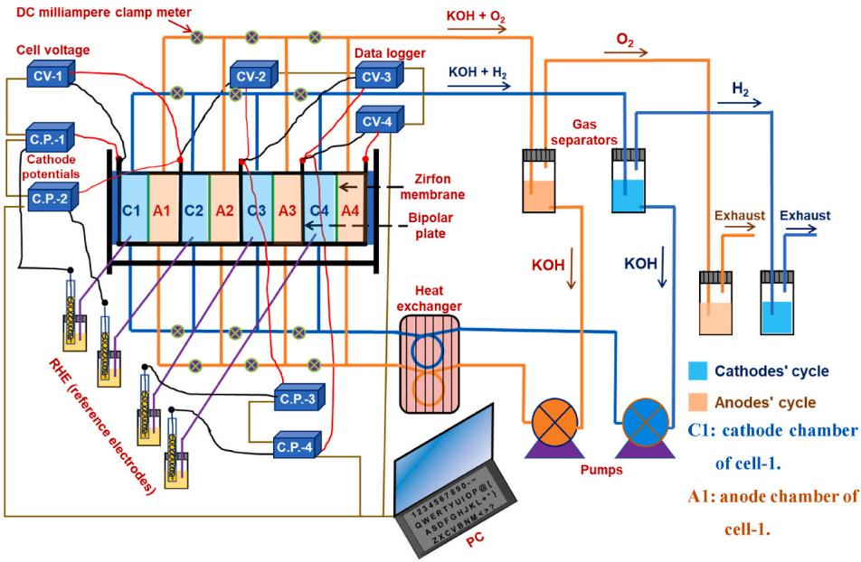
Fig. 1. Schematic diagram of the utilized 4-cell stack bipolar plate alkaline water electrolysis system.

inlet and the outlet of the manifold tubes. The DC milliampere clamp meter can measure the ionic current flowing through the KOH electrolyte inside the PTFE tubes. A reversible hydrogen electrode (RHE) is connected to each cathode chamber through a Luggin-capillary tube. A potentiostat (BCS-815, Bio-Logic Science Instruments) was used to power the electrolyzer with the required DC current. During the experiment, cathode potentials, cell voltages, electrolyte temperature, and reverse current were recorded on a computer connected to the experiment through data loggers (Yokogawa GM90PS).

# 2.2. The bipolar plate stack and the associated manifold assembly

Fig. S1 shows a schematic diagram of the first two cells of the utilized bipolar plate AWE stack. The cells were grouped based on the zero-gap configuration, in which the anode and cathode of each cell are in direct contact with either side of the associated separator. The separator used in this study is Zirfon™ PERL (UTP 500) membrane. The volume of the anode chamber and cathode chamber is $100\mathrm{ml}$ . Each two adjacent cells are electrically connected in series through a shared metallic bipolar plate. Two current collectors, in the form of a metal grid to facilitate the evacuation of gas generated from the associated electrode, were installed on either side of each bipolar plate. The anode of each cell is electrically connected to the cathode of the subsequent cell through the metallic structure of the BP.

Fig. S2 shows a detailed schematic diagram of the 4-cell AWE stack and the connected manifold assembly. The manifold tubes are made of PTFE with an inner diameter of $4\mathrm{mm}$ . The manifold system was designed to be symmetric around all bipolar plates; the length (L) of any manifold branch — the tube connecting two adjacent cathode or anode chambers — is the same $(\mathrm{L} = 9 + 36\times 2 = 81~\mathrm{cm})$ . Therefore, under steady-state flow of the electrolyte $(15\mathrm{ml}\mathrm{min}^{-1}$ per cell in the current study), the ionic resistances of all manifold branches are equal.

# 2.3. Basics of the reverse current phenomenon and the equivalent electrical circuit

During the electrolysis time, positive charges were accumulated on the surface of the anode electrodes, and negative charges were accumulated on the surface of the cathode electrodes due to the water oxidation and hydrogen evolution reactions, respectively. For each BP, the direction of the electrolysis current, as shown in Fig. S3, is from the

cathode side to the anode side. Immediately after shutting down the electrolyzer, the BP acts as a charged battery having a certain emf. The emf of each BP is equal to the potential difference between the anode and the cathode on either side of this bipolar plate. It is noteworthy that the anode and cathode on either side of each BP are electrically connected through the body of the BP and ionically connected through the electrolyte that fills the cell compartments and manifolds; it is a close circuit. Initially, the emf of each BP is relatively high enough to drive electric current from the positively charged anode to the negatively charged cathode through the BP. Consequently, the ionic current flows from the chamber of the cathode to that of the anode through the separators and then through the electrolyte-filled manifold tubes, as shown in Fig. S4. Therefore, the stack and attached manifold assembly, shown schematically in Fig. 2 (a), from the electrical perspective can be represented by the equivalent electrical circuit shown in Fig. 2 (b). In this equivalent circuit emf1, emf2 and emf3 represent the electromotive forces of BP-1, BP-2, and BP-3, respectively. In addition, R1' and R2' stand for the ionic resistance of the longitudinal tube and horizontal tube, respectively. Moreover, $i_{\mathrm{k,j}}$ ( $\mathrm{k} = 1, 2, 3$ and $\mathrm{j} = 1, 2, 3, 4$ ) represent the ionic reverse current portions that measured experimentally by means of DC milliampere clamp meters.

Since the four circuit branches connected across each emf are identical, the equivalent circuit can be simplified to the equivalent circuit shown in Fig. S5. The simplified circuit contains three branches, each branch consists of an emf connected in series with the ionic resistances of the longitudinal and the horizontal manifold tubes, $R_{1}$ and $R_{2}$ , respectively. The adjacent branches share $R_{1}$ . The currents of the three branches $i_{1}, i_{2}$ , and $i_{3}$ flowing in the resistors $R_{2}$ are the total reverse currents corresponding to the bipolar plates BP-1, BP-2, and BP-3, respectively, where $i_{m} = \sum_{n=1}^{4} j_{m,n}$ .

# 2.4. Electrolysis and shutdown conditions

The following electrolysis conditions were applied separately during the operating mode:

1 DC current density of $0.4\mathrm{Acm}^{-2}$ for $1.0\mathrm{h}$ at $30^{\circ}\mathrm{C}$ .
2 DC current density of $0.6\mathrm{Acm}^{-2}$ for $1.0\mathrm{h}$ at $30^{\circ}\mathrm{C}$ .
3 DC current density of $0.6\mathrm{Acm}^{-2}$ for $1.0\mathrm{h}$ at $80^{\circ}\mathrm{C}$ .
4 DC current density of $1.0\mathrm{Acm}^{-2}$ for $1.0\mathrm{h}$ at $80^{\circ}\mathrm{C}$ .

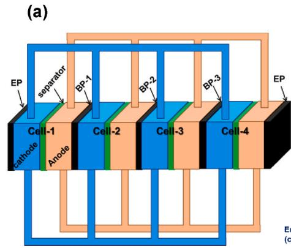

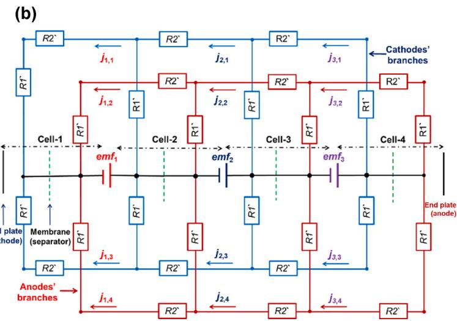
Fig. 2. a) A schematic diagram of the 4-cell stack alkaline water electrolyzer and the attached manifold assembly. B) The corresponding equivalent electrical circuit after shutdown.

After $1.0\mathrm{h}$ of steady-state operation, the power supply was turned off and the circuit breaker was physically opened to prevent any external influence on the electrodes' potentials during the measurements. It is worth noting that the heater was turned off immediately after the water electrolysis was terminated and the KOH electrolyte was left to cool naturally over time.

In addition, effects of the electrolyte circulation, with and without the nitrogen bubbling in the electrolyte, on the reverse current and the electrodes' potentials during the shutdown time were studied. The following conditions were applied separately during the shutdown time:

1 With KOH electrolyte circulation (pumps ON).
2 Without KOH electrolyte circulation (pumps OFF).
3 Feeding of vigorous nitrogen gas bubbles to the KOH electrolyte inside the gas separators. In this case, the KOH circulation operates.

# 2.5. Fabrication of the electrodes

In this study, two different OER electrocatalysts were individually utilized with the same HER electrocatalyst. The first OER electrocatalyst is $\mathrm{NiCoO_x}$ electrocatalyst that was deposited on the a blasted Ni-mesh substrate by the thermal decomposition technique as presented in our previous report [30]. It is worthy to mention that all thin films used in this study were deposited according to that thermal decomposition procedure. To fabricate the second OER electrocatalyst, a thin layer of $\mathrm{LiNiO_x}$ was directly deposited on the Ni-mesh substrate forming a $\mathrm{LiNiO_x / N_i - m e s h}$ electrode, which showed a good durability under a dynamic operation condition in an alkaline medium [50]. Then, a thin film composed of Ir, Co, and Ni oxides was deposited. It is noteworthy that the second electrocatalyst has an improved OER activity and better durability compared to the first one. The HER electrocatalyst (the cathode) consists of Ru and Ln oxides deposited on a fine mesh of Ni metal. The projected area of each electrode is $27.8~\mathrm{cm}^2$ . For simplicity, throughout this manuscript, the first OER catalyst is named "AN-1", the second OER catalyst is named "AN-2" and the cathode is named CA-1, where "AN" stands for anode and "CA" stands for cathode.

# 2.6. Modeling approach

In this model, the reverse current phenomenon is considered as a battery discharge. The reactions are expressed based on the electrical circuit model shown in Fig. S5. The simulator was fed with the numerical data of the $E - Q_{\mathrm{rev}}$ plot; where $E$ represents the potential of the anode and the cathode on either side of a BP, and $Q_{\mathrm{rev}}$ represents the reverse

charge flowing in the circuit branch of that BP. The $E - Q_{\mathrm{rev}}$ plot, shown in Fig. S6, was obtained based on the results of the actual experiment of the present 4-cell AWE system. For each BP, the emf of the corresponding battery equals the potential difference between the anode and the cathode on either side of that BP. In addition, for the ionic current resulted from the flow of hydroxide ions in the manifold tubes, the continuity of current in conductive materials is described as follows:

$$
\nabla \quad (- \sigma_ {S} \cdot \nabla \varnothing_ {S}) = 0
$$

$$
\nabla (- \sigma_ {\mathrm {E}} \cdot \nabla \varnothing_ {\mathrm {E}}) = 0 \tag {1}
$$

where, $\varphi_{E}$ is the potential of any point inside the KOH electrolyte through the cells and the manifolds. In addition, $\varphi_{S}$ is the potential of metallic parts including the associated electrodes, end plates and bipolar plates. $\sigma_{\mathrm{E}}$ is the ionic conductivity of the KOH electrolyte, which equals $62~\mathrm{S / m}$ at $30^{\circ}\mathrm{C}$ . $\sigma_{\mathrm{S}}$ is the electrical conductivity of the bipolar plates and the electrodes, which is equal to $1.43\times 10^{7}\mathrm{S / m}$ . Therefore, the relationship between the potential of the reaction surfaces and the resulting current becomes as follows:

$$
i _ {\text {r e a c}} = \frac {1}{R _ {\text {i n t}}} \left(\varnothing_ {\mathrm {S}} - \varnothing_ {\mathrm {E}} - E\right) \tag {2}
$$

where, $i_{\text{reac}}$ is the reaction current that resulted from the redox reactions of the electrodes.

$R_{int}$ is the internal resistance of each cell. $E$ is the potential of the associated anode and cathode that experimentally measured during the shutdown time of the electrolyzer.

For the time development, the relationship between the flowing charges and the reaction current becomes:

$$
\frac {\partial Q}{\partial t} = i _ {\text {r e a c}} \tag {3}
$$

where, $Q$ is the cumulative reverse charge associated with the experimentally measured reverse current during the shutdown time of the electrolyzer.

The boundary conditions are set as follows:

- All internal boundaries are continuous. Inside the definition area of $\varphi_{\mathrm{S}}$ and $\varphi_{\mathrm{E}}$ , the source term of ionic current flux is always equal to zero. Thus, the following relations are valid:

$$
- \boldsymbol {n} \cdot \left(- \sigma_ {\mathrm {S}} \nabla \varphi_ {\mathrm {S}}\right) = 0 \tag {4}
$$

$$
- \boldsymbol {n} \cdot \left(- \sigma_ {\mathrm {E}} \nabla \varphi_ {\mathrm {E}}\right) = 0 \tag {5}
$$

- The end plate on the cathode side of the cells stack is set to ground, $\varphi_{\mathrm{S}} = 0$

The reverse current model of the 4-cell stack considers the anode compartments, anode manifolds, the cathode compartments, cathode manifolds, bipolar plates, end plates, and the separators. In this model, the geometric dimensions of all components are the same as those used in the actual experiment, except for the geometric dimensions of the manifold. For each manifold branch, we adapted its geometry to have the same ionic resistance as that of the actual experiment. The model was solved by means of COMSOL5.6.

# 3. Results and discussion

# 3.1. Basic water electrolysis performance of the single cell electrolyzer

A single-cell alkaline water electrolyzer was assembled based on a zero-gap configuration, as shown in Fig. S1. AN-1 and AN-2 were used separately as OER electrocatalysts. However, CA-1 was utilized as HER electrocatalyst in both cases. The current density and the electrochemical impedance (by applying a sine wave of $10\mathrm{mV}$ amplitude in a frequency range of $10\mathrm{kHz}$ to $1.0\mathrm{Hz}$ ) were measured at different cell voltages in KOH electrolyte $(7\mathrm{M})$ at $30^{\circ}\mathrm{C}$ and $80^{\circ}\mathrm{C}$ . The cell voltage against current density of the two electrode systems with and without iR correction are shown in Fig. 3 (a) and (b). The figures clearly show that AN-2 outperforms AN-1 as an OER electrocatalyst.

# 3.2. Basic behavior of the electrolyzer after shutdown

Before discussing the factors that affects the reverse current phenomenon, we present the basic information and most likely the general behavior of the electrocatalysts of alkaline water electrolyzers under the start-up/shutdown operation condition. As a case study, an electrolyzer with AN-2 electrodes operated under a constant current of $0.6\mathrm{Acm}^{-2}$ for $1.0\mathrm{h}$ at $30^{\circ}\mathrm{C}$ was considered. Fig. 4 (a) shows the behavior of the electromotive forces over time after the shutdown. The electromotive forces of the three BPs have almost the same initial value $(\sim 1.55\mathrm{V})$ . They gradually decrease at approximately the same rate down to about $1.1\mathrm{V}$ after which they decline at higher rates. It is noteworthy that the sharp decrease of the emf of the middle bipolar plate (BP-2) started

earlier than that of the other two bipolar plates (BP-1 and BP-2) which have almost the same behavior. Fig. 4 (b) shows the experimentally measured as well as the theoretically calculated, by means of the COMSOL model described hereinabove, reverse currents of the three BPs over the shutdown time. Interestingly, the theoretical and the experimental results agree well. The figure shows that the reverse current of BP-2 is relatively higher than that of BP-1 and BP-3 which have almost similar reverse currents over time. The simulation data can explain this observation clearly. Figs. S7-S10 exhibit the resulted, by means of COMSOL5.6 software, distribution of the electrical potential through the electrolyte of the cells and the manifolds as well as the resulted ionic reverse current, represented by arrows size and direction, in all tube branches after 0.0, 100, 1000 and $5000\mathrm{s}$ of shutdown time, respectively. As shown in Figs. S7-S10, the gradual decrease of the electrolyte potential from the anode-end plate side (cell-4, on right hand side of the stack) to the cathode-end plate side (cell-1) induces ionic reverse currents in the indicated directions (from cell-4 toward cell-1). The components of the ionic reverse current start from cells 4 and 3 (cells with higher electrolyte potential), accumulate at the center of the manifold system (across BP-2) and then end in cells 2 and 1 (cells with relatively lower electrolyte potential). Therefore, the ionic reverse current is maximized in the middle manifold branch $(i_2)$ . In addition, the figures reveal that the flow of the reverse current during the shutdown time causes the electrolyte potential of all cells to drop to the value of the grounded cathode-end plate (cathode of cell-1) and thus the ionic reverse current is significantly diminished after $\sim 5000$ s. It is noteworthy that the net reverse currents in the vertical tubes connected to the middle cells (cells 2 and 3) are clearly smaller than those in the tubes connected to the terminal cells (cells 1 and 4). Therefore, the potential gradient is relatively smaller in the middle cells. The increased value of the reverse current in the middle branch $(i_2)$ could explain the faster decline in the emf of BP-2 compared to that of other BPs, as shown in Fig. 4 (a). In addition, Fig. 4 (b) reveals that the initial values of the experimentally measured reverse currents are relatively low. It appears that a period of $\sim 30$ s is required to completely evacuate the remaining gas bubbles and fill the outlet manifold tubes with KOH electrolyte and thus the ionic conductivity increases, and the reverse currents reach their maximum values as shown in the figure. However, in the simulator, immediate evacuation of gas bubbles after shutdown is assumed. This explains the higher theoretical reverse current during the early $30\mathrm{s}$ after shutdown compared to the experimental reverse current. For each

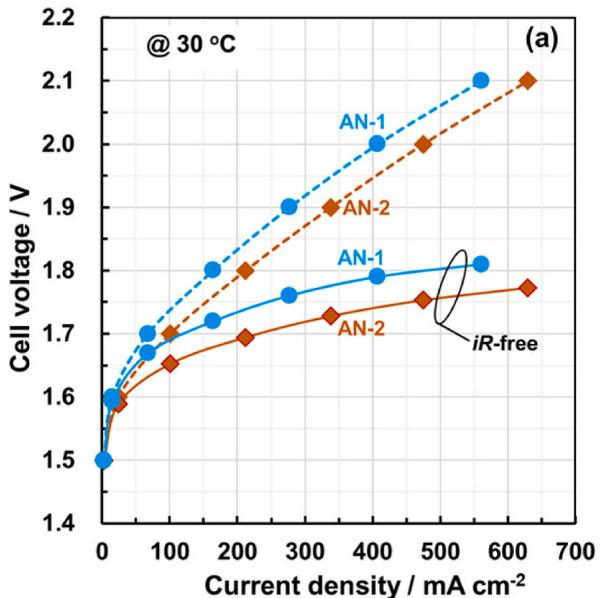

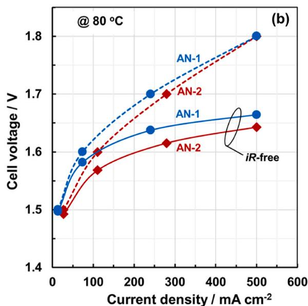
Fig. 3. For the two set of electrodes AN-1//CA-1 and AN-2//CA-1, the cell voltage against the current density of a single-cell electrolyzer at a) $30^{\circ}\mathrm{C}$ and b) $80^{\circ}\mathrm{C}$ in KOH electrolyte of $7\mathrm{M}$ .

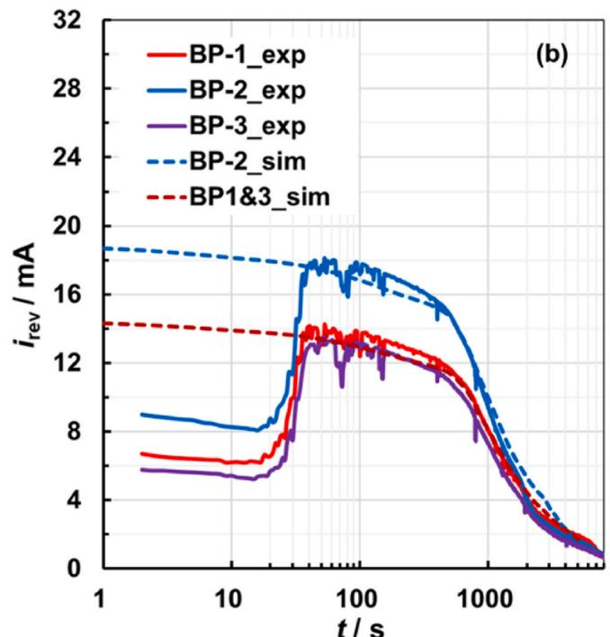

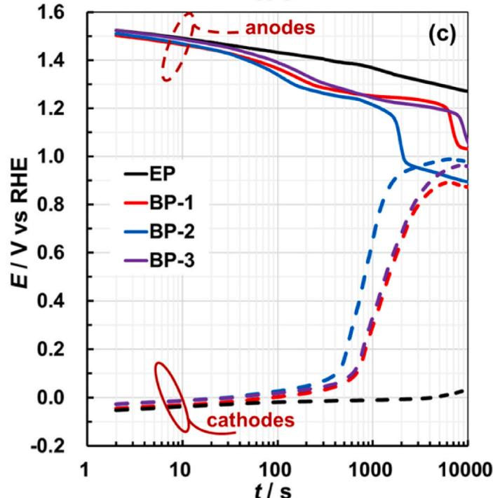

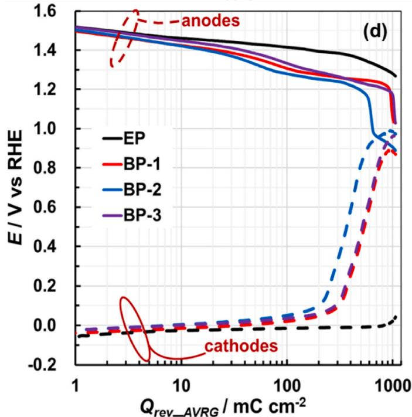
Fig. 4. For the electrode system with AN-2 anodes after electrolysis under condition of $0.6\mathrm{Acm}^{-2}$ at $30^{\circ}\mathrm{C}$ for 1 h a) The electromotive forces of bipolar plates versus time. b) Reverse current of each bipolar plate versus shutdown time of the experiment (solid lines) as well as the simulation (dashed lines). c) Electrodes' potentials of bipolar plates and end plates versus shutdown time. d) Electrodes' potentials of bipolar plates and end plates versus the average reverse charge of the three bipolar plates.

bipolar plate $(\mathrm{BP_k})$ the electromotive force $emf_{\mathrm{k}}$ was plotted against the measured reverse current $(i_{\mathrm{k}})$ where $\mathrm{k} = 1,2,$ and 3, the graph is shown in Fig. S11 (a). The figure reveals that after evacuation of the generated gas bubbles the relationship between the $emf_{\mathrm{k}}$ and $i_{\mathrm{k}}$ becomes linear, in a wide range of reverse current. The slope of each trend line (dashed lines) represents the so-called equivalent resistance $(R_{\mathrm{equ}})$ associated with the corresponding BP. The equivalent resistance of the middle bipolar plate (BP-2) is slightly lower than that of the edge plates (BP-1 and BP-3) 81 and $100\Omega$ , respectively. This as well may explain the increased reverse current of BP-2 compared to that of BP-1 and BP-3. Fig. 4 (c) shows the behavior of the potentials of the anodes and cathodes of the end plates

(EP) and bipolar plates (BP-1, BP-2, and BP-3) versus shutdown time. Anodes (cathodes) have almost the same positive (negative) initial potential value. Basically, during the shutdown time, the electrodes of the end plates are electrically isolated, thus they have rather stable potentials over the measurement time (10,000 s–2.7 h). Nevertheless, the reverse current flowing in each BP decreases the anode potential and increases the cathode potential during shutdown. Thus, unfavorable reduction reactions (oxidation reactions) occurred on the anodes (the cathodes) of BPs. The recurrence of oxidation/reduction cycles certainly has negative implications for the long-term durability of the electrodes [24–30]. Fig. S11 (b) shows how the electrodes' potentials changed after

2000 s from the moment the electrolyzer was turned off. It is obvious that the amount of change in the potential of each BP cathode is rather greater than that of the associated anode. This indicates that the BPs cathodes associated with AN-2 are subjected to higher stressors than those of the same anodes. In addition, the potential of the cathode on the middle bipolar plate (BP-2) is higher than that of cathodes on the other BPs. This observation corresponds to the highest reverse current of BP-2. Furthermore, Fig. S12 (a) reveals that the cumulative reverse charge of the middle BP is relatively higher than that of other BPs. Fig. 4 (d) shows the plot of electrodes' potentials against the average cumulative reverse charge $\left(\mathrm{Q}_{\mathrm{rev\_AVRG}}\right)$ of the three BPs. For bipolar plates, the anodes' and cathodes' potentials gradually change, up to $\mathrm{Q}_{\mathrm{rev\_AVRG}}$ equals $\sim 200~\mathrm{mC}$ $\mathrm{cm}^{-2}$ . Afterward, there was a sharp increase in the potentials of the cathodes, especially that of BP-2. The sharp drop in the anodes' potentials occurs at a relatively higher reverse charge. Finally, Fig. S12 (b) exhibits the cell voltages of the four cells of the stack versus shutdown time. The figure shows that all cells have the same initial cell voltage. However, the cell voltages of the middle cells (cell 2 and cell 3) reached minimum values that are clearly lower than those of the peripheral cells (cell 1 and cell 4). In summary, simulation and experimental results agreed that the reverse current of the middle BP is higher than that of the peripheral BPs. For simplicity, since the behaviors of the reverse currents and the electrode potentials are almost symmetric around BP-2, henceforth we present the average behavior of the electrodes of BP-1 and BP-3 to demonstrate the impact of different operating and shutdown parameters on the reverse current phenomenon.

# 3.3. Effects of dissolved gases on the reverse current phenomenon

The aim of this experiment is to examine whether the origin of the reverse current phenomenon is the redox reactions of the dissolved gases $\mathrm{(H_2}$ and $\mathrm{O}_2$ ) or the redox reactions of the electrodes' materials themselves. In this experiment, a 4-cell stack with anodes AN-2 and cathodes CA-1 electrodes was used. $\mathrm{N}_2$ gas was introduced into the electrolyte to quickly evacuate the dissolved gases and thus eliminate the effect of the dissolved gases on the measurement of the reverse current and the electrodes' potentials during the shutdown time. Fig. 5 (a) shows the average reverse current of BP-1 and BP-3 versus shutdown time in case of with and without $\mathbf{N}_2$ bubbling. The figure shows that the reverse current was not affected by the introduction of $\mathbf{N}_2$ . In addition, Fig. S13 (a) shows the emf versus time. It is very evident that the $\mathbf{N}_2$ bubbling does not affect the electromotive forces of the bipolar plates throughout the shutdown time. Moreover, the behavior of potentials of the cathodes and anodes versus time are nearly identical regardless of the $\mathbf{N}_2$ bubbling, as shown in Fig. 5 (b). Furthermore, the average potential of

the cathodes and anodes of BP-1 and BP-3 versus the average reverse charge of the two bipolar plates in the case of $\mathrm{N}_2$ bubbles are like those in the absence of $\mathrm{N}_2$ bubbling, as shown in Fig. S13 (b). Subsequently, it can be concluded that the main origin of the reverse current phenomenon during the shutdown time is the redox reactions of the electrode materials on both sides of each BP. The anodes are electrochemically reduced, and the cathodes are electrochemically oxidized. It is noteworthy that Uchino et al. (2018) performed reverse current measurements for a 2-cell AWE using Ni-mesh as OER and HER electrocatalysts [26]. After shutdown, they replaced the used KOH electrolyte with a fresh KOH electrolyte (of course of the same concentration) that was free of reactive gases. They concluded that the reverse current was predominantly due to the reverse redox reactions of the electrode materials. This means that the electrocatalysts of the alkaline water electrolyzer powered by intermittent RES, for example solar and wind energy, are susceptible to degradation due to the frequent reduction/oxidation reaction cycles [24-30].

# 3.4. Effects of the electrolyte circulation on the reverse current phenomenon

During the operating time of the AWE system, electrolyte cycling is necessary to compensate for evaporated and decomposed water amount, to prevent a temperature gradient across the stack, and to promote the evacuation of generated gas bubbles [38]. However, the effect of electrolyte circulation during the shutdown time on the reverse current phenomenon and thus on the durability of the electrocatalysts of the AWE system under dynamic operation has not been studied so far.

In the present study, for the 4-cell stack electrolyzer with the AN-2 electrodes, effects of the electrolyte circulation on the reverse current and the behavior of the electrodes' potentials during the shutdown time were studied. Experiments were conducted under the electrolysis condition of $0.6\mathrm{Acm}^{-2}$ for $1.0\mathrm{h}$ at $30^{\circ}\mathrm{C}$ , the electrolyte circulation was maintained during the electrolysis time. However, during the shutdown time, in some experiments, the electrolyte circulation was continued (pumps ON) and in other experiments the electrolyte circulation was stopped (pumps OFF) immediately before the termination of the electrolysis. When the electrolyte circulation was stopped, the inlet manifold tubes (horizontally fixed) of the cathodes and anodes chambers were filled with the electrolyte. However, the outlet tubes (vertically fixed) of the manifold system were about half filled with the electrolyte and the remaining portions contained the generated gases. As shown schematically in Fig. S14. Therefore, the average ionic resistance $(R_{\mathrm{eff}})$ of BP-1 and BP-3 is increased from about 130 to $400\Omega$ as shown in Fig. S15 (a). It is noteworthy that without the electrolyte circulation, residual gas

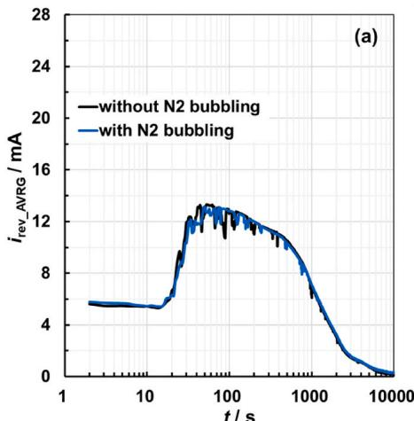

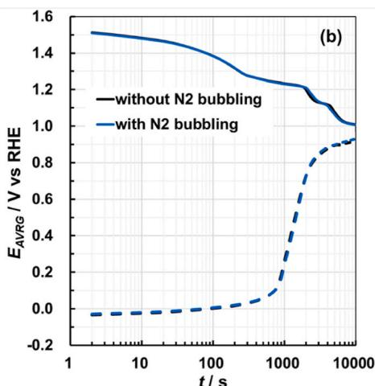
Fig. 5. For experiments conducted with and without $\mathbf{N}_2$ bubbling a) The average reverse current of BP-1 and BP-3 versus shutdown time. b) The average potential of the anodes and cathodes of BP-1 and BP-3 versus shutdown time.

bubbles remain inside the electrolyte and thus contribute to raising the ionic resistance. Although the electromotive forces have the same initial value, the electrolyte circulation accelerate their decline with time, as shown in Fig. S15 (b). Consequently, experimental as well as the simulation results agreed that the reverse current in the case of electrolyte circulation is much higher than that of without electrolyte circulation, as shown in Fig. 6 (a). Fig. 6 (b) shows the average potentials of the anodes and cathodes of BP-1 and BP-3 versus the shutdown time. The figure reveals that the electrolyte circulation fastened the redox reaction on the electrode surfaces during the shutdown time. In addition, the figure reveals that, in case of suspended electrolyte circulation, the potential of the cathodes and anodes did not change remarkably up to $\sim 3000$ s (the cathode and anode potential reach $\sim 0.1$ V and $1.25\mathrm{V}$ vs RHE, respectively). This may indicate that the repeated temporary shutdown of this electrolyzer, due RES fluctuations, for about $50\mathrm{min}$ does not have significant effect on the long-term durability of the electrocatalysts. This safe shutdown period reduced to about $12\mathrm{min}$ ( $720~\mathrm{s}$ ) in case of electrolyte circulation, as shown in Fig. 6 (b). Consequently, from the perspective of the long-term durability of the electrodes, it is highly recommended to suspend the electrolyte circulation during the shutdown time.

# 3.5. Effects of the electrolysis current and temperature on the reverse current phenomenon

The influences of the parameters of the electrolysis condition, namely the electrolyte temperature and the value of the DC current density, on the reverse current phenomenon were studied. Experiments were carried out under different electrolysis conditions: $i = 0.4$ A cm $^{-2}$ at electrolyte temperature ( $T_{\mathrm{KOH}}$ ) of $30^{\circ} \mathrm{C}$ , $i = 0.6$ A cm $^{-2}$ at $T_{\mathrm{KOH}} = 30^{\circ} \mathrm{C}$ , $i = 0.6$ A cm $^{-2}$ at $T_{\mathrm{KOH}} = 80^{\circ} \mathrm{C}$ , and $i = 1.0$ A cm $^{-2}$ at $T_{\mathrm{KOH}} = 80^{\circ} \mathrm{C}$ . For the four electrolysis conditions, Fig. 7 (a) shows the average electromotive forces (emfs) of BP-1 and BP-3 during shutdown time. The figure indicates that the initial values of the electromotive forces as well as their behaviors against shutdown time depend mainly on the electrolyte temperature not on the value of the electrolysis current density. In addition, the measured reverse currents resulted from the four electrolysis conditions are clearly dependent on the electrolyte temperature than on the electrolysis current, as shown in Fig. 7 (b). The reverse current increases with the increase in the electrolyte temperature, mainly due to the increase in the ionic conductivity of the electrolyte with increasing temperature [51], as shown in Fig. S16 (a). Accordingly, the cumulative reverse charges are higher in the case of electrolyte temperature of $80^{\circ} \mathrm{C}$ regardless of the electrolysis current, as shown in

Fig. S16 (b). This means that the total reverse charge is approximately independent of the electrolysis current in the range of $400 - 1000\mathrm{mAcm}^{-2}$ . It is worthy to mention that Uchino et al. (2018) studied the effect of electrolysis current (in a range of $100 - 600\mathrm{mA cm}^{-2}$ ) on the reverse charge of AWE using bare Ni-mesh electrodes as electrocatalysts [27]. In that study, the dependence of the reverse charge on the value of the electrolysis current is greatly diminished in the high current range of $0.4 - 0.6\mathrm{A cm}^{-2}$ : An increase in the electrolysis current from 0.4 to $0.6\mathrm{A cm}^{-2}$ leads to about $7\%$ increase in the reverse charge. The slight difference between the previous study and the present study could be due to the difference in electrode materials: in the previous study, bare Ni-mesh electrodes were used, however, in the current study, Ni-mesh electrodes coated with high-activity materials were used as electrocatalysts. Fig. 7 (c) and (d) show the behavior of the electrodes' potentials against the shutdown time and against the average cumulative reverse charge, respectively. In the case of $80^{\circ}\mathrm{C}$ , the potentials of the anodes have a clearly lower initial value, and the cathodes have a slightly higher initial potential value than that of $30^{\circ}\mathrm{C}$ , as shown in Fig. 7 (c). This could be due to structural changes and/or phase changes that may occur at the surfaces of the electrodes due to the temperature increase [52,53]. These initial values of the electrode potential are approximately independent of the electrolysis current density. In addition, the high temperature accelerated the change in electrodes' potentials during the shutdown time, mainly due to the increase in reverse current. Moreover, in the case of $80^{\circ}\mathrm{C}$ , the BPs cathodes' potentials reached their final values after the flow of a relatively larger cumulative reverse charge, as shown in Fig. 7 (d). Ultimately, although the operation of the AWE at high temperature improves the kinetics of the water splitting and thus enhances the water electrolysis efficiency [39,44-46], it has a negative effect on the long-term durability of the electrocatalysts under repeated temporary shutdowns. Accordingly, it can be said that the rapid cooling of the electrolyte after shutdown can extend service life of the electrocatalysts. On the other hand, interestingly, operating the AWE at an optimally high current density, to increase the efficiency of the overall system and the purity of the hydrogen produced [37], has no significant effect on the reverse current phenomenon during the shutdown time.

# 3.6. Effects of anode materials on the reverse current phenomenon

For the two systems of electrodes used in this part of our study, the cathodes are the same. The improved anode (AN-2), which consisted of two layers of metal oxides including precious metal oxide, has higher OER activity and better durability compared to the AN-1 anode, which

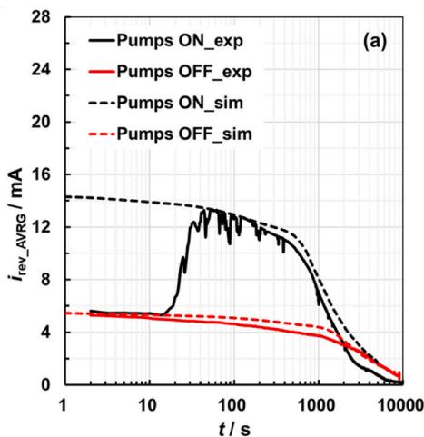

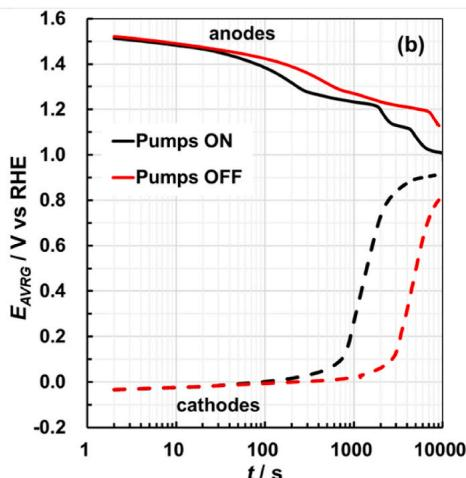
Fig. 6. For experiments conducted with (Pumps ON) and without (Pumps OFF) electrolyte circulation a) The average reverse current of BP-1 and BP-3 versus shutdown time of the experiment (solid lines) as well as the simulation (dashed lines). b) The average potential of the anodes and the cathodes of BP-1 and BP-3 versus shutdown time.

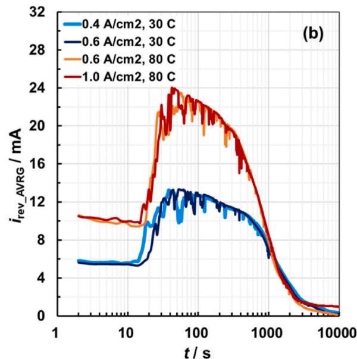

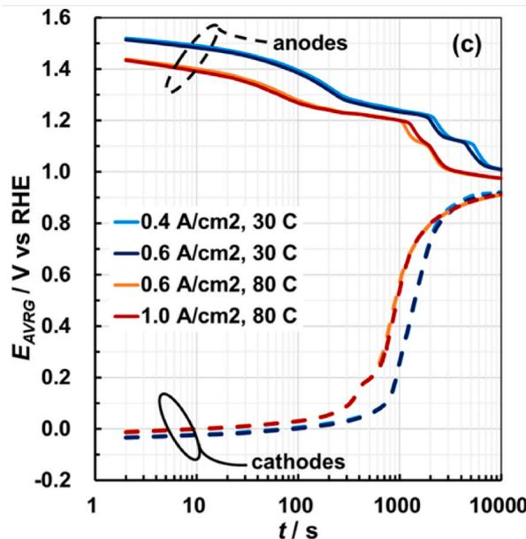

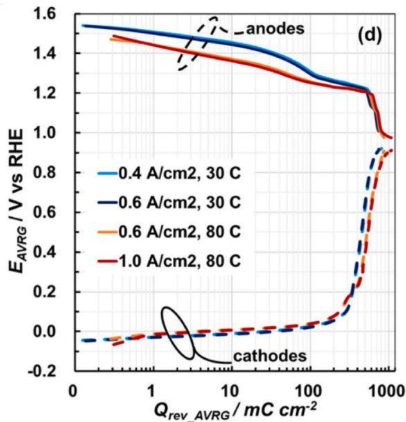
Fig. 7. For water electrolysis condition of $0.4\mathrm{Acm}^{-2}$ at $30^{\circ}\mathrm{C},$ $0.6\mathrm{Acm}^{-2}$ at $30^{\circ}\mathrm{C},$ $0.6\mathrm{Acm}^{-2}$ at $80^{\circ}\mathrm{C},$ and $1.0\mathrm{Acm}^{-2}$ at $80^{\circ}\mathrm{C}$ each for $1.0\mathrm{h}$ a) The average electromotive force of BP-1 and BP-3 versus shutdown time. b) The average reverse current of BP-1 and BP-3 versus shutdown time. c) the average potentials of the anodes and cathodes of BP-1 and BP-3 versus shutdown time. d) The average potentials of the anodes and cathodes versus the average reverse charge of BP-1 and BP-3.

consists of only one layer of $\mathrm{NiCoO_x}$ . The two systems were operated under a constant current density of $0.6\mathrm{Acm}^{-2}$ for $1.0\mathrm{h}$ at $30^{\circ}\mathrm{C}$ . Fig. 8 (a) shows the emf of the two systems as a function of time. The electrode system with AN-2 anodes has a slightly higher initial emf and a lower discharge rate during the early $900~s$ of shutdown time compared to that of AN-1 anodes. In addition, Fig. 8 (b) shows that the reverse current of the electrode system with AN-2 anodes is relatively higher than that of AN-1. Thus, the cumulative reverse charge is clearly higher for the system of AN-2, as shown in Fig. S17 (a). This could be due to the increased oxide species present on the AN-2 anode compared to AN-1. Fig. 8 (c) exhibits the average of the potentials of BP-1 and BP-3 electrodes against the shutdown time. Although the two systems had nearly similar initial anode and cathode potentials, they had distinctly different behavior during the shutdown time, especially after about $200~s$ of shutdown time. The AN-2 anodes showed a gradual decrease in their potential over time. However, the AN-1 anodes showed a rapid decline in their potential after $\sim 200~s$ and reached the minimum value ( $\sim 0.55\mathrm{V}$ vs RHE) after about $2000~s$ . This may mean that temporary shutdown of

the AWE system with AN-1 anodes, due to RES fluctuations, should not exceed about 3 min to avoid the electrocatalysts degradation/detachment. On the other hand, after about 500 s of shutdown, the cathode associated with AN-2 showed a pronounced increase in its potential compared to that associated with AN-1. In addition, Fig. S17 (b) shows the plot of electrode potentials versus the average cumulative reverse charge. Based on this graph, the amount of change in the potential of the electrodes, after the flow of $400\mathrm{mCcm}^{-2}$ of the reverse charge, was calculated and displayed in Fig. 8 (d). The study confirmed that the cathode attached to the highly active and robust anode (AN-2) on either side of the BP, is subject to higher stressors than that associated with the less efficient anode (AN-1). In addition, the type and amount of active metal oxides on the electrode surface control the electrode potential behavior during shutdown time. Therefore, selecting compatible anodes and cathodes may extend the service life of the AWE system under dynamic operation.

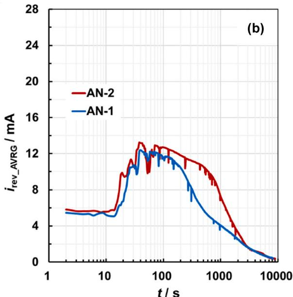

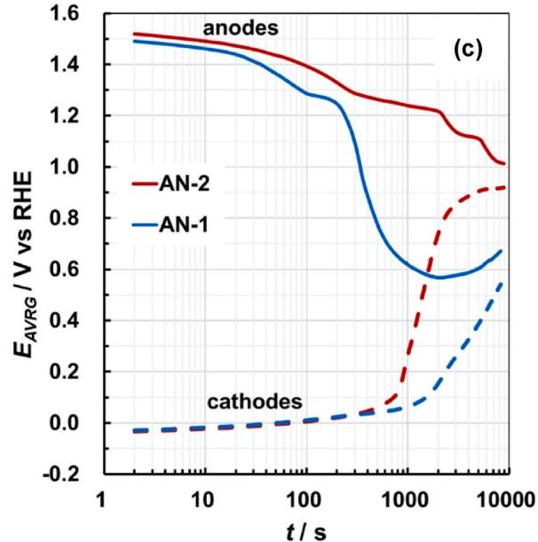

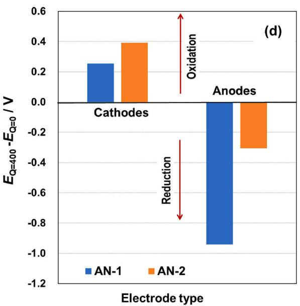
Fig. 8. For the electrode systems with AN-1 and AN-2 anodes operated under water electrolysis condition of $0.6\mathrm{Acm}^{-2}$ at $30^{\circ}\mathrm{C}$ for $1.0\mathrm{h}$ a) The average electromotive forces of BP-1 and BP-3 versus shutdown time. b) The average reverse current of BP-1 and BP-3 versus shutdown time. c) Average electrode potentials of BP-1 and BP-3 versus shutdown time. d) The change in the average potentials of the cathodes and anodes of BP-1 and BP-3, after the flow of $400\mathrm{mCcm}^{-2}$ of the reverse charge.

# 4. Conclusion

In the present study, we operated a 4-cell stack alkaline water electrolyzer under different operating parameters. The effects on the reverse current phenomenon of these parameters as well as electrode material are discussed. The high operating temperature $(80^{\circ}\mathrm{C})$ increased the reverse current and thus accelerated the unfavorable reverse redox reactions of the electrocatalysts during shutdown. Thus, rapid cooling of the electrolyte after stopping the electrolyzer is somewhat likely to improve the long-term durability of electrocatalysts. In addition, circulating the electrolyte through the stack and the manifold tubes during shutdown time increased the reverse current, due to the improved ionic conductivity, thus accelerated the change in the electrodes' potentials. Accordingly, it is recommended to stop the electrolyte circulation immediately after terminating the water electrolysis. Moreover, vigorous $\mathrm{N}_2$ bubbling in the electrolyte during shutdown time does not affect the reverse current nor the electrodes' potentials. This means that

the reverse current is directly related to the redox reactions of the electrocatalysts material not to the redox reactions of the dissolved $\mathrm{O}_2$ and $\mathrm{H}_2$ gasses. Interestingly, the value of the operating DC current density did not show a significant effect on the reverse current phenomenon during shutdown time. Moreover, during the shutdown time, the cathode bound to the multilayer anode, which has a larger charge capacity, on the same BP is subject to more stresses and is therefore more susceptible to corrosion. Therefore, selecting compatible anodes and cathodes may extend the service life of the AWE system under dynamic conditions. As a general observation, the middle BP showed a relatively higher reverse current and faster change in electrode potential compared to the other BPs. Interestingly, the results of the introduced theoretical model, by means of COMSOL5.6, of the reverse current phenomenon agreed well with the experimental data. The simulator enabled us to explain some observations. In addition, it is a useful tool that can be used to study more complex systems: for example, stacks with bigger cells or with higher number of cells. Ultimately, the current

study provides new basic information that is necessary to adapt AWE systems to the dynamic operating conditions of RES.

# CRediT authorship contribution statement

Ashraf Abdel Haleem: Conceptualization, Methodology, Validation, Investigation, Writing - original draft. Jinlei Huyan: Software, Investigation. Kensaku Nagasawa: Conceptualization, Supervision, Validation. Yoshiyuki Kuroda: Conceptualization, Supervision, Validation. Yoshinori Nishiki: Conceptualization, Resources, Validation. Akihiro Kato: Resources, Validation. Takaaki Nakai: Resources, Validation. Takuto Araki: Conceptualization, Software, Supervision. Shigenori Mitsushima: Conceptualization, Methodology, Writing - review & editing, Supervision, Project administration, Funding acquisition.

# Declaration of competing interest

The authors declare that they have no known competing financial interests or personal relationships that could have appeared to influence the work reported in this paper.

# Acknowledgements

This study was accomplished within the project of "the development of Fundamental Technology for Advancement of Water Electrolysis Hydrogen Production in Advancement of Hydrogen Technologies and Utilization". The project (grant #P14021) is financially supported by the New Energy and Industrial Technology Development Organization (NEDO).

# Appendix A. Supplementary data

Supplementary data to this article can be found online at https://doi.org/10.1016/j.jpowsour.2022.231454.

# References

[1] J.H. Williams, R.A. Jones, B. Haley, G. Kwok, J. Hargreaves, J. Farbes, M.S. Torn, Carbon-neutral pathways for the United States, AGU Adv 2 (2021), https://doi.org/10.1029/2020av000284.
[2] L. Gil, J. Bernardo, An approach to energy and climate issues aiming at carbon neutrality, Renew. Energy Focus. 33 (2020) 37-42, https://doi.org/10.1016/j.ref.2020.03.003.
[3] S. Lazarou, S. Makridis, Hydrogen storage Technologies for smart grid applications, Challenges 8 (2017) 13, https://doi.org/10.3390/challe8010013.
[4] M. Newborough, G. Cooley, Developments in the global hydrogen market: electrolyser deployment rationale and renewable hydrogen strategies and policies, Fuel Cell. Bull. (2020) 16-22, https://doi.org/10.1016/S1464-2859(20)30486-7, 2020.
[5] M. Ramadan, A review on coupling Green sources to Green storage (G2G): case study on solar-hydrogen coupling, Int. J. Hydrogen Energy 46 (2021) 30547-30558, https://doi.org/10.1016/j.ijhydene.2020.12.165.
[6] G. Maggio, A. Nicita, G. Squadrito, How the hydrogen production from RES could change energy and fuel markets: a review of recent literature, Int. J. Hydrogen Energy 44 (2019) 11371-11384, https://doi.org/10.1016/j.ijhydene.2019.03.121.
[7] R.H. Lin, Y.Y. Zhao, B.D. Wu, Toward a hydrogen society: hydrogen and smart grid integration, Int. J. Hydrogen Energy 45 (2020) 20164-20175, https://doi.org/10.1016/j.ijhydene.2020.01.047.
[8] S.A. Grigoriev, V.N. Fateev, D.G. Bessarabov, P. Millet, Current status, research trends, and challenges in water electrolysis science and technology, Int. J. Hydrogen Energy 45 (2020) 26036-26058, https://doi.org/10.1016/j.ijhydene.2020.03.109.
[9] A. Kovac, M. Paranos, D. Marcius, Hydrogen in energy transition: a review, Int. J. Hydrogen Energy 46 (2021) 10016-10035, https://doi.org/10.1016/j.ijhydene.2020.11.256.
[10] M.K. Kazi, F. Eljack, M.M. El-Halwagi, M. Haouari, Green hydrogen for industrial sector decarbonization: costs and impacts on hydrogen economy in Qatar, Comput. Chem. Eng. 145 (2021) 107144, https://doi.org/10.1016/j.compchemeng.2020.107144.
[11] F. Dawood, M. Anda, G.M. Shafiullah, Hydrogen production for energy: an overview, Int. J. Hydrogen Energy 45 (2020) 3847-3869, https://doi.org/10.1016/j.ijhydene.2019.12.059.
[12] Y. Manoharan, S.E. Hosseini, B. Butler, H. Alzhahrani, B.T.F. Senior, T. Ashuri, J. Krohn, Hydrogen fuel cell vehicles; Current status and future prospect, Appl. Sci. 9 (2019) 2296, https://doi.org/10.3390/app9112296.

[13] B. Tanc, H.T. Arat, E. Baltacioglu, K. Aydin, Overview of the next quarter century vision of hydrogen fuel cell electric vehicles, Int. J. Hydrogen Energy 44 (2019) 10120-10128, https://doi.org/10.1016/j.ijhydene.2018.10.112.
[14] A. Ajanovic, R. Haas, Prospects and impediments for hydrogen and fuel cell vehicles in the transport sector, Int. J. Hydrogen Energy 46 (2021) 10049-10058, https://doi.org/10.1016/j.ijhydene.2020.03.122.
[15] J. Shin, W.S. Hwang, H. Choi, Can hydrogen fuel vehicles be a sustainable alternative on vehicle market?: comparison of electric and hydrogen fuel cell vehicles, Technol. Forecast. Soc. Change 143 (2019) 239-248, https://doi.org/10.1016/j.techfore.2019.02.001.
[16] C. Schnuelle, T. Wassermann, D. Fuhrlaender, E. Zondervan, Dynamic hydrogen production from PV & wind direct electricity supply – modeling and technoeconomic assessment, Int. J. Hydrogen Energy 45 (2020) 29938-29952, https://doi.org/10.1016/j.ijhydene.2020.08.044.
[17] N.V. Kuleshov, V.N. Kuleshov, S.A. Dovbysh, S.A. Grigoriev, S.V. Kurochkin, P. Millet, Development and performances of a $0.5\mathrm{kW}$ high-pressure alkaline water electrolyser, Int. J. Hydrogen Energy 44 (2019) 29441-29449, https://doi.org/10.1016/j.ijhydene.2019.05.044.
[18] J. Brauns, T. Turek, Alkaline water electrolysis powered by renewable energy: a review, Processes 8 (2020) 248, https://doi.org/10.3390/pr8020248.
[19] V. Schröder, B. Emonts, H. Janßen, H.P. Schulze, Explosion limits of hydrogen/oxygen mixtures at initial pressures up to 200 bar, Chem. Eng. Technol. 27 (2004) 847-851, https://doi.org/10.1002/ceat.200403174.
[20] P. Haug, M. Koj, T. Turek, Influence of process conditions on gas purity in alkaline water electrolysis, Int. J. Hydrogen Energy 42 (2017) 9406-9418, https://doi.org/10.1016/j.ijhydene.2016.12.111.
[21] A. Ursúa, I. San Martin, E.L. Barrios, P. Sanchis, Stand-alone operation of an alkaline water electrolyser fed by wind and photovoltaic systems, Int. J. Hydrogen Energy 38 (2013) 14952-14967, https://doi.org/10.1016/j.ijhydene.2013.09.085.
[22] W. Hug, J. Divisek, J. Mergel, W. Seeger, H. Steele, Highly efficient advanced alkaline electrolyzer for solar operation, Int. J. Hydrogen Energy 17 (1992) 699-705, https://doi.org/10.1016/0360-3199(92)90090-J.
[23] A. Ursúa, E.L. Barrios, J. Pascual, I. San Martin, P. Sanchis, Integration of commercial alkaline water electrolyzers with renewable energies: limitations and improvements, Int. J. Hydrogen Energy 41 (2016) 12852-12861, https://doi.org/10.1016/j.ijhydene.2016.06.071.
[24] A. Weiß, A. Siebel, M. Bernt, T.-H. Shen, V. Tileli, H.A. Gasteiger, Impact of intermittent operation on lifetime and performance of a PEM water electrolyzer, J. Electrochem. Soc. 166 (2019) F487-F497, https://doi.org/10.1149/2.0421908jes.
[25] M. Bernt, A. Hartig-Weiß, M.F. Tovini, H.A. El-Sayed, C. Schramm, J. Schröter, C. Gebauer, H.A. Gasteiger, Current challenges in catalyst development for PEM water electrolyzers, Chem. Ing. Tech. 92 (2020) 31–39, https://doi.org/10.1002/cite.201900101.
[26] Y. Uchino, T. Kobayashi, S. Hasegawa, I. Nagashima, Y. Sunada, A. Manabe, Y. Nishiki, S. Mitsushima, Dependence of the reverse current on the surface of electrode placed on a bipolar plate in an alkaline water electrolyzer, Electrochemistry 86 (2018) 138-144, https://doi.org/10.5796/electrochemistry.17-00102.
[27] Y. Uchino, T. Kobayashi, S. Hasegawa, I. Nagashima, Y. Sunada, A. Manabe, Y. Nishiki, S. Mitsubishi, Relationship between the redox reactions on a bipolar plate and reverse current after alkaline water electrolysis, Electrocatalysis 9 (2018) 67-74, https://doi.org/10.1007/s12678-017-0423-5.
[28] S. Cherevko, A.R. Zeradjanin, A.A. Topalov, N. Kulyk, I. Katsounaros, K.J. J. Mayrhofer, Dissolution of noble metals during oxygen evolution in acidic media, ChemCatChem 6 (2014) 2219-2223, https://doi.org/10.1002/cctc.201402194.
[29] C. Spöri, J.T.H. Kwan, A. Bonakdarpour, D.P. Wilkinson, P. Strasser, The stability challenges of oxygen evolving catalysts: towards a common fundamental understanding and mitigation of catalyst degradation, Angew. Chem. Int. Ed. 56 (2017) 5994-6021, https://doi.org/10.1002/anie.201608601.
[30] A. Abdel Haleem, K. Nagasawa, Y. Kuroda, Y. Nishiki, A. Zaenal, S. Mitsushima, A new accelerated durability test protocol for water oxidation electrocatalysts of renewable energy powered alkaline water electrolyzers, Electrochemistry 89 (2021) 186–191, https://doi.org/10.5796/electrochemistry.20-00156.
[31] A. Buttler, H. Sliethoff, Current status of water electrolysis for energy storage, grid balancing and sector coupling via power-to-gas and power-to-liquids: a review, Renew. Sustain. Energy Rev. 82 (2018) 2440–2454, https://doi.org/10.1016/j.rser.2017.09.003.
[32] J. Divisek, J. Mergel, H. Schmitz, Advanced water electrolysis and catalyst stability under discontinuous operation, Int. J. Hydrogen Energy 15 (1990) 105-114, https://doi.org/10.1016/0360-3199(90)90032-T.
[33] G. Schiller, R. Henne, P. Mohr, V. Peinecke, High performance electrodes for an advanced intermittently operated 10-kW alkaline water electrolyzer, Int. J. Hydrogen Energy 23 (1998) 761-765, https://doi.org/10.1016/S0360-3199(97) 00122-5.
[34] G.R. Zhang, L.L. Shen, P. Schmatz, K. Krois, B.J.M. Etzold, Cathodic activated stainless steel mesh as a highly active electrocatalyst for the oxygen evolution reaction with self-healing possibility, J. Energy Chem. 49 (2020) 153-160, https://doi.org/10.1016/j.jechem.2020.01.025.
[35] Y. Kuroda, T. Nishimoto, S. Mitsushima, Self-repairing hybrid nanosheet anode catalysts for alkaline water electrolysis connected with fluctuating renewable energy, Electrochim. Acta 323 (2019) 134812, https://doi.org/10.1016/j.electacta.2019.134812.
[36] W. Ju, M.V.F. Heinz, L. Pusterla, M. Hofer, B. Fumey, R. Castiglioni, M. Pagani, C. Battaglia, U.F. Vogt, Lab-scale Alkaline water electrolyzer for bridging material

fundamentals with realistic operation, ACS Sustain. Chem. Eng. 6 (2018) 4829-4837, https://doi.org/10.1021/acssuschemeng.7b04173.
[37] F. ezazra Chakik, M. Kaddami, M. Mikou, Effect of operating parameters on hydrogen production by electrolysis of water, Int. J. Hydrogen Energy 42 (2017) 25550-25557, https://doi.org/10.1016/j.ijhydene.2017.07.015.
[38] A. Dukić, M. Firak, Hydrogen production using alkaline electrolyzer and photovoltaic (PV) module, Int. J. Hydrogen Energy 36 (2011) 7799-7806, https://doi.org/10.1016/j.ijhydene.2011.01.180.
[39] D. Jang, W. Choi, H.-S. Cho, W.C. Cho, C.H. Kim, S. Kang, Numerical modeling and analysis of the temperature effect on the performance of an alkaline water electrolysis system, J. Power Sources 506 (2021) 230106, https://doi.org/10.1016/j.jpowsour.2021.230106.
[40] N.A. Burton, R.V. Padilla, A. Rose, H. Habibullah, Increasing the efficiency of hydrogen production from solar powered water electrolysis, Renew. Sustain. Energy Rev. 135 (2021) 110255, https://doi.org/10.1016/j.rser.2020.110255.
[41] X. Shen, X. Zhang, G. Li, T.T. Lie, L. Hong, Experimental study on the external electrical thermal and dynamic power characteristics of alkaline water electrolyzer, Int. J. Energy Res. 42 (2018) 3244-3257, https://doi.org/10.1002/er.4076.
[42] N. Demir, M.F. Kaya, M.S. Albawabiji, Effect of pulse potential on alkaline water electrolysis performance, Int. J. Hydrogen Energy 43 (2018) 17013-17020, https://doi.org/10.1016/j.ijhydene.2018.07.105.
[43] D. Jang, H.S. Cho, S. Kang, Numerical modeling and analysis of the effect of pressure on the performance of an alkaline water electrolysis system, Appl. Energy 287 (2021) 116554, https://doi.org/10.1016/j.apenergy.2021.116554.
[44] A. Balabel, M.S. Zaky, I. Sakr, Optimum operating conditions for alkaline water electrolysis coupled with solar PV energy system, Arabian J. Sci. Eng. 39 (2014) 4211-4220, https://doi.org/10.1007/s13369-014-1050-6.
[45] K. Zeng, D. Zhang, Recent progress in alkaline water electrolysis for hydrogen production and applications, Prog. Energy Combust. Sci. 36 (2010) 307-326, https://doi.org/10.1016/j.pecs.2009.11.002.

[46] E. Amores, J. Rodríguez, C. Carreras, Influence of operation parameters in the modeling of alkaline water electrolyzers for hydrogen production, Int. J. Hydrogen Energy 39 (2014) 13063-13078, https://doi.org/10.1016/j.ijhydene.2014.07.001.
[47] P. Haug, B. Kreitz, M. Koj, T. Turek, Process modelling of an alkaline water electrolyzer, Int. J. Hydrogen Energy 42 (2017) 15689-15707, https://doi.org/10.1016/j.ijhydene.2017.05.031.
[48] M.H. Sellami, K. Loudiyi, Electrolytes behavior during hydrogen production by solar energy, Renew. Sustain. Energy Rev. 70 (2017) 1331-1335, https://doi.org/10.1016/j.rser.2016.12.034.
[49] D. Zhou, P. Li, W. Xu, S. Jawaid, J. Mohammed-Ibrahim, W. Liu, Y. Kuang, X. Sun, Recent advances in non-precious metal-based electrodes for alkaline water electrolysis, ChemNanoMat 6 (2020) 336–355, https://doi.org/10.1002/cnma.202000010.
[50] S. Fujita, I. Nagashima, Y. Nishiki, C. Canaff, T.W. Napporn, S. Mitsushima, The effect of LixNi2-xO2/Ni with modification method on activity and durability of alkaline water electrolysis anode, Electrocatalysis 9 (2018) 162-171, https://doi.org/10.1007/s12678-017-0439-x.
[51] R.J. Gilliam, J.W. Graydon, D.W. Kirk, S.J. Thorpe, A review of specific conductivities of potassium hydroxide solutions for various concentrations and temperatures, Int. J. Hydrogen Energy 32 (2007) 359-364, https://doi.org/10.1016/j.ijhydene.2006.10.062.
[52] Y. Li, X. Du, J. Huang, C. Wu, Y. Sun, G. Zou, C. Yang, J. Xiong, Recent progress on surface reconstruction of earth-abundant electrocatalysts for water oxidation, Small 15 (2019) 1-18, https://doi.org/10.1002/smll.201901980.
[53] M. Tang, W. Yuan, Y. Ou, G. Li, R. You, S. Li, H. Yang, Z. Zhang, Y. Wang, Recent progresses on structural reconstruction of nanosized metal catalysts via controlled-atmosphere transmission electron microscopy: a review, ACS Catal. 10 (2020) 14419-14450, https://doi.org/10.1021/acs Catal.0c03335.
