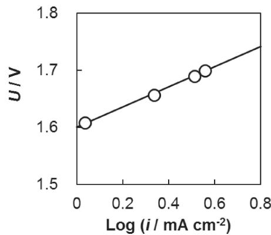
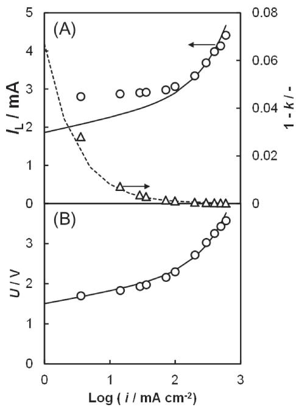
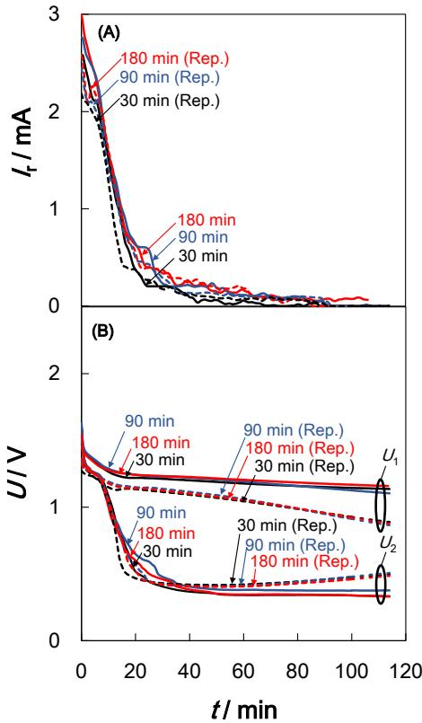
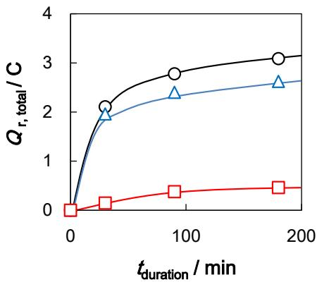
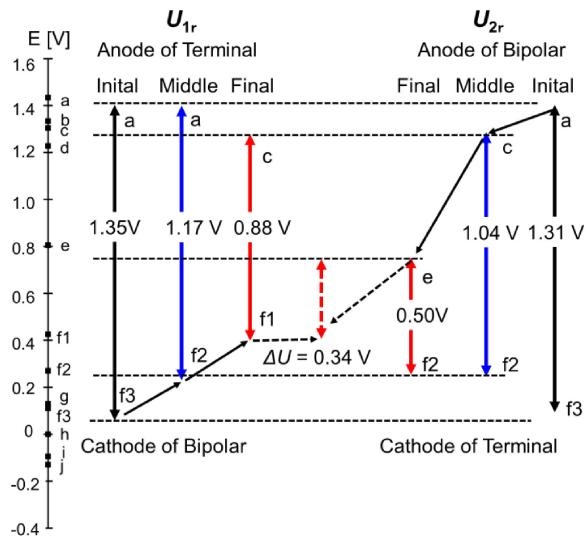

# Dependence of the Reverse Current on the Surface of Electrode Placed on a Bipolar Plate in an Alkaline Water Electrolyzer

# Yosuke UCHINO,a,b,* Takayuki KOBAYASHI,b Shinji HASEGAWA,a Ikuo NAGASHIMA,c Yoshio SUNADA,d Akiyoshi MANABE,e Yoshinori NISHIKI,e and Shigenori MITSUSHIMAb

a Asahi Kasei Corp., 1-3-1 Yakou, Kawasaki-ku, Kawasaki, 210-0863, Japan
b Yokohama National University, 79-5 Tokiwadai, Hodogaya-ku, Yokohama, 240-8501, Japan
c Kawasaki Heavy Industries, Ltd., 1-1 Kawasaki-cho, Akashi 673-8666, Japan
d thyssenkrupp Uhde Chlorine Engineers (Japan), Ltd., 7F Sakura Nihonbashi Building, 1-13-12 Nihonbashi Kayaba-cho, Chuo-ku, Tokyo 103-0025, Japan
e De Nora Permelec, Ltd., 2023-15 Endo Fujisawa 252-0816, Japan

* Corresponding author: uchino.yb@om.asahi-kasei.co.jp

# ABSTRACT

The behavior of the leak and reverse currents in a bipolar-type alkaline water electrolyzer has been investigated using a bipolar-type electrolyzer which consists of two cells. The electrodes were nickel mesh, which are the conventional electrodes for alkaline water electrolyzers. The leak circuit could be expressed by a simple equation and a simple equivalent circuit for the cell performance and ionic resistance of the manifolds. The electrolyte was replaced by a gas-free electrolyte after electrolysis to classify the influence of the reverse current into the gas reaction and electrode active material. As a result, the dominant driving force of the reverse current was the active nickel-based materials on the Ni electrode. The redox couples on the electrode surface during the reverse current were estimated based on the measured cell voltages and redox potentials on a nickel electrode. The final potentials of both sides on the bipolar plate for the replacement conditions were higher than those for the non-replacement condition, because the hydrogen of the reductant was removed from the cathode electrolyte, and the balance of the reductant and oxidant would change to the oxidation side.

$\circledcirc$ The Electrochemical Society of Japan, All rights reserved.

Keywords : Alkaline Water Electrolysis, Reverse Current, Bipolar Plate, Ni Electrode

# 1. Introduction

In order to solve global warming due to $\mathrm { C O } _ { 2 }$ emission, the introduction of renewable energies, such as solar and wind powers, have been promoted all over the world. However, the electric power generation using the renewable energy, such as solar power, is regionally localized with intermittent fluctuations due to its unstable output, large scale usage of renewal energy is limited. Hence energy conversion of electric power is regarded as the best way to solve the problem. Among the technologies, energy storage or transportation using hydrogen which is made by water electrolysis is considered as a prospective method. With the perspective of practical use, alkaline and polymer electrolyte water electrolysis have the potential for these applications. Alkaline water electrolysis has considerable cost advantage thanks to its applied inexpensive materials. Therefore, the alkaline water electrolyzer possessing high durability to the fluctuations of the renewable energy is required.1,2

Most of alkaline water electrolyzer is consist of a number of cells. Based on electrical circuit configuration of the cells, alkaline water electrolyzer is categorized into monopolar and bipolar type.1,3,4 Figure 1 shows the conceptual diagram of bipolar type electrolyzer. In a bipolar type electrolyzer, the electrolyte is fed via manifolds to the anode or cathode chambers of the cells that were electrically connected in series. The leak circuits between one side and the other side on the bipolar plate through ionic conduction of the manifolds are formed. During electrolysis, leaked current not only decreases the efficiency but causes corrosion problem on mainly the metallic construction materials located at a location where leakage current is discharged of the electrolyzer. Furthermore, when the circuit breaker is cut to cease electrolysis, a reverse current takes place in the electrolyzer from anode chamber to cathode chamber through

bipolar plate. The current causes degradation of the electrodes by the reduction of the anode surface or oxidation of the cathode surface.– Therefore, it is important how these conditions can be made an improvement to restrain the degradation of the electrodes.1,2,5 14

The reverse current is also a serious problem with brine electrolysis of the chlor-alkali process. The major driving force for the reverse current is the active chlorine oxidant of the anolyte, such as $\mathrm { O C l ^ { - } }$ , and the reductant such as $\mathrm { H } _ { 2 }$ adsorbed on the cathode.4 The major driving force for the reverse currents in an alkaline water electrolyzer has also been qualitatively or quantitatively investigated. We previously reported that the major redox couple of the reverse current is $\mathrm { [ N i O _ { 2 } / N i O O H ] }$ and $[ \mathrm { H } _ { 2 } / \mathrm { H } _ { 2 } \mathrm { O } ]$ immediately after the electrolysis.

In this study, the leak and reverse currents in a bipolartype alkaline water electrolyzer were investigated to clarify the contribution of other active materials, such as dissolved gases and the oxidation state of the surface for the total reverse current.

# 2. Experimental

Figure 2 shows the experimental system of the electrolysis. The electrolyzer consisted of two finite gap cells, which have 1-mm gaps between the electrodes and the separators, connected in series to external manifolds. All the tubes of A-C, B-D, G-I and H-J are $8 5 0 \mathrm { m m }$ in length with a 4-mm inner diameter. The anodes and cathodes were Ni meshes. Nafion membranes (NRE212CS) were used as the separators. The projected area of the electrode was $2 7 . 8 \mathrm { c m } ^ { 2 }$ in a cell. The volume of each electrode chamber was $5 0 \mathrm { m L }$ . The $7 . 0 \mathrm { M } ( = \mathrm { m o l } \mathrm { d } \mathrm { m } ^ { - 3 } . $ ) NaOH solution electrolyte was fed to the each of electrode chambers at $2 5 \mathrm { m L } \mathrm { m i n } ^ { - 1 }$ . The temperature of the inlet electrolyte was maintained at $2 5 ^ { \circ } \mathrm { C }$ using a heat

Conceptual diagram of bipolar-type electrolyzer.

Schematic drawing of the experimental system.

exchanger. The generated gases were removed from the electrode chambers to tanks for the anode and cathode with the electrolyte as a two-phase flow of the gases and electrolyte. The tanks also worked as separators of the gas and electrolyte.

The electrolysis was shut by an electronic circuit breaker after $3 0 \mathrm { { m i n } }$ to 180 min of constant current electrolysis at $6 0 0 \mathrm { m A c m } ^ { - 2 }$ and $2 5 ^ { \circ } \mathrm { C }$ , and the reverse current was measured as the ionic currents through the tubes. The cell voltages were also measured. $U _ { 1 }$ and $U _ { 2 }$ are the cell voltages of the anode and the cathode terminal side cell, respectively. The reverse current was measured until the current of less than $0 . 1 \mathrm { m A }$ for 1 min was attained using a DC milli-ampere clamp meter (KEW 2500) at a, b, g and h in Fig. 2. After electrolysis the electrolyte was replaced with a reactive gas-free electrolyte,

such as oxygen, using the following procedure to maintain the electrode surface.

Step 1: $\mathrm { V a l } _ { 1 }$ , Val2, ${ \mathrm { V a l } } _ { 3 }$ and $\mathrm { V a l } _ { 4 }$ were closed after electrolysis so no reverse current flowed. $\mathrm { V a l } _ { 7 }$ and $\mathrm { V a l } _ { 8 }$ were opened to allow the $\Nu _ { 2 }$ gas to flow in order to prevent contamination from to gas separator during the electrolyte replacement operation.
Step 2: $\mathrm { V a l } _ { 5 }$ was opened to form a drainage canal. Val , ${ \mathrm { V a l } } _ { 2 }$ , ${ \mathrm { V a l } } _ { 3 }$ and $\mathrm { V a l } _ { 4 }$ were then opened to remove the electrolyte containing the hydrogen and oxygen.
Step 3: After all the chambers were emptied, Val , Val , Val , Val and $\mathrm { V a l } _ { 5 }$ were closed. $\mathrm { V a l } _ { 6 }$ was then opened to form an injection channel for the electrolyte.

Simple equivalent circuit of the electrolyzer.

Step 4: Val1, Val2, Val3 and Val4 were then opened to inject the reactive gas-free electrolyte. (Note that the channel for the reverse current should not be formed.)
Step 5: After all the chambers were full, Val , Val , Val and $\mathrm { V a l } _ { 4 }$ were opened at the same time. The circulation of the electrolyte was started. (This time was considered zero.)

Figure 3 shows a simple equivalent circuit of the electrolyzer. $R _ { \mathrm { e } }$ and $R _ { \mathrm { L } }$ are the resistance of the electrolyte in the cell and manifold, respectively. $R _ { \mathrm { e } }$ is defined as the resistance obtained by dividing total power consumption due to the electrolyte containing bubbles and the membrane by the square of total current through the electrolyte of the cell. $R _ { \mathrm { L } }$ is defined as combined resistance of two manifolds of inlet because two manifolds of outlet are insulated with gases.

$I _ { \mathrm { d } }$ and $I _ { \mathrm { L } }$ represent the current through the electrodes and the electrolyte of manifold, respectively. The total current and current density are represented $I = I _ { \mathrm { d } } + I _ { \mathrm { L } }$ and $i = i _ { \mathrm { d } } + i _ { \mathrm { L } }$ . $i _ { \mathrm { d } }$ is represented $i _ { \mathrm { d } } = k i$ where $k$ is defined as $\begin{array} { r } { k = 1 - \frac { i _ { L } } { i } } \end{array}$ . And $\begin{array} { r } { i _ { \mathrm { d } } = \frac { I _ { \mathrm { d } } } { S _ { \mathrm { d } } } } \end{array}$ and $\begin{array} { r } { i _ { \mathrm { L } } = \frac { I _ { \mathrm { L } } } { S _ { \mathrm { d } } } } \end{array}$ are ¼ - ¼ ¼ current density through the electrodes and manifold, where projected area of electrodes is defined as $S _ { \mathrm { d } }$ .

$\eta _ { \mathrm { a } } ( i )$ and $\eta _ { \mathrm { c } } ( i )$ are the overpotential at the anode and cathode as a function of the current density i through electrode, respectively. Where overpotential is defined as the voltage obtained by dividing total power loss due to electrode by the total current through electrode. $U ^ { \mathbf { \rho } }$ is the theoretical decomposition voltage. $U _ { \mathrm { c e l l } }$ is the cell voltage ( $U _ { 1 }$ or $U _ { 2 }$ ). $U _ { \mathrm { s t } }$ is the electrolyzer voltage. $U _ { \mathrm { s t } }$ is expressed in two ways through the two cells and the manifold as follows.

$$
\begin{array}{l} U _ {\mathrm {s t}} = 2 U ^ {\mathrm {o}} + \eta_ {\mathrm {a}} (i) + \eta_ {\mathrm {a}} (i _ {\mathrm {d}}) + \eta_ {\mathrm {c}} (i _ {\mathrm {d}}) \\ + \eta_ {\mathrm {c}} (i) + i _ {\mathrm {d}} S _ {\mathrm {d}} R _ {\mathrm {e}} + i S _ {\mathrm {d}} R _ {\mathrm {e}} \tag {1} \\ \end{array}
$$

$$
U _ {\mathrm {s t}} = U ^ {\mathrm {o}} + \eta_ {\mathrm {a}} (i) + \eta_ {\mathrm {c}} (i) + i _ {\mathrm {L}} S _ {\mathrm {d}} R _ {\mathrm {L}} + i S _ {\mathrm {d}} R _ {\mathrm {e}} \tag {2}
$$

The overpotential can be described by a Tafel equation.

$$
\text {I f}, \eta_ {\mathrm {a}} (i) + \eta_ {\mathrm {c}} (i) = a + b \log (i) \tag {3}
$$

Where $a$ and $^ b$ are the Tafel intercept and slope adding that of anode and cathode. The Eqs. (1), (2) and (3) give the following equations.

$$
\begin{array}{l} U _ {\mathrm {s t}} = 2 U ^ {\circ} + \{a + b \log (i) \} + \{a + b \log (k i) \} + i S _ {\mathrm {d}} R _ {\mathrm {e}} + k i S _ {\mathrm {d}} R _ {\mathrm {e}} \\ = 2 U ^ {\mathrm {o}} + 2 a + 2 b \log (i) + b \log (k) + i S _ {\mathrm {d}} R _ {\mathrm {e}} + k i S _ {\mathrm {d}} R _ {\mathrm {e}} \tag {4} \\ \end{array}
$$

$$
U _ {\mathrm {s t}} = U ^ {\circ} + \{a + b \log (i) \} + i _ {\mathrm {L}} S _ {\mathrm {d}} R _ {\mathrm {L}} + i S _ {\mathrm {d}} R _ {\mathrm {e}} \tag {5}
$$

Therefore, Eqs. (4) and (5) give the following equation.

$$
i _ {\mathrm {L}} S _ {\mathrm {d}} R _ {\mathrm {L}} = U ^ {\mathrm {o}} + a + b \log (i) + b \log (k) + k i S _ {\mathrm {d}} R _ {\mathrm {e}} \tag {6}
$$

When $i _ { \mathrm { d } } \gg i _ { \mathrm { L } } , k \approx 1$ , therefore, the $U _ { \mathrm { c e l l } }$ and $i _ { \mathrm { L } }$ are expressed as follows.

$$
\begin{array}{l} U _ {\text {c e l l}} = U ^ {0} + a + b \log (i) + i R _ {\mathrm {e}} (7) \\ i _ {\mathrm {L}} = \left\{U ^ {\mathrm {o}} + a + b \log (i) + i S _ {\mathrm {d}} R _ {\mathrm {e}} \right\} / S _ {\mathrm {d}} R _ {\mathrm {L}} (8) \\ \end{array}
$$

Where, $R _ { \mathrm { e } }$ and $R _ { \mathrm { L } }$ were measured by the AC impedance method with 10 mV AC from $1 0 0 \mathrm { m H z }$ to $1 0 0 \mathrm { k H z }$ superimposed on a 2 V DC bias voltage.

# 3. Results and Discussion

# 3.1 Cell characteristics

$U _ { 1 }$ and $U _ { 2 }$ were almost same behavior at low current densities. Figure 4 shows the measured $U _ { 1 }$ in the low current density region where $I R$ loss is sufficiently small and negligible. The Tafel coefficients $a$ and $^ b$ were determined from the vertical axis intercept and the slope, respectively, because the measured cell voltages showed a linear relation that would be almost free from any internal resistance. The measured $R _ { \mathrm { e } }$ and $R _ { \mathrm { L } }$ value were $2 . 4 \Omega \mathrm { c m } ^ { 2 }$ and $1 0 1 . 4 \Omega \mathrm { c m } ^ { 2 }$ , respectively. Table 1 shows the characteristic values to describe the cell voltages and leak current.

Figure 5 shows the measured and fitted cell voltage $U _ { \mathrm { c e l l } } )$ , and $i _ { \mathrm { L } }$ as a function of the applied current density using Eqs. (7) and (8). The fitted cell voltage was almost the same as the measured cell voltage. In addition, the fitted $i _ { \mathrm { L } }$ was also almost the same as the measured $i _ { \mathrm { L } }$ above $1 0 0 \mathrm { m A c m } ^ { - 2 }$ of applied current density. The calculated error of the $i _ { \mathrm { L } }$ was less than $5 \%$ in this domain. $( 1 - k )$ was then less than $0 . 1 \%$ . The $i _ { \mathrm { L } }$ linearly increased because the

Measured cell voltage as a function of logarithm of Figure 4.current in low current density region.

Characteristic value to describe cell voltages and leak Table 1current.

<table><tr><td>a [V]</td><td>b [V/dec.]</td><td>Re [Ω]</td><td>RL [Ω]</td></tr><tr><td>0.37</td><td>0.173</td><td>0.0862</td><td>1614</td></tr></table>

Leak current (circles) and the ratio to applied current Figure 5.(triangle) (A) and cell voltages for $U _ { 1 }$ (circles) (B) as a function of applied current (plots: measured, lines: calculated).

contribution of the non-linearly term became small when i became high enough; $\frac { i _ { L } } { i }$ is nearly $\frac { R _ { \mathrm { e } } } { R _ { L } }$ in Eq. (8). On the other hand, when current density was less than $3 0 \mathrm { m A } \mathrm { c m } ^ { - 2 }$ , $( 1 - k )$ was greater than $0 . 3 \%$ , the contribution of a non-linear term in Eq. (8) is significant. Therefore, the calculated error of the $i _ { \mathrm { L } }$ was greater than $5 \%$ , under the influence of the contribution of a non-linear term in Eq. (8). Therefore, Eq. (8) and the proposed simple equivalent circuit would be adequate to express the behavior of $i _ { \mathrm { L } }$ in region of the contribution of the linear term in Eq. (8).

# 3.2 Cell voltage behavior after electrolysis

We reported that the major redox couple of the reverse current is $\mathrm { [ N i O _ { 2 } / N i O O H ] }$ and $[ \mathrm { H } _ { 2 } / \mathrm { H } _ { 2 } \mathrm { O } ]$ immediately after the electrolysis.1 In addition, the nickel oxides on the anode of the bipolar plate would be reduced, and the cathodic active material of hydrogen and nickel on the cathode side of the bipolar plate would be oxidized during the reverse current flow. Ultimately, the reverse current would finish when the redox state of both sides of the bipolar plate had the same oxidation state.1 However, the redox couple when the reverse current flows and finishes could not be determined. In addition, the dissolved gas species and the electrode surface were not experimentally distinguished. Therefore, to distinguish the reverse current by the reaction of dissolved gas species from that by the deterioration of the electrode surface, the electrolyte was replaced with the reactive gas-free electrolyte after the electrolysis. Figure 6 shows the reverse current (A) and the cell voltages (B) as a function of time with (dashed line) and without (solid line) electrolyte replacement after a $6 0 0 \mathrm { m A c m } ^ { - 2 }$ electrolysis from 30 min to 180 min at $2 5 ^ { \circ } \mathrm { C }$ .

# 3.2.1 Case of non-replacement

Firstly, without the electrolyte replacement case is explained as follows. The $U _ { 1 }$ and $U _ { 2 }$ were around $1 . 6 \mathrm { V }$ immediately after the electrolysis regardless of the electrolysis time. The initial $U _ { 1 }$ and $U _ { 2 }$ were defined as $U _ { \mathrm { 1 , i } }$ and $U _ { 2 , \mathrm { i } } ,$ respectively. Afterward, the $U _ { 1 }$ gradually decreased to around $1 . 3 \mathrm { V }$ in about $1 0 \mathrm { { m i n } }$ , while the $U _ { 2 }$ gradually decreased to around $1 . 3 \mathrm { V }$ in about 2 min. These periods of the $U _ { 1 }$ and $U _ { 2 }$ were then defined as $U _ { \mathrm { 1 , m } }$ and $U _ { 2 , \mathrm { m } }$ , respectively. Furthermore, $U _ { 2 }$ rapidly decreased to $0 . 4 \mathrm { V }$ after $4 0 \mathrm { { m i n } }$ . On the other hand, the $U _ { 1 }$ gradually decreased around $1 . 0 \mathrm { V } ,$ and never

Reverse current of non-replacement (solid line) and Figure 6.replacement (dashed line) (A) and cell voltages (B) as a function of time after $6 0 0 \mathrm { m A c m } ^ { - 2 }$ electrolysis for 30 min, 90 min and $1 8 0 \mathrm { m i n }$ .

Measerd cell voltages of the $U _ { 1 }$ and $U _ { 2 }$ for initial, Table 2.middle, and final periods of reverse current. Couples are listed in Table 3.

<table><tr><td></td><td colspan="2">Initial</td><td colspan="2">Middle</td><td colspan="2">Final</td></tr><tr><td></td><td>U/V</td><td>Couple</td><td>U/V</td><td>Couple</td><td>U/V</td><td>Couple</td></tr><tr><td>U1</td><td>1.60</td><td>a-j</td><td>1.28</td><td>c-h</td><td>1.14</td><td>c-f3</td></tr><tr><td>U2</td><td>1.59</td><td>a-j</td><td>1.30</td><td>c-h</td><td>0.35</td><td>fl-h
f2-h</td></tr><tr><td>U1r</td><td>1.35</td><td>a-f3</td><td>1.17</td><td>a-f2</td><td>0.88</td><td>c-f1</td></tr><tr><td>U2r</td><td>1.31</td><td>a-f3</td><td>1.04</td><td>c-f2</td><td>0.50</td><td>e-f2</td></tr></table>

decreased as did $U _ { 2 }$ . The reverse current followed to a maximum of $1 1 0 \mathrm { m i n }$ after the electrolysis. These periods of the $U _ { 1 }$ and $U _ { 2 }$ were defined as $U _ { \mathrm { 1 f } }$ and $U _ { 2 , \mathrm { f } } ,$ respectively. A slight difference in their reverse current due to the difference in the electrolysis time was seen. However, their behaviors were roughly similar regardless of the electrolysis time.

U1_i, U2_i, U1_m, U2_m, $U _ { \mathrm { 1 f } }$ and $U _ { 2 . \mathrm { f } }$ were determined regarding the electrolysis times of 30 min, 90 min and 180 min. However, $U _ { 1 , { \mathrm { i } } } ,$ . $U _ { 2 , \mathrm { i } } ,$ , $U _ { 1 , \mathrm { m } } , \ U _ { 2 , \mathrm { m } } , \ U _ { 1 , \mathrm { f } }$ and $U _ { 2 . \mathrm { f } }$ showed roughly similar values regardless of the electrolysis time. Therefore, the U1_i, U2_i, $U _ { 1 , \mathrm { m } } ,$ $U _ { 2 , \mathrm { m } }$ , $U _ { \mathrm { 1 f } }$ and $U _ { 2 \mathrm { f } }$ were adopted as the average values regarding the electrolysis times of 30 min, 90 min and 180 min. They are listed in Table 2. The subscripts of i, m, and f denote the initial, middle, and final, respectively, and pairs with a to j in couples are estimated redox couples listed in Table 3. The details will be described later. 3.2.2 Case of replacement

Secondly, the electrolyte replacement case is explained as follows. The $U _ { 1 }$ and $U _ { 2 }$ values decreased to slightly greater than $1 . 3 \mathrm { V }$ immediately after the electrolysis regardless of the electrolysis

Expected redox potentials for nickel water phase.

<table><tr><td></td><td>Ep/V vs. RHE</td><td>Reaction</td><td>Ref.</td></tr><tr><td>a</td><td>1.434</td><td>NiO2+ H2O + e- ↔ NiOOH + OH-</td><td>15</td></tr><tr><td>b</td><td>1.334</td><td>β-NiOOH + H2O + e- ↔ β-Ni(OH)2 + OH-</td><td>16</td></tr><tr><td>c</td><td>1.304</td><td>γ-NiOOH + H2O + e- ↔ α-Ni(OH)2 + OH-</td><td>16</td></tr><tr><td>d</td><td>1.228</td><td>O2+ 2H2O + 4e- ↔ 4OH-</td><td>15</td></tr><tr><td>e</td><td>0.806</td><td>3NiO + H2O ↔ Ni3O4 + 2H+ + 2e-</td><td>15,17,18</td></tr><tr><td>f1</td><td>0.426</td><td>Ni + 2OH- ↔ Ni(OH)2 + 2e-</td><td>19</td></tr><tr><td>f2</td><td>0.270</td><td>Ni5+ mH2O ↔ Ni5-1{Ni(OH)2·(m-1)H2O} + 2e-</td><td>20</td></tr><tr><td>f3</td><td>0.110</td><td>Ni + 2OH- ↔ Ni(OH)2 + 2e-</td><td>15</td></tr><tr><td>g</td><td>0.130</td><td>Ni-Had + OH- ↔ Ni + H2O + e-</td><td>20</td></tr><tr><td>h</td><td>0.000</td><td>2OH- + H2 ↔ 2H2O + 2e-</td><td>15</td></tr><tr><td>i</td><td>-0.075/-0.095</td><td>α-NiH + OH- ↔ Ni + H2O + e-</td><td>21,22</td></tr><tr><td>j</td><td>-0.12/-0.13</td><td>β-NiH + OH- ↔ Ni + H2O + e-</td><td>21,22</td></tr></table>

time. $U _ { 1 }$ and $U _ { 2 }$ were then defined as $U _ { \mathrm { 1 r . i } }$ and $U _ { 2 \mathrm { r } \dot { 1 } } .$ . Afterward, $U _ { 1 }$ and $U _ { 2 }$ then gradually decreased to around $1 . 2 \mathrm { V }$ and $1 . 0 \mathrm { V } ,$ respectively, within $1 0 \mathrm { m i n }$ . The $U _ { 1 }$ and $U _ { 2 }$ value were then defined as $U _ { \mathrm { 1 r . m } }$ and $U _ { 2 \mathrm { r } , \mathrm { m } }$ . $U _ { 2 }$ rapidly decreased to $0 . 5 \mathrm { V }$ within $4 0 \mathrm { m i n }$ . $U _ { 1 }$ and $U _ { 2 }$ then became constant values slightly after changing within 40 to $1 1 0 \mathrm { m i n }$ . The $U _ { 1 }$ and $U _ { 2 }$ value were then defined as $U _ { \mathrm { 1 r . f } }$ and $U _ { 2 \mathrm { r } , \mathrm { f } } ,$ respectively. The reverse current was observed only until 90 min after the electrolysis but a small reverse current might flow to 110 min. A difference in their reverse currents due to the replacement and non-replacement was specifically seen from 0 to $1 0 \mathrm { { m i n } }$ . The average $U _ { \mathrm { 1 r . i } } ,$ $U _ { 2 \mathrm { r } , \mathrm { i } } ,$ , $U _ { \mathrm { 1 r \mathrm { . } m } } .$ , $U _ { 2 \mathrm { r } , \mathrm { m } } ,$ , $U _ { \mathrm { 1 r . f } }$ and $U _ { 2 \mathrm { r } , \mathrm { f } }$ of average regarding electrolysis duration time of 30 min, 90 min and 180 min are also listed in Table 2.

# 3.3 Ratio of gas influence to give cell voltages

Figure 7 shows the electric charge of the reverse current, $Q _ { \mathrm { r } } ( t )$ $\textstyle ( = \int _ { 0 } ^ { t } I _ { \mathrm { r } } d t )$ , as a function of the electrolysis for the non-replacement (circles), replacement (triangles) and difference in the nonreplacement and replacement (squares). The difference would be due to contribution of the hydrogen and oxygen gases. The integration period of the reverse current is applied from the end of the electrolysis to the reverse current finish, which was determined to be less than 0.1 mA of continuous current for 1 min using the DC milli-ampere clamp meter (KEW 2500). The electric charge of the– reverse current increased with the increase in the electrolysis time regardless of the replacement or not. Because the electric charge with the replacement was $1 0 { - } 2 0 \%$ lower than that with the non-

Electric charge of the reverse current as a function of Figure 7.electrolysis duration time; non-replacement (circles), replacement (triangles), difference (squares).

replacement, the dominant driving force for the reverse current was the active material of the Ni electrode.

# 3.4 Redox couples

Redox potentials on the nickel electrode are shown in Table 3.15 22 These potentials are corrected to the RHE scale to compare the experimental condition in the electrolyzer. $\left[ \mathrm { N i } / \mathrm { N i } ( \mathrm { O H } ) _ { 2 } \right]$ was reported such that f1, f2 and f3 may correspond to various structure of the hydrate nickel hydroxide. $\mathrm { N i } _ { 3 } \mathrm { O } _ { 4 }$ is also reported as an unstable hydrate.15,17,18 The electrode potentials of the redox couple during the reverse current measurement were estimated using the measured cell voltages and following consideration.

1) $\mathrm { N i O } _ { 2 }$ , which is formed during electrolysis on the anode, is slowly reduced after electrolysis.
2) The anode on the bipolar plates does not have a higher potential than a terminal anode, because the anode on the bipolar plates is reduced rapidly due to short circuit state, although the terminal anode was only slowly reduced.
3) The cathode on the bipolar plates does not have a lower potential than the terminal cathode, because the cathode on the bipolar plates oxidized rapidly due to short circuit state, although the terminal cathode was only slowly reduced.
4) The redox direction does not change after electrolysis. That is, the anode is reduced and the cathode is oxidized during reverse current.

Figure 8 shows the estimated electrode potential with the measured cell voltage at the initial, middle and final times without electrolyte replacement (A) and with electrolyte replacement (B). The length of the vertical arrows and values on the arrows in Fig. 8 indicate the measured values and suitable redox couples of the $U _ { 1 }$ and $U _ { 2 }$ , respectively.

# 3.4.1 Redox couples in initial stage

The initial cell voltages of $U _ { \mathrm { 1 , i } }$ and $U _ { 2 , \mathrm { i } }$ were around 1.60 and $1 . 5 9 \mathrm { V } ,$ , respectively. Among the combinations of the redox couple, they would be the combination of $\mathrm { [ N i O _ { 2 } / N i O O H ] }$ (a) and [¢-NiH/ Ni] ( j) that has the maximum potential difference of 1.564 V.

The $U _ { \mathrm { 1 r . i } }$ and $U _ { 2 \mathrm { r } , \mathrm { i } }$ were 1.35 and 1.31 V, respectively. Based only on the potential difference, there are three possible combinations of the redox couple for the $U _ { \mathrm { 1 r . i } }$ and $U _ { 2 \mathrm { r } , \mathrm { i } }$ as shown below. The first combination is $\mathrm { [ N i O _ { 2 } / N i O O H ] }$ (a) and $\left[ \mathrm { N i } / \mathrm { N i } ( \mathrm { O H } ) _ { 2 } \right]$ (f 3) of $1 . 3 2 0 \mathrm { V } .$ . The second combination is $[ \mathrm { O } _ { 2 } / \mathrm { O H } ^ { - } ]$ (d) and $[ \beta \mathrm { - N i H / }$ Ni] ( j) of $1 . 3 5 8 \mathrm { V } .$ . The third combination is $[ \mathrm { O } _ { 2 } / \mathrm { O H } ^ { - } ]$ (d) and [¡- NiH/Ni] (i) of 1.323 V. The latter two combinations with the oxygen reaction would not be reasonable, because the replaced electrolyte hardly contains oxygen.

(A)

(B)
Relationship of measured potential and redox couples at Figure 8.the initial, middle and final time for the non-replacement (A) and (B) replacement cases.

# 3.4.2 Redox couples in intermediate stage

The $U _ { \mathrm { 1 , m } }$ and $U _ { 2 , \mathrm { m } }$ values of 1.28 and $1 . 3 \mathrm { V }$ slightly decreased from the $U _ { \mathrm { 1 , i } }$ and $U _ { 2 , \mathrm { i } } ,$ respectively. In principle, one side and the other side on a bipolar plate are reduced and oxidized due to the potential difference between both sides on the bipolar plate through a closed circuit by ionic conduction and electronic conduction.1 Discharge of the initial redox reaction between both sides on the bipolar plate would decrease the cell voltages. In addition, dissolved $\mathrm { H } _ { 2 }$ and water would gradually slowly reduce the Ni oxide of the anode on the bipolar plate and terminal, and also the dissolved oxygen would gradually oxidize the Ni on the bipolar plate and terminal and hydrogen in the cathode chamber during the nonreplacement condition.

The redox couple of cathode reaction for $U _ { 2 , \mathrm { m } }$ would be $\mathrm { [ H } _ { 2 } / \mathrm { H } _ { 2 } \mathrm { O } ]$ (h) with dissolved hydrogen for the non-replacement condition. Therefore, the combination of $\left[ \gamma \mathrm { - N i O O H } / \alpha \mathrm { - N i ( O H ) } _ { 2 } \right]$ (c) and $[ \mathrm { H } _ { 2 } / \mathrm { H } _ { 2 } \mathrm { O } ]$ (h) with a $1 . 3 0 4 \mathrm { V }$ potential difference would be a suitable combination of the redox couple for the $U _ { 2 , \mathrm { m } }$ of $1 . 3 \mathrm { V } .$ The terminal anode would be $\gamma { \mathrm { - N i O O H } }$ or $\beta$ -NiOOH, because the terminal anode did not have a lower potential than the anode of the bipolar plate. The terminal anode would be $\gamma { \mathrm { - N i O O H } }$ , because

$\gamma { \mathrm { - N i O O H } }$ forms by oxidation of the $\beta$ -NiOOH during oxygen evolution.16 Therefore, the combination of $\left[ \gamma \mathrm { - N i O O H } / \alpha \mathrm { - N i ( O H ) } _ { 2 } \right]$ (c) and $[ \mathrm { H } _ { 2 } / \mathrm { H } _ { 2 } \mathrm { O } ]$ (h) of 1.304 V would be a suitable combination of the redox couple for the $U _ { 1 , \mathrm { m } }$ of $1 . 2 8 \mathrm { V } .$ .

The $U _ { \mathrm { 1 r . m } }$ and $U _ { 2 \mathrm { r } , \mathrm { m } }$ of 1.17 and $1 . 0 4 \mathrm { V }$ slightly decreased from the $U _ { \mathrm { 1 r . i } }$ and $U _ { 2 \mathrm { r } , \mathrm { i } } ,$ respectively. Like $U _ { \mathrm { 1 , m } }$ and $U _ { 2 , \mathrm { m } }$ , discharge of the initial redox reaction would decrease the cell voltages. The cathode on the bipolar plate would be oxidized from $\left[ \mathrm { N i } / \mathrm { N i } ( \mathrm { O H } ) _ { 2 } \right]$ (f 3) by the reverse current, however, the cathode potential would not reach that of $[ \mathrm { N i } / \mathrm { N i } ( \mathrm { O H } ) _ { 2 } ]$ (f1). Because $1 . 0 0 8 \mathrm { V }$ of the potential difference between $\mathrm { [ N i O _ { 2 } / N i O O H ] }$ (a) of $1 . 4 3 4 \mathrm { V } ,$ , which is the highest potential in Table 3, and $[ \mathrm { N i } / \mathrm { N i } ( \mathrm { O H } ) _ { 2 } ]$ (f1) of $0 . 4 2 6 \mathrm { V }$ would be too low to compare with the $U _ { \mathrm { 1 r . m } }$ of 1.17 V. Therefore, the cathode for $U _ { \mathrm { 1 r . m } }$ would be an intermediate hydrate of the nickel hydroxide between $[ \mathrm { N i } / \mathrm { N i } ( \mathrm { O H } ) _ { 2 } ]$ (f1) and $\left[ \mathrm { N i } / \mathrm { N i } ( \mathrm { O H } ) _ { 2 } \right]$ (f 3).

The anode on the bipolar plate would be reduced faster than that on the terminal due to reduction by the reverse current for the anode on the bipolar plate. The reduced anode would be $\gamma { \mathrm { - N i O O H } }$ rather than $\beta$ -NiOOH, because the potential difference between $\left[ \beta \mathrm { - N i O O H } / \beta \mathrm { - N i ( O H ) } _ { 2 } \right]$ (b) and $[ \mathrm { N i } / \mathrm { N i } ( \mathrm { O H } ) _ { 2 } ]$ (f 3) of $1 . 0 6 4 \mathrm { V }$ would be a little high for the $1 . 0 4 \mathrm { V }$ of $U _ { 2 \mathrm { r } , \mathrm { m } } ,$ whereas the potential difference between $\left[ \gamma \mathrm { - N i O O H } / \alpha \mathrm { - N i ( O H ) } _ { 2 } \right]$ (c) and $[ \mathrm { N i } / \mathrm { N i } ( \mathrm { O H } ) _ { 2 } ]$ (f 2) of $1 . 0 3 4 \mathrm { V }$ was almost the same as the $U _ { 2 \mathrm { r } , \mathrm { m } }$ of $1 . 0 4 \mathrm { V } .$ .

# 3.4.3 Redox couples in final stage

The $U _ { \mathrm { 1 f } }$ and $U _ { 2 \mathrm { f } }$ were 1.14 and $0 . 3 5 \mathrm { V } _ { : }$ , respectively. The potential difference between $\left[ \gamma \mathrm { - N i O O H } / \alpha \mathrm { - N i ( O H ) } _ { 2 } \right]$ (c) and [Ni/ $\mathrm { N i } ( \mathrm { O H } ) _ { 2 } ]$ (f 3) of $1 . 1 9 4 \mathrm { V }$ would correspond to $1 . 1 4 \mathrm { V }$ of $U _ { \mathrm { 1 , f } } .$ . The potential difference between $[ \mathrm { H } _ { 2 } / \mathrm { H } _ { 2 } \mathrm { O } ]$ (h) and $[ \mathrm { N i } / \mathrm { N i } ( \mathrm { O H } ) _ { 2 } ]$ of (f1) or (f2), which is in the potential difference range from 0.426 to $0 . 2 7 0 \mathrm { V }$ would correspond to the $0 . 3 5 \mathrm { V }$ of the $U _ { 2 , \mathrm { f } } .$ At this time, the potential difference $\Delta U$ between one side and the other side on a bipolar plate would be around $0 . 2 4 \mathrm { V } ( = U _ { 2 \mathrm { f } } - ( \mathrm { f } 3 - \mathrm { h } ) )$ .

The reverse current could not be measured in spite of $\Delta U$ of around $0 . 2 4 \mathrm { V }$ because the reverse current was less than the limit of detection for the DC milli-ampere clamp meter. The reverse current was low due to the low potential difference between one side and the other side on a bipolar plate and the high $R _ { \mathrm { m } }$ which is the parallel ionic resistance of the manifold. The final potential of both sides on the bipolar plate for the non-replacement conditions would be between $[ \mathrm { N i } / \mathrm { N i } ( \mathrm { O H } ) _ { 2 } ]$ (f1) of $0 . 4 2 6 \mathrm { V }$ and $[ \mathrm { N i } / \mathrm { N i } ( \mathrm { O H } ) _ { 2 } ]$ (f 3) of 0.110 V.

The $U _ { \mathrm { 1 r . f } }$ and $U _ { 2 \mathrm { r } , \mathrm { f } }$ were 0.88 and $0 . 5 0 \mathrm { V } ,$ , respectively. The potential difference between $\left[ \gamma \mathrm { - N i O O H } / \alpha \mathrm { - N i ( O H ) } _ { 2 } \right]$ ] (c) and [Ni/ $\mathrm { N i } ( \mathrm { O H } ) _ { 2 } ]$ (f1) of $0 . 8 7 8 \mathrm { V }$ would correspond to $0 . 8 8 \mathrm { V }$ of the $U _ { \mathrm { 1 r . f . } }$ . The potential difference between $\mathrm { [ N i O / N i _ { 3 } O _ { 4 } ] }$ (e) of $0 . 8 0 6 \mathrm { V }$ and $\left[ \mathrm { N i } / \mathrm { N i } ( \mathrm { O H } ) _ { 2 } \right]$ (f 2) of $0 . 5 3 6 \mathrm { V }$ would correspond to the $0 . 5 0 \mathrm { V }$ of $U _ { \mathrm { 2 r , f } } .$ At this time, the potential difference $\Delta U$ between one side and the other side on a bipolar plate would be around $0 . 3 5 \mathrm { V }$ $( = U _ { 2 \mathrm { r . f } } - ( \mathrm { f } 1 - \mathrm { f } 2 ) )$ ). The final potential of both sides on the bipolar plate for the non-replacement conditions would be between [NiO/ $\mathrm { N i } _ { 3 } \mathrm { O } _ { 4 } ]$ (e) of $0 . 8 0 6 \mathrm { V }$ and $\left[ \mathrm { N i } / \mathrm { N i } ( \mathrm { O H } ) _ { 2 } \right]$ (f1) of $0 . 4 2 6 \mathrm { V } .$ .

To confirm the influence of the dissolved gas reaction in the anode or cathode chambers on the final potential of the bipolar plate, the final potential of the bipolar plate for the replacement and non-replacement conditions was compared. The final potential on the bipolar plate for the replacement was higher than that for the non-replacement condition. The active nickel based material of the cathode on the bipolar plate for the replacement would be oxidized more than for the non-replacement condition, because the hydrogen of the reductant, which would be sacrificially oxidized instead of the active nickel based material, was removed from the cathode chamber by the replacement. Based on this result, the final potential on both sides of the bipolar plate would change due to the balance of the reductant and oxidant in the anode and cathode chambers.

# 4. Conclusions

The behavior of the leak and reverse currents in an alkaline water electrolyzer has been investigated using a bipolar-type electrolyzer which consists of nickel mesh electrodes.

The leak current could be expressed by a simple equation and the simple equivalent circuit along with the cell performance and ionic resistance of the manifolds.

To understand the reverse current, combinations of the redox couples on one side and the other side of a bipolar plate current have been investigated. The electrolyte was replaced with a gas-free electrolyte after electrolysis to determine the influence of the reverse current into two categories; i.e., the gas reaction and electrode active– material. As a result, the gases of hydrogen or oxygen contributed to some extent as a driving force of the reverse current because the electric charge with the replacement was $10 \mathrm { - } 2 0 \%$ lower than the non-replacement condition. And the dominant driving force for the reverse current was the active based materials on the Ni electrode.

The redox couples on the electrode surface during the reverse current were estimated using the measured cell voltages and redox potentials on the nickel electrode. The final potentials of both sides on the bipolar plate for the replacement conditions were higher than those for the non-replacement condition, because the hydrogen reductant was removed from the electrolyte, and the balance of the reductant and oxidant would change to the oxidation side. Based on this result, the final potential on both sides of the bipolar plate would change due to the balance of the reductant and oxidant in the anode and cathode chambers. The study provides some suggest to suppress the deterioration of the alkaline electrolyzer due to the reverse current because the final potential of both sides on the bipolar plate would affect the deterioration of the electrodes.

# Acknowledgment

This work was performed as one of the activities of alkaline water electrolysis research workshop in cooperation with the Asahi Kasei Co., Kawasaki Heavy Industries Ltd., thyssenKrupp Uhde Chlorine Engineers (Japan), Ltd., De Nora Permelec, Ltd., and Yokohama National University. The authors appreciate all the contributing individuals.

# Nomenclature

$R _ { \mathrm { e } }$ : Ionic resistance of electrolyte in cell [³]
$R _ { \mathrm { L } }$ : Combined ionic resistance of electrolyte in manifold [³]
$U _ { \mathrm { c e l l } }$ : Cell voltage [V]
$U _ { 1 }$ : Cell voltage of anode terminal side cell [V]
$U _ { 2 }$ : Cell voltage of cathode terminal side cell [V]
$U _ { \mathrm { 1 , i } }$ U1_m, U1_f : Cell voltage of anode terminal side cell in initial, middle and final stage in case of non-replacement [V]

$U _ { 2 , \mathrm { i } } ,$ , $U _ { 2 , \mathrm { m } } .$ , $U _ { 2 . \mathrm { f } }$ : Cell voltage of cathode terminal side cell in initial, middle and final stage in case of non-replacement [V]
$U _ { \mathrm { 1 r . i } }$ , $U _ { \mathrm { 1 r . m } } , U _ { \mathrm { 1 r . f } }$ : Cell voltage of anode terminal side cell in initial, middle and final stage in case of replacement [V]
$U _ { 2 \mathrm { r } , \mathrm { i } } ,$ , $U _ { 2 \mathrm { r } , \mathrm { m } } .$ , $U _ { 2 \mathrm { r } , \mathrm { f } }$ : Cell voltage of anode terminal side cell in initial, middle and final stage in case of replacement [V]
$U ^ { \mathrm { { o } } }$ : Theoretical decomposition voltage [V]
$U _ { \mathrm { s t } }$ : Voltage of electrolyzer [V]
$\Delta U$ : Potential difference between one side and the other side on a bipolar plate [V]
$\eta _ { \mathrm { c } } ( i ) , \eta _ { \mathrm { a } } ( i )$ : Overpotential at the anode and cathode as a function of the current density i through electrode, respectively [V]
$S _ { \mathrm { d } }$ : Projected area of electrodes $[ \mathrm { c m } ^ { 2 } ]$
I: Total currents [mA]
i: Total current density $[ \mathrm { m A c m } ^ { - 2 } ]$
$I _ { \mathrm { d } }$ : Total currents through the electrode $[ \mathrm { m A c m } ^ { - 2 } ]$
$i _ { \mathrm { d } }$ : Total current density through electrode $[ \mathrm { m A c m } ^ { - 2 } ]$
IL: Total leak currents through manifold [mA]
iL: Total leak current density through manifold $[ \mathrm { m A c m } ^ { - 2 } ]$
$I _ { \mathrm { r } }$ : Total reverse currents through manifold [mA]
a: Tafel intercept adding that of anode and cathode [V]
b: Tafel slope adding that of anode and cathode [V/dec.]
$\boldsymbol { Q } _ { \mathrm { r , t o t l } }$ : Charge of reverse current amount [C]
$E _ { \mathrm { p } }$ : Standard electrode potential [V]

# References
