# Reverse-Current Tolerance for Hydrogen Evolution Reaction Activity of Lead-Decorated Nickel Catalysts in Zero-Gap Alkaline Water Electrolysis Systems

Sang-Mun Jung, Yoona Kim, Byung-Jo Lee, Hyeonjung Jung, Jaesub Kwon, Jinhyeon Lee, Kyu-Su Kim, Young-Woo Kim, Ki-Jeong Kim, Hyun-Seok Cho, Jong Hyeok Park, Jeong Woo Han, and Yong-Tae Kim*

Alkaline water electrolysis (AWE) systems offer a cost-effective and scalable approach for large-scale hydrogen production using renewable energy sources. However, their susceptibility to load fluctuations, particularly the reverse-current (RC) phenomenon during shutdown events, poses a significant challenge to the long-term stability and scalability of these systems. Herein, a catalytic approach for enhancing the RC tolerance in AWE systems by using Pb-decorated Ni cathode catalysts (Pb/Ni) is introduced. The oxidation of Pb/Ni by repeated RC lowers the electromotive force for the reverse current operation, and consequently, imparts RC tolerance. Intriguingly, contrary to the expectation that the decoration with lead, an inert material for the hydrogen evolution reaction (HER), will interfere with the hydrogen generation of the Ni catalyst, the presence of Pb on the Ni cathode after the RC flow promotes both the proton desorption and water-dissociation steps, improving the HER activity. Furthermore, the AWE stack testing with Pb/Ni catalysts is perfectly operated, demonstrating remarkably enhanced RC tolerance during startup/shutdown (SU/SD) testing protocol. This paper presents a new strategy for mitigating the AWE performance degradation induced by RC flow and for achieving Pb/Ni catalysts with improved operational durability against RC flow in AWE systems.

# 1. Introduction

Large-scale, short-/long-term energy-storage solutions have proved invaluable for stabilizing electric power systems

S.-M. Jung, Y. Kim, B.-J. Lee, J. Kwon, J. Lee, K.-S. Kim, Y.-W. Kim, Y.-T. Kim
Department of Materials Science and Engineering
Pohang University of Science and Technology
Pohang 37673, Republic of Korea
E-mail: yongtae@postech.ac.kr
H. Jung, J. W. Han
Department of Materials Science and Engineering
Seoul National University
Seoul 08826, Republic of Korea

The ORCID identification number(s) for the author(s) of this article can be found under https://doi.org/10.1002/adfm.202316150

DOI: 10.1002/adfm.202316150

considering the fluctuating power supply from renewable sources, such as solar and wind turbines.[1] Accordingly, one promising method for achieving an ideal transition toward a green energy society is to use alkaline water electrolysis (AWE) systems connected to renewables for large-scale hydrogen production.[2] However, despite the cost-effectiveness, long-term stability, and scalability of AWE systems, they are limited by their susceptibility to load fluctuations resulting from the intermittent power supplied by renewable energy sources. In particular, the transient stability of the catalyst caused by the "reverse-current (RC)" phenomenon during the shutdown of the AWE system by load fluctuations is one of the most challenging limitations to address.[3]

The RC flow is induced by the potential difference between the anode and cathode, an electronic path via bipolar plate, and an ionic path via a manifold during the operation of the AWE system (as shown in Figure 1a).[4] In particular, this phenomenon specifically occurs in AWE due to the presence of manifold, while it

doesn't occur in PEMWE because there is no ionic path. In detail, under normal conditions, the cathode and anode sites are in reductive (consisting of $\mathrm{H}_{2}$ and reduced species) and oxidative environments (consisting of $\mathrm{O}_{2}$ and oxidized species),

K.-J. Kim

Beamline Research Division

Pohang Accelerator Laboratory

Pohang 37674, Republic of Korea

H.-S. Cho

Hydrogen Research Department

Korea Institute of Energy Research

Daejeon 34129, Republic of Korea

J.H.Park

Department of Chemical and Biomolecular Engineering

Yonsei University

Seoul 03021, Republic of Korea

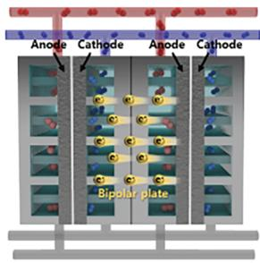
a
Normal condition Electrolytic cell

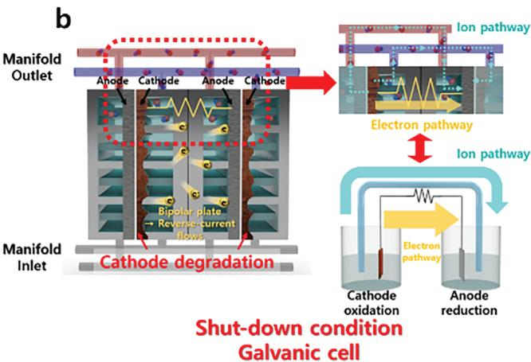
Figure 1. Ni electrode degradation by reverse-current flow after the shutdown of the alkaline electrolyzer. a) A schematic of the reverse-current flow between the cathode and anode, separated by a bipolar plate, after the shutdown process in the alkaline water-electrolyzer cell. b) A detailed mechanism of the reverse-current phenomenon after the shutdown process

respectively. When the AWE is halted, both the reductive species on the cathode and the oxidative species on the anode are electrically connected via the bipolar plate. A manifold for circulating the electrolyte solution in the AWE system induces an unintended ionic-path formation, which completes the "galvanic cell" and initiates a spontaneous self-discharge process. (Figure 1b) This process causes a portion of the current to flow in the opposite direction to that in normal electrolysis, resulting in the oxidation and reduction of the cathode and anode, respectively. The RC continues to flow until a potential equilibrium is established between the two electrodes, ultimately causing the degradation of the AWE performance. This durability concern is particularly pronounced when the AWE system is utilized as an energy-storage device for renewable sources subject to intermittent power fluctuations. Therefore, studies focusing on mitigating the durability issues caused by the RC phenomenon are crucial for the reliable implementation of AWE systems for large-scale energy storage considering the intermittent power fluctuations of renewables. The impact of anode reduction during the RC phenomenon is negligible. Rather, an intermittent reduction of the OER catalyst has been observed to have a healing effect on its catalytic activity, which could lead to an improvement in the overall durability of the catalyst.[5] In contrast, the cathode oxidation by RC phenomenon could result in passivation[6] or dissolution[3c,d] of the catalyst, leading to a serious degradation in its catalytic performance. In particular, in case a potential above $0.6\mathrm{V}$ versus RHE is applied to the Ni-based electrode, irreversible hydroxide or oxide phases (such as $\beta\text{-Ni(OH)}_2$ and $\mathrm{NiO}$ ) are formed, causing deterioration of the catalytic activity for HER.[7]

A few studies have proposed practical strategies based on system engineering for solving the HER catalyst-degradation issue resulting from shutdown events. The use of polarization rectifiers represents one possible solution for mitigating the negative effects of the RC phenomenon. To protect the cathode catalyst layer from RC flow, an additional cathodic potential can be applied at a sufficiently high level.[3c,8] Recently, our research group has introduced another system-based approach, using the cathodic protection method, wherein a sacrificial anode is connected to the cathode.[7] This is effective because the sacrifi

cial anode dissolves instead of the cathode material, preventing the electrode deterioration caused by the RC phenomenon. Although these system-level solutions are effective, they negatively impact the overall system balance, necessitating additional facilities and consequently increasing the operating cost. Consequently, it is crucial to adopt material-based approaches that can mitigate degradation without necessitating supplementary facilities.[9] However, few material-based solutions have been developed for preventing catalyst degradation due to RC flow.

Herein, we introduce a catalytic approach for enhancing the reverse current tolerance by the direct decoration of the Ni catalyst with a sacrificial metal. As the oxidation of the repeated RC elevated the potential of the cathode electrode, the electromotive force for the operation of the galvanic cell is weakened. This gradually hinders RC flows and confers the RC tolerance. In particular, contrary to our expectation that the decoration with lead, an inert material for the HER, would interfere with the hydrogen generation of Ni catalyst, the surface decoration of the Ni catalyst with $\mathrm{Pb}$ (Pb/Ni) catalyst exhibits improved HER activity as well as remarkable RC-flow resistance. The presence of $\mathrm{Pb}$ on Ni after RC flows enhances both the proton-desorption and water-dissociation steps, improving the HER activity of the catalyst. Furthermore, we have demonstrated the marked enhancement in the operational durability of $\mathrm{Pb} / \mathrm{Ni}$ against the RC flow phenomena using a real AWE stack.

# 2. Results and Discussion

# 2.1. Degradation Tolerance of the Pb/Ni Electrocatalyst Under Reverse-Current Conditions

In our previous work, we demonstrated that Sn, Zn, Al, and Pb worked effectively as sacrificial metals in the cathodic protection system to prevent the degradation of the Ni cathode.[7] However, directly coating the electrode with these metals is a more facile and cost-effective approach, compared with the system-level approach. First, we prepared thin-film surfaces with metal precursors on polycrystalline Ni pellets via solution deposition. Subsequently, metals were deposited on Ni with rapid calcination

a

b

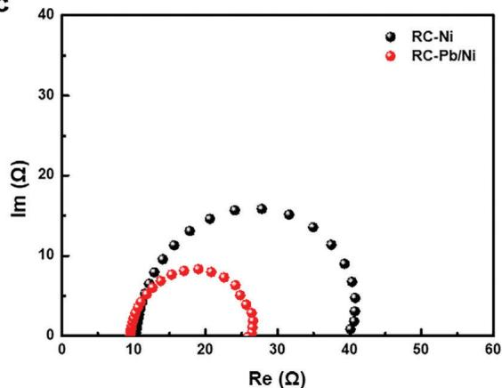
C

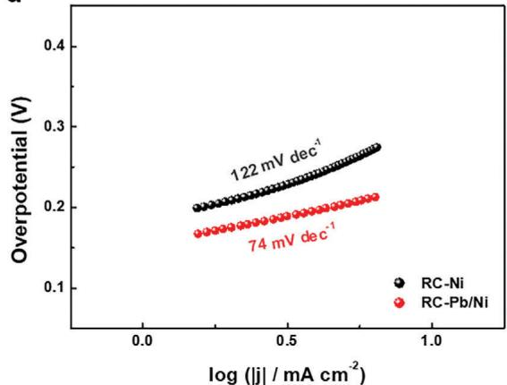
d
Figure 2. Measurement of the Ni and Pb/Ni catalysts under RC conditions. a) The LSV curves for Ni and Pb/Ni before and after the 5th and 10th cycles of HER-RC indicate the degradation of the HER activity of Ni and the enhancement of that of Pb/Ni during repeated RC cycles, simulating a start-up/shutdown (SU/SD) event in an alkaline water electrolyzer. b) The $\mathrm{RCSF}_{\eta}$ and $\mathrm{RCAF}_{\eta}$ values for Ni and M/Ni (M=Sn, Zn, Al, and Pb) before and after the 10th RC cycle. The Pb/Ni catalyst exhibited outstanding values for both the $\mathrm{RCSF}_{\eta}$ and $\mathrm{RCAF}_{\eta}$ . c) EIS at a potential of $-0.3\mathrm{V}$ versus RHE. d) Tafel slopes for RC-Ni and RC-Pb/Ni.

(hereinafter, the blend of M and Ni is denoted as $\mathrm{M / N_i}$ , where M is the sacrificial metal ( $\mathrm{M} = \mathrm{Sn}$ Zn, Al, or Pb)).

We begin with a discussion on the electrochemical behaviors of bare Ni and the prepared catalysts (Sn/Ni, Zn/Ni, Al/Ni, and Pb/Ni) under repeated dynamic RC cycles in $1\mathrm{M}$ KOH, as previously reported.[7] All the potentials in this paper are discussed in reference to the reversible hydrogen electrode (RHE), calibrated by linear sweep voltammetry (LSV) on a Pt rotating disk electrode (RDE) under a hydrogen-saturated atmosphere, whereby the potential at zero current corresponds to $0\mathrm{V}$ versus RHE (Figure S1, Supporting Information).[10] An RC simulation in a three-electrode system comprises one cycle of LSV for the HER and chronopotentiometry (CP) for the RC flow. The LSV measurement for the HER was conducted from $0.1\mathrm{V}$ to $-0.5\mathrm{V}$ versus RHE. All LSV currents were normalized by geometric area and the potentials were iR-corrected. The RC was simulated by CP at a constant current of $0.1\mathrm{mA}\mathrm{cm}^{-2}$ until the potential of the working electrode reached $1.2\mathrm{V}$ versus RHE, at which point the irreversible formation of Ni hydroxide or oxide phases (such as $\beta \text{-Ni(OH)}_2$ and NiO) occurred sufficiently in $1\mathrm{M}$ KOH.[6-7,11] As shown in Figure 2a, the bare Ni catalyst exhibited a $278~\mathrm{mV}$

overpotential at a current density of $-10\mathrm{mAcm}^{-2}$ before the RC flow. The HER performance of the bare Ni catalyst deteriorated with an overpotential of $310~\mathrm{mV}$ after the 10th RC cycle due to its oxidation by the RC flow.[12] As anticipated, the deposition of metals (Sn, Zn, Al, and Pb) alleviated the degradation of the Ni catalyst under the RC flow (Figure S2, Supporting Information). In particular, unexpectedly, the HER activity of the Pb/Ni catalyst gradually improved during the 10th RC cycle. The HER performance of the Pb/Ni catalyst exhibited continuous improvement during repeated RC cycles, with a $231\mathrm{mV}$ overpotential achieved after the 10th RC cycle (Figure 2a; Figure S3, Supporting Information). The HER current density at the 10th RC cycle for the Pb/Ni catalyst at $-0.25\mathrm{V}$ versus RHE was $-14.1\mathrm{mAcm}^{-2}$ , three times higher than that for the bare Ni and more than two-fold higher than those for others (Sn/Ni, Zn/Ni, and Al/Ni, see Figure S2, Supporting Information).

In our previous work, we introduced the RC stability factor at a constant current $(\mathrm{RCSF_j})$ , Equation (1), a metric for quantifying the durability of a catalyst against the RC flow in the HER.[7] To further consider the activity of various catalysts under RC conditions, we introduce the following new metrics: the RC

stability factor $(\mathbf{RCSF}_{\eta})$ , Equation 2) and the RC activity factor $(\mathbf{RCAF}_{\eta})$ , Equation 3) at a constant voltage, which includes the activity term $(j|_{\eta})$ . At a constant overpotential $(\eta = 250\mathrm{mV})$ , these metrics are expressed as follows:

$$
\mathrm {R C S F} _ {\mathrm {j}} = \left(1 - \frac {\eta_ {\text {a f t e r}} - \eta_ {\text {b e f o r e}}}{\eta_ {\text {b e f o r e}}} \Bigg | _ {j}\right) \times 1 0 0 \tag {1}
$$

$$
\mathrm {R C S F} _ {\eta} = \left. \frac {j _ {\text {a f t e r}}}{j _ {\text {b e f o r e}}} \right| _ {\eta} \tag {2}
$$

$$
\mathrm {R C A F} _ {\eta} = \left. j _ {\text {a f t e r}} \right| _ {\eta} \tag {3}
$$

Relatively high $\mathrm{RCSF}_{\eta}$ and $\mathrm{RCAF}_{\eta}$ values indicate that the catalyst exhibits high durability and activity under the RC conditions. The $\mathrm{RCSF}_{\eta}$ and $\mathrm{RCAF}_{\eta}$ metrics offer quantitative insights into the vulnerability of the Ni catalyst to the RC phenomenon. Figure 2b shows the $\mathrm{RCSF}_{\eta}$ values of the Ni and M/Ni catalysts at a constant current density $(j = 10\mathrm{mAcm}^{-2})$ ; the values increase in the order of Ni(0.75) $<  \mathrm{Al / N i}(2.24) <   \mathrm{Sn / N i}(2.40) <   \mathrm{Zn / N i}(3.18) <   \mathrm{Pb / N i}(6.35)$ The $\mathrm{RCAF}_{\eta}$ values at the overpotential of $250~\mathrm{mV}$ increase in the order of $\mathrm{Ni}(4.62\mathrm{mAcm}^{-2}) <   \mathrm{Sn / N i}(4.80\mathrm{mAcm}^{-2})$ $<  \mathrm{Al / N i}(5.99\mathrm{mAcm}^{-2}) <   \mathrm{Zn / N i}(6.15\mathrm{mAcm}^{-2}) <   \mathrm{Pb / N i}$ $(14.11\mathrm{mAcm}^{-2})$ . These results reveal the outstanding HER performance and stability of the Pb/Ni catalyst after the RC flow. Compared with conventional alkaline HER catalysts, such as metal sulfide,[13] oxide,[14] and layered double hydroxide (LDH)[15] (see Figure S4, Supporting Information), our Pb/Ni catalyst demonstrated enhanced electrochemical HER kinetics, performances, and particularly RC tolerance.

The HER kinetics of $\mathrm{Pb / Ni}$ and Ni after the 10th RC cycle (denoted as RC-Pb/Ni and RC-Ni) can be quantitatively compared by electrochemical impedance spectroscopy (EIS) measurements. The charge-transfer resistance $(\mathbb{R}_{\mathrm{ct}})$ , which is correlated with the electrocatalytic kinetics, is represented by the semicircle diameters in the Nyquist plot. As shown in the Nyquist plots (Figure 2c; Figure S5, Supporting Information), the $\mathrm{Pb / Ni}$ catalyst after the RC flow $(17.3\Omega)$ exhibited lower charge-transfer resistance than that of the bare Ni after the RC flow $(30.4\Omega)$ , verifying the high electron-transfer rate and the enhanced HER kinetics of RC-Pb/Ni compared with those of RC-Ni. The superior HER kinetics of RC-Pb/Ni was also confirmed by the Tafel plots (Figure 2d). The Tafel slope of $\mathrm{Pb / Ni}$ $(74\mathrm{mVs}^{-1})$ was lower than that of the Ni catalyst $(122\mathrm{mVs}^{-1})$ after the RC flow, demonstrating the superior HER performance of RC-Pb/Ni compared with that of RC-Ni.

To further confirm the durability of the RC-Pb/Ni-based electrode for HER during repeated RC cycles, 700 RC cycles were implemented with CV measurement ( $\approx$ 12.6 h, Figure S6, Supporting Information). The CV measurements were conducted from $-0.3\mathrm{V}$ (HER region) to $1.3\mathrm{V}$ (RC region), at a scan rate of $50\mathrm{mVs^{-1}}$ . As the cycle count increased, the Ni catalyst performance continuously deteriorated, and thus, an increased overpotential was observed. Remarkably, the overpotential of the Pb/Ni catalyst at $5\mathrm{mAcm}^{-2}$ gradually decreased from $243\mathrm{mV}$ to $221\mathrm{mV}$ and saturated after the 700th cycle. The $\mathrm{RCSF}_{\eta}$ and $\mathrm{RCAF}_{\eta}$ values for Pb/Ni were also larger than those for Ni, indicating that the HER activity of Pb/Ni was notably improved and that it could tolerate the RC flow for extended periods.

Additionally, the concentration of the dissolved Pb ions in the electrolyte solution was measured using inductively coupled plasma mass spectrometry (ICP-MS). Following the 10th RC cycle, only $4.2\mathrm{ppb}$ of Pb was detected in the KOH electrolyte, a negligible level of dissolution. However, it is worth noting that $\mathrm{Pb}$ is widely recognized for its detrimental impact and toxicity across various human body systems and ecosystems, including animals and plants.[16] While the concentration per electrode area remains below $1\mu \mathrm{g}\mathrm{cm}^{-2}$ ( $\approx 0.8\mu \mathrm{g}\mathrm{cm}^{-2}$ during the 10th RC cycle), it's advisable to implement an additional treatment process for $\mathrm{Pb}$ waste (e.g., employing adsorption methods using nanoscale adsorbents[17]), particularly when utilizing $\mathrm{Pb / Ni}$ for large-scale electrodes in real water electrolyzers.

Furthermore, to confirm these positive effects of the $\mathrm{Pb / N_i}$ catalyst against RC flow under the conventional industrial AWE pH condition, we conducted more repeated RC cycle experiments with the $\mathrm{Pb / N_i}$ catalyst in a $5\mathrm{M}$ KOH electrolyte.[18] Unlike Ni, the $\mathrm{Pb / N_i}$ catalyst exhibited an exceptionally improved HER performance under the RC condition, which is consistent with the RC cycling results in $1\mathrm{M}$ KOH (Figure S7, Supporting Information). Furthermore, considering the facile fabrication of large-area $\mathrm{Pb / N_i}$ electrodes, we deposited a $\mathrm{Pb}$ thin film on a Ni pellet $(\mathrm{Pb / NP})$ and a Ni foam $(\mathrm{Pb / NF})$ electrode by simple magnetron sputtering. The thickness of the sputtered $\mathrm{Pb}$ films was determined to be $\approx 10~\mathrm{nm}$ by X-ray reflection spectroscopy (Figure S8, Supporting Information). As shown in Figures S9 and S10 (Supporting Information), the deposited $\mathrm{Pb}$ film prevented the degradation of the Ni catalyst during the RC cycle, and moreover, the HER activities of $\mathrm{Pb / NP}$ and $\mathrm{Pb / NF}$ were gradually improved during the 10th RC cycle. From the polarization curves, it is clear that the HER performances of $\mathrm{Pb / NP}$ and $\mathrm{Pb / NF}$ were activated during the repeated RC cycles, similar to the behavior of the $\mathrm{Pb / N_i}$ catalyst, whose HER performance was enhanced by the RC flow. Consequently, we concluded that coating the Ni electrode with a $\mathrm{Pb}$ layer improves the HER activity of Ni and enhances its degradation tolerance toward repeated RC flow cycles.

# 2.2. Origin of the Reverse-Current Tolerance and Improved Catalytic Activity of the Pb/Ni Catalyst

To explore the origins of the RC tolerance of the $\mathrm{Pb / Ni}$ catalyst, we investigated potential changes between the cathode and the anode during the repetitive shut-down event. Employing the RC simulation model,[7] we could directly observe potential changes during RC flow in a water electrolyzer. For comparative analysis of the potential changes with different cathode materials, the anode (OER catalyst) was fixed to the bare Ni.

The RC simulation model consists of two steps: a steady-state condition and a reverse-current condition. (Figure 3a). Initially, potentials for the oxygen evolution reaction (OER) (1.6 V vs RHE) and the HER $(-0.3\mathrm{V}$ vs RHE) were concurrently applied to the anode and cathode, respectively, for $30\mathrm{min}$ in each of the three-electrode cells coupled to separate potentiostats (PS1 and PS2). After achieving a steady-state condition for each electrochemical reaction (30 min), two cells were integrated into two electrode cells via a salt bridge to simulate the self-discharge (reverse-current) condition in a water electrolyzer. Subsequently,

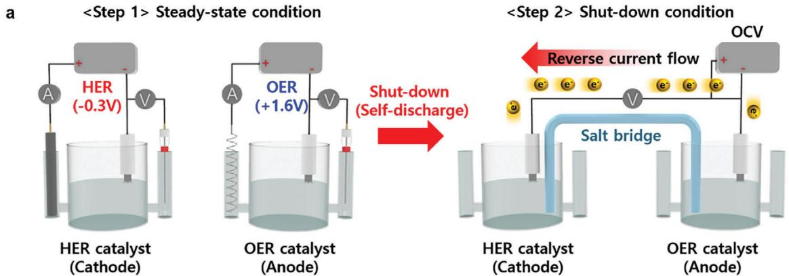

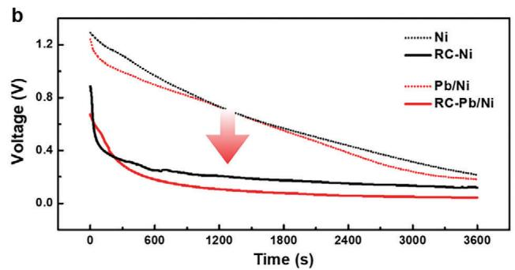

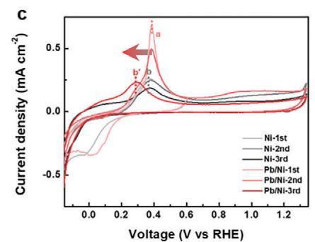
Figure 3. Origin of the improved HER activity of the $\mathrm{Pb / Ni}$ catalyst during the RC cycles. a) A schematic of the RC simulation model experiment showing the self-discharge between the cathode and the Ni anode. b) OCV measurement during the self-discharge for $1\mathrm{h}$ . c) The CV curves for Ni and $\mathrm{Pb / Ni}$ , showing peaks $a$ and $b$ , corresponding to the oxidation of $\mathrm{Pb / Pb^{2+}}$ and $\mathrm{Ni / Ni^{2+}}$ , respectively. In particular, for $\mathrm{Pb / Ni}$ , peak $c$ appears after the RC region because of the change in the electronic structure and the electrochemical kinetics.

we measured the open-circuit voltage (OCV) between the cathode and the anode to gain insights into the system's behavior.

Figure 3b illustrates the OCV results during a $1\mathrm{h}$ self-discharge, comparing the conditions before (dotted line) and after 10th repetition (solid line) of the RC simulation model. For both the two-electrode systems with Ni cathode (black dotted line) and $\mathrm{Pb / N_i}$ cathode (red dotted line), the OCV initiated at $\approx 1.3\mathrm{V}$ and decreased to $\approx 0.25\mathrm{V}$ after $1\textrm{h}$ ,suggesting that the self-discharge of galvanic cell formed by the potential difference between the cathode and the anode was carried out during the $1\textrm{h}$ period.

In contrast, the OCVs after the 10th RC cycle (solid line) were notably lower than before the RC cycle (dotted line). This was attributable to the irreversible oxidation of the Ni and $\mathrm{Pb / N_i}$ cathodes during the repeated RC cycles, which increased the potential of the cathode electrode. Consequently, the oxidized cathode materials weakened the electromotive force for the self-discharge operation. The OCVs after the 10th RC cycle (RC-Ni and RC $\mathrm{Pb / N_i}$ ) reached an equilibrium faster (within $10\mathrm{min}$ ), alleviating the degradation induced by the RC flow. In particular, this trend was more evident in the presence of Pb. The OCV for RC-Pb/Ni $(0.7\mathrm{V}$ at the beginning of the RC flow and $0.04\mathrm{V}$ at the end) was also lower than those for RC-Ni $(0.9$ and $0.1\mathrm{V})$ , confirming the degradation tolerance of the $\mathrm{Pb / N_i}$ catalyst against RC flow.

Based on the RC simulation model experiment, we highlight that HER electrodes were oxidized and passivated by RC, and consequently, it slows the catalyst degradation rate. However, the reason for the gradually improved HER performance of RC-Pb/Ni

is still questionable. To gain insights into the origin of the improved HER activity of the $\mathrm{Pb / Ni}$ catalyst during the RC flow cycle, we additionally subjected Ni and $\mathrm{Pb / Ni}$ to CV measurements. In Figure 3c, anodic peak $a$ indicates the electrochemical oxidation of $\mathrm{Pb}$ to $\mathrm{Pb(OH)_2}$ , and peak $b$ denotes the electrochemical oxidation of Ni to $\alpha\text{-Ni(OH)}_2$ .[19] In the first cycle of the CV graph (the sweep range was $-0.3 - 0.6\mathrm{V}$ ), the reversible oxidation and reduction reactions of Ni $(\mathrm{Ni} \leftrightarrow \alpha\text{-Ni(OH)}_2 + 2\mathrm{e}^-$ are shown for both the Ni and $\mathrm{Pb / Ni}$ catalysts. Next, the second and third CV cycles were swept from $-0.30$ to $1.27\mathrm{V}$ , encompassing both the HER and RC regions. In the second cycle, the reduction peak of Ni disappeared for both catalysts, attributed to the irreversible phase transformation of $\alpha\text{-Ni(OH)}_2$ into $\beta\text{-Ni(OH)}_2$ and NiO. Furthermore, the intensity of peak $a$ for $\mathrm{Pb / Ni}$ was slightly decreased by the dissolution of $\mathrm{Pb}$ during the cycle. Intriguingly, in the third cycle, a clear difference between the Ni and $\mathrm{Pb / Ni}$ catalysts was observed. After the catalysts were oxidized in the second cycle of the RC region, peak $b$ for the $\mathrm{Pb / Ni}$ catalyst negatively shifted $(83\mathrm{mV})$ to peak $b'$ in the third cycle, suggesting that the electronic configuration of the $\mathrm{Pb / Ni}$ surface changed after the RC flow. The negatively shifted peak indicated weak proton adsorption because oxidation peaks $b$ and $b'$ correspond to the electrochemical formation of $\alpha\text{-Ni(OH)}_2$ , followed by the desorption of the adsorbed proton.[20] Overall, the oxidized $\mathrm{Pb / Ni}$ catalyst under the RC condition exhibited superior proton-desorption kinetics in the CV measurements.

From the OCVs of the two-electrode system and the CV results, we can propose the origin of the RC tolerance and improved

catalytic activity of the $\mathrm{Pb / Ni}$ catalyst. First, both Ni and $\mathrm{Pb / Ni}$ oxidized via the RC decreases the potential difference between the anode and cathode electrodes, gradually impeding the RC flow. Simultaneously, RC-Pb/Ni exhibits superior proton-desorption kinetics compared with Ni or RC-Ni, which increases the HER activity of $\mathrm{Pb / Ni}$ . Consequently, an unintended oxidation of $\mathrm{Pb / Ni}$ catalyst by the repeated RC cycles could be considered the key origin of the RC tolerance and the unexpected HER activity improvement.

# 2.3. Material Characterization of RC Tolerant Pb/Ni Catalyst

To unveil the role of Pb in the high- $\mathrm{RCSF}_{\eta}$ and $-\mathrm{RCAF}_{\eta}$ Pb/Ni catalyst, we investigated the crystal structure, surface morphology, and composition of the Pb/Ni catalysts. Before analyzing these material properties, we confirmed an optimal concentration and configuration of Pb in the Ni catalyst for maximum HER efficiency. To determine the optimal concentration of Pb in the Ni catalyst for maximum HER efficiency, we compared the LSV curves for different concentrations of Pb and Ni precursors after the 10th RC cycle. We confirmed that only Pb deposition on Ni $(\mathrm{Pb}_{1} / \mathrm{Ni})$ has the catalytically most active LSV curves after the 10th RC cycle. (Figures S11 and S12, Supporting Information)

With the optimized $\mathrm{Pb / Ni}$ catalyst, high-resolution X-ray diffraction (XRD) patterns were obtained at a 9B high-resolution powder diffraction (HRPD) beamline in the Pohang Accelerator Laboratory (PAL) to confirm the accurate crystal structure of the $\mathrm{Pb / Ni}$ catalyst. (Figure S13, Supporting Information) For both the bare polycrystalline Ni and the $\mathrm{Pb / Ni}$ catalysts, fcc-Ni diffraction peaks at $2\theta = 44.4^{\circ}$ , $51.7^{\circ}$ , $76.3^{\circ}$ , $92.8^{\circ}$ , and $98.3^{\circ}$ (JCPDS 04-0850) were observed. The dominant (220) plane peak of fcc-Ni at $76.3^{\circ}$ was broadened and exhibited a negative shift, indicating the incorporation of relatively large Pb atoms into the Ni matrix. To reveal the morphological characteristics of the $\mathrm{Pb / Ni}$ catalyst before and after the RC flow, we additionally conducted scanning electron microscopy (SEM) analysis. At top-view SEM images of the catalysts, the polished polycrystalline Ni electrodes exhibited a flat and smooth morphology, whereas the $\mathrm{Pb / Ni}$ catalyst layer before and after the RC flow exhibited relatively rough surfaces. (Figure S14, Supporting Information). However, the surface images of the $\mathrm{Pb / Ni}$ catalysts before and after the RC flow are indistinguishable, implying that the morphological effect is negligible.

We then investigated the compositional change of the $\mathrm{Pb / Ni}$ catalyst under the RC conditions with energy-dispersive X-ray spectroscopy (EDS) mapping. A focused ion beam (FIB) was applied to the $\mathrm{Pb / Ni}$ catalysts before and after the RC cycle, respectively (Figure S15, Supporting Information). Pt was deposited on the catalyst surface as a protective layer during the FIB milling process. Afterward, we finally acquired cross-sectional SEM images and elemental maps of the $\mathrm{Pb / Ni}$ catalyst through EDS. As shown in the elemental maps, both Ni and $\mathrm{Pb}$ were distributed throughout the electrode surface, and two separate layers were formed, excluding the Pt deposition layer (Figure S16, Supporting Information). According to the quantitative composition analysis from the EDS results, the entire sample region included $15.75\mathrm{wt}\%$ of $\mathrm{Pb}$ (Figure S17, Supporting Information). In addition, the distribution of $\mathrm{Pb}$ was markedly concentrated in the upper layer of the electrode rather than the lower layer, and 23.49

and $8.40\mathrm{wt}\%$ of Pb occupied different spots in the upper and lower layers, respectively (Figure S18, Supporting Information). After the 10th RC cycle, $\approx 1\mathrm{wt}\%$ of Pb was distributed throughout the sample, and 1.61 wt% of Pb remained in a local region with a surface area of a few nanometers, as shown in the TEM and EDS imaging of the FIB cross-sections (Figures S19-S21, Supporting Information). Although many harsh RC cycles were repeated, $\approx 2\mathrm{wt}\%$ of Pb still existed on the electrode surface after the repeated RC cycles (Figure S21, Supporting Information). We assumed that this small quantity of Pb contributed to the enhanced alkaline HER kinetics and activity of the oxidized Ni after the RC flow.

# 2.4. Water Activation Effect of RC Tolerant Pb/Ni Catalyst: Improving Water-Dissociation Ability

Unlike the case in proton-rich acidic electrolytes, in alkaline electrolytes, $\mathrm{H^{*}}$ can only be derived from the water-dissociation process.[21] Therefore, the water-dissociation ability of catalysts is one of the key descriptors of their HER activity in alkaline media. Ambient pressure X-ray photoemission spectroscopy (AP-XPS) analysis was conducted to evaluate the water-dissociation ability of the catalysts (Figure 4a,b).[22] The O1s peak could be deconvoluted into: i) ionization characteristics of oxygen species for lattice oxide in metal $(\mathrm{O}^{2-}, \mathrm{O}_{\text{lattice}})$ , ii) ionization characteristics of oxygen species integrated into the material as $\mathrm{OH}^{-}$ , iii) $\mathrm{O}^{-}(\mathrm{O}_{\text{vac}})$ and iv) oxygen in water molecules $(\mathrm{H}_2\mathrm{O}_{\text{ads}})$ .[23] In a $0.1\mathrm{mTorrH}_2\mathrm{O}$ atmosphere, the intensity of the peak assigned to adsorbed water $(\mathrm{H}_2\mathrm{O}_{\text{ads}})$ increased in the order of $\mathrm{Ni} < \mathrm{RC}-\mathrm{Ni} < \mathrm{RC}-\mathrm{Pb}/\mathrm{Ni}$ . We confirmed that the oxidation of the Ni catalyst due to the RC flow enhanced its water adsorption ability of the catalyst surface.[24] In addition, the RC-Pb/Ni catalyst further exhibited the largest peak intensity. The facile adsorption of water molecules on the surface of the RC-Pb/Ni catalyst could decrease the energy barrier required for the water-dissociation step. We also investigated the intrinsic water-dissociation ability of Pb/Ni and compared the AP-XPS spectra under ultrahigh vacuum (UHV) and $0.1\mathrm{mTorrH}_2\mathrm{O}$ conditions. Compared to the UHV condition, Pb/Ni exhibited enhanced peak intensities for both $\mathrm{H}_2\mathrm{O}_{\text{ads}}$ and $\mathrm{OH}_{\text{ads}}$ in the $0.1\mathrm{mTorrH}_2\mathrm{O}$ atmosphere. The increase in the intensity of $\mathrm{OH}_{\text{ads}}$ suggests that $\mathrm{H}_2\mathrm{O}_{\text{ads}}$ are dissociated from $\mathrm{OH}_{\text{ads}}$ and $\mathrm{H}_{\text{ads}}$ . Consequently, this increase in $\mathrm{H}_2\mathrm{O}_{\text{ads}}$ and $\mathrm{OH}_{\text{ads}}$ on the catalyst surface in the presence of water clearly indicates water dissociation on the Pb/Ni catalysts.[25] AP-XPS analysis provided direct evidence of the activated performance of the Pb/Ni catalyst, attributed to the enhanced water-dissociation ability after the RC flow.

Density functional theory (DFT) calculations were performed to reveal the origin of the enhanced alkaline HER activity and tolerance of the $\mathrm{Pb / Ni}$ catalyst toward the RC flow. According to the XRD and XPS data (Figure S13, Supporting Information), fcc-Ni and $\mathrm{Ni(OH)_2}$ models were constructed to represent Ni and oxidized Ni after the RC flow (RC-Ni), respectively (Figure 4c). The lattice constant of fcc-Ni was optimized to be $a = 3.52\AA$ and the lattice constants of $\mathrm{Ni(OH)_2}$ were optimized to be $a = 3.15\AA$ and $c = 4.66\AA$ (Figure S22, Supporting Information). The most stable [111] facet was selected for the Ni surface, whereas the [110] facet with bare metal sites was chosen for the $\mathrm{Ni(OH)_2}$ surface since

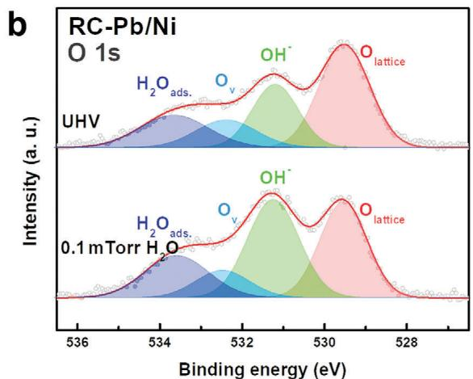

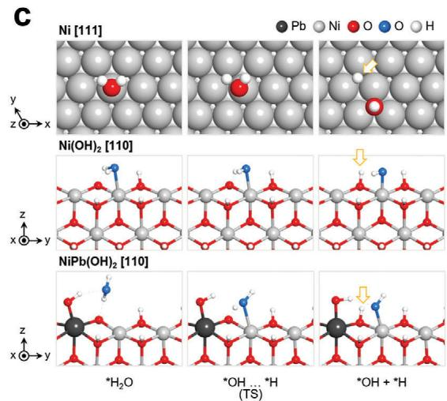

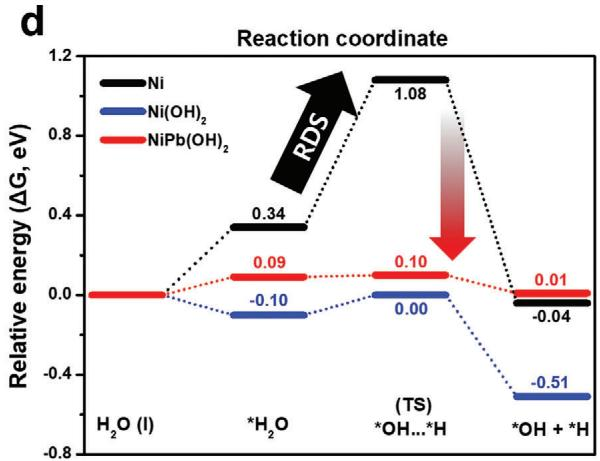
Figure 4. Water activation Effect of RC tolerant Pb/Ni catalyst: improving water-dissociation ability. a) Comparison of the O 1s AP-XPS spectra of Ni, RC-Ni, and RC-Pb/Ni under a $0.1\mathrm{mTorrH_2O}$ atmosphere. b) O1s AP-XPS spectra under ultrahigh vacuum (UHV) and $0.1\mathrm{mTorrH_2O}$ conditions. c) Intermediate structures of Ni, $\mathrm{Ni(OH)_2}$ , and $\mathrm{NiPb(OH)_2}$ for the water-dissociation step. The yellow arrows indicate the hydrogen intermediate sites that were investigated during the calculation of the hydrogen-binding energy. d) Gibbs free-energy profiles of the water-dissociation steps on Ni, $\mathrm{Ni(OH)_2}$ , and $\mathrm{NiPb(OH)_2}$ .

its alkaline HER activity was known.[26] One surface Ni atom of $\mathrm{Ni(OH)_2}$ slab model was replaced to Pb atom $(\mathrm{NiPb(OH)}_2$ Figure 4c) designates oxidized $\mathrm{Pb / N_i}$ after RC sample. The energy barriers for the water-dissociation step on the Ni, $\mathrm{Ni(OH)_2}$ and $\mathrm{NiPb(OH)_2}$ surfaces were calculated (Figure 4d). Among the catalysts, Ni exhibited the highest energy requirement for the water-dissociation step $(0.74\mathrm{eV})$ , which is the rate-determining step. $\mathrm{Ni(OH)_2}$ exhibited significantly more favorable kinetics for water dissociation $(0.10\mathrm{eV})$ .The $\mathrm{Pb}$ -doped $\mathrm{Ni(OH)_2}$ catalyst was maintained a low water-dissociation barrier $(0.01\mathrm{eV})$ . The poor HER activity of the oxidized Ni after the RC flow, despite its comparatively good water-dissociation ability, was attributed to the strong hydrogen-binding affinity of the lattice oxygens.

# 2.5. Ligand Effect in RC Tolerant Pb/Ni Catalyst: Promoting Proton Desorption

In general, the adsorption strength of the proton on the surface of the electrocatalyst determines the HER activity, and it depends

on the electronic structure of the electrocatalyst. To verify the correlation between hydrogen-binding affinity with the presence of lead atom and the oxidation of Ni, we further analyzed core-level XPS spectra (Figure 5a,b). Four catalyst samples were prepared: Ni, Pb/Ni, Ni after the 10th RC cycle (RC-Ni), and Pb/Ni after the 10th RC cycle (RC-Pb/Ni), and ex situ XPS spectra for Ni 2p and Pb 4f were obtained. Figure 5a compares the Ni 2p XPS core level signals for Ni, Pb/Ni, RC-Ni, and RC-Pb/Ni, respectively. The Ni spectrum exhibits a high-intensity metallic $\mathrm{Ni}^0$ peak at a binding energy of $852.28\mathrm{eV}$ , whereas the RC-Ni spectrum exhibits a low-intensity metallic $\mathrm{Ni}^0$ peak and a markedly intense $\mathrm{Ni(OH)}_2$ peak at a binding energy of $854.94\mathrm{eV}$ . Similar to the case for Ni, the metallic $\mathrm{Ni}^0$ peak for Pb/Ni occupies the majority of the XPS spectrum. However, the intensity of the metallic $\mathrm{Ni}^0$ peak for RC-Pb/Ni was slightly decreased compared with that for RC-Ni, and the metallic $\mathrm{Ni}^0$ peak exhibited a negative shift $(0.15\mathrm{eV})$ for the RC-Pb/Ni catalyst, implying that the metallic $\mathrm{Ni}^0$ state was partially reduced by the electron transfer from Pb to Ni.[21c,27] Moreover, the Pb 4f XPS spectra (Figure 5b) of RC-Pb/Ni show that the binding energy of metallic $\mathrm{Pb}^0$ positively shifted after the RC flow,

a

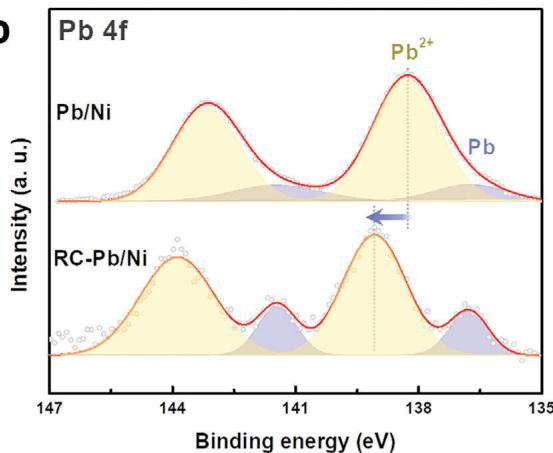
b

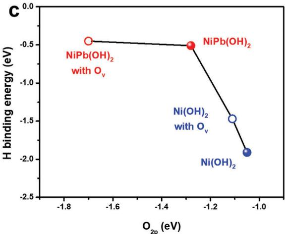

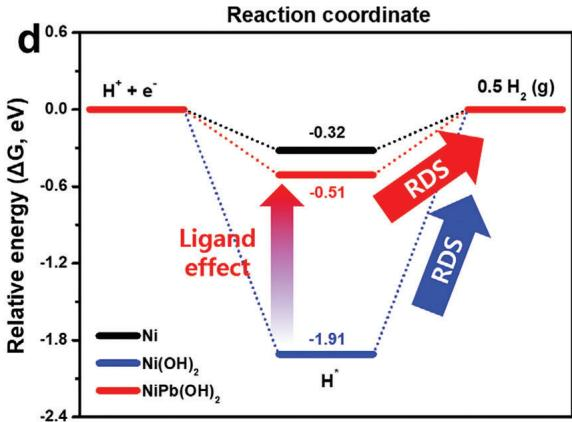
Figure 5. Ligand Effect in RC tolerant Pb/Ni catalyst: promoting proton desorption. a) Ni 2p XPS spectra of Ni, RC-Ni, Pb/Ni, and RC-Pb/Ni. b) Pb 4f XPS spectra of Pb/Ni and RC-Pb/Ni. c) The relationship between the oxygen $2p$ -band centers and the hydrogen-binding energies. d) Gibbs free-energy profiles of the hydrogen-gas-desorption steps on Ni, $\mathrm{Ni(OH)_2}$ , and $\mathrm{NiPb(OH)_2}$

verifying the charge transfer from $\mathrm{Pb}$ to Ni. The electron charge transferred from $\mathrm{Pb}$ to Ni would be attributable to the change of electronic structure for Ni catalyst surface.

In fact, the proton-adsorption strength on the catalyst surface is one of the key descriptors of the HER activity.[28] Clearly, hydrogen-binding strength has been correlated with the oxygen $2p$ -band center $(\mathrm{O}_{2p})$ [29] The downward shift of $\mathrm{O}_{2p}$ contributes to decreasing the proton-adsorption energy.[30] Since Ni exhibits strong proton adsorption,[31] the comparatively weak adsorption on the Ni surfaces promotes the desorption of the adsorbed hydrogen, thereby increasing the HER efficiency. This was consistent with the relationship between the oxygen $2p$ -band centers and the hydrogen-binding energies derived from DFT. (Figure 5c) As a low $\mathrm{O}_{2p}$ indicates weak hydrogen binding, the lowered $\mathrm{O}_{2p}$ in the presence of Pb could facilitate the release of ${}^{*}\mathrm{H}$ from the $\mathrm{Ni(OH)}_2$ surface. In addition, since oxygen vacancies $(\mathrm{O_v})$ were observed in $\mathrm{Ni(OH)_2}$ and $\mathrm{NiPb(OH)_2}$ based on the XPS spectra (Figure 4a,b), their effect was investigated further. The most stable $\mathrm{O_v}$ site on the $\mathrm{Ni(OH)_2}$ surface was first identified (Figure S23, Supporting Information), and the calculated energetics for the alkaline HER in the $\mathrm{O_v}$ -containing models indicated that $\mathrm{O_v}$ improved the performance of both catalysts by re

ducing the energy required for $\mathrm{H}_{2}$ desorption (Table S1, Supporting Information). However, the alkaline HER activity trend remained consistent, with $\mathrm{Ni(OH)}_{2} < \mathrm{Ni} < \mathrm{NiPb(OH)}_{2}$ , regardless of the presence of $\mathrm{O}_{\mathrm{V}}$ . The weakened hydrogen binding due to $\mathrm{O}_{\mathrm{V}}$ was also explained by the downshifted $\mathrm{O}_{2\mathrm{p}}$ (Figure 5c). This trend was also in line with the valence band spectra for RC-Ni and RC-Pb/Ni. (Figure S24, Supporting Information) According to several literatures, the downshifted d-band center leads to a relatively large occupation of antibonding states, decreasing the proton-adsorption/desorption energy.[32] The valence band center of RC-Pb/Ni (6.92 eV) downshifts compared with that of RC-Ni (6.87 eV). Also, compared with the valence band maximum of RC-Ni (1.34 eV), that of RC-Pb/Ni shifts to 1.52 eV, weakening the binding energy of protons.

Finally, the calculation of hydrogen binding energy with DFT summarizes the ligand effect in $\mathrm{Pb / Ni}$ catalyst. (Figure 5d) $\mathrm{Ni(OH)_2}$ exhibited significantly more favorable kinetics for water dissociation; however, its kinetics for the hydrogen-desorption step was tremendously sluggish $(-1.91\mathrm{eV})$ . Interestingly, the $\mathrm{Pb}$ -doped $\mathrm{Ni(OH)_2}$ catalyst exhibited a moderately low hydrogen-binding energy $(-0.51\mathrm{eV})$ while maintaining a low water-dissociation barrier, As mentioned before, the poor HER

activity of the oxidized Ni after the RC flow, despite its comparatively good water-dissociation ability, was attributed to the strong hydrogen-binding affinity of the lattice oxygens. However, the incorporation of $\mathrm{Pb}$ mitigated this issue while affording the benefit of a lower water-dissociation barrier. Thus, the XPS analysis and DFT calculations provided evidence that the proton-adsorption/desorption energy of the RC-Pb/Ni catalyst was weakened by the charge-transfer effect.

Meanwhile, in previous characterizations, the Pb content in the Ni/Pb catalyst was reduced from $15.75\mathrm{wt}\%$ to only $2\mathrm{wt}\%$ after the RC flow; however, here, the resulting $\mathrm{NiPb(OH)}_2$ phase maintained a Pb composition of $2\mathrm{wt}\%$ over multiple RC cycles and could function as a stable catalyst. The high tolerance and durability of the Pb-doped $\mathrm{Ni(OH)}_2$ catalyst under harsh RC conditions were explored by calculating the Pb binding energy (PbBE) and dissolution energy (Figures S25 and S26, Supporting Information). The Pb-doped $\mathrm{Ni(OH)}_2$ catalyst exhibited a significantly stronger PbBE than the Pb-loaded Ni and Pb-doped Ni, which translates to a higher Pb dissolution resistance across the entire potential range. This confirms that the state of Pb incorporated into oxidized $\mathrm{Ni(OH)}_2$ is more stable than that of Pb on metallic Ni and that $2\mathrm{wt}\%$ Pb remains on the oxidized Ni matrix continuously even after repeated RC cycles.

In summary, there are two major effects responsible for the increased RC tolerance of the $\mathrm{Pb / Ni}$ catalyst. First, the water activation effect on RC-Pb/Ni improves water-dissociation ability. Repeated RC cycles facilitate the oxidation of the Ni and $\mathrm{Pb / Ni}$ surfaces, enhancing their water-dissociation abilities. (Figure 4) Second, the ligand effect on RC-Pb/Ni promotes proton desorption. The presence of Pb after the RC flow induces the electron transfer from $\mathrm{Pb}$ to Ni, indicating that partial Ni species further accommodate electrons in RC-Pb/Ni system. This charge transfer leads to a decrease in the proton adsorption energy on Ni species. (Figure 5) Consequently, these two major effects induced by a small quantity of $\mathrm{Pb}$ promote the HER activity of oxidized Ni catalyst in alkaline media.

# 2.6. Reverse-Current Tolerance of the Pb/Ni Catalyst in an Alkaline Water-Electrolyzer Stack

A simulated SU/SD protocol, as depicted in Figure S26 (Supporting Information, was implemented to confirm the RC tolerance of the $\mathrm{Pb / Ni}$ catalyst in a practical situation, i.e., in a bipolar-type alkaline water electrolyzer stack. The stack was assembled with two zero-gap type single cells (Figure 6a). Every single cell was composed of two electrodes, current collectors, bipolar plates, a Ni foam as the porous transport layer (PTL), and a separator (Zirfon, Agfa). We observed no appreciable decrease in the output current during $24\mathrm{h}$ continuous operation at $4.5\mathrm{V}$ , demonstrating long-term stability of alkaline water-electrolyzer stack cell with normal operation conditions. (Figure S28, Supporting Information)

Figure 6b shows the marked difference in cell performance as the SU/SD cycle count increases. In the first cycle, the current density of the $\mathrm{Pb / N_i}$ cathode/Ni anode AWE system (Pb/Ni || Ni, $1042.4\mathrm{mAcm}^{-2}$ ) is higher than that of the Ni cathode/Ni anode AWE system (Ni || Ni, $736.2\mathrm{mAcm}^{-2}$ ). After 30 SU/SD cycles, the Ni || Ni system retained only $89.5\%$ of its initial cur

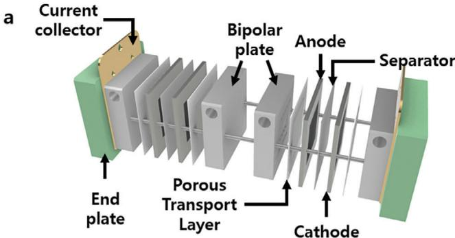

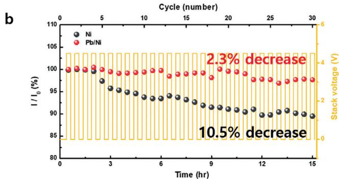
Figure 6. Alkaline water-electrolyzer stack cell. a) Schematic of the bipolar-type zero-gap alkaline water electrolyzer stack. b) Current-density profiles relative to the SU/SD cycle. One SU/SD cycle consists of two steps: 1) $10\mathrm{min}$ of operation at $4.5\mathrm{V}$ (start-up) and 2) a 20-min switch-off step (shutdown). The geometric area of the electrodes was $4\mathrm{cm}^2$ and a $30\mathrm{wt}\%$ KOH electrolyte solution was introduced at a flow rate of $300\mathrm{mL}\mathrm{min}^{-1}$ at $80^{\circ}\mathrm{C}$ .

rent density $(659.72\mathrm{mAcm}^{-2})$ , whereas the $\mathrm{Pb / N_i}$ || Ni system retained $\approx 97.3\%$ (1018.1 mA cm-2) Furthermore, the Pb/Ni || NiFeOx stack cell (with a conventional anode material) also retained $\approx 98.7\%$ after 30 SU/SD cycles, verifying the RC tolerance of $\mathrm{Pb / N_i}$ in situations of enhanced performance. (Figure S29, Supporting Information) These results clearly demonstrate the markedly improved durability of the $\mathrm{Pb / N_i}$ catalyst compared with that of the Ni foam during the repetitive SU/SD events in the alkaline water electrolyzer stack.

# 3. Conclusion

In this study, we have demonstrated a novel material-based approach to enhance the reverse-current (RC) tolerance of catalysts by directly decorating the Ni catalyst with Pb. The decoration of the Ni catalyst with Pb offers high- $\mathrm{RCSF}_{\eta}$ (6.35) and $-\mathrm{RCAF}_{\eta}$ $(14.11\mathrm{mAcm}^{-2})$ under repetitive shutdown conditions, which are five times higher than those of bare Ni. The RC tolerance is induced by the oxidation of Pb/Ni cathode electrode during repeated RC cycles. The potential elevation caused by the oxidized Pb/Ni electrode hinders the RC flow, thereby imparting RC tolerance to Pb/Ni. Contrary to our initial expectation that decorating with lead, an inert material for the HER, would interfere with the hydrogen generation of the Ni catalyst, the Pb/Ni catalyst exhibits high RCAF. To explain the reasons for the HER activity enhancement, we have confirmed two major effects: water activation effect and ligand effect. In the case of the water activation effect,

the RC cycle facilitates the oxidation of the Ni and $\mathrm{Pb / N_i}$ surface, enhancing the water-dissociation ability. Additionally, in the case of the ligand effect, the charge transfer from $\mathrm{Pb}$ to Ni downshifts the band center, leading to a decrease in the proton adsorption energy on Ni species. Both enhancement in water-dissociation and proton-desorption steps synergistically improve the HER activity of Ni catalyst in alkaline media. Moreover, we have validated the operational durability of $\mathrm{Pb / N_i}$ against RC flow phenomena using an actual alkaline water electrolysis (AWE) stack. The AWE stack using $\mathrm{Pb / N_i}$ shows minimal loss of current during 30 cycles of SU/SD protocols, while that with bare Ni demonstrated a $10.5\%$ current loss from the initial value. Taken all together, these results obviously verify the reverse-current tolerance $\mathrm{Pb / N_i}$ HER catalysts and their great potential for enhancing the longevity and performance of alkaline water electrolyzers.

# Supporting Information

Supporting Information is available from the Wiley Online Library or from the author.

# Acknowledgements

S.-M.J. and Y.K. contributed equally to this work. This work was supported by a grant from the National Research Foundation of Korea (2019M3D1A1079306).

# Conflict of Interest

The authors declare no conflict of interest.

# Data Availability Statement

The data that support the findings of this study are available from the corresponding author upon reasonable request.

# Keywords

alkaline water electrolysis, hydrogen energy, Lead, load fluctuation, reverse current

Received: December 17, 2023

Revised: February 13, 2024

Published online: March 3, 2024

[1] a) A. S. Brouwer, M. van den Broek, A. Seebregts, A. Faaij, Renewable Sustain. Energy Rev. 2014, 33, 443; b) P. Colbertaldo, S. B. Agustin, S. Campanari, J. Brouwer, Int. J. Hydrogen Energy 2019, 44, 9558.
[2] a) S. Marini, P. Salvi, P. Nelli, R. Pesenti, M. Villa, M. Berrettoni, G. Zangari, Y. Kiros, Electrochim. Acta 2012, 82, 384; b) H. Lee, J. Gu, B. Lee, H.-S. Cho, H. Lim, Energy and Al 2023, 13, 100251; c) I.-S. Kim, H.-S. Cho, M. Kim, H.-J. Oh, S.-Y. Lee, Y.-K. Lee, C. Lee, J. H. Lee, W. C. Cho, S.-K. Kim, J. H. Joo, C.-H. Kim, J. Mater. Chem. A 2021, 9, 16713; d) W.-B. Han, I.-S. Kim, M. Kim, W. C. Cho, S.-K. Kim, J. H. Joo, Y.-W. Lee, Y. Cho, H.-S. Cho, C.-H. Kim, Electrochim. Acta 2021, 386, 138458.

[3] a) J. Divisek, R. Jung, D. Britz, J. Appl. Electrochem. 1990, 20, 186; b) A. Kuhn, J. Booth, J. Appl. Electrochem. 1980, 10, 233; c) S. Holmin, L.-Å. Naslund, Å. S. Ingason, J. Rosen, E. Zimmerman, Electrochim. Acta 2014, 146, 30; d) L.-Å. Naslund, Å. S. Ingason, S. Holmin, J. Rosen, J. Phys. Chem. C 2014, 118, 15315.
[4] a) R. E. White, C. W. Walton, H. S. Burney, R. N. Beaver, J. Electrochem. Soc. 1986, 133, 485; b) Y. Uchino, T. Kobayashi, S. Hasegawa, I. Nagashima, Y. Sunada, A. Manabe, Y. Nishiki, S. Mitsushima, Electrocatalysis 2018, 9, 67; c) Y. Uchino, T. Kobayashi, S. Hasegawa, I. Nagashima, Y. Sunada, A. Manabe, Y. Nishiki, S. Mitsushima, Electrochemistry 2018, 86, 138.
[5] a) F. Bao, E. Kemppainen, I. Dorbandt, F. Xi, R. Bors, N. Maticiuc, R. Wenisch, R. Bagacki, C. Schary, U. Michalczik, P. Bogdanoff, I. Lauermann, R. van de Krol, R. Schlatmann, S. Calnan, ACS Catal. 2021, 11, 10537; b) C. Kuai, Z. Xu, C. Xi, A. Hu, Z. Yang, Y. Zhang, C.-J. Sun, L. Li, D. Sokaras, C. Dong, S.-Z. Qiao, X.-W. Du, F. Lin, Nat. Catal. 2020, 3, 743.
[6] M. Grden, K. Klimek, J. Electroanal. Chem. 2005, 581, 122.
[7] Y. Kim, S.-M. Jung, K.-S. Kim, H.-Y. Kim, J. Kwon, J. Lee, H.-S. Cho, Y.-T. Kim, JACS Au 2022, 2, 2491.
[8] R. L. Doughty, V. J. Ionata, T. E. Dye, J. A. Wirant, IEEE Transact. Ind. Appl. 1989, 25, 928.
[9] a) M. M. Silver, E. M. Spore, E. S. I. E. Division, Proceedings of the Symp. on Advances in the Chlor-Alkali and Chlorate Industry, Industrial Electrolytic Division, Electrochemical Society, Pennington, NJ 1984; b) S.-M. Jung, S.-W. Yun, J.-H. Kim, S.-H. You, J. Park, S. Lee, S. H. Chang, S. C. Chae, S. H. Joo, Y. Jung, J. Lee, J. Son, J. Snyder, V. Stamenkovic, N. M. Markovic, Y.-T. Kim, Nat. Catal. 2020, 3, 639.
[10] a) J. Suntivich, H. A. Gasteiger, N. Yabuuchi, Y. Shao-Horn, J. Electrochem. Soc. 2010, 157, B1263; b) J. Suntivich, K. J. May, H. A. Gasteiger, J. B. Goodenough, Y. Shao-Horn, Science 2011, 334, 1383; c) B. Zhang, X. Zheng, O. Voznyy, R. Comin, M. Bajdich, M. Garcia-Melchor, L. Han, J. Xu, M. Liu, L. Zheng, Science 2016, 352, 333.
[11] M. Alsabet, M. Grden, G. Jerkiewicz, Electrocatalysis 2015, 6, 60.
[12] A. Y. Faid, A. O. Barnett, F. Seland, S. Sunde, Electrochim. Acta 2020, 361, 137040.
[13] a) J. Petó, T. Ollár, P. Vancsó, Z. I. Popov, G. Z. Magda, G. Dobrik, C. Hwang, P. B. Sorokin, L. Tapasztó, Nat. Chem. 2018, 10, 1246; b) J. Xie, J. Zhang, S. Li, F. Grote, X. Zhang, H. Zhang, R. Wang, Y. Lei, B. Pan, Y. Xie, J. Am. Chem. Soc. 2013, 135, 17881.
[14] M. S. A. Sher Shah, V. K. Paidi, H. Jung, S. Kim, G. Lee, J. W. Han, K.-S. Lee, J. H. Park, J. Mater. Chem. A 2021, 9, 1770.
[15] a) G. Chen, T. Wang, J. Zhang, P. Liu, H. Sun, X. Zhuang, M. Chen, X. Feng, Adv. Mater. 2018, 30, 1706279; b) Y. Jia, L. Zhang, G. Gao, H. Chen, B. Wang, J. Zhou, M. T. Soo, M. Hong, X. Yan, G. Qian, J. Zou, A. Du, X. Yao, Adv. Mater. 2017, 29, 1700017.
[16] a) P. Panda, J. Mater. Sci. 2009, 44, 5049; b) J. Wu, D. Xiao, J. Zhu, Chem. Rev. 2015, 115, 2559.
[17] M. Hua, S. Zhang, B. Pan, W. Zhang, L. Lv, Q. Zhang, J. Hazard. Mater. 2012, 211, 317.
[18] a) Y. Liu, X. Liang, L. Gu, Y. Zhang, G.-D. Li, X. Zou, J.-S. Chen, Nat. Commun. 2018, 9, 2609; b) H. Dotan, A. Landman, S. W. Sheehan, K. D. Malviya, G. E. Shter, D. A. Grave, Z. Arzi, N. Yehudai, M. Halabi, N. Gal, N. Hadari, C. Cohen, A. Rothschild, G. S. Grader, Nat. Energy 2019, 4, 786; c) V. R. Jothi, K. Karuppasamy, T. Maiyalagan, H. Rajan, C.-Y. Jung, S. C. Yi, Adv. Energy Mater. 2020, 10, 1904020.
[19] a) E. B. Ferreira, G. Jerkiewicz, Electrocatalysis 2021, 12, 199; b) S. S. Abd El Rehim, L. I. Ali, N. H. Amin, N. F. Mohamed, Monatsh. für Chem. /Chem. Monthly 1997, 128, 245; c) M. Pourbaix, NACE 1966.
[20] A. G. Oshchepkov, A. Bonnefont, V. N. Parmon, E. R. Savinova, Electrochim. Acta 2018, 269, 111.
[21] a) D. T. Ram Subbaraman, D. Strmcnik, K-C. Chang, M. Uchimura, A. P. Paulikas, V. Stamenkovic, N. M. Markovic, Science 2011, 334, 6060; b) J. Kim, S.-M. Jung, K.-S. Kim, S.-H. You, B.-J. Lee, Y.-T. Kim,

J. Electrochem. Sci. Technol. 2022, 13, 417; c) J. Kim, H. Jung, S.-M. Jung, J. Hwang, D. Y. Kim, N. Lee, K.-S. Kim, H. Kwon, Y.-T. Kim, J. W. Han, J. K. Kim, J. Am. Chem. Soc. 2020, 143, 1399; d) D. S. Baek, G. Y. Jung, B. Seo, J. C. Kim, H. W. Lee, T. J. Shin, H. Y. Jeong, S. K. Kwak, S. H. Joo, Adv. Funct. Mater. 2019, 29, 1901217.
[22] M. E. Grass, P. G. Karlsson, F. Aksoy, M. Lundqvist, B. Wannberg, B. S. Mun, Z. Hussain, Z. Liu, Rev. Sci. Instrum. 2010, 81, 053106.
[23] a) J.-C. Dupin, D. Gonbeau, P. Vinatier, A. Levasseur, Phys. Chem. Chem. Phys. 2000, 2, 1319; b) Y. Wang, R. Yang, Y. Ding, B. Zhang, H. Li, B. Bai, M. Li, Y. Cui, J. Xiao, Z.-S. Wu, Nat. Commun. 2023, 14, 1412; c) Y. Luo, L. Tang, U. Khan, Q. Yu, H.-M. Cheng, X. Zou, B. Liu, Nat. Commun. 2019, 10, 269; d) G. Li, H. Jang, S. Liu, Z. Li, M. G. Kim, Q. Qin, X. Liu, J. Cho, Nat. Commun. 2022, 13, 1270; e) J. Yin, J. Jin, H. Liu, B. Huang, M. Lu, J. Li, H. Liu, H. Zhang, Y. Peng, P. Xi, C.-H. Yan, Adv. Mater. 2020, 32, 2001651.
[24] M. Cao, K. Liu, Y. Song, C. Ma, Y. Lin, H. Li, K. Chen, J. Fu, H. Li, J. Luo, Y. Zhang, X. Zheng, J. Hu, M. Liu, J. Energy Chem. 2022, 72, 125.
[25] S. Yamamoto, K. Andersson, H. Bluhm, G. Ketteler, D. E. Starr, T. Schiros, H. Ogasawara, L. G. M. Pettersson, M. Salmeron, A. Nilsson, J. Phys. Chem. C 2007, 111, 7848.
[26] S. Li, C. Xi, Y.-Z. Jin, D. Wu, J.-Q. Wang, T. Liu, H.-B. Wang, C.-K. Dong, H. Liu, S. A. Kulinich, X.-W. Du, ACS Energy Lett. 2019, 4, 1823.

[27] a) J. Libra, K. Veltruská, V. Matolin, Phys. Rev. B 2007, 76, 165438; b) K. Gurtler, K. Jacobi, Surf. Sci. 1983, 134, 309; c) Y.-H. Lin, C.-H. Hsu, I. Jang, C.-J. Chen, P.-M. Chiu, D.-S. Lin, C.-T. Wu, F.-C. Chuang, P.-Y. Chang, P.-J. Hsu, ACS Appl. Mater. Interfaces 2022, 14, 23990.
[28] a) J. Durst, A. Siebel, C. Simon, F. Hasché, J. Herranz, H. A. Gasteiger, Energy Environ. Sci. 2014, 7, 2255; b) W. Sheng, Z. Zhuang, M. Gao, J. Zheng, J. G. Chen, Y. Yan, Nat. Commun. 2015, 6, 5848.
[29] a) Y. Liu, T. Sakthivel, F. Hu, Y. Tian, D. Wu, E. H. Ang, H. Liu, S. Guo, S. Peng, Z. Dai, Adv. Energy Mater. 2023, 13, 2203797; b) D. He, X. Song, W. Li, C. Tang, J. Liu, Z. Ke, C. Jiang, X. Xiao, Angew. Chem., Int. Ed. 2020, 59, 6929.
[30] a) B. Xing, G.-C. Wang, Phys. Chem. Chem. Phys. 2014, 16, 2621; b) J. Zhang, W. Li, J. Wang, X. Pu, G. Zhang, S. Wang, N. Wang, X. Li, Angew. Chem., Int. Ed. 2023, 62, 202215654.
[31] a) D. Soares, O. Teschke, I. Torriani, J. Electrochem. Soc. 1992, 139, 98; b) Y. Li, X. Tan, R. K. Hocking, X. Bo, H. Ren, B. Johannessen, S. C. Smith, C. Zhao, Nat. Commun. 2020, 11, 2720; c) F. Song, W. Li, J. Yang, G. Han, P. Liao, Y. Sun, 2018, 9, 4531.
[32] a) Z. Chen, Y. Song, J. Cai, X. Zheng, D. Han, Y. Wu, Y. Zang, S. Niu, Y. Liu, J. Zhu, X. Liu, G. Wang, Angew. Chem., Int. Ed. 2018, 57, 5076; b) Q. Hu, K. Gao, X. Wang, H. Zheng, J. Cao, L. Mi, Q. Huo, H. Yang, J. Liu, C. He, Nat. Commun. 2022, 13, 3958; c) G. Wu, X. Han, J. Cai, P. Yin, P. Cui, X. Zheng, H. Li, C. Chen, G. Wang, X. Hong, Nat. Commun. 2022, 13, 4200.
