RESEARCH ARTICLE

# Reverse-Current Induced Cascade Degradation in Ni-Ru Electrodes: Tracing the Path from Noble Metal Loss to Substrate Corrosion

Xukang Wang | Chenchen Feng | Lingao Deng | Chao Liu | Feifei Li | Luyu Yang | Zijian Gao | Tong Sun | Jiangong Zhu | Zhen Geng | Cunman Zhang | Liming Jin

School of Automotive Studies and Clean Energy Automotive Engineering Center, Tongji University, Shanghai, China

Correspondence: Liming Jin (limingjin@tongji.edu.cn)

Received: 30 October 2025 | Revised: 26 November 2025 | Accepted: 27 November 2025

Keywords: accelerated stress test | alkaline water electrolysis | galvanic corrosion | multi-stage degradation | renewable energy | reverse current

# Abstract

Long-term durability of Ni-based electrodes under renewable energy (RE) driven dynamic operation, remains a critical bottleneck in advancing the alkaline water electrolysis (AWE). Among various durability-related failure behaviors, degradation induced by reverse current (RC) has been largely overlooked, despite its growing relevance under fluctuating RE. Herein, we systematically elucidate a multistage degradation pathway of Ni-Ru electrodes (NR) under an accelerated stress test (AST). By combining full-process electrochemical monitoring with morphological and compositional analysis the pathway is summarized as follow: (i) the dense Ru layer is initially oxidated into rough and defective surface with high surface area, under the Ostwald ripening effect; (ii) promoted by the gradual formation of the Ni-Ru co-exposure to the electrolyte, the Ni substrate is subsequently galvanic corroded accompanied by partial Ru redeposition; (iii) through prolonged operation, both Ni and Ru are extensively oxidized and precipitated, eventually resulting in complete Ru depletion and structural collapse of Ni substrate. Based on this mechanistic understanding, we further investigate the effect of RC amplitude on degradation kinetics. Reducing the RC amplitude fraction from $20\%$ to $0\%$ , the initial Ru oxidation is effectively suppressed and following failure is thereby mitigated, with decreasing the degradation rate from $4.756$ to $0.257\mathrm{mV}\mathrm{h}^{-1}$ . These findings provide with fundamental insight into dynamic degradation evolution and offer practical mechanism for RC-tolerant electrode design.

# 1 | Introduction

With the rapid increase of social demand for green hydrogen production, alkaline water electrolysis (AWE) powered by renewable energy (RE) is gaining great attention as a scalable and cost-effective route. Promising implementation of RE-AWE is directly associated with the efficiency and stability of electrolysis,

which could be promoted by the core component electrode with enhanced catalytic activity and durability [1-10]. In particular, Ni-X electrode (X: Ru, Fe, Co et al.) has attracted great attention due to the high catalytic activity benefited from the intermetallic synergistic effect [11, 12], yet suffers from insufficient durability caused by severe degradation under dynamic operation powered by RE. In this regard, ascertaining the inducing

Abbreviations: AST, accelerated stress test; AWE, alkaline water electrolysis; BoT, begin of test; CV, cyclic voltammograms; EoT, end of test; EIS, electrochemical resistance spectroscopy; ECSA, electrochemical active area; EDS, Energy Dispersive X-ray Spectroscopy; ICP-MS, Inductively Coupled Plasma Optical Emission Spectrometry/Mass Spectrometry; LSV, linear sweep voltammetry; Ni, nickel; NR, Ni-Ru electrode; RE, renewable energy; RC, reverse current; Ru, ruthenium; RHE, reference hydrogen electrode; SHE, standard hydrogen electrode; SEM, scanning electron microscope; TEM, transmission electron microscope; XPS, X-ray photoelectron spectroscopy.

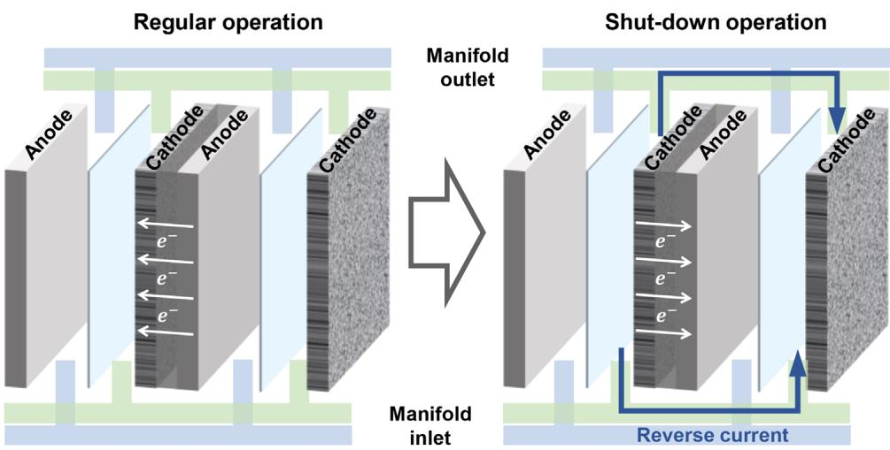
FIGURE 1 | Schematic description of RC formation after the rapid shut-down operation.

stresses from RE power and corresponding degradation-inducing mechanisms is extremely crucial. Reverse current (RC), resulting from the reverse self-discharge after the rapid shut down triggered, was reported to induce the degradation of electrode through converting the redox condition as shown in Figure 1 [13-28]. Furthermore, for the rapid shut-down operations are frequently triggered by the intermittent and fluctuating input, the RC-induced degradation is even accelerated in the long-term operation powered by RE. However, due to the restriction to constant condition in the previous studies, the RC-induced degradation is grossly neglected. Consequently, fundamental understanding of RC-induced degradation is critically required.

Kim et al. [29]. and Holmin et al. [15]. have simulated the RC-induced degradation of Ni-based cathode by directly applying the potential (1.6 V vs RHE for 30 min) and current density (640 mA cm $^{-2}$ for 6 h) for oxygen evolution reaction (OER). Similar conclusions were acquired that the irreversible electrochemical oxidation was responsible for the RC-induced degradation. It is worth noting that with the oxidation proceeds, component of electrode and electrolyte changes as well, which indicates the existence of complicated degradation evolution during long-term operation. Yet the long-term RC-induced degradation have not been investigated in depth due to the excessive time required by the durability test and the enclosed property of the traditional "begin-end" test [30-34]. More importantly, the above-mentioned simulating RC durations are significantly higher than 1 min, which overlooked the high-frequency alternating property of practical RC operation. Because the durations of RC are influenced by multiple factors in the AWE system, up to date rare efforts have been done with applying practical RC profile to the degradation study. As a result, a more realistic durability study is urgently required to reveal the long-term RC-induced degradation behavior.

Herein, a "RC-like" accelerated stressed test (AST) protocol was employed to examine the RC-induced degradation of Ni-Ru electrodes (NR) in comparison to constant potential test (CP). The simulation approach was practical in that it utilized the repetitive alternation of regular condition and RC condition instead of directly maintaining the reversal condition. The AST profile demonstrates a high resolution of 1 s and the shortest

step duration among the available profiles, which enables us to maximize the long-term impact of RC during RE-AWE within a short test length. Additionally, a full-process monitoring method combining the electrochemical measurements with morphology and compositional characterizations was conducted to demonstrate the complete catalytic and structural degradation behavior. Results showed that NR after the AST exhibited a $214\mathrm{-mV}$ overpotential increase at $400\mathrm{mAcm}^{-2}$ compared with that after CP, along with total Ru depletion and Ni substrate damaged. More in-depth, comprehensive analysis revealed that the degradation behavior of NR underwent a three-stage evolution. Initially, the dense Ru layer was oxidized and reformed into rough and defective surface under the Ostwald ripening effect. Subsequently, due to the surface defects, galvanic corrosion of Ni substrate was triggered by the Ni-Ru co-exposure to the electrolyte, accompanied with partial redeposition of Ru species. Eventually, through prolonged operation with the above electrochemical reactions, both Ni and Ru were extensively oxidized and precipitated, resulting in complete depletion of Ru and structural collapse of the Ni substrate. In addition, sensitivity of the degradation to the RC amplitude was investigated as well. Reducing the RC fraction from $20\%$ to $0\%$ , degradation rate was mitigated from 4.756 to $0.257\mathrm{mVh^{-1}}$ . Combined analysis manifested that the mitigation resulted from the suppress effect of lower RC to the initial Ru oxidation, which prevented the electrode from subsequent corrosion. These results provide with mechanistic reference for durable Ni-X electrode design to construct RE-AWE system. Ultimately, these lab-scale findings will promote industrial-scale electrolysis powered by renewable energies into reality.

# 2 Results and Discussion

# 2.1 | Degradation Assessment

We applied an AST protocol with two-step square wave in a single cycle for totally 60 000 cycles, which simulated the alternation between regular operation $(-1.3\mathrm{V}$ vs RHE for $2\mathrm{s})$ and RC operation $(0.5\mathrm{V}$ vs RHE for 1s) as shown in Figure 2a,b. CP were applied as well for comparison to eliminate the influence of regular operation. NR were used as cathode and tested in

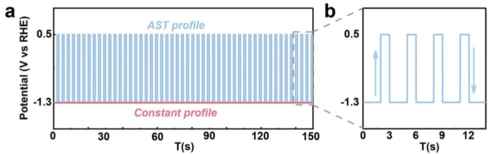

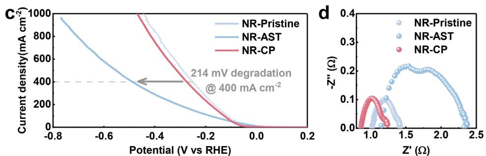

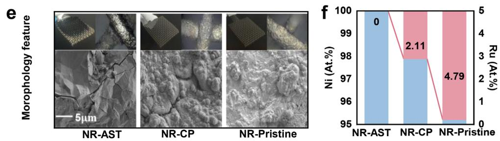
FIGURE 2 | Applied input profile and electrode degradation. (a,b) Applied potential profile including the AST of regular $-20\%$ reverse cycle (cycling ranging from $-1.3\mathrm{V}$ vs RHE to $0.5\mathrm{V}$ vs RHE for 60 000 cycles) and constant durability test of regular condition (at $-1.3\mathrm{V}$ vs RHE for $50\mathrm{h}$ ). (c) Measured LSV curves of pristine NR electrode, NR electrode after AST and after constant test, (d) EIS plots (e) the morphology images of pristine NR electrode, NR electrode after AST and after constant test. (f) The atomic percentage acquired from EDS.

a three-electrode cell (cell A). During the AST, electrochemical measurements including electrochemical active area (ECSA) acquired from cyclic voltammograms (CV), linear sweep voltammetry (LSV) and electrochemical resistance spectroscopy (EIS) were carried out every 1000 cycles in another three-electrode cell. To quantify the electrode performance change, overpotentials at various current densities $(\eta_{100},\eta_{400},\eta_{800})$ were obtained from LSV, among which the time-dependent increase of $\eta_{400}$ was defined as the degradation rate $(\mathrm{mV}\mathrm{h}^{-1})$ . Specific electrochemical results are demonstrated in next paragraph.

Figure 2c and Figure S9 displays the LSV comparison of the pristine NR, NR after AST (NR-AST) and NR after CP (NR-CP), in which a $214\mathrm{-mV}$ increase of $\eta_{400}$ for NR-AST $(488~\mathrm{mV})$ compared to that of NR-CP $(274~\mathrm{mV})$ were acquired. Over 10-time of increased degradation rate of NR-AST $(4.756\mathrm{mV}\mathrm{h}^{-1})$ to that of NR-CP $(0.473\mathrm{mV}\mathrm{h}^{-1})$ indicates that the AST condition accelerated the degradation. To reveal the causes from the aspect of electrochemical property, EIS results are shown in Figure 2d, from which the charge transfer resistance and ohm resistance were fitted. $\mathbb{R}_{\mathrm{ct}}$ and $\mathbb{R}_{\Omega}$ of NR-AST are 2.02 and $1.15\Omega$ respectively, much higher than that of NR-CP $(0.51\Omega \mathrm{R}_{\mathrm{ct}}$ and $0.87\Omega$ for $\mathbb{R}_{\Omega}$ ), which may be resulted from the deterioration of NR interface or structure. For further assessing the surface and structural degradation, scanning electron microscope (SEM) and Energy

Dispersive X-ray Spectroscopy (EDS) were conducted. As shown in Figure 2e and Figure S10, NR-AST were featured by severe Ru-layer depletion and Ni substrate exposure. Figure 2f and Figures S11 and S12 demonstrated a decreased Ru atomic percentage from 4.79 to 0 at.% which verified the total detachment of Ru as well. At the same time, apparent cracks of NR-AST were observed in Figure 2e and Figure S17, which suggested the damage of Ni substrate.

# 2.2 | Electrochemical Behavior and Morphology Evolutions

To gain more deep insight into the degradation dynamics of NR-AST, evolution of the overpotentials, ECSA, $\mathrm{R}_{\mathrm{ct}}$ and $\mathbb{R}_{\Omega}$ were plotted and shown in Figure 3a,b. The $\eta_{400}$ increased rapidly at a rate of $102.8\mathrm{mVh^{-1}}$ during the initial 2000 cycles (250 to $422\mathrm{mV})$ followed by a much slower increase of $1.4\mathrm{mVh^{-1}}$ from 2000 to 60 000 cycles (422 to $488\mathrm{mV})$ . At the same time, the ECSA increased from 0 to 20 000 cycles (0.52 to 0.72) then declined from 20 000- to 60 000 cycles (0.72 to 0.53). Given the distinctly different trends with 2000- and 20 000-cycle as transition nodes, the degradation process was divided into three stages for detailed analysis: 0-2000 (Stage 1), 2000-20 000 (Stage 2) and

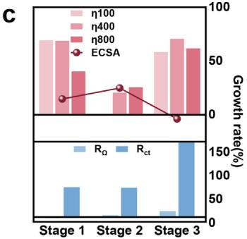

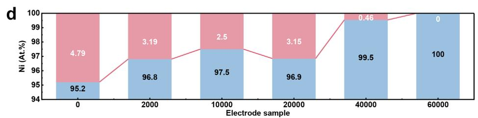

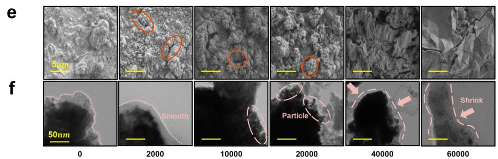
FIGURE 3 | Performance changes and morphology features in different degradation stage. (a) The overpotential curves at 100, 400, and $800\mathrm{mA}$ $\mathrm{cm}^{-2}$ and ECSA curve. (b) The charge transport resistance curve and ohm resistance curve. (c) The degradation rate of overpotentials, ECSA, charge transport resistance and ohm resistance compared with the pristine state. (d) The atomic percentage of surface acquired from EDS. (e) The SEM images of electrode surface at different stages. (f) The TEM images of Ru particles at different stages.

20 000-60 000 (Stage 3) cycles (Figure 3a,b; Figures S13-S16, Table S4).

In stage 1 $\eta_{400}$ was increased from 250 to $422\mathrm{mV}$ , indicating the initial reduction of catalytic activity. At the same time ECSA was increased from 0.54 to 0.64, suggesting the probable morphology changes. $\mathbf{R}_{\mathrm{ct}}$ was increased simultaneously from 0.48 to 0.79 $\Omega$ , which is correlated to the surface deterioration. By contrast, in stage 2 $\eta_{400}$ was reduced from $422\mathrm{mV}$ to 337, meaning the activity recovery behavior. Meanwhile the ECSA and $\mathbf{R}_{\mathrm{ct}}$ were risen from 0.64 to 0.72 and from 0.79 to $0.97\Omega$ , respectively, meaning that similar morphology features changed accompanied by continuous surface deterioration in stage 2. However, $\eta_{400}$ was found to rebound to $488\mathrm{mV}$ in stage 3, namely the decrease of catalytic activity. Meanwhile the ECSA was decreased to 0.53 and Rct was risen to $2.01\Omega$ , which demonstrated that converse morphology change occurred with the further surface degradation.

Figure 3d-f and Figure S10 presented the morphology and elemental distribution evolution of the degradation process acquired by EDS, SEM and TEM. In stage 1, dense and small-particle Ru layer were observed to transformed into cracked and larger-particle layer, along with the reduction of Ru atomic percentage from 4.79 to 3.19 at.% Based on the previous investigation on

Ru-based catalyst [35-37], Ru-species loss had been validated to reduce the catalytic activity, which implies that decreased Ru in stage 1 was responsible for the increase of $\eta$ and $\mathrm{R_{ct}}$ . In addition, the morphology changes during the Ru loss were inferred to result in the increased ECSA. In stage 2, notable sophisticated structures and defects were observed, along with outer smaller-scale Ru particle in TEM images. We conclude that the newly formed particles caused the increased ECSA. At the same time, Ru atomic percentage was found to recover back to 3.15 at.% meaning the probable Ru redeposition during stage 2, which was deduced to result in the decreased $\eta$ . Stage 3 is featured by the gradual depletion of the structures formed in stage 2 and total exposure of Ni substrate, explaining the increased $\eta$ and $\mathrm{R_{ct}}$ . The outer small-particles were no longer visible and size of the core particle were observed to shrink. Ru atomic percentage was declined to 0 at.% eventually, confirming the Ru depletion, which could be the cause of ECSA decline.

# 2.3 | Solution and Interface Evolutions

To further ascertain the above dynamic process, evolutions of solution and electrode interface were characterized. Compositional evolution acquired by Inductively Coupled Plasma Optical Emission Spectrometry/Mass Spectrometry (ICP-MS) of

a

b

C

d

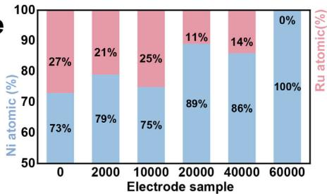
e

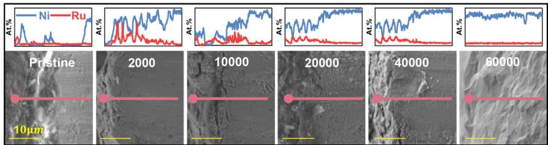
f
FIGURE 4 | Metal ion concentration in testing solution, elemental composition and electrode cross-section elemental distribution in different degradation stages. (a) Recorded appearance images and corresponding elemental concentration in working solution at different stages acquired from MS-ICP. Curve-fitted XPS results of (b) Ni 2p and (c) Ru 3p in precipitates for 10 000-, 20 000-, and 60 000-cycle sample. (d) The atomic percentage of precipitates at different stages acquired from XPS. (e) The atomic percentage within $5\mu \mathrm{m}$ of the electrode surface acquired from EDS. (f) The cross-section EDS results at different stages.

electrolyte solution in cell A were conducted along with the appearance records. X-ray photoelectron spectroscopy (XPS) was employed for detection of the precipitates composition, and the spectroscopy results were normalized to eliminate the impact of C peak signal $(284.8\mathrm{eV})$ . More than that, to assist in understanding the interface evolution, elemental distributions in the depth direction of NR-AST were attained by cross-sections SEM and EDS line scan. At the same time the cumulative atomic percentages within $5\mu \mathrm{m}$ starting from the outer layer were acquired from the EDS results.

Figure 4a-d and Figure S18 displays the evolution of the electrolyte solution and XPS results of precipitates. Regarding the evolution of solution appearance, change from colorless to orange was observed in stage 1, consistent with the phenomenon from Holmin et al. [15]. From the ICP-MS result, Ru concentration were found to rise from 0 to $0.60\mathrm{mg / L}$ (Table S5), which had been validated to be the formation of Ru species with higher

oxidation states $(\mathrm{Ru}^{7+}, \mathrm{Ru}^{8+}$ etc.) [38]. It is worth noting that the Ni concentration was found to rises from 0 to $0.40 \, \mathrm{mg/L}$ , indicating the probable dissolution of Ni substrate in stage 1. Stage 2 witnessed the disappearance of orange to light green then back to colorless, with the presence of dark precipitates at the cell bottom. Concentration of Ru and Ni was increased to 0.25 and $0.43 \, \mathrm{mg/L}$ , respectively. Previous research had verified the transition to green to be the gradual presence of Ni with high oxidation state by Ultraviolet-visible spectroscopy (UV-vis) [39]. Regarding the XPS result, the precipitates were inspected to be the mixture of metal Ni (853.8 and $854.9 \, \mathrm{eV}$ ) and RuO2 (462.5 eV), meaning the deposition of free Ni and Ru in stage 2. Thus, we inferred that the sophisticated structures in stage 2 mentioned in the last section were resulted from the deposition of Ni and Ru as well. In stage 3, no apparent color change of the electrolyte solution was found. Concentration of Ni and Ru were decreased from 0.43 to $0.07 \, \mathrm{mg/L}$ and from $0.25 \, \mathrm{mg/L}$ to 0, respectively. Meanwhile, increased precipitates in the cell bottom

were observed, along with the XPS intensity rises of the Ni and $\mathrm{RuO_2}$ peaks from 20 000- to 60 000-cycle. Therefore, formation of Ni and $\mathrm{RuO_2}$ precipitate was responsible for the concentration decrease of Ni and Ru. Additionally, considering the elemental proportion in Figure 4d, the ratio of Ni to Ru was decreased from 1.1 to 0.85, meaning the greater share of the Ru deposition process. As a result, we concluded that the dissolution of Ru was the main degradation process in stage 3, accompanied by the deposition of the Ni and Ru ions.

Figure 4e,f demonstrates the results of cross-section images and atomic percentages. In stage 1, disappearance of Ru signal at the outmost layer was observed in line scan results. According to the elemental share result in Figure 4e, the Ru atomic percentage was decreased from 27 to 21 at.% at the out-layer, which has been attributed to the Ru electrochemical dissolution. In stage 2, multilayer alternations of Ni and Ru signals were observed accompanied by outward shifting of the Ni signals, which confirmed the co-deposition process of Ni and Ru in stage 2. In stage 3, no evident Ru signal was detected, with the cross-section turning sleek. With the Ru atomic percentage declining from 27 to 0 at.% the Ru-species was confirmed to be totally consumed. Therefore, based on the analysis above, the three-stage process of the NR electrode during AST can be summarized as: (i) dissolution of surface Ru; (ii) dissolution of Ni substrate and deposition of free Ru and Ni; (iii) dissolution of Ru and deposition of free Ru and Ni. The detailed evolution mechanisms in each stage will be discussed in the next section.

# 2.4 | Degradation Mechanism and Pathway Analysis

To ascertain the stage-evolution mechanisms from thermodynamic state of Ni and Ru in each stage, Pourbaix diagrams were referred. Converting the reference hydrogen potential (RHE) in AST into standard hydrogen electrode (SHE) utilized in Pourbaix diagrams based on Nernst equation, AST-potential of $-0.37\mathrm{V}$ vs SHE and $1.43\mathrm{V}$ vs SHE was acquired.

$$
E (\mathrm {S H E}) = E (\mathrm {R H E}) + 0. 0 5 9 1 \times \mathrm {p H} + 0. 0 9 8 \mathrm {V}, p H = 1 4 \tag {1}
$$

According to the diagram in Figure 5a, Ru-species were supposed to be the mixture of metal Ru and $\mathrm{RuO_2}$ at $-0.37\mathrm{V}$ vs SHE and electrochemical dissolved into $\mathrm{HRuO}_5^-$ at $1.43\mathrm{V}$ vs SHE, validating the dynamic process of Ru dissolution and deposition. Therefore, we concluded that the main behavior in stage 1 was the dynamic cycling of 2-s Ru dissolution and 1-s redeposition in a single cycle, leading to the general trend of Ru-species loss. As for the Ni dissolution, Kim et al. had reported that maintaining the cathodic potential below $1.5\mathrm{V}$ vs SHE can effectively keep the Ni from oxidation, which was not conforming to the Ni dissolution under $1.43\mathrm{V}$ vs SHE in this work, illustrating the existence of extra driven force to motivate the Ni dissolution in NR electrode [29, 40].

Yet, a Ni galvanic corrosion origin from the galvanic coupling mechanism had been reported by Liu et al. [42]. The galvanic corrosion was validated to result from the coexistence of Ni and other metal with higher oxidation potential, during which Ni worked as the anode in the galvanic couple and was oxidated

[43-45]. Taking the case as a reference, according to the standard electrode potential acquired from database, the Ru deposition potential of $0.455\mathrm{V}$ vs. SHE and Ni dissolution potential of $-0.257\mathrm{V}$ vs. SHE fulfilled the condition of galvanic couple, which might result in mutual promotion of Ni dissolution and Ru deposition [15, 35, 46]. Thus, we hypothesized that the galvanic couple of Ni/Ru in KOH could be responsible for the Ni corrosion and Ru deposition. To confirm the rationality, a three-phase galvanic simulation model composed of Ni/Ru/KOH was constructed in COMSOL (Figure S29). Setting the electrode potential at $1.43\mathrm{V}$ vs SHE, a 0-800 s simulation comparison result was obtained. As is shown in Figure 5b, the electrolyte potential adjacent to Ni (1.15 V vs SHE) was found to be high than that of Ru side (1.13 V vs SHE), making the Ni work as the galvanic anode and be oxidized. Compared with the initial state, apparent Ni loss was observed. Therefore, we concluded that the corrosion of Ni substrate was induced by the Ru/Ni co-exposure to electrolyte after stage 1 (Figure S20). Since the galvanic reaction rate was proportional to the concentration of reactant, the Ni corrosion was supposed to be promoted by the high concentration of free Ru. Yet the finite content of free Ru after stage 2 did not remain high enough to support the continuous happening of the galvanic coupling corrosion, which led to the subsequent process transition from the Ni corrosion to Ru dissolution.

Figure 5c presents the scheme of the degradation pathway in stages based on the above analysis. In the initial stage, dense Ru pre-deposited on the Ni mesh was dissolved into solution under excessive reverse potential, which led to the exposure of underlying Ni substrate and bulk $\mathrm{HRuO}_5^-$ lost in the solution. (Figures S17 and S19) The above results formed the condition of stage 2, during which the exposed Ni and the comprised the galvanic couple, leading to the simultaneous occurrence of Ni corrosion and Ru deposition. (Figure S20) In stage 2 Ni was corroded into $\mathrm{Ni}^{2+}$ and $\mathrm{HRuO}_5^-$ was redeposited, part of which was deposited back to the electrode surface, thereby sophisticated structures were formed. After a period of cycling, for the high content of $\mathrm{HRuO}_5^-$ were consumed by the Ni corrosion, the galvanic reaction was no longer supported, and the Ru-species continued to be dissolved. As a result, the sophisticated structures formed from galvanic reaction were re-dissolved into solution in stage 3, then reduced into precipitates under the regular potential, which occurred until the Ru layer on surface was totally consumed, leaving the corroded Ni substrate exposed distinctly.

# 2.5 | Sensitivity on the RC Amplitude

Aiming to further reveal the degradation-trigger mechanism of RC, sensitivity of NR electrode to the RC amplitude was investigated in the three-electrode system. By setting the RC amplitude fraction $(-20\%, -10\%, 0\%)$ the reverse potential $(1.43\mathrm{V}$ vs SHE, $0.43\mathrm{V}$ vs SHE, $-0.04\mathrm{V}$ vs SHE) in the AST protocol was adjusted, after which the post measured electrochemical results of the three-electrode AST were conducted (Figure 6a-c; Figures S21-S25).

Figure 6a-c displayed the LSV, EIS and ECSA results of the samples. $\eta_{400}$ of the $0\%$ -AST (NR-AST-0) $(211~\mathrm{mV})$ and $10\%$ -AST sample (NR-AST-10) $(253~\mathrm{mV})$ were attained. Increases of NR-AST-0 and NR-AST-10 respectively were 39 and $2\mathrm{mV}$

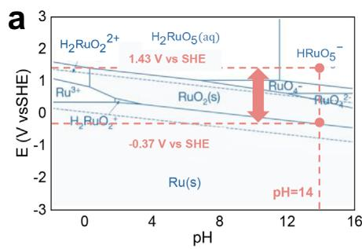

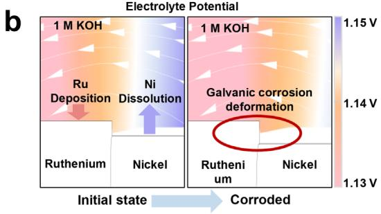

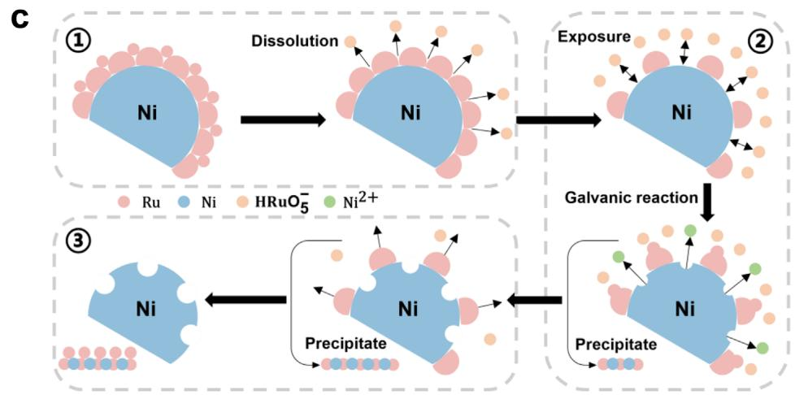
FIGURE 5 | Degradation mechanism illustrated by scheme and simulation results. (a) Pourbaix diagram of Ru [41]. Copyright 2020 Z Wang et al. (b) Simulated galvanic corrosion result at initial state and after a period of 800s. (c) Scheme diagram of the degradation process under AST.

compared with pristine NR, much lower than the $238\mathrm{mV}$ of $20\%$ -AST sample (NR-AST-20) (Table 1). Thus, declining the reverse potential effectively mitigates the catalytic activity reduction. Based on the EIS result, apparently smaller impedance arcs and horizontal axis intercepts were found, namely less $\mathbb{R}_{\mathrm{ct}}$ and $\mathbb{R}_{\Omega}$ of NR-AST-0 and NR-AST-10 compared with that of NR-AST20, which suggests that less surface deterioration occurred. At the same time, the apparent slope increase compared with that of NR-AST-20 in Figure 6c indicates that distinct morphology changes occurred under different ASTs. Moreover, corresponding current-controlled AST and EIS were conducted in an alkaline electrolysis system as well, along with the LSV conducted in three-electrode cell at begin of test (BoT) to end of test (EoT), respectively. As is shown in Figure S32a, full-cell voltage was risen significantly from BoT to $20\%$ EoT (from 1.62 to $1.71\mathrm{V}$ ). Identical changing trends of the LSV and EIS in Figure S32b,c were found to be consistent with the above three-electrode test results in Figures 6a,b, which further confirmed the mitigation effect of declining RC fraction.

To ascertain the mitigation mechanism, SEM images and EDS results were presented in Figure 6e,f. Only a few cracks of NR-AST-0 and NR-AST-10 were observed, meaning less corrosion occurred. We inferred that it is the formation of cracks that released more active sites, which led to the ECSA increase. More than that, considering the EDS result, 2.79 at.% and 0.23 at.% of Ru was observed, which further confirmed the higher surface preservation of lower-amplitude AST. Yet according to the Pourbaix diagram, the electrochemical transition from solid Ru

or $\mathrm{RuO}_2$ to ions occurs only under $1.43\mathrm{V}$ vs SHE (NR-AST-20), at the same time no color changes were observed during the $0\%$ -AST and $10\%$ -AST, indicating that no irreversible oxidation occurred. To prove the oxidation behavior, XPS were conducted to the electrodes. As is shown in Figure 6d, apparent peak of the Ru 3p at $462.5\mathrm{eV}$ was found of NR-AST-20 compared with the pristine NR, which had been confirmed to be related to the formation of $\mathrm{RuO}_2$ . While no visible changes were observed to the NR-AST-0 and NR-AST-10, meaning that oxidation was not the cause of the surface changes. Referring to a metal surface damage resulting from bubble cavitation and tip-oxidation reported by Lampke et al. and Mo et al. [46, 47]. (Figures S27 and S28), it can be deduced that the Ru loss under $0\%$ and $10\%$ AST can be attributed to bubbles cavitation and stress corrosion during electrolysis, which is inevitable. Furthermore, we concluded that NR-AST-0 suffered from the cavitation by least bubbles, explaining the largest Ru layer preservation (2.79 at.%). For validation, the extended $0\%$ AST was conducted. As shown in Figure S26 and Table 1, only after 200 000 cycles did the $\eta_{400}$ rise to $293\mathrm{mV}$ . The degradation rate was calculated to be $0.257\mathrm{mV}\mathrm{h}^{-1}$ , much lower than $4.756\mathrm{mV}\mathrm{h}^{-1}$ of NR-AST-20, which illustrates the lifetime extension effect of $0\%$ -AST to NR. The result demonstrates that under different RC conditions the NR exhibits various degradation behavior, thereby affecting the electrode lifetime. The above investigations provide with mechanistic idea on the design of RC-tolerant electrode in furtural RE-AWE development. More than that, from the aspect of electrolysis system, through voltage-limitation operation the RC is largely suppressed, which could be considered as an essential mitigation strategy.

a

d

e

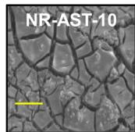

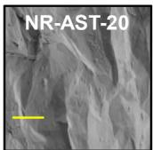

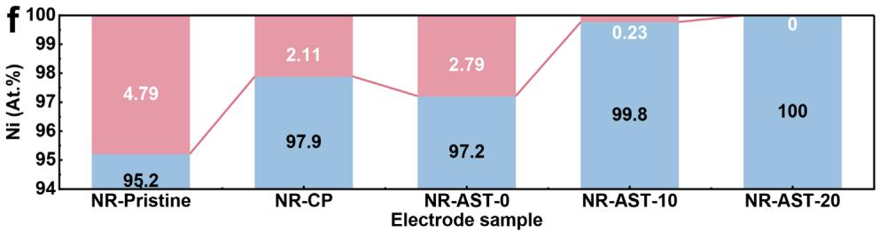
FIGURE 6 | Performance and morphology changes under different AST profiles. (a) Measured LSV curves of pristine NR electrode, NR electrode after AST of different reverse voltage and after constant test. (b) Measured EIS and (c) measure ECSA. (d) The XPS comparison of Ru 3p of the pristine sample and AST samples. (e) The SEM images of electrode surface after different tests. (f) The atomic percentage of surface under different test conditions acquired from EDS.

TABLE 1 | Overpotential and degradation rate of tested samples.

<table><tr><td rowspan="2">Sample</td><td colspan="3">Overpotential @Current density/mV</td><td rowspan="2">Degradation rate /mV.h-1@400 mA cm-2</td></tr><tr><td>100 mA cm-2</td><td>400 mA cm-2</td><td>800 mA cm-2</td></tr><tr><td>Pristine</td><td>114.32</td><td>250.33</td><td>383.54</td><td>/</td></tr><tr><td>Constant 50ha)</td><td>126.64</td><td>273.97</td><td>414.86</td><td>0.473</td></tr><tr><td>NR-AST-20 60 000 cycles</td><td>181.27</td><td>488.10</td><td>704.38</td><td>4.756</td></tr><tr><td>NR-AST-10 60 000 cycles</td><td>111.85</td><td>253.57</td><td>394.86</td><td>0.0648</td></tr><tr><td>NR-AST-0 60 000 cycles</td><td>102.41</td><td>211.05</td><td>335.50</td><td>-0.7856</td></tr><tr><td>NR-AST-0 100 000 cycles</td><td>137.89</td><td>273.42</td><td>382.63</td><td>0.2771</td></tr><tr><td>NR-AST-0 200 000 cycles</td><td>143.18</td><td>293.16</td><td>434.85</td><td>0.2570</td></tr></table>

a) $50\mathrm{h}$ is equal to the test time of 60 000 cycles in AST.

# 3 | Conclusions

We introduced a two-step "RC-like" AST protocol to simulate the regular-reverse cycling input. Through the combination

of time-resolved electrochemical measurements, morphological and compositional analysis, the whole degradation behavior of NR was demonstrated and elucidated. Initially, under the excess reverse potential, dissolution of surface Ru occurred, leading

to the formation of surface defects and free Ru ions in the electrolyte. Subsequently, promoted by the above defects and free ions, Ni substrate was exposed and corroded under the Ni-Ru-electrolyte coupled galvanic reaction. Eventually, suffered from the alternation of the above dissolving and galvanic reaction, Ru layer was totally depleted and the Ni substrate was severely damaged. In addition, aiming to ascertain the trigger of the cascade degradation and attain corresponding mitigation idea, sensitivity of NR to the RC amplitude was investigated. Reducing the RC fraction from $20\%$ to $0\%$ , degradation rate was significantly suppressed from 4.756 to $0.257\mathrm{mV}\mathrm{h}^{-1}$ . We deduced that it is the inhibition of initial Ru dissolution that kept NR from subsequent corrosion. The above results demonstrate the variation of RC-induced degradation behavior for Ni-X electrodes under different RC conditions. Through the investigations we contribute mechanistic insight on the RC-induced degradation and provide with reference toward the futilal RC-tolerant electrode design utilized in RE-AWE.

# 4 | Experimental

# 4.1 | Electrode Preparation

The Ni mesh with in situ deposited Ru (JP New Energy, AZ-46/19, Table S1 and Table S2) was selected as the studied object to investigate the electrode degradation during long-time regular-reverse potential cycles. The pristine NR electrode obtained by electrodeposition show an inhomogeneous profile of Ru uniformly distributed in the outer layer of Ni (Figure S2). The sample demonstrated good reproducibility in terms of electrochemical properties. (Figure S1) Basic stability was tested under RC of $100\mathrm{mAcm}^{-2}$ for 100 s (Figure S3). The Ru showed distinct unstable property and free ions presented as orange ruthenate shown in Figure S3, which was transformed into ruthenate hydroxide subsequently based on Pourbaix diagram in Figure 5b.

# 4.2 | AST Setup and Electrochemical Measurement

The AST was designed based on the alternation of regular and reverse operation. $100\mathrm{mAcm}^{-2}$ was chosen as the regular condition while the $-20\%$ of the regular value namely $-20\mathrm{mA}$ $\mathrm{cm}^{-2}$ was set as the reverse condition. To facility the mechanism study in this work, potential-controlled AST were employed in the three-electrode test due to stronger redox-correlation compared with current-controlled AST. The potential cycling from 100 and $-20\mathrm{mAcm}^{-2}$ was measured to be $-1.3\mathrm{V}$ vs RHE and $0.5\mathrm{V}$ vs RHE, respectively (Figure S4; Figure 2a,b). In the contrast, to meet the practical RC operation in the two-electrode system, current-controlled AST was utilized in the alkaline electrolyzer experiment.

As for the duration time of each stage, considering that the response time of RC is usually within hundred milliseconds, to maximize the impact density of RC and shorten the test duration, 1 and 2s were set as the single-step length of RC step and regular step, respectively. Specific selecting principle of parameters are demonstrated in Figures S30 and S31, Tables S8 and S9 and Parameter selection of AST.

A glass three-electrode electrochemical cell containing 1 M KOH system using the NR electrode as working electrode (Figure S3) was employed, while a $2^{*}2$ mm platinum plate as the counter electrode and a $\mathrm{Hg / HgO}$ reference electrode.

During the AST process, electrochemical measurements comprising cyclic voltammograms (CV), linear sweep voltammetry (LSV) and electrochemical resistance spectroscopy (EIS) were performed every 1000 cycles. (CorrTest CS310M) Prior to each measurement, the electrode was activated by performing CVs until a stable voltammogram was obtained. The double-layer capacitance was determined by conducting CV measurements at 5 different scan rates (20 to $100\mathrm{mVs^{-1}}$ ) within the non-Faradaic region $(-0.7$ to $-0.8\mathrm{V}$ vs. RHE), thereby the electrochemical active surface area (ECSA) was calculated based on the ratio of the double-layer capacitance to the theoretical specific double-layer capacitance $(40~\mu \mathrm{F} / \mathrm{cm}^2)$ . The LSVs were conducted from $-0.7$ to $-2.7\mathrm{V}$ with the scan rate of $5\mathrm{mVs^{-1}}$ (Figure S6). EIS measurements were conducted at $-1.2\mathrm{V}$ (vs. RHE) with an amplitude of $10\mathrm{mV}$ and frequencies ranging from 100 000 to $0.1\mathrm{Hz}$ .

The above measured potential values were converted to the reversible hydrogen electrode (RHE) scale. Calculation of Rct and $\mathbf{R}_{\Omega}$ were fitted from the equivalent circuit model (ECM) shown in Figure S5. $\mathbf{R}_{\Omega}$ drop compensation was performed based on the measured $\mathbf{R}_{\Omega}$ resistance from electrochemical resistance spectroscopy (EIS), calculated using Equation:

$$
V (\text {v s . R H E}) = V _ {\text {m e a s u r e d}} + 0. 9 2 6 8 - 0. 8 5 \times i _ {\text {m e a s u r e d}} \times R \tag {2}
$$

# 4.3 | Configuration of the Electrolyzer Validation Experiment

A zero-gap single-cell (Active area: $1\mathrm{cm}^2$ ) consisting of the current collectors, Ni-plated polar plates with serpentine flow-channel, electrodes and a commercial Agfa-500 diaphragm (Thickness: $500~{\mu\mathrm{m}}$ ), was assembled and fastened by six torque-set bolts (Torque: $30\mathrm{Nm}^{*}6$ ), where the Ni mesh (Mesh count: 46, Wire diameter: $0.1\mathrm{mm}$ ) and the studied NR electrode were used as anode and cathode, respectively. An NGI36100 programmable DC power supply was used to conduct the current-controlled AST $(-100\mathrm{mA}$ for $2\mathrm{s}$ and $20\mathrm{mA}$ for $1\mathrm{s}$ ) for 60 000 cycles. Voltage curve was measured at $80^{\circ}\mathrm{C}$ , with $7\mathrm{M}$ KOH solution circulating in the alkaline electrolysis system at $15\mathrm{mL / min}$ . Full-cell EIS were employed before and after the AST (Frequency: $100~000 - 0.1~\mathrm{Hz}$ , Potential: open circuit potential, Amplitude: $10\mathrm{mV}$ ). The LSV of the studied NR were measured in the three-electrode cell with $1\mathrm{M}$ KOH solution before and after the test.

# 4.4 | Physical Characterization

The SEM images were acquired using a JSM-7900F instrument with an accelerating potential of $3\mathrm{kV}$ . Energy dispersive spectroscopy (EDS) was conducted with a Super X detector. The probed electrode samples of different stages were prepared by imposing AST for corresponding length. (Figure S5)

The tested solution was sampled for $10~\mu \mathrm{L}$ every 1000 cycles to ensure that the effect of sampling on the test solution is minimized, then diluted into $6\mathrm{mL}$ and kept in vials. (Figure S5) Solution samples at different stages were characterized for 3 times with Inductively Coupled Plasma Optical Emission Spectrometry/Mass Spectrometry (MS-ICP). Values in Figure 4a is the average of the three results. ICP-OES/MS measurement were acquired using Agilent 7850(MS) instrument.

XPS measurements were made with a Thermo Fisher ESCALAB 250Xi system, utilizing Al Kα radiation (hv = 1486.6 eV) as the excitation source. Binding energies for the high-resolution spectra were adjusted according the C 1s peak to 284.8 eV. The probed precipitate samples of different stages were prepared by imposing AST for corresponding length as well.

# 4.5 | Dynamic Dissolution/Deposition and Osterwalder Ripening

Considering the existence of reciprocating condition, the transient dynamic dissolution and deposition of Ru or RuO2 may affect the degradation result. To mitigate the effect, short-step AST (500 cycles as measurement step for 1500 cycles in total) is conducted to find out the minimum measurement step not influenced by the dynamic process. As is shown in Figure S8, the ECSA of the tested cathode underwent specific decreasing and then increasing trend, consistent with the difference of LSV curves. At the same time, the SEM comparison between pristine sample and 500-cycle sample (Figure S7) shows that the surface Ru particles are roughened and fresh deposited skeletonized Ru particles adhered on the larger particle, confirming the existence of dynamic dissolution-deposition process, namely the Osterwalder ripening [48, 49]. Therefore, setting the measure step for more than 500 cycles can effectively neglect the effect of transient dynamic process.

# Acknowledgements

The authors acknowledge the financial support from National Key R&D Program of China, Nos. 2022YFB4002303, National Natural Science Foundation of China, Grant Nos. 52241701 and 52307249, Science and technology projects of Shaanxi Province Grant Nos. 2024GX-ZDCYL-04-02 and 2024QCY-KXY-133, Fundamental Research Funds for the Central Universities at Tongji University.

# Conflicts of Interest

The authors declare no conflicts of interest.

# Data Availability Statement

The data that support the findings of this study are available from the corresponding author upon reasonable request.

# References
