# Strategies and Countermeasures Against Reverse Current for Enhanced Durability in Water Electrolysis Systems

Zhiyi Peng, Hongquan Zhang, Yuqi Zhang, Yinuo Zhao, Jianmei Chen,\* and Longlu Wang\*

Reverse current, a detrimental phenomenon arising during shutdown or fluctuating input from renewable energy sources in water electrolysis, poses a critical threat to the longevity and efficiency of green hydrogen production systems. This current flows in the opposite direction to the normal operational current, instigating severe degradation of electrode materials, particularly at the cathode, and thereby diminishing hydrogen generation rates. Herein, the underlying electrochemical mechanisms of reverse current are comprehensively elucidated and critically assess its influence on electrode integrity and overall electrolyzer performance. Furthermore, state-of-the-art mitigation strategies are being explored and analyzed to counteract this damage, encompassing innovations from materials-level approaches (e.g., electrode modification via dopants and protective coatings) to system-level external regulation and control. This review bridges fundamental insights with practical engineering strategies (e.g., multifunctional dynamic protective layers and in situ and operando techniques) to guide the designs of electrolyzer to reduce damage from reverse current.

# 1. Introduction

Hydrogen, a clean and sustainable energy carrier, is pivotal for replacing fossil fuels.[1-6] Water electrolysis, particularly when powered by renewable sources, offers a promising pathway for green hydrogen production. However, the inherent intermittency of renewables can lead to voltage fluctuations and sudden power interruptions, potentially causing reverse current, a phenomenon in current flows opposite to normal electrolysis, posing significant risks to electrode stability. Understanding this risk is crucial for various electrolysis technologies, including alkaline (ALK) water electrolysis,[7-12] proton exchange membrane (PEM) electrolysis,[13-19] and anion exchange membrane (AEM) electrolysis.[20-27] This challenge necessitates a deeper

Z. Peng, H. Zhang, Y. Zhang, Y. Zhao, J. Chen, L. Wang
College of Electronic and Optical Engineering & College of Flexible
Electronics (Future Technology) & State Key Laboratory of Organic
Electronics and Information Displays
Nanjing University of Posts and Telecommunications (NJUPT)
Nanjing 210023, P. R. China
E-mail: chenjianmei@njupt.edu.cn; wanglonglu@njupt.edu.cn

The ORCID identification number(s) for the author(s) of this article can be found under https://doi.org/10.1002/smtd.202501816

DOI: 10.1002/smtd.202501816

exploration into how these fundamental electrolysis technologies operate and interact with the variable nature of renewable energy.

As a primary method for hydrogen production, water splitting is adaptable to electricity, sunlight, and other energy sources further solidifying water electrolysis as a cornerstone of clean hydrogen generation.[28-33] This process involves oxygen formation at the anode and hydrogen at the cathode. When coupled with renewables, it provides an efficient route toward a low-carbon future. Yet, the full potential of these technologies, including ALK, PEM, and AEM, is challenged by the intrinsic intermittency and unpredictability of renewable energy, stemming from seasonal, diurnal, and weather-related variations. Such fluctuations cause frequent voltage swings, intermittent system operation,

and sudden power interruptions. Under these unstable conditions, mismatches in electrode potential and delayed current responses can generate a reverse potential. Once a closed circuit forms, the hazardous reverse current may arise, particularly impacting certain electrolyzer types. AEM electrolyzers are significantly prone to severe reverse current due to their larger electrolyte volume and slower dynamics. PEM electrolyzers are also highly susceptible because of their low internal resistance and fast response. This backward flow of current poses substantial threats to electrode durability and system reliability. Therefore, a comprehensive understanding and effective mitigation of reverse current are paramount for ensuring the long-term viability of renewable-driven water electrolysis systems.

This review systematically introduces the concept of reverse current in water electrolysis systems, with a particular focus on its origins, mechanisms, and the detrimental effects it poses on system stability and electrode integrity. The sources of reverse current—such as intermittent renewable energy input, voltage imbalance in multi-stack configurations, and power control failures—are analyzed in detail. Reverse current can cause significant degradation to electrode materials: non-noble metal catalysts[34-41] (e.g., Ni, Fe, Co) may undergo rapid oxidative dissolution when exposed to unintended anodic potentials, while catalyst layers may delaminate or lose conductivity. Ion exchange membranes are also prone to degradation under such stress. Furthermore, the review highlights current strategies for mitigating

reverse current, including the optimization of electrode materials to enhance resistance to reverse bias, the regulation of external operating environments (e.g., temperature, electrolyte composition), and the implementation of system-level protection measures such as polarization rectifiers and intelligent control circuits. These mitigation approaches are discussed with an emphasis on their effectiveness, technical feasibility, and potential for integration into scalable hydrogen production systems.

# 2. Background of Reverse Current

Reverse current is a widespread phenomenon in electrochemical systems, particularly in applications involving intermittent power sources, such as renewable energy-driven electrolysis or frequent startup/shutdown cycles. Its occurrence is often overlooked, yet it poses a significant threat to the stability and longevity of electrode materials. The mechanism behind reverse current generation typically involves a sudden interruption or fluctuation in the external power supply. When this happens, imbalances in electrode potential or charge redistribution may cause the direction of current to reverse.[42-45] Specifically, if the cathode maintains a higher potential than the anode after a power failure, electrons can flow backward through the closed circuit. This reverse electron flow leads to unintended electrochemical reactions, such as oxidation of the cathode or reduction at the anode, accelerating material degradation. The problem is significantly exacerbated in large-scale industrial stacks, where the sheer number of cells connected in series and parallel can lead to substantially higher and more complex reverse currents. This increased scale not only amplifies the potential for electrode degradation but also magnifies the challenge of implementing effective mitigation strategies. While solutions such as polarization rectifiers and cathodic protection systems are available, they often introduce considerable costs and complexity to the overall system. Polarization rectifiers serve as backup power to block reverse current but require extra hardware and complex controls. Similarly, cathodic protection uses sacrificial anodes to shield nickel cathodes, demanding specialized materials and regular anode replacement. Given these cost barriers, elucidating the fundamental mechanisms of reverse current becomes imperative to develop cost-effective alternatives. Therefore, while technically viable, the economic and operational burdens of these solutions can be a significant barrier to their widespread adoption in large-scale hydrogen production facilities.

However, despite its well-documented prevalence and detrimental impact on electrolyzers health, a granular understanding of the exact mechanisms that trigger reverse current generation is still lacking. The fundamental electrochemical pathways and the precise conditions at the electrode-electrolyte interface that initiate this damaging flow are not fully elucidated. Furthermore, the dynamic behavior of the reverse current, how it evolves in magnitude and character over the course of a shutdown period, remains poorly understood. Consequently, systematic studies dedicated specifically to this phenomenon are still surprisingly limited. Much of the current knowledge is based on basic observations or studies that are not comprehensive in scope, leaving a critical gap in the foundational research needed to develop truly effective, universally applicable mitigation strategies.

# 2.1. Origin of Reverse Current

Reverse current is primarily generated when the external power supply to an electrochemical system is suddenly interrupted or fluctuates, especially during conditions such as power outages, load variations, or renewable energy intermittency. In AEM systems, as Figure 1a depicts, in the normal process of electrolyzing water, electrons go to the cathode and are used to reduce water to produce hydrogen gas, and the redox species are accumulated in related electrodes. When input sudden shut down or fluctuates dramatically, voltage changes faster than current due to the capacitance of electrolyte, which breaks the accumulation process in electrolysis (Figure 1b). After accumulation, there are imbalance potentials between cathode and anode, and A closed loop forms, so electrons will move from cathode to anode, thus forming a current opposite to normal water electrolysis. Due to its direction, it is named as reverse current, as Figure 1c demonstrates. When the potential difference between the cathode and anode reaches equilibrium at zero, reverse current disappears, and a balance is achieved (Figure 1d).

The generation of local reverse currents in proton exchange membrane (PEM) fuel cells stems from localized imbalances in water and gas distribution. A primary trigger is membrane dehydration, particularly at the anode inlet, which is caused by electroosmotic drag. This dehydration impedes reactant transport and leads to local fuel starvation. In these starved regions, the cell can no longer sustain the standard hydrogen oxidation reaction; instead, parasitic reactions like water electrolysis and carbon corrosion are initiated, driven by the potential of the normally operating parts of the cell. This process results in a flow of electrons in the opposite direction, manifesting as a reverse current. A secondary mechanism involves the permeation of reactant gases through the membrane. This crossover of oxygen to the anode and hydrogen to the cathode creates an internal short-circuit condition, which drives parasitic reactions that also contribute to the flow of reverse current.

# 2.2. Influence of Reverse Current

Typically, water is oxidized at the anode to produce oxygen and reduced at the cathode to produce hydrogen during normal water electrolysis. However, when a reverse current occurs—such as during a power shutdown or power input fluctuation—the normal potential difference is disrupted, and the direction of current flow reverses. This drives undesirable electrochemical reactions, such as the oxidation of the cathode material or the reduction of oxygen at the anode. These processes alter the local chemical environment, including $\mathsf{pH}$ , ion concentration, and electrode surface states, which can deteriorate the electrocatalysts and decrease system efficiency. Over time, this leads to degradation of electrode performance, reduced gas purity, and in extreme cases, risks such as recombination of hydrogen and oxygen gases, which may pose explosion hazards.

# 2.2.1. Inducing the Cathode to be Oxidized

In industrial anion exchange membrane water electrolysis (AEMWE) systems, the development of cathode catalysts

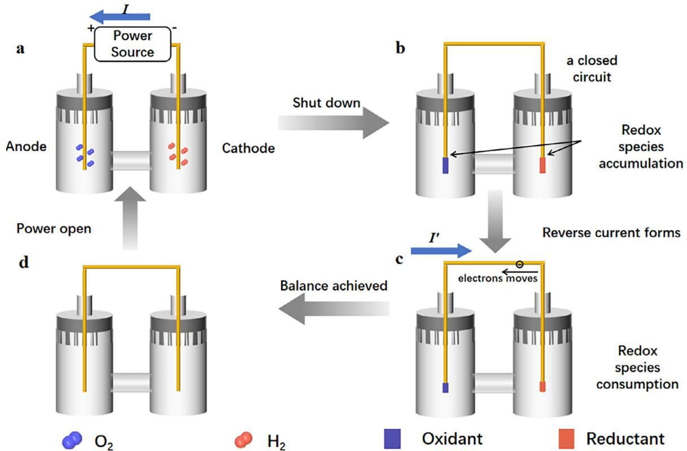
Figure 1. Scheme of emergence of reverse current in AEM systems. a) Water electrolysis. b) Shutting down or fluctuating input and redox species accumulation. c) Electrons move against the original direction with redox species consumption. d) Balance is achieved, and the reverse current disappears.

primarily focuses on non-precious metal materials to balance cost and performance. Among them, nickel-based materials such as Ni, Ni-Mo,[46-54] and Ni-Fe[55-58] have attracted significant attention due to their high catalytic activity for the hydrogen evolution reaction (HER), natural abundance, and good chemical stability in alkaline environments. These materials offer a promising alternative to precious metals like platinum. However, despite their advantages, nickel-based electrodes are highly susceptible to degradation under reverse current conditions, which can occur during intermittent operation or shutdown of the system. Reverse current can lead to the oxidation of the metallic Ni species, the dissolution of alloying elements, and the formation of passivating layers on the electrode surface, all of which severely impair the long-term performance and durability of the catalyst. Therefore, improving the resistance of Ni-based cathodes to reverse current is essential for ensuring the stability and commercial viability of AEMWE technologies.

Wang et al.[59] propose a plausible mechanism for the material degradation and transformation process occurring in nickel-based cathodes under the influence of reverse current, as illustrated in Figure 2a. When reverse current is applied, the metallic nickel at the cathode surface undergoes electrochemical oxidation, leading to the formation of nickel hydroxide $(\mathrm{Ni(OH)}_2)$ , which is characterized by a loose, layered, and fragmented morphology. This structural change is clearly evidenced by the scanning electron microscopy (SEM) image presented in Figure 2b, showing the surface of the nickel cathode after exposure to reverse current. Moreover, X-ray photoelectron spectroscopy (XPS) analysis in Figure 2c reveals a noticeable shift in the binding en

ergy of nickel species toward lower values, implying a reduction in the chemical stability of the electrode material. This shift indicates a transformation in the electronic environment of nickel atoms, making the electrode more susceptible to further degradation. Compared to pristine nickel, the appearance of a distinct nickel hydroxide peak—represented by the green line in Figure 2d—confirms that $\mathrm{Ni(OH)}_2$ is indeed generated as a direct consequence of reverse current exposure. In addition, extended reverse current testing uncovers the formation of higher oxidation state nickel compounds, such as nickel oxyhydroxide (NiOOH), which is known to further compromise the integrity and conductivity of the cathode material. The presence of NiOOH is corroborated by spectroscopic evidence shown in Figure 2e, emphasizing the progressive oxidation and deterioration mechanisms that nickel electrodes suffer under such adverse operating conditions.

Moving from the alkaline environment of an Anion Exchange Membrane (AEM) to the acidic conditions of Proton Exchange Membrane (PEM) electrolysis fundamentally alters the nature of the cathode's stability challenge. The focus of degradation shifts away from the oxidation of non-precious metals like nickel. Instead, the acidic PEM cathode, which relies on a platinum-carbon architecture, faces a distinct set of failure modes. These failures are particularly pronounced during reverse current events, which can occur during shutdown or intermittent operation. During such an event, the potential at the hydrogen evolution cathode can rise to a highly oxidative state, often exceeding $1.5\mathrm{V}$ vs the reversible hydrogen electrode. This high potential is sufficient to drive the electrochemical instability of the carbon support,

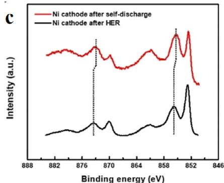

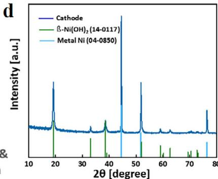

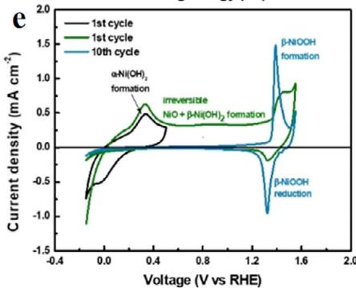
Figure 2. a) Scheme of reverse current to Ni cathodes. b) SEM image of nickel cathodes after reverse current. c) Ni 2p XPS analysis of Ni cathode after self-discharge. d) XRD image of Ni cathode after reverse current. e) Cyclic voltammograms of the Ni electrode, measured at a rate of $50\mathrm{mV}s^{-1}$ . [59] Copyright 2025, Wiley-VCH.

oxidizing it into carbon dioxide. This process, known as carbon corrosion, leads to the structural collapse of the catalyst layer, which in turn causes the detachment and agglomeration of the platinum catalyst particles that rely on the carbon for physical support and electrical connection. The resulting loss of electrical contact and active surface area leads to irreversible performance degradation and a significantly shortened lifespan for the electrolyzer.

Okonkwo et al.[60] provides a comprehensive summary of the degradation mechanisms affecting platinum (Pt) catalysts in PEMFCs, pinpointing platinum oxidation as a pivotal initiating mechanism for its electrochemical dissolution. The authors explain that under the high potential conditions common in fuel cell cathodes, especially during start-up/shut-down cycles, the metallic Pt surface is electrochemically oxidized to form a less stable layer of platinum oxides (PtO) or hydroxides. This surface oxide layer is more prone to dissolution into the electrolyte, leading to the formation of mobile $\mathrm{Pt^{2+}}$ ions. These dissolved ions then become the primary actors in subsequent degradation pathways, including Ostwald ripening, where they redeposit onto larger particles, causing agglomeration and a loss of active surface area, and migration into the proton exchange membrane. By systematically breaking down these interconnected processes, the paper underscores that mitigating platinum degradation fundamentally requires controlling or preventing this initial oxidation step to enhance the overall durability and commercial viability of PEMFC technology.

# 2.2.2. Triggering the Anode to be Reduced

In addition to the oxidation of the cathode material, the reverse current also induces partial reduction of the anode material, which significantly alters its chemical composition and electrochemical properties. Under reverse current conditions, oxidized species such as nickel oxyhydroxide (NiOOH) or cobalt oxides may be reduced back to their lower-valence states, such as $\mathrm{Ni(OH)}_2$ or even metallic Ni. This reverse transformation not only disrupts the stable redox balance of the anode but also leads to the loss of active catalytic phases, reduced oxygen evolution reaction (OER) efficiency, and deterioration of the electrode's structural integrity. Consequently, repeated exposure to reverse current can accelerate the deactivation and degradation of the anode, compromising the overall performance and lifespan of the electrolyzer system.

Wang et al.[59] reveal that under dynamic electrolysis conditions, such as repetitive switching on a shutting down (SU/SD) cycles, the anode material—primarily nickel-based—undergoes significant transformation. In particular, Ni surfaces are oxidized to form $\mathrm{Ni(OH)}_2$ and further to $\mathrm{NiOOH}$ during anodic polarization. These phases contribute to oxygen evolution reaction activity but also demonstrate varying levels of stability. Repeated electrochemical cycling leads to gradual structural reorganization, including the formation of $\beta\text{-Ni(OH)}_2$ , which is more stable but less active compared to $\gamma\text{-NiOOH}$ (Figure 3a). Furthermore, SEM image (Figure 3b) demonstrates needlepoint deposits and

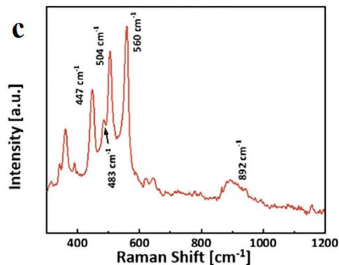

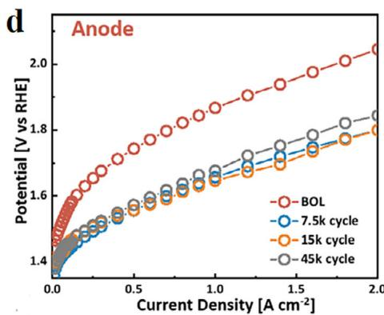

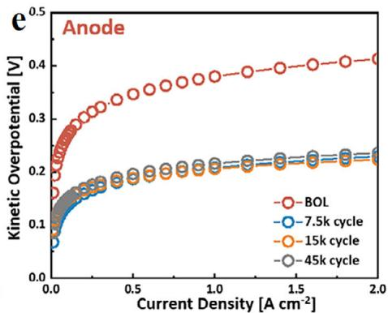
Figure 3. a) Mechanism of reverse current influence to the anode. b) SEM image of anode after $45\mathrm{k}$ rounds of switching on a shutting down cycles. c) Raman spectra Ni anode after $45\mathrm{k}$ cycles. d) Polarization curves of the anode after different rounds. e) Kinetic Overpotential of the anode after different rounds.[59] Copyright 2025, Wiley-VCH.

Raman shift also proving the formation of $\beta\text{-}\mathrm{Ni}(\mathrm{OH})_2$ , with peaks at 447 and $504~\mathrm{cm^{-1}}$ related to $\mathrm{Ni - OH}$ and $\mathrm{Ni - O}$ in $\mathrm{Ni(OH)_2}$ (Figure 3c). Electrochemical tests show under the same current density, the potential of the electrode drops and oxygen production performance decreases as a decrease in kinetic overpotential as well as polarization curves, as Figure 3d,e illustrated respectively.

While the degradation of anodes due to reverse current presents a significant challenge in alkaline electrolyzers, this phenomenon introduces a distinct and often more severe set of challenges in proton exchange membrane water electrolyzers (PEMWE). This difference stems from the inherent material asymmetry of the PEMWE system. The anode is specifically engineered with robust catalysts like iridium dioxide $\mathrm{(IrO_2)}$ [61-63] and titanium dioxide $\mathrm{(TiO_2)}$ ,[64-66] which is universally recognized for its unparalleled catalytic activity for the oxygen evolution reaction (OER) and exceptional stability in the harsh acidic and high-potential environment. However, despite its renowned stability under normal operation, this crucial anode material is itself highly susceptible to degradation under dynamic conditions, such as system start-up/shut-down or reverse current events. These transients can lead to the reduction of stable $\mathrm{IrO_2}$ species to metallic iridium, which subsequently dissolves during high-potential periods. Simultaneously, during a reverse current event, the cathode, typically composed of platinum on a carbon support, is subjected to these same oxidative conditions for which it is entirely unprepared, leading to accelerated degradation through platinum dissolution and carbon support corrosion.

# 2.2.3. Precipitating Energy Waste and Safety Hazard

Besides dangers to electrodes, reverse current can initiate parasitic reactions such as the recombination of hydrogen and oxygen gases or the corrosion of electrode materials. These unintended reactions not only waste the electrical energy previously used to generate hydrogen but may also irreversibly damage the electrocatalyst surface, shorten electrode lifespan, and increase operational costs. More critically, the reverse current may promote hydrogen and oxygen recombination within the same compartment, potentially generating an explosive gas mixture.[67] In large-scale or industrial alkaline water electrolysis systems, especially under frequent startup/shutdown conditions, the impact of reverse current becomes more severe, leading to reduced hydrogen production efficiency, compromised system stability, and increased safety concerns, ultimately undermining the economic and practical feasibility of green hydrogen production.[68,69]

# 2.3. Common Methods for Testing Electrode Resistance to Reverse Current

Given the significant and often irreversible damage that reverse current inflicts, which can manifest as electrode corrosion, surface delamination, and rapid material degradation, the impact extends beyond the component itself to compromise the overall lifespan and reliability of the entire system. Therefore, the implementation of robust and meticulously designed testing

methodologies is absolutely essential to not only evaluate an electrode's resilience but also to ensure its long-term durability when faced with such operational anomalies.

A primary method to assess electrode resilience is reversecurrent chronopotentiometry, which provides a direct measure of durability under constant stress. The test involves applying a continuous, fixed reverse current to the electrode and meticulously tracking how its potential responds over time. A robust electrode will demonstrate a stable potential plateau for an extended duration, indicating its ability to withstand the adverse conditions without significant degradation. Conversely, a sudden, sharp drop or spike in the potential profile signals catastrophic failure. This abrupt change typically implies severe material decomposition, structural collapse, or delamination of the active material from its substrate, providing clear evidence of the electrode's inability to tolerate sustained current reversal.

To understand the cumulative impact of intermittent reverse currents, researchers often employ cyclic voltammetry (CV) stress testing.[11,70-73] This technique involves repeatedly cycling the electrode's potential through a window that extends into the reverse-current region, after which a final diagnostic CV is compared to an initial, pre-stress scan. An electrode with high resistance to reverse current will show nearly identical CV curves before and after the stress test, signifying that its active surface area and electrochemical properties have remained intact. However, a significant deviation, such as diminished peak currents or altered curve shapes, indicates cumulative damage. This suggests that the repeated exposure has caused a gradual loss of active sites or led to the formation of passivating surface layers, revealing a progressive degradation pathway.

Beyond electrochemical data, post-mortem physical characterization provides direct, visual evidence of how reverse current affects an electrode's structure and composition. Following stress testing, the electrode is analyzed using techniques like Scanning Electron Microscopy (SEM), X-ray Diffraction (XRD), or X-ray Photoelectron Spectroscopy (XPS). An SEM analysis can reveal the physical aftermath, such as the formation of cracks, corrosion pits, or the pulverization and delamination of the electrode material. Meanwhile, XRD and XPS offer insights into chemical and crystalline changes, confirming if the material has decomposed into different phases or if new, detrimental chemical species have formed on its surface. These findings are critical as they correlate the observed performance loss with tangible physical and chemical degradation, offering a complete picture of the failure mechanism.

# 3. Mitigation Strategies Against Reverse Current

Reverse current significantly undermines the durability of electrolyzers, causing issues such as electrode corrosion, catalyst degradation, and even serious safety risks like gas recombination and explosion. These effects are particularly pronounced during intermittent operation or unexpected power shutdowns, where uncontrolled current flow can lead to irreversible damage. Therefore, developing effective mitigation strategies is essential. Approaches such as optimizing electrode materials, and integrating polarized rectifiers have shown promising potential to suppress

reverse current and ensure stable, long-term operation of water electrolysis systems.

# 3.1. Material Engineering

Material modification is vital for creating high-performance materials for demanding technologies. A key challenge, especially in energy systems like electrolyzers, is the damage caused by reverse current during shutdown periods. This electrical backlash can severely degrade a material, reducing its efficiency and lifespan. By strategically modifying materials, for example, by applying protective surface coatings or altering their composition, we can make them inherently more resistant to this degradation. This approach is essential for developing robust and reliable components that can withstand harsh operating conditions, paving the way for more durable and efficient clean energy technologies.

# 3.1.1. Elemental Doping

Material modification[50,74-76,17,77-80] is vital for creating high-performance materials for demanding technologies. A key challenge, especially in energy systems like electrolyzers, is the damage caused by reverse current during shutdown periods. This electrical backlash can severely degrade a material, reducing its efficiency and lifespan. We can enhance a material's inherent resistance to this degradation by strategically modifying its composition, for instance, through elemental doping. This approach is essential for developing robust and reliable components that can withstand harsh operating conditions, paving the way for more durable and efficient clean energy technologies.

Jung et al.[70] further investigate the effect of $\mathrm{Pb}$ doping on nickel electrodes. They prepared an experimental electrolyzer for generating reverse current as Figure 4a demonstrated. Four kinds of electrodes are made and tested, which are Ni, Ni after reverse current (RC-Ni), Ni doped with $\mathrm{Pb}$ (Pb/Ni), and Ni doped with $\mathrm{Pb}$ after reverse current (RC-Pb/Ni). XPS shows that after reverse current, nickel is oxidated, but with lead doped, the species obtained by oxidation gets changed from less active $\mathrm{Ni(OH)}_2$ to more active NiOOH (Figure 4b). Gibbs free energy changes prove that hydrogen attached to $\mathrm{Ni(OH)}_2$ owns a more stable state compared with Ni due to the ligand effect, thus difficult to desorb from the catalyst surface. However, with $\mathrm{Pb}$ doped, hydrogen adsorption is more unstable on the catalyst surface, making it more susceptible to desorption (Figure 4c). Figure 4d shows that after repeated reverse current cycles, the open-circuit voltage (OCV) of both Ni and $\mathrm{Pb} / \mathrm{Ni}$ electrodes dropped more quickly and to lower levels compared to before reverse current treatment. This is due to irreversible oxidation caused by RC, which increases electrode potential and reduces the driving force for self-discharge. As a result, electrode degradation is accelerated. Although $\mathrm{Pb} / \mathrm{Ni}$ shows better resistance to reverse current damage than pure Ni, it still poses a significant threat to electrode stability. Further cyclic start-stop tests, which is conducted via voltage switching from 4.5 to $0\mathrm{V}$ , show that the lead-doped material has only $2.3\%$ current loss compared to the pure nickel electrode material which has $\approx 10\%$ current loss, which proves that the lead-doped material has a certain protective effect on the nickel electrode, as Figure 4e depicted.

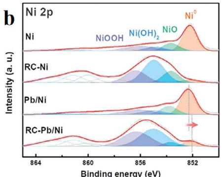

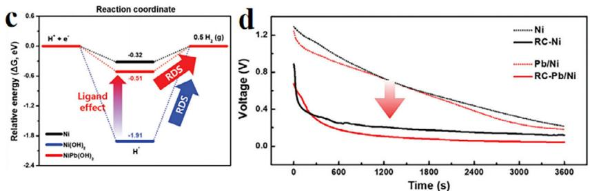

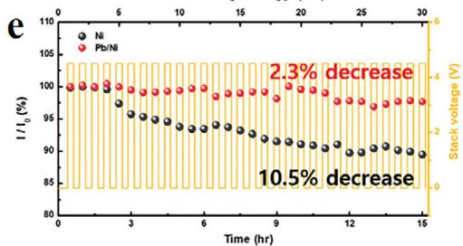
Figure 4. a) Sketch of the mechanism of reverse current generation. b) Ni 2p XPS image of different materials under various conditions. c) Gibbs free-energy profiles of the hydrogen generation steps. d) Voltage changes with time in different materials. e) Current-density profiles relative to the SU/SD cycle, with current density measured.[70] Copyright 2024, Wiley-VCH.

# 3.1.2. Nanoarchitecture and Structural Engineering

Besides cathodic protection and doping of external metals, other strategies can be applied to improve the antioxidant properties of nickel-based cathodes under reverse current conditions. These include surface modification techniques such as atomic layer deposition[81-89] (ALD) or electrochemical passivation,[74,75,80] which can form protective layers that inhibit oxidation without significantly compromising catalytic activity. Additionally, structural engineering approaches—such as designing core-shell architectures or creating nanostructured surfaces—can enhance electron conductivity and facilitate the removal of oxidative intermediates. The incorporation of conductive polymers or carbon-based materials[50,90-97] (e.g., graphene or carbon nanotubes) as support matrices can also help buffer the electrode against harsh electrochemical environments. Moreover, a promising strategy involves the design and application of a protective layer directly onto the cathode surface. This materials-based approach aims to create a physical and electrochemical barrier, specifically engineered to shield the underlying nickel from the corrosive environment present during shutdown periods. By doing so, it directly inhibits the irreversible oxidation caused by reverse current, thereby prolonging the electrode's lifespan. Collectively, the incorporation of such protective layers complements conventional mitigation methods and offers a robust, materials-centric approach to enhancing the durability of nickel-based cathode materials in AEMWE systems.

Xu et al.[73] introduce cobalt phosphide (CoP) doping with W and Mo on the nickel mesh (NM), which is denoted as WMoCoP@NM. It is prepared through electrodeposition as depicted in Figure 5a. Following the electrodeposition process, the WMoCoP@NM films formed on the NM surface are noticeably thicker and denser compared to the CoP@NM films, exhibiting a dense

and coarse morphology (Figure 5b). Further electrochemical tests have shown that WMo-CoP@NM electrode has a higher current strength at the same voltage (Figure 5c). Reverse current mainly emerges when the voltage changes dramatically. As Figure 5d demonstrated, returning to the original voltage after 7 rounds of incremental voltage increase, the current intensity changed only slightly, proving that the reverse current has a negligible effect on the electrode material. Then materials are put into a more hazardous environment, alternating high current density $(1.5\mathrm{Acm}^{-2})$ as well as low current density $(0.4\mathrm{Acm}^{-2})$ cycling tests (ADT-1) and SU/SD test (ADT-2). The result in Figure 5e shows that after these procedures, WMo-CoP@NM owns a relatively stable voltage change. Density functional theory proves that W and Mo dopants change the electron density around nickel and make it difficult to be oxidized. Also, CoP on the nickel surface is first oxidized to cobalt phosphate attached on the surface to protect nickel.

Zhang et al.[98] prepared an acid- and alkali-resistant oxidationresistant cathode material by attaching a novel catalytic material to a conventional nickel foam (NF) skeleton and depositing a layer of nitrogen-doped carbon on the surface to improve its resistance to reverse current. Figure 6a illustrates the synthesis process, starting with the hydrothermal growth of $\mathrm{NiMoO_4}$ microrod precursors on a 3D NF substrate. These precursors are then converted via pyrolysis into the final NiMoN@NC-X/NF core-shell structure, featuring a NiMoN core encapsulated by a nitrogendoped carbon layer. The number 'X' in the sample names denotes the pyrolysis temperature. Data shows that lower temperature leads to fewer carbon layer attached, and temperature is too high and the carbon layer is too thick to prevent the internal active catalyst from contacting the electrolyte, and $600^{\circ}\mathrm{C}$ as pyrolysis is a compromise, which is denoted as NiMoN@NC-6/NF. SEM image (Figure 6b), visually confirms the successful fabrication of

b

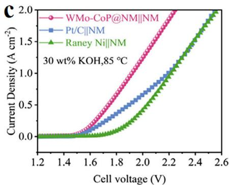

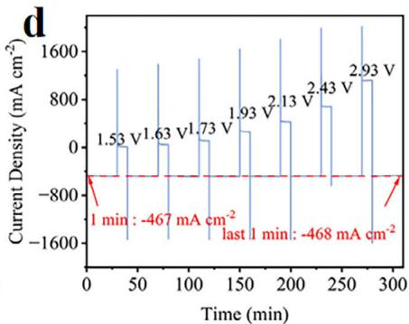

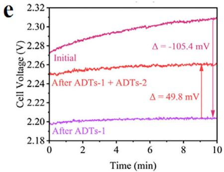
Figure 5. a) Preparation of WMo-CoP@NM. b) SEM image of WMo-CoP@NM. c) Polarization curves for overall water electrolysis in 30 wt.% KOH electrolytes at $85^{\circ}\mathrm{C}$ . d) Resistant counter-current performance of WMo-CoP@NM-based AWE e) Voltage changes after accelerating decomposition test 1 (ADT-1) and accelerating decomposition test 2 (ADT-2).[73] Copyright 2025, Wiley-VCH.

these dense, well-aligned microrod arrays on the substrate. Analyst's performance is evaluated in the following figures. Accelerating decomposition test in an acid electrolyte is conducted via switching from various current densities and a positive voltage to simulate oxidation. As Figure 6c depicted, compared with Pt/C, NiMoN@NC-6/NF owns a stable potential, boasting excellent reverse current resistance. With intrinsic HER activity through LSV curves in Figure 6d, it demonstrates that optimized NiMoN@NC-6 (red line) exhibits catalytic performance that rivals, and even surpasses, the commercial Pt/C benchmark. In order to test its performance changes under repeated start-stop conditions in an AWE system, a 50-round SU/SD test is launched, with an hour switching on at $100\mathrm{mAcm}^{-2}$ and an hour shutting down. Due to the presence of the carbon protective layer, there is only a small increase in performance compared to Pt/C as Figure 6e depicted.

Zhang et al.[99] presented a clever strategy for fabricating a highly efficient catalyst system from a single precursor for overall water splitting, as depicted in Figure 7a. They initially synthesized NiMoFeO microcolumn arrays directly on nickel foam via a hydrothermal method (Figure 7b), which served as a robust OER catalyst with performance superior to the benchmark $\mathrm{RuO_2}$ . Subsequently, through an organic immersion and pyrolysis treatment, this precursor is transformed into a nitrogen-doped carbon-coated composite, NiMoFe@NC (Figure 7c), which demonstrated exceptional HER activity, rivaling the performance of commercial Pt/C. Compared with conventional catalysts, this combination owns a durability of reverse current which results in fluctuating power input, as Figure 7d illustrated. After impacts with different current density, the potential of the electrolyzer remains stable. A longer stability test is conducted in further research with a slight potential up in $1000\mathrm{h}$ proving its durability.

Nickel-based catalysts[55,100-105] have long been considered the benchmark for cathodic hydrogen evolution reactions in alkaline environments due to their low cost and reasonable activity. However, to further enhance performance and durability under harsh industrial conditions, researchers are increasingly exploring noble-metal-based alternatives such as ruthenium-based catalysts. These materials offer superior intrinsic activity and stability, making them promising candidates for high-efficiency alkaline water electrolysis systems. Ruthenium dioxide[31,106-113] $(\mathrm{RuO}_2)$ has emerged as a promising cathode material in industrial electrochemical systems such as alkaline water electrolysis and chlor-alkali production, owing to its exceptional hydrogen evolution reaction kinetics, high electrical conductivity, and corrosion resistance under cathodic polarization. However, the mechanism under reverse current deserve further research.

Holmin et al.[114,115] introduce ruthenium dioxide on top of the nickel mesh to improve the catalytic efficiency of the nickel mesh and try to find out the influence of reverse current on the electrode. SEM images (Figure 8a,b) demonstrate destruction of surface structure. Further experimental demonstrations showed that hydroxylation of oxygen occurs during hydrogen production, with the main intensity moving from $529.5\mathrm{eV}$ like higher binding energies, as Figure 8c depicted. Then electrodes were first used for catalytic hydrogen production for $6\mathrm{h}$ , and then immediately carried out for catalytic oxygen production to simulate the reverse current and explore the effect of electrode material. Diffractogram of the $\mathrm{RuO}_2$ coating subjected to the polarity inversion test exhibits no peak at 26.5 degrees (Figure 8d). This absence indicates that the hydroxylated phase, which is formed during extensive hydrogen evolution, is subsequently removed during the extensive oxygen evolution stage. Subsequent

a

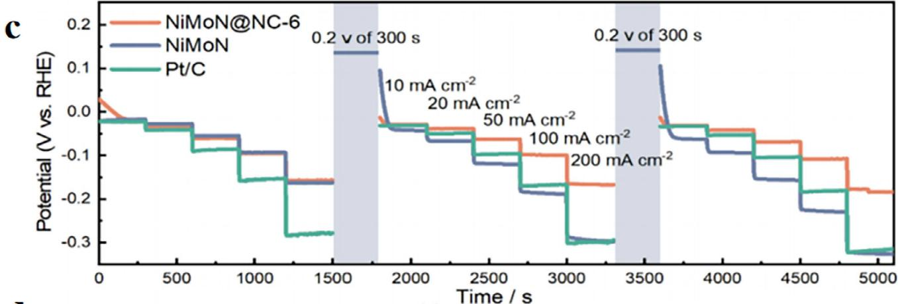

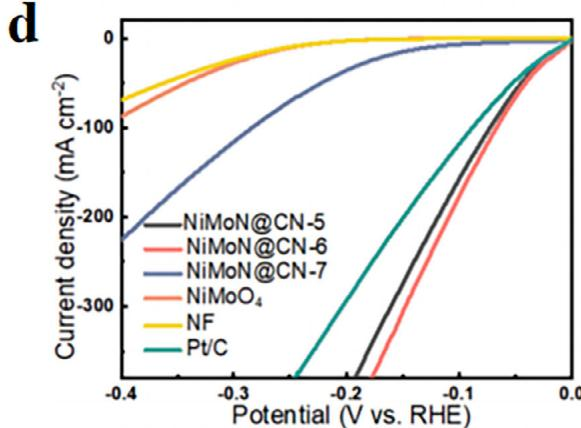

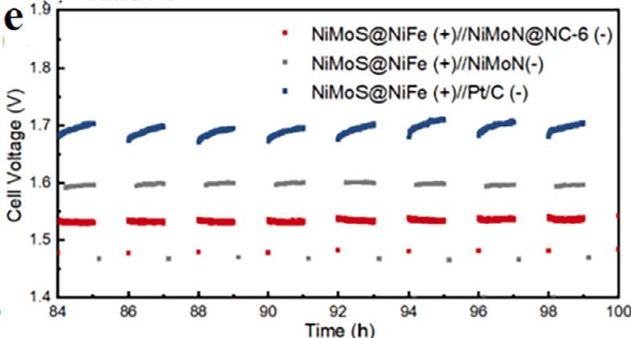
Figure 6. a) Preparation process of the hierarchical structure of NiMoN@NC/NF. b) SEM image of NiMoN@NC-6/NF. c) Multiple current density tests in $0.5\mathrm{mol}L^{-1}\mathrm{H}_2\mathrm{SO}_4$ d) Linear current voltage (LSV) curves of different materials in $0.5\mathrm{mol}L^{-1}\mathrm{H}_2\mathrm{SO}_4$ e) Voltage changes of the last few rounds of the cycle in SU/SD tests of different materials in $1\mathrm{mol}L^{-1}\mathrm{KOH}$ . [98] Copyright 2022, Elsevier.

UV–vis spectrophotometry detection found $\mathrm{RuO}_4^{2-}$ in electrolyte. With these results, the authors propose a possible mechanism for dissolution in Figure 8e. The ruthenium dioxide attached to the surface during hydrogen production hydroxylates to form $\mathrm{RuO(OH)}_2$ , which in turn generates $\mathrm{RuO}_4^{2-}$ under the action of the reverse current and dissolves in solution.

Sha et al.[72] engineered a $\mathrm{NiCoP - Cr_2O_3}$ catalyst capable of dynamic self-protection against reverse current, with a mechanism depicted in Figure 9a. $\mathrm{Cr}_2\mathrm{O}_3$ owns a quite high stability at high potential and acts as the skeletons of this armor. To find out the mechanism, TOF-SIMS, which is applied to get its structure, conducted, and particles brought out by the high-speed flow of ions are obtained. As the affinity energy of the three elements nickel phosphorus cobalt, and oxygen increases in succession,

Co is easier to go to the surface to combine with oxygen resulting in the reverse current process as $\mathrm{CoO_x}$ combined with Cr forms, as Figure 9b illustrated, so cobalt oxide ions are detected in the beginning. Then P comes and is oxidized to phosphates in stage to in Figure 9c. In a more inner layer, the rest Co is combined with extra oxygen to form another $\mathrm{CoO_x}$ layer in stage 3 in Figure 9b. After these protective layers, nickel electrode are as Figure 9d depicted, with a high proportion of $\mathrm{Ni^{-}}$ . When oxidation stops, hydrogen will reduce them to the original part, which makes a dynamic circle of protection. Subsequent 10 000-h seawater electrolysis with a periodic power input shows a stable voltage under the same current density, strongly proving the effectiveness of dynamic protection mechanisms (Figure 9e).

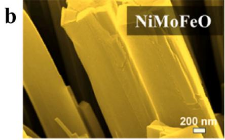

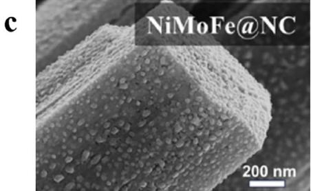

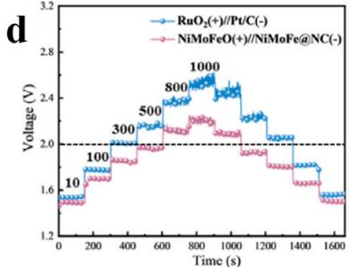
Figure 7. a) Synthesis procedure of catalysts. b) SEM image of OER catalyst. c) SEM image of HER catalyst. d) Voltage changes of fluctuating current densities.[99] Copyright 2024, Elsevier.

The stability challenges posed by dynamic operation are not unique to AEM systems; in proton exchange membrane water electrolysis (PEMWE), these same stresses manifest as equally critical, albeit chemically distinct, degradation issues. The shift from an alkaline to an acidic environment necessitates a complete change in catalyst materials, making the system vulnerable in different ways. Consequently, enhancing the commercial viability of PEMWE technologies requires a holistic approach to addressing the stability of both electrodes under dynamic stress:

this involves not only improving the resistance of the anode to reductive dissolution but also mitigating the unique oxidative damage pathways experienced by the cathode. Tovini et al.[61] address a critical degradation pathway in PEMFCs stemming from the operational instability of conventional $\mathrm{IrO}_2$ co-catalysts. While added to protect the anode during start-up/shut-down cycles, conventional $\mathrm{IrO}_2$ is chemically reduced by hydrogen into an unstable metallic iridium phase, which subsequently dissolves and poisons the cathode. To break this degradation cycle, the paper

a
b

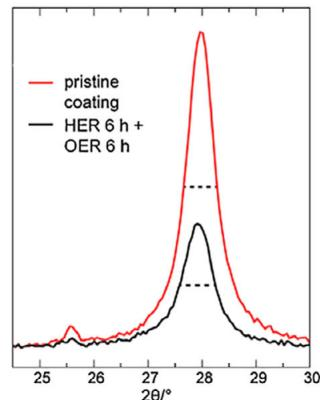
d

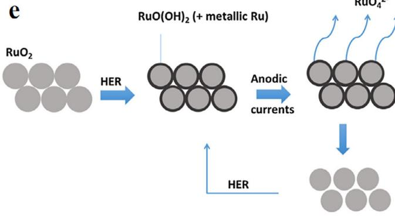
e
Figure 8. a) SEM image of $\mathrm{RuO_2 / Ni}$ cathodes. b) SEM image of $\mathrm{RuO_2 / Ni}$ cathodes after reverse current. c) O 1 s XPS image changes with time exposed under hydrogen (gradual increase in time from bottom to top).[114] Copyright 2014, American Chemistry Society. d) XRD image of $\mathrm{RuO_2 / Ni}$ cathodes e) Mechanism of Ru Oxidization and dissolution in solution.[115] Copyright 2014, Elsevier.

a

b

C

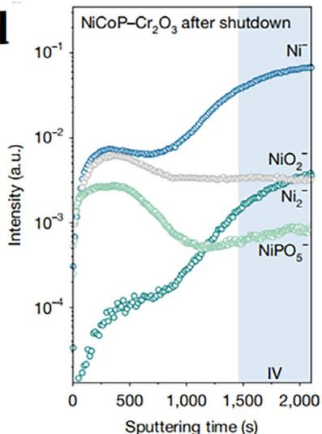
d

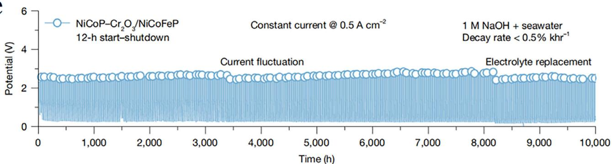
e
Figure 9. a) Mechanism of the electrode to mitigate the influence of reverse current. Time of flight secondary ion mass spectrometry (TOF-SIMS) spectra of the cathode after reverse current. b) Ni c) Co d) P e) Potential changes under a constant current of $0.5\mathrm{Acm}^{-2}$ with a cyclical volatile energy input.[72] Copyright 2025, Springer Nature.

introduces a novel, 'irreducible' $\mathrm{IrO}_2$ (irr- $\mathrm{IrO}_2$ ) catalyst and elucidates the mechanism behind its exceptional stability. The essence of this protective mechanism lies in the material's highly ordered crystalline structure, achieved through high-temperature synthesis, which introduces a significant kinetic barrier to the initial, destructive reduction step. The success of this mechanism is demonstrated through both material characterization and device-level testing, where, after 500 cycles, no iridium crossover to the cathode is detected. By preventing the initial reduction, the catalyst effectively breaks the entire degradation chain reaction—dissolution and crossover—

thereby ensuring the long-term stability of the fuel cell system.

# 3.2. External Environmental Regulation

Apart from electrode material optimization, external environmental regulation also plays a crucial role in mitigating reverse current. In electrochemical systems, a sacrificial anode offers a dual-protection mechanism, safeguarding not only against ambient oxidation but also against the damaging effects of reverse

a

b

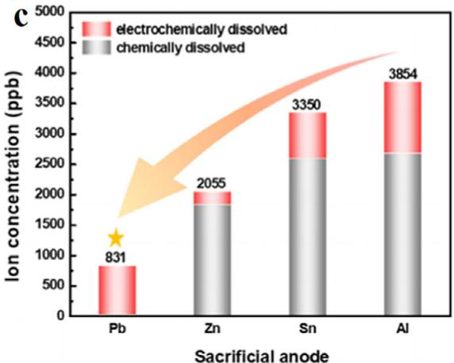

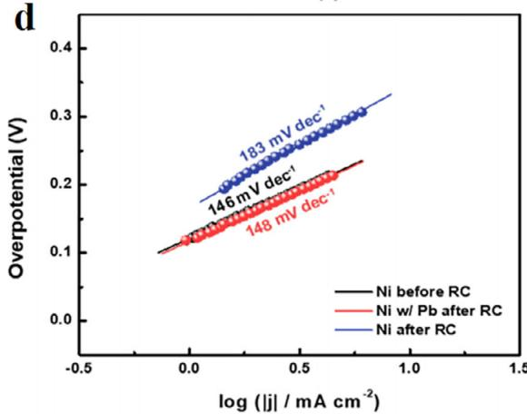
d
Figure 10. a) Experimental illustration for a cathodic protection system. b) Voltage measurement for various metals over time. c) Metal dissolution after 30 min with a surface area of $0.3167\mathrm{cm}^{-2}$ d) Tafel slope of different materials.[71] Copyright 2022, American Chemical Society.

current. When a system is operational, the more electrochemically active sacrificial anode corrodes preferentially, providing standard cathodic protection to the primary electrodes. However, its role becomes even more critical during system shutdowns or unexpected power interruptions, which can induce a reverse current. This reverse current can cause unintended and detrimental electrochemical reactions, essentially forcing the protected electrode to act as an anode and undergo rapid degradation. By integrating a sacrificial anode, any reverse current is drawn toward this more reactive material. The sacrificial anode absorbs this harmful current and corrodes in place of the more valuable primary electrode, effectively neutralizing the threat and ensuring the system remains in a safe, non-degrading state. This passive but highly effective strategy significantly enhances both the stability and lifespan of the entire system.

Applying a protective electrode material to the cathode or doping in the electrode, which is susceptible to oxidation, is considered to be a better option. Kim et al.[71] Further conduct a series of experiments of different metals via connecting to the original nickel electrode by means of a parallel connection, as Figure 10a demonstrated. With voltage measured by time, only Pb, Zn, Sn, and Al provide good protection for the nickel cathode. Others own a higher potential compared with NiO/Ni or $\mathrm{Ni(OH)}_2 / \mathrm{Ni}$ , which is irreversible damage to the cathode (Figure 10b). As Figure 10c illustrated, except from Pb, there is a portion of chemical dis

solution due to the presence of an alkaline electrolyte. Pb as a sacrificial electrode deserves to be studied in depth, as shown in Figure 10d, where the slope increase for the protected nickel electrode is only $0.02\mathrm{mV}\cdot \mathrm{dec}$ compared with before, proving that Pb does have a protective effect on cathodes.

Beyond the protection afforded by a sacrificial anode, the regulation of the external physical environment is equally crucial. By precisely controlling operational parameters such as temperature, electrolyte composition, flow rate, and $\mathsf{pH}$ value, the electrochemical system's susceptibility to reverse current can be significantly reduced. In addition, integrating a polarizing rectifier—an electrical device that allows current to flow only in the forward direction—serves as an effective safety measure to prevent reverse current from damaging the electrodes during shutdowns or power fluctuations. This passive protection mechanism ensures that the electrolysis cell remains in a safe, non-degrading state when external power is interrupted, further enhancing system stability and lifespan.

Haleem et al.[116] provide a comprehensive study of how reverse current forms and damages electrodes in alkaline electrolyzers during system shutdown. They make various comparisons in external conditions like gas dissolved in the electrolyte, pumps to maintain the normal circulation of electrolyte, and temperature. Nitrogen is bubbled into the electrolyte to reduce the dissolution of hydrogen and oxygen in water, and the reverse

current is measured subsequently. Data show that whether nitrogen is bubbled, reverse current changes slightly, so the gas in water isn't a factor to reverse current. Also, electrolytes' temperature deserves a deeper insight. Generally speaking, the temperature of the electrolyte should be maintained at $\approx 80^{\circ}\mathrm{C}$ to increase the rate of reaction. However, when a fluctuating energy supply is introduced, excessive temperatures can raise reverse current. The average current increases dramatically due to temperature, mainly due to thermally activated ion transport mechanisms, where higher thermal energy facilitates ionic dissociation and mobility in the electrolyte. There is a pump in the electrolyzer to maintain the circulation of electrolyte, but for reverse current, it provides a current-conducting channel, thus boosting it. Experiments go along with simulation. When the pumps on, reverse current rises and the voltage of the electrode changes more sorely. From a series of experiments and simulations, it can be concluded that lower temperature of electrolyte, closed circulation pumps can reduce and delay the influence of reverse current.

The composition of the electrolyte is a critical, yet often overlooked, factor that fundamentally dictates the degradation pathways during a reverse current event and, consequently, imposes specific constraints on electrode design. While in a pure water system, the primary parasitic reaction on the cathode is OER, the presence of impurities, such as chloride ions in seawater, introduces the far more aggressive chlorine evolution reaction. Chlorine evolution reaction not only occurs at a lower potential than OER, thereby accelerating the onset of degradation, but its products—highly corrosive chlorine gas and hypochlorite species—can severely attack both the platinum catalyst and its carbon support. This necessitates a paradigm shift in cathode design for such applications; the catalyst must not only be efficient for the HER but also possess exceptional tolerance to chlorine-induced corrosion, a property not typically required for pure water operation. Furthermore, the presence of cations like $\mathrm{Mg}^{2+}$ and $\mathrm{Ca}^{2+}$ can lead to surface passivation through hydroxide precipitation, adding another layer of complexity. Therefore, the design and selection of robust cathode materials must be intrinsically linked to the intended electrolyte environment to ensure long-term operational stability.

Besides environmental regulation, a suitable supervisory system is also a good option. A polarized rectifier is an electrochemical protection device commonly used in water electrolysis systems to prevent reverse current damage during shutdown or power fluctuations. When the external power supply is interrupted, the potential difference between the electrodes may lead to reverse current flow, causing corrosion or degradation of the electrode materials. The polarized rectifier functions as a one-way valve for electric current—it allows normal forward current during electrolysis but blocks the reverse flow when the system is shut down or idle. This helps protect sensitive electrodes, especially non-noble metal catalysts, from reverse current oxidation and extends the operational lifespan of the electrolyzers. In modern alkaline and PEM electrolyzers, polarized rectifiers are often integrated as emergency protection components to improve system reliability and safety.

# 4. Conclusion and Perspective

In summary, reverse current constitutes a significant and persistent impediment to the long-term durability and, by extension, the economic viability of anion AEMWE. This issue becomes particularly acute when these systems are coupled with the inherently intermittent nature of renewable energy sources such as solar and wind, which enforce frequent startup and shutdown cycles. This comprehensive review has systematically deconstructed the origins of this detrimental effect. At its core, the problem stems from fundamental electrochemical principles: upon the cessation of external power, the electrolyzer stack transforms from a device consuming energy to one that spontaneously generates it. A galvanic cell potential forms between the high-potential oxygen-evolving anode and the low-potential hydrogen-evolving cathode, driving a damaging reverse flow of electrons. The most damaging effect of this current is the irreversible oxidation of nickel-based cathode materials, which are widely used in alkaline media due to their high activity and cost-effectiveness. This process corrodes the active material, forming passivating surface layers of nickel hydroxide or oxide, which leads to a dramatic increase in the hydrogen evolution overpotential, a significant loss of performance, and ultimately, a premature end to the electrolyzers' operational lifespan.

In response to this critical challenge, current mitigation efforts have established a foundational toolkit of strategies. These primarily revolve around materials-centric approaches, including elemental doping, where elements like iron, cobalt, molybdenum, or chromium are introduced into the nickel lattice to enhance its intrinsic corrosion resistance. Another key strategy is the engineering of sophisticated nanostructures. By creating hierarchical architectures such as core-shell nanoparticles or 3D porous foams, researchers aim to develop electrodes that are not only highly active but also structurally resilient to the stresses of shutdown cycles. Alongside these material modifications are system-level interventions, such as implementing external environmental controls. These include polarization rectifiers that apply a small protective voltage during idle periods or dedicated cathodic protection systems. While these strategies have certainly shown promise and have advanced our understanding, particularly in lab-scale studies, they often represent incremental improvements. Dopants can leach out over time, complex nanostructures can lose their integrity, and external systems add significant cost and complexity to the balance of the plant. Consequently, they have yet to fully resolve the profound stability challenges required for the widespread, cost-effective industrial deployment of AEMWE technology.

Looking forward, overcoming the reverse current challenge necessitates a decisive paradigm shift from these empirical, often trial-and-error methods to a more rational, predictive, and holistic design philosophy. The future research trajectory must be built upon the synergistic integration of computational science with advanced materials engineering. A pioneering approach to material science is being spearheaded by the integration of high-throughput screening with artificial intelligence (AI), where the core novelty lies in applying sophisticated machine learning

models trained on vast datasets to dramatically accelerate the design of novel protective materials. This data-centric methodology fundamentally transcends the inherent limitations of traditional, resource-intensive trial-and-error experimentation by systematically deciphering complex relationships between thousands of potential material compositions and surface configurations, enabling the AI-powered framework to efficiently identify candidates with an optimal balance of catalytic activity and electrochemical stability. A crucial application of this advanced screening is designing exceptionally robust protective layers for vulnerable components like electrodes or bipolar plates to mitigate the severe corrosive effects of reverse currents that occur during system shutdown or intermittent operation. Machine learning algorithms can rapidly screen extensive libraries of potential material compositions and surface configurations to identify candidates with an optimal balance of catalytic activity and electrochemical stability. This predictive power is enhanced by fusing numerical data with textual information from experimental protocols and manufacturing processes, leading to more accurate forecasts of corrosion behavior. This predictive capability not only offers deeper insights into the fundamental mechanisms of current-induced degradation but also paves the way for the rational design of next-generation materials with enhanced resilience. This will be synergistically coupled with integrated simulation-experimental workflows, where Density Functional Theory (DFT) provides critical atomic-level insights into how reverse currents initiate corrosion, and these theoretical predictions are then directly validated and refined through targeted synthesis and characterization, creating a powerful feedback loop for accelerated discovery.

Within this forward-looking framework, a particularly compelling direction is the development and implementation of multifunctional dynamic protective layers. The concept involves depositing an ultrathin, conformal coating directly onto the surface of the active cathode material. These engineered coatings must be meticulously designed to act as a robust physical and electrochemical barrier, effectively shielding the underlying nickel from oxidation during idle periods. However, the design of such a layer is a formidable challenge governed by a delicate balance of properties. The ideal layer must be chemically inert in the harsh alkaline environment, mechanically robust to withstand operational stresses, and strongly adherent to the substrate. Critically, it must remain highly electronically conductive to not impede charge transfer to the active sites, yet ideally be ionically insulating to halt the galvanic circuit. An excessive or poorly designed layer, for example, a thick, amorphous carbon coating, can inadvertently passivate the electrode surface and block active sites and severely hindering its catalytic performance. Therefore, future work must focus on novel materials and deposition techniques that allow for atomic-level control over the thickness, morphology, and chemical nature of these protective films, exploring candidates from graphene and other 2D materials to conductive metal oxides and polymers.

Ultimately, even the most advanced material innovations must be complemented by the parallel development and implementation of advanced diagnostic and monitoring systems. The field must move beyond post-mortem analysis of failed components toward real-time health management. The integration of in situ and operando techniques, such as electrochemical

impedance spectroscopy (EIS), synchrotron-based X-ray absorption spectroscopy (XAS), and Raman spectroscopy directly into operating electrolyzer cells will be critical. These tools allow researchers to observe the dynamic changes in the electrode's chemical state and performance as they happen, providing invaluable data for validating the efficacy of new materials and protective layers under realistic conditions. Furthermore, this stream of real-time data will be essential for building accurate lifetime prediction models and for enabling intelligent control strategies. These smart operational protocols could, for example, dynamically detect the onset of damaging conditions and automatically adjust shutdown procedures or apply minimal protective currents to actively minimize degradation. In conclusion, a truly multifaceted approach, one that combines inherently stable materials discovered through computational design, rationally engineered protective architectures, and smart, feedback-controlled operational protocols will be the key to finally solving the reverse current dilemma, unlocking the full potential of AEMWE technology, and paving the way for its pivotal role in a robust and sustainable global hydrogen economy.

# Acknowledgements

This work was financially supported by the Natural Science Foundation of China (22479079), Natural Science Foundation of Jiangsu Province (BK20201381), and Science Foundation of Nanjing University of Posts and Telecommunications (NY219144, NY221046).

# Conflict of Interest

The authors declare no conflict of interest.

# Keywords

renewable energy electrolysis, reverse current, water electrolysis

Received: September 10, 2025

Revised: October 16, 2025

Published online: November 10, 2025

[1] C. Li, Z. Wang, M. Liu, E. Wang, B. Wang, L. Xu, K. Jiang, S. Fan, Y. Sun, J. Li, Nat. Commun. 2022, 13, 3338.
[2] X. Shi, H. Jeong, S. J. Oh, M. Ma, K. Zhang, J. Kwon, I. T. Choi, I. Y. Choi, H. K. Kim, J. K. Kim, Nat. Commun. 2016, 7, 11943.
[3] R. Yao, K. Sun, K. Zhang, Y. Wu, Y. Du, Q. Zhao, G. Liu, C. Chen, Y. Sun, J. Li, Nat. Commun. 2024, 15, 2218.
[4] Z. Gu, Y. Zhang, X. Wei, Z. Duan, L. Ren, J. Ji, X. Zhang, Y. Zhang, Q. Gong, H. Wu, K. Luo, Adv. Sci. 2022, 9, 2201903.
[5] L. Wan, J. Liu, Z. Xu, Q. Xu, M. Pang, P. Wang, B. Wang, Small 2022, 18, 2200380.
[6] Z. Wu, L. Liu, Z. Zhao, C. Yang, S. Mu, H. Zhou, X. Luo, T. Ma, S. Li, C. Zhao, Small 2023, 19, 2204738.
[7] A. Guha, M. Sahoo, K. Alam, D. K. Rao, P. Sen, T. N. Narayanan, iScience 2022, 25, 104835.
[8] T. W. LeBaron, R. Sharpe, K. Ohno, Int. J. Mol. Sci. 2022, 23, 14750.
[9] L. Li, P. C. M. Laan, X. Yan, X. Cao, M. J. Mekkering, K. Zhao, L. Ke, X. Jiang, X. Wu, L. Li, L. Xue, Z. Wang, G. Rothenberg, N. Yan, Adv. Sci. 2023, 10, 2206180.

[10] H. Tüysüz, Acc. Chem. Res. 2024, 57, 558.
[11] R. Zhang, A. Xie, L. Cheng, Z. Bai, Y. Tang, P. Wan, Chem. Commun. 2023, 59, 8205.
[12] C. Feng, M. Chen, Y. Zhou, Z. Xie, X. Li, P. Xiaokaiti, Y. Kansha, A. Abudula, G. Guan, J. Colloid Interface Sci. 2023, 645, 724.
[13] Y. Chen, C. Dai, Q. Wu, H. Li, S. Xi, J. Z. Y. Seow, S. Luo, F. Meng, Y. Bo, Y. Xia, Y. Jia, A. C. Fisher, Z. J. Xu, Nat. Commun. 2025, 16, 2730.
[14] S. H. Kang, H. Y. Jeong, S. J. Yoon, S. So, J. Choi, T. H. Kim, D. M. Yu, Polymers 2023, 15, 2109.
[15] D. Kawaguchi, H. Ogihara, H. Kurokawa, ChemSusChem 2021, 14, 4431.
[16] J. Liu, H. Liu, Y. Yang, Y. Tao, L. Zhao, S. Li, X. Fang, Z. Lin, H. Wang, H. B. Tao, N. Zheng, ACS Cent. Sci. 2024, 10, 852.
[17] R. T. Liu, Z. L. Xu, F. M. Li, F. Y. Chen, J. Y. Yu, Y. Yan, Y. Chen, B. Y. Xia, Chem. Soc. Rev. 2023, 52, 5652.
[18] F. Rocha, C. Georgiadis, K. Van Droogenbroek, R. Delmelle, X. Pinon, G. Pyka, G. Kerckhofs, F. Egert, F. Razmjooei, S. A. Ansar, S. Mitsushima, J. Proost, Nat. Commun. 2024, 15, 7444.
[19] B. N. D. van Haersma Buma, M. Peretto, Z. M. Matar, G. van de Kaa, Heliyon 2023, 9, 17999.
[20] R. Gentile, S. C. Zignani, M. Zatoń, M. Dupont, F. Lecoeur, N. Donzel, A. Amel, E. Tal-Gutelmacher, A. Salanitro, A. S. Aricó, S. Cavaliere, D. J. Jones, J. Rozière, ChemSusChem 2024, 17, 202400825.
[21] H. Kim, S. Jeon, J. Choi, Y. S. Park, S. J. Park, M. S. Lee, Y. Nam, H. Park, M. Kim, C. Lee, S. E. An, J. Jung, S. Kim, J. F. Kim, H. S. Cho, A. S. Lee, J. H. Lee, ACS Nano 2024, 78, 32694.
[22] A. M. I. Noor Azam, T. Ragunathan, N. N. Zulkefli, M. S. Masdar, E. H. Majlan, R. Mohamad Yunus, N. S. Shamsul, T. Husaini, S. N. A. Shaffee, Polymers 2023, 15, 1301.
[23] C. Santoro, A. Lavacchi, P. Mustarelli, V. Di Noto, L. Elbaz, D. R. Dekel, F. Jaouen, ChemSusChem 2022, 15, 202200027.
[24] X. Wang, H. Hu, J. Liu, J. Hu, C. Han, J. P. Attfield, M. Yang, Adv. Mater. 2025, 37, 08705.
[25] Z. Xu, S. Delgado, V. Atanasov, T. Morawietz, A. S. Gago, K. A. Friedrich, Membranes 2023, 13, 328.
[26] L. Yin, R. Ren, L. He, W. Zheng, Y. Guo, L. Wang, H. Lee, J. Du, Z. Li, T. Tang, G. Ding, L. Sun, Angew. Chem. Int. Ed. 2024, 63, 202400764.
[27] W. Zheng, L. He, T. Tang, R. Ren, H. Lee, G. Ding, L. Wang, L. Sun, Angew. Chem. Int. Ed. 2024, 63, 202405738.
[28] A. Franco, C. Giovannini, Sustainability 2023, 15, 16917.
[29] Q. Hassan, A. Z. Sameen, H. M. Salman, M. Jaszcur, Int. J. Hydrogen Energy 2023, 48, 34299.
[30] T. Ikuerowo, S. O. Bade, A. Akinmoladun, B. A. Oni, Int. J. Hydrogen Energy 2024, 76, 75.
[31] J. Ke, Y. Ji, D. Liu, J. Chen, Y. Wang, Y. Li, Z. Hu, W.-H. Huang, Q. Shao, J. Lu, ACS Appl. Mater. Interfaces 2024, 17, 13.
[32] H. Kojima, K. Nagasawa, N. Todoroki, Y. Ito, T. Matsui, R. Nakajima, Int. J. Hydrogen Energy 2023, 48, 4572.
[33] H. Shin, D. Jang, S. Lee, H.-S. Cho, K.-H. Kim, S. Kang, Energy Convers. Manag. 2023, 286, 117083.
[34] S. Cherevko, Curr. Opin. Electrochem. 2023, 38, 101213.
[35] Z. Guan, L. Yang, L. Wu, D. Guo, X. a. Chen, S. Wang, Sustain. Energy Fuels 2023, 7, 4051.
[36] C. Hu, F. Ding, C. Lv, L. Zhou, N. Zeng, A. Liu, J. Cai, T. Tang, Sep. Purif. Technol. 2025, 352, 128249.
[37] S. Park, J. E. Park, G. Na, C. Choi, Y.-H. Cho, Y.-E. Sung, ACS Appl. Energy Mater. 2023, 6, 8738.
[38] A. A. H. Tajuddin, G. Elumalai, Z. Xi, K. Hu, S. Jeong, K. Nagasawa, J.-i. Fujita, Y. Sone, Y. Ito, Int. J. Hydrogen Energy 2021, 46, 38603.
[39] H. Wu, C. Feng, L. Zhang, J. Zhang, D. P. Wilkinson, Electrochem. Energy Rev. 2021, 4, 473.
[40] T. Wu, M.-Z. Sun, B.-L. Huang, Rare Met. 2022, 41, 2169.

[41] P. Zhao, Y. Zhao, H. Liang, X. Song, B. Yu, F. Liu, A. J. Ragauskas, C. Wang, Chem. Eng. J. 2023, 466, 143140.
[42] J. Divisek, R. Jung, D. Britz, J. Appl. Electrochem. 1990, 20, 186.
[43] Y. Uchino, T. Kobayashi, S. Hasegawa, I. Nagashima, Y. Sunada, A. Manabe, Y. Nishiki, S. Mitsushima, Electrochemistry 2018, 86, 138.
[44] Y. Uchino, T. Kobayashi, S. Hasegawa, I. Nagashima, Y. Sunada, A. Manabe, Y. Nishiki, S. Mitsushima, Electrocatalysis 2018, 9, 67.
[45] R. E. White, C. Walton, H. Burney, R. Beaver, J. Electrochem. Soc. 1986, 133, 485.
[46] C.-C. Cheng, T.-Y. Lin, Y.-C. Ting, S.-H. Lin, Y. Choi, S.-Y. Lu, Nano Energy 2023, 112, 108450.
[47] S. Feng, J. Wang, W. Wang, X. Wang, Y. Zhang, Chenchen, A. Ju, J. Pan, R. Xu, Adv. Mater. Interfaces 2021, 8, 2100500.
[48] S. Jia, Q. Wang, J. Chen, S. Wang, Synth. Met. 2021, 279, 116847.
[49] L. Jiang, Y. Pan, J. Zhang, X. Chen, X. Ye, Z. Li, C. Li, Q. Sun, J. Colloid Interface Sci. 2022, 622, 192.
[50] H. J. Kim, H. Y. Kim, J. Joo, S. H. Joo, J. S. Lim, J. Lee, H. Huang, M. Shao, J. Hu, J. Y. Kim, J. Mater. Chem. A 2022, 10, 50.
[51] T. Tran-Phu, M. Chatti, J. Leverett, T. K. A. Nguyen, D. Simondson, D. A. Hoogeveen, A. Kiy, T. Duong, B. Johannessen, J. Meilak, Small 2023, 19, 2208074.
[52] Z. Xu, S. Jin, M. H. Seo, X. Wang, Appl. Catal. B Environ. 2021, 292, 120168.
[53] X. Zhang, A. Wu, D. Wang, Y. Jiao, H. Yan, C. Jin, Y. Xie, C. Tian, Appl. Catal. B Environ. 2023, 328, 122474.
[54] Y. Zhang, W. Liang, S. Yao, Z. Zheng, C. Wang, Fuel 2026, 404, 136253.
[55] J. Chang, S. Zang, F. Song, W. Wang, D. Wu, F. Xu, K. Jiang, Z. Gao, Appl. Catal. A Gen. 2022, 630, 118459.
[56] M. Demnitz, Y. M. Lamas, R. L. G. Barros, Ad. L. den Bouter, J. van der Schaaf, M. T. Groot, iScience 2024, 27, 108695.
[57] D. Gao, S. Ji, V. Linkov, R. Wang, Int. J. Hydrogen Energy 2022, 47, 37831.
[58] M. Rajeev, A. Jerome-Saboori, R. Shekhar, S. W. Boettcher, P. A. Kempler, ACS Catal. 2025, 15, 2847.
[59] G. Wang, H. Li, F. Babbe, A. Tricker, E. J. Crumlin, J. Yano, R. Mukundan, X. Peng, Adv. Energy Mater. 2025, 15, 2500886.
[60] P. C. Okonkwo, O. O. Ige, P. C. Uzoma, W. Emori, A. Benamor, A. M. Abdullah, Int. J. Hydrogen Energy 2021, 46, 15850.
[61] M. F. Tovini, A. M. Damjanovic, H. A. El-Sayed, B. Strehle, J. Speder, A. Ghielmi, H. A. Gasteiger, J. Electrochem. Soc. 2024, 171, 074510.
[62] T. Yan, S. Chen, W. Sun, Y. Liu, L. Pan, C. Shi, X. Zhang, Z. F. Huang, J. J. Zou, ACS Appl. Mater. Interfaces 2023, 15, 6912.
[63] C. Yang, Y. Zhu, F. Zhang, L. Yao, Y. Chen, T. Lu, Q. Li, J. Li, G. Wang, Q. Cheng, H. Yang, Adv. Mater. 2025, 37, 2507560.
[64] R. Fagan, D. E. McCormack, S. J. Hinder, S. C. Pillai, Materials 2016, 9, 286.
[65] I. Gammoudi, L. Blanc, F. Moroté, C. Grauby-Heywang, C. Boissière, R. Kalfat, D. Rebière, T. Cohen-Bouhacina, C. Dejous, Biosens. Bioelectron. 2014, 57, 162.
[66] N. S. Leyland, J. Podporska-Carroll, J. Browne, S. J. Hinder, B. Quilty, S. C. Pillai, Sci. Rep. 2016, 6, 24770.
[67] S. Im, W. S. Kim, A. M. Tamboli, J. Sim, Y. Jung, J. OH, C.-H. Kim, Meet. Abstr. MA2024-02 3228.
[68] C. Haoran, Y. Xia, W. Wei, Z. Yongzhi, Z. Bo, Z. Leiqi, Int. J. Hydrogen Energy 2024, 54, 700.
[69] M. Muthiah, M. Elnashar, W. Afzal, H. Tan, Int. J. Hydrogen Energy 2024, 84, 803.
[70] S. M. Jung, Y. Kim, B. J. Lee, H. Jung, J. Kwon, J. Lee, K. S. Kim, Y. W. Kim, K. J. Kim, H. S. Cho, Adv. Funct. Mater. 2024, 34, 2316150.
[71] Y. Kim, S. M. Jung, K. S. Kim, H. Y. Kim, J. Kwon, J. Lee, H. S. Cho, Y. T. Kim, JACS Au 2022, 2, 2491.
[72] Q. Sha, S. Wang, L. Yan, Y. Feng, Z. Zhang, S. Li, X. Guo, T. Li, H. Li, Z. Zhuang, D. Zhou, B. Liu, X. Sun, Nature 2025, 639, 360.

[73] G. Xu, M. Xing, Z. Qiao, M. Han, Y. Wu, S. Wang, D. Cao, Adv. Energy Mater. 2025, 15, 2500926.
[74] L. Chen, W. Liu, B. Dong, Y. Zhao, T. Zhang, Y. Fan, W. Yang, Corros. Sci. 2021, 193, 109903.
[75] M.-Z. Chen, Z.-D. Wang, E.-K. Wu, K. Yang, K. Zhao, J.-J. Shi, G.-F. Sun, E.-H. Han, Corros. Sci. 2024, 229, 111882.
[76] K. Li, J. He, X. Guan, Y. Tong, Y. Ye, L. Chen, P. Chen, Small 2023, 19, 2302130.
[77] S. Pinilla, J. Coelho, K. Li, J. Liu, V. Nicolosi, Nat. Rev. Mater. 2022, 7, 717.
[78] A. J. Shih, M. C. Monteiro, F. Dattila, D. Pavesi, M. Philips, A. H. da Silva, R. E. Vos, K. Ojha, S. Park, O. van der Heijden, Nat. Rev. Methods Primers 2022, 2, 84.
[79] X. Xu, Z. Shao, S. P. Jiang, Energy Technol. 2022, 10, 2200573.
[80] Y. Yin, H. Li, S. Pan, J. Zhang, Q. Han, S. Yang, Corros. Sci. 2022, 206, 110494.
[81] X. Feng, L. Sun, W. Wang, Y. Zhao, J.-W. Shi, Sep. Purif. Technol. 2023, 324, 124520.
[82] J. Fonseca, J. Lu, ACS Catal. 2021, 11, 7018.
[83] D. Guo, Z. Zeng, Z. Wan, Y. Li, B. Xi, C. Wang, Adv. Funct. Mater. 2021, 31, 2101324.
[84] Y. Kim, W. J. Woo, D. Kim, S. Lee, S. m. Chung, J. Park, H. Kim, Adv. Mater. 2021, 33, 2005907.
[85] J. Park, S. J. Kwak, S. Kang, S. Oh, B. Shin, G. Noh, T. S. Kim, C. Kim, H. Park, S. H. Oh, Nat. Commun. 2024, 15, 2138.
[86] M. Si, Z. Lin, Z. Chen, X. Sun, H. Wang, P. D. Ye, Nat. Electron. 2022, 5, 164.
[87] R. T. van Limpt, M. Lao, M. N. Tsampas, M. Creatore, Adv. Sci. 2024, 11, 2405188.
[88] J. Yang, J. Wang, H. Li, Z. Wu, Y. Xing, Y. Chen, L. Liu, Adv. Sci. 2022, 9, 2101988.
[89] J. Yarbrough, A. B. Shearer, S. F. Bent, J. Vac. Sci. Technol. A 2021, 39, 021002.
[90] Y. Cong, S. Huang, Y. Mei, T. T. Li, Chem. Eur. J. 2021, 27, 15866.
[91] L. Y. Guo, J. F. Li, Z. W. Lu, J. Zhang, C. T. He, ChemSusChem 2023, 16, 202300214.
[92] Y. Jia, X. Yao, Acc. Chem. Res. 2023, 56, 948.
[93] M. S. Reza, N. B. H. Ahmad, S. Afroze, J. Tawekun, M. Sharifpur, A. K. Azad, Chem. Eng. Technol. 2023, 46, 420.
[94] T. K. Tran, C. K. Trinh, H. V. Trinh, H. T. Truong, R. Safdar, G. H. Tran, H. J. Leu, N. Kim, ACS Appl. Energy Mater. 2023, 6, 9455.

[95] H. Yang, M. Driess, P. W. Menezes, Adv. Energy Mater. 2021, 11, 2102074.
[96] Z. Zhang, Y. Lei, W. Huang, Chin. Chem. Lett. 2022, 33, 3623.
[97] T. Wang, X. Cao, L. Jiao, Small 2021, 17, 2004398.
[98] R. Zhang, L. Xu, Z. Wu, L. Wang, J. Zhang, Y. Tang, L. Xu, A. Xie, Y. Chen, H. Zhang, Chem. Eng. J. 2022, 436, 134931.
[99] R. Zhang, Q. Liu, L. Zhou, L. Wang, L. Cheng, A. Xie, H. Xu, Z. Bai, Y. Tang, P. Wan, Int. J. Hydrogen Energy 2024, 82, 1341.
[100] Z. Angeles-Olvera, A. Crespo-Yapur, O. Rodríguez, J. L. Cholula-Díaz, L. M. Martínez, M. Vida, Energies 2022, 15, 1609.
[101] J. Chang, Z. Hu, D. Wu, F. Xu, C. Chen, K. Jiang, Z. Gao, J. Colloid Interface Sci. 2023, 638, 801.
[102] J. Chang, S. Zang, J. Li, D. Wu, Z. Lian, F. Xu, K. Jiang, Z. Gao, Electrochim. Acta 2021, 389, 138785.
[103] S. Ma, J. Huang, C. Zhang, G. Chen, W. Chen, T. Shao, T. Li, X. Zhang, T. Gong, K. K. Ostrikov, Chem. Eng. J. 2022, 435, 134859.
[104] S. Wang, A. Lu, C.-J. Zhong, Nano Converg. 2021, 8, 4.
[105] M. Yu, E. Budiyanto, H. Tüysüz, Angew. Chem., Int. Ed. 2022, 61, 202103824.
[106] Q. Chen, Z. Kang, S. Luo, J. Li, P. Deng, C. Wang, Y. Hua, S. Zhong, X. Tian, Int. J. Hydrogen Energy 2023, 48, 8888.
[107] Q. Chen, Y. Yu, S. Luo, P. Deng, Y. Hua, S. Zhong, X. Tian, J. Li, Int. J. Hydrogen Energy 2024, 84, 401.
[108] Y. Duan, L. L. Wang, W. X. Zheng, X. L. Zhang, X. R. Wang, G. J. Feng, Z. Y. Yu, T. B. Lu, Angew. Chem. 2024, 136, 202413653.
[109] G. Q. Liu, Y. Yang, X. L. Zhang, H. H. Li, P. C. Yu, M. R. Gao, S. H. Yu, Small 2024, 20, 2306914.
[110] Y. Tang, T. Zhou, S. Yu, X. Huang, J. J. Fu, P. K. Shen, Z. Q. Tian, J. Colloid and Interface Sci. 2025, 695, 137754.
[111] K. Wang, S. Xu, D. Wang, Z. Kou, Y. Fu, M. Bielejewski, V. Montes-García, B. Han, A. Ciesielski, Y. Hou, Adv. Mater. 2025, 37, 2417374.
[112] J. Zhang, X. Fu, S. Kwon, K. Chen, X. Liu, J. Yang, H. Sun, Y. Wang, T. Uchiyama, Y. Uchimoto, Science 2025, 387, 48.
[113] G. Zhao, W. Guo, M. Shan, Y. Fang, G. Wang, M. Gao, Y. Liu, H. Pan, W. Sun, Adv. Mater. 2024, 36, 2404213.
[114] L.-Å. Naslund, A. S. Ingason, S. Holmin, J. Rosen, J. Phys. Chem. C 2014, 118, 15315.
[115] S. Holmin, L.-Å. Naslund, Å. S. Ingason, J. Rosen, E. Zimmerman, Electrochim. Acta 2014, 146, 30.
[116] A. A. Haleem, J. Huyen, K. Nagasawa, Y. Kuroda, Y. Nishiki, A. Kato, T. Nakai, T. Araki, S. Mitsushima, J. Power Sources 2022, 535, 231454.

Longlu Wang received his Ph.D. degree in 2017 from Hunan University. He currently works at Nanjing University of Posts and Telecommunications. He was invited as reviewers for over 30 journals and has over 200 scientific publications with total citations over 13000 and an H-index at 66. His current research interest is the 2D energy materials and devices.
