# 10,000-h-stable intermittent alkaline seawater electrolysis

https://doi.org/10.1038/s41586-025-08610-1

Received: 14 August 2024

Accepted: 7 January 2025

Published online: 5 March 2025

Qihao Sha1,7, Shiyuan Wang1,2,7, Li Yan1 , Yisui Feng3 , Zhuang Zhang1 , Shihang Li1 , Xinlong Guo1 , Tianshui Li1 , Hui Li3 , Zhongbin Zhuang4 , Daojin Zhou1 ✉, Bin Liu5,6 ✉ & Xiaoming Sun1 ✉

Seawater electrolysis powered by renewable electricity provides an attractive strategy for producing green hydrogen1–5 . However, direct seawater electrolysis faces many challenges, primarily arising from corrosion and competing reactions at the anode caused by the abundance of halide ions (Cl− , Br− ) in seawater6 . Previous studies3,6–14 on seawater electrolysis have mainly focused on the anode development, because the cathode operates at reducing potentials, which is not subject to electrode dissolution or chloride corrosion reactions during seawater electrolysis11,15. However, renewable energy sources are intermittent, variable and random, which cause frequent start– shutdown operations if renewable electricity is used to drive seawater electrolysis. Here we frst unveil dynamic evolution and degradation of seawater splitting cathode in intermittent electrolysis and, accordingly, propose construction of a catalyst’s passivation layer to maintain the hydrogen evolution performance during operation. An in situ-formed phosphate passivation layer on the surface of NiCoP– $\mathbf { \cdot C r } _ { 2 } \mathbf { O } _ { 3 }$ cathode can efectively protect metal active sites against oxidation during frequent discharge processes and repel halide ion adsorption on the cathode during shutdown conditions. We demonstrate that electrodes optimized using this design strategy can withstand fuctuating operation at $0 . 5 \mathsf { A c m } ^ { - 2 }$ for 10,000 h in alkaline seawater, with a voltage increase rate of only $0 . 5 \% \mathsf { k h r ^ { - 1 } }$ . The newly discovered challenge and our proposed strategy herein ofer new insights to facilitate the development of practical seawater splitting technologies powered by renewable electricity. [EVID: EVID008]

Renewable seawater splitting offers a sustainable approach for largescale green hydrogen production. However, the intermittent nature of renewable electricity poses high requirements for the design and development of electrocatalysts that can be operated at fluctuating, industry-relevant current densities. Figure 1a schematically illustrates dynamic evolution of hydrogen evolution reaction (HER) catalyst under start–shutdown water electrolysis cycles. Through simulating frequent start–shutdown seawater electrolysis processes, we discovered discharge and oxidation currents at the cathode, which decreased the cathode catalytic activity. Furthermore, the halide ions in seawater could also easily adsorb onto the cathode during shutdown and discharge conditions, corroding and poisoning the catalyst (Fig. 1a).

To address the challenges faced by water/seawater splitting cathode under frequent start–shutdown conditions, we design a NiCoP– $\mathbf { \cdot C r } _ { 2 } \mathbf { O } _ { 3 }$ catalyst, in which a phosphate-based passivation layer is formed on the surface of the catalyst and can effectively protect the catalyst against both metal sites oxidation and halide ions adsorption during the shutdown and discharge processes. The cathode catalyst can reactivate back to its original state during HER, contributing to stable intermittent seawater electrolysis at $0 . 5 \mathsf { A c m } ^ { - 2 }$ for 10,000 h with a

small voltage increase rate of less than $0 . 5 \% \mathsf { k h r ^ { - 1 } }$ . Furthermore, the NiCoP– ${ \mathrm { { C r } } _ { 2 } } { \bf { O } } _ { 3 }$ catalyst exhibits stable operation under a harsher condition at 1 A $\mathrm { c m } ^ { - 2 }$ with high-frequency start–shutdown fluctuations (10-min start–shutdown) for 4,500 h in alkaline seawater without decay and at $1 0 \mathsf { A c m } ^ { - 2 }$ for 700 h with a small voltage increase of less than $1 . 8 \% \mathsf { k h r } ^ { - 1 }$ . The catalyst designed in this study achieves stable seawater electrolysis under various fluctuating harsh conditions, showing high potential for practical applications. Notably, the structure and mechanism of dynamic passivation induced by phosphorus doping and metal oxide composition hold great promise for further application to metal-based current collectors, addressing the reverse problem during shutdown and restart in a wide range of water splitting systems. [EVID: EVID009]

# Cathode oxidation during start–shutdown water splitting cycles

Using NiCoP– $\mathbf { \cdot C r } _ { 2 } \mathbf { O } _ { 3 }$ as the cathode and Ni foam as the anode, a simulated water electrolysis with a cycle of start and shutdown operation in every 12 h was conducted at 1 A $\mathsf { c m } ^ { - 2 }$ (Supplementary Fig. 1 and

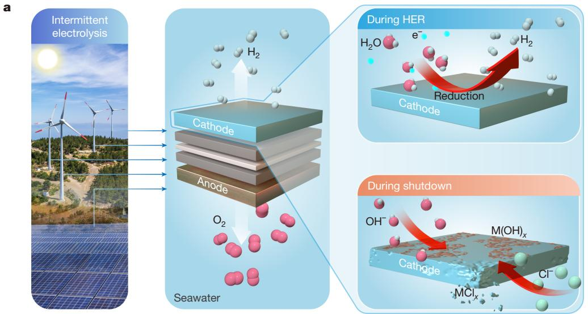

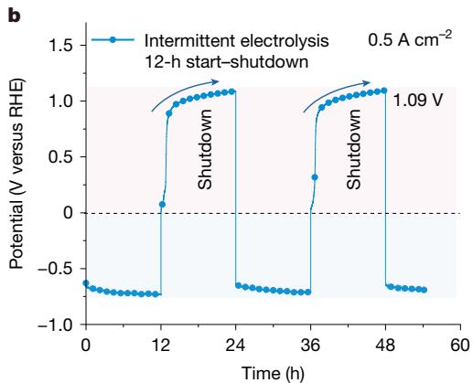

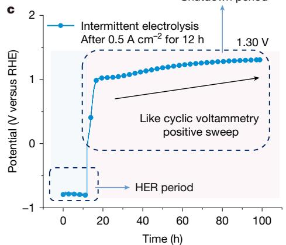
Fig. 1 | Cathode oxidation and corrosion under start–shutdown water electrolysis cycles. a, Schematic showing cathode oxidation and corrosion under start–shutdown water/seawater electrolysis cycles. Quantitative analysis [EVID: EVID_FIG001]
of oxidation potential at the cathode operated at $0 . 5 \mathsf { A c m } ^ { - 2 }$ : the cathodic discharge potential reached 1.09 V (versus RHE) in 12 h (b) and 1.30 V (versus RHE) in 72 h (c).

Supplementary Note 1). Supplementary Fig. 2a,b shows the corresponding V–t and I–t plots.

To quantitatively analyse the oxidation process, another set of electrochemical workstation and HgO reference electrode was introduced into the two-electrode system (Supplementary Fig. 3) to monitor the potential change at the cathode, which was performed at current densities of 0.5 and 1 A cm−2 for 12 h, followed by shutdown. During chronopotentiometric electrolysis at $0 . 5 \mathsf { A c m } ^ { - 2 }$ , the cathode voltage was negative and the cathode voltage sharply reversed once electrolysis operation was stopped (Fig. 1b and Supplementary Fig. 4), and eventually reached 1.30 V versus reversible hydrogen electrode (RHE) (Fig. 1c), exceeding the theoretical potential for water oxidation (1.23 V versus RHE) at room temperature. A similar phenomenon was observed at a higher current density $( 1 \mathsf { A } \mathsf { c m } ^ { - 2 }$ ; Supplementary Fig. 5). The results indicate that, after shutdown of water electrolysis, cathodic discharge occurs, which lasts for tens of hours, causing irreversible oxidative damage to the cathode catalyst. This issue will be intensified when seawater is used as a feedstock, in which halide anions tend to accumulate at the cathode during shutdown time, resulting in cathode and current collector corrosion. [EVID: EVID004]

# Catalysts design strategy

Phosphorus has a wide range of oxidation states, enabling it to bind with a substantial number of oxygen atoms. When combined with metal oxides, this allows it to form a dense passivation layer to resist [EVID: EVID005]

oxidation. $\mathbf { C r } _ { 2 } \mathbf { O } _ { 3 }$ , as a stable oxide under high-potential alkaline environments16–18, can enrich and densify the outermost passivation layer structure. It can also effectively resist oxidation of metal sites by transmembrane oxygen19. Given the severe damage to the cathode during intermittent water/seawater electrolysis, we developed a phosphorization treatment and used an in situ-formed phosphate passivation layer coupled with an outer-coated ${ \mathrm { C r } } _ { 2 } { \mathrm { O } } _ { 3 }$ heterostructure to protect the NiCo-based HER cathode against oxidation and corrosion during repeated start–shutdown water/seawater electrolysis cycles (Supplementary Figs. 6–10).

# Activity and stability of NiCoP– $\mathbf { C r _ { 2 } 0 _ { 3 } }$ cathode in intermittent electrolysis

We used a standard three-electrode system to evaluate the hydrogen evolution performance of NiCoP– $\mathbf { \cdot C r } _ { 2 } \mathbf { O } _ { 3 }$ cathode. First, the activity and stability of NiCoP– ${ \bf \cdot C r } _ { 2 } { \bf O } _ { 3 }$ were evaluated in an alkaline electrolyte. The polarization curves, Tafel plots and intermittent stability test results indicated that NiCoP– $\mathbf { \cdot C r } _ { 2 } \mathbf { O } _ { 3 }$ exhibited excellent hydrogen evolution activity and anti-fluctuation stability in 1 M NaOH (Supplementary Figs. 11–14). Furthermore, an alkaline anion exchange membrane (AEM) electrolyser equipped with NiCoP– $\mathbf { C r } _ { 2 } \mathbf { O } _ { 3 }$ cathode and NiFe–LDH anode was assembled (Supplementary Fig. 15), which achieved 1 and $4 \mathsf { A c m } ^ { - 2 }$ (1 M KOH, $8 0 ^ { \circ } \mathrm { C } )$ ) with a cell voltage of only 1.74 and 1.99 V, respectively (Supplementary Fig. 16a–c), ranking among the top reported performances in the literature (Supplementary Table 1). The AEM electrolyser [EVID: EVID006]

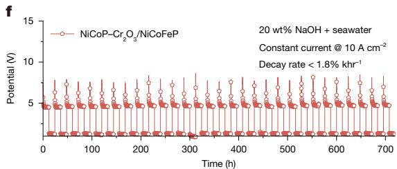

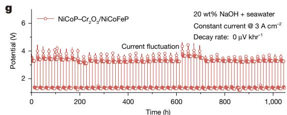

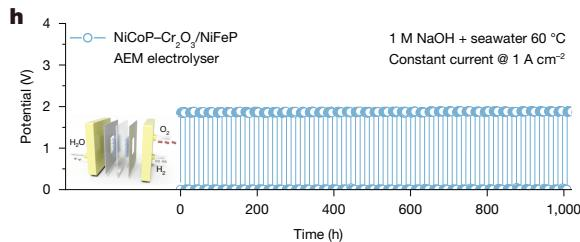
Fig. 2 | HER performance and intermittent electrolysis stability. a, Polarization curves of NiCoP– $\mathbf { C r } _ { 2 } \mathbf { O } _ { 3 }$ and NiCo–LDH recorded in $2 0 \mathrm { w t \% }$ $\mathrm { N a O H ^ { + } }$ seawater. Inset, SEM image of NiCoP– $\mathbf { \cdot C r } _ { 2 } \mathbf { O } _ { 3 }$ . Scale bar, $2 0 0 \mathsf { n m }$ . b, The overpotential of NiCoP– $\mathbf { \cdot } \mathbf { C r } _ { 2 } \mathbf { O } _ { 3 }$ at a current density of 0.1, 0.25, 0.5 and $4 \mathsf { A c m } ^ { - 2 }$ , measured in 1 M NaOH, 1 M NaOH $^ +$ seawater and $2 0 \mathsf { w t \% N a O H } +$ seawater, respectively. c, Stability comparison. d, Intermittent stability test of NiCoP– ${ \mathrm { C r } } _ { 2 } \mathbf { O } _ { 3 }$ recorded at $0 . 5 \mathsf { A c m } ^ { - 2 }$ in 1 M NaOH + seawater with 12-h start–shutdown cycles. e, Intermittent stability test of NiCoP– $\mathbf { C r } _ { 2 } \mathbf { O } _ { 3 }$ recorded at 1 A cm−2 in 1 M [EVID: EVID_FIG002]
NaOH + seawater with 10-min start–shutdown cycles. Inset, V–t curve during the first 24 h. f, Intermittent stability test of NiCoP– $\mathbf { \cdot } \mathbf { C r } _ { 2 } \mathbf { O } _ { 3 }$ recorded at $1 0 \mathsf { A c m } ^ { - 2 }$ i $1 2 0 \mathsf { w t \% N a O H } +$ seawater with 12-h start–shutdown cycles. g, Intermittent stability test of NiCoP– $\mathbf { C r } _ { 2 } \mathbf { O } _ { 3 }$ recorded at 3 A cm−2 in 20 wt% NaOH + seawater with 12-h start–shutdown cycles. h, Intermittent stability test of an AEM electrolyser (with NiCoP– $\mathbf { \cdot } \mathbf { C r } _ { 2 } \mathbf { O } _ { 3 }$ cathode and NiFeP anode) recorded at 1 A cm−2 in 1 M NaOH $^ +$ seawater with 12-h start and 6-h shutdown cycles at $6 0 ^ { \circ } \mathrm { C }$ .

could be operated under fluctuated electricity input at a current density of 1 A $\mathsf { c m } ^ { - 2 }$ for 140 h with no obvious voltage decay (Supplementary Fig. 16d).

Moreover, to examine the capability of NiCoP– $\mathbf { C r } _ { 2 } \mathbf { O } _ { 3 }$ cathode in catalysing seawater electrolysis, the HER activity and intermittent stability of NiCoP– ${ \bf \cdot C r } _ { 2 } { \bf O } _ { 3 }$ were assessed in 1 M NaOH + 0.5 M NaCl and $2 0 \mathrm { w t \% }$ $\mathrm { { N a O H ^ { + } } }$ seawater (seawater was taken from the Yellow Sea, China). The NiCoP– $\mathbf { \cdot C r } _ { 2 } \mathbf { O } _ { 3 }$ cathode exhibited excellent intermittent electrolysis stability over 300 h with almost no activity decay in 1 M $\mathsf { N a O H } + 0 . 5 \mathsf { M }$ NaCl (Supplementary Figs. 17–22), which required an overpotential of only $2 7 5 \mathrm { m V }$ to achieve a cathodic current density of 4 A cm−2 in 20 wt% NaOH + seawater (Fig. 2a,b). [EVID: EVID007]

To demonstrate the practical application potential in renewableelectricity-driven seawater electrolysis, we carried out frequent start– shutdown tests under various harsh conditions (Fig. 2c and Supplementary Table 2). The full water electrolysis cell with a NiCoP– $\mathrm { C r } _ { 2 } \mathrm { O } _ { 3 }$ cathode and a NiCoFeP anode could stably operate at a current density of $0 . 5 \mathsf { A c m } ^ { - 2 }$ for 10,000 h in 1 M NaOH + seawater with 12-h start– shutdown intervals. The activity decay rate was as low as $0 . 5 \%$ khr−1 (Fig. 2d). Even at a current density of 1 A cm−2 in 1 M NaOH $^ +$ seawater, the full water electrolysis cell could withstand 12-h start–shutdown cycles without showing obvious degradation for 6,000 h (Supplementary Fig. 23). By contrast, the NiCo–LDH cathode showed poor resistance to start–shutdown fluctuations with $2 0 . 5 8 \%$ activity decay in 800 h of intermittent electrolysis at $0 . 5 \mathsf { A c m } ^ { - 2 }$ in 1 M NaOH + seawater (Supplementary Fig. 24), owing to deactivation of electrode caused by oxidation and corrosion during start–shutdown operational cycles. [EVID: EVID003]

It is worth noting that renewable energy sources may experience marked fluctuations under real operating conditions. Therefore, we simulated extremely frequent fluctuations with 10-min start–shutdown

intervals to examine the stability of the catalyst to withstand extreme conditions. The results showed that NiCoP– $\mathbf { \cdot C r } _ { 2 } \mathbf { O } _ { 3 }$ could maintain stable operation at a current density of 1 A cm−2 in 1 M NaOH + seawater with 10-min start–shutdown cycles for 4,500 h (Fig. 2e). Even at very high operating current densities (for example, $3 { \mathrm { - } } 1 0 \mathsf { A } \mathsf { c m } ^ { - 2 }$ , the NiCoP– $\mathbf { \cdot C r } _ { 2 } \mathbf { O } _ { 3 }$ cathode showed long time stable performance in $2 0 \mathrm { w t \% }$ $\mathrm { N a O H ^ { + } }$ seawater (Fig. 2f,g, Supplementary Fig. 25 and Supplementary Note 3; for characterization of NiCoP– $\mathbf { \cdot C r } _ { 2 } \mathbf { O } _ { 3 }$ after stability tests, see Supplementary Figs. 26–37). Finally, an AEM electrolyser equipped with a NiCoP– $\mathbf { \cdot C r } _ { 2 } \mathbf { O } _ { 3 }$ cathode and a NiFeP anode was assembled, which exhibited stable performance at 1 A cm−2 in 1 M NaOH $^ +$ seawater with 12-h start–shutdown cycles for more than 1,000 h at ${ 6 0 ^ { \circ } \mathrm { C } }$ (Fig. 2h), demonstrating the practical application potential of NiCoP– ${ \bf \cdot C r } _ { 2 } { \bf O } _ { 3 }$ for renewable-electricity-driven seawater electrolysis.

# Reaction mechanism

To explore why and how NiCoP– $\mathbf { \mathrm { C r } } _ { 2 } \mathbf { O } _ { 3 }$ could maintain stable performance during intermittent water/seawater electrolysis, we carried out time-of-flight secondary ion mass spectrometry (TOF-SIMS). TOF-SIMS spectra recorded immediately after HER (Fig. 3a–d and Supplementary Fig. 38) revealed a regular distribution of elements within NiCoP– $\mathbf { \cdot } \mathbf { C r } _ { 2 } \mathbf { O } _ { 3 }$ except for the $\mathrm { C r } _ { 2 } \mathrm { O } _ { 3 }$ coating on the surface and partially oxidized $\mathsf { P O } _ { 4 } ^ { - }$ . However, after 24 h of shutdown time, elemental segregation occurred (Fig. 3e–h and Supplementary Fig. 39). The radial distribution of Co and CoO initially increased at the surface, then sharply decreased and ultimately increased again, indicating a stratified distribution of Co species within the overall structure (Fig. 3e). Notably, phosphorus also underwent phase separation (Fig. 3f) but its distribution trend is opposite to that of Co, suggesting that phosphorus may occupy the

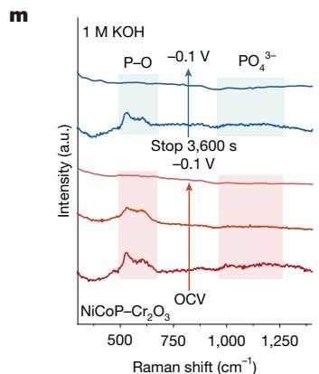

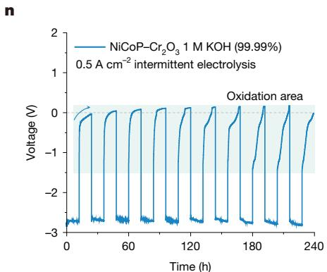

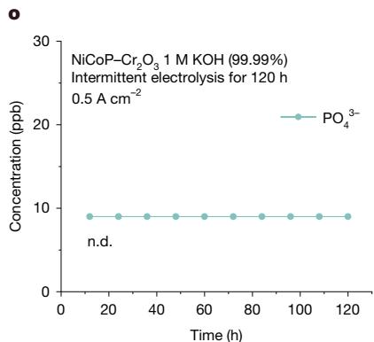
Fig. 3 | Reaction mechanism. TOF-SIMS spectra of Co (a), P (b), Ni (c) and spectra overlap (d) of NiCoP– $\mathbf { C r } _ { 2 } \mathbf { O } _ { 3 }$ after HER. TOF-SIMS spectra of Co (e), P (f), Ni (g) and spectra overlap (h) of NiCoP– $\mathbf { \cdot C r } _ { 2 } \mathbf { O } _ { 3 }$ after shutdown. $\mathsf { A } \mathsf { r } ^ { + }$ XPS spectra of Co species in NiCoP– $\mathbf { C r } _ { 2 } \mathbf { O } _ { 3 }$ after HER (i) and shutdown ( j). Ar+ XPS spectra of Ni [EVID: EVID_FIG003]
species after HER (k) and shutdown (l). m, Operando Raman spectra of NiCoP– ${ \mathrm { C r } } _ { 2 } \mathbf { O } _ { 3 }$ acquired at the intermittent condition. n, V–t curve recorded during IC test. o, IC test result showing concentration of ${ \mathsf { P O } } _ { 4 } ^ { 3 - }$ −. a.u., arbitrary units; n.d., not detected; OCV, open-circuit voltage.

interstitial spaces within the Co matrix (Fig. 3h). Meanwhile, Ni species predominantly accumulated in the inner layer, with a marked increase in concentration.

On the basis of the above TOF-SIMS results, we deduced that, after a 24-h shutdown period, a portion of cobalt segregates to the surface and, on coupling with $\mathrm { C r } _ { 2 } \mathrm { O } _ { 3 } ,$ forms an enriched oxide layer, whereas phosphorus migrates to the sublayer to construct an oxygen-rich phosphate layer. Concurrently, another fraction of Co segregates to the Ni-rich surface to form an oxidized layer. This process culminates in the formation of a compact oxide layer that shields the underlying Ni, thereby achieving passivation. Previous works on in situ formation of $\mathbf { I r O } _ { 2 }$ passivation layer20,21 and MnCr bilayer passivation layer22 suggest that the passivation layer formation begins with OH− or ${ \sf H } _ { 2 } { \sf O }$ tunnelling from the surface to the interior, followed by simultaneous passivation from both interior and exterior, with cessation of oxidation once the passivation layer is formed. Therefore, we proposed that, during the shutdown period, Co segregates to the surface and interior regions owing to the enrichment of $\mathrm { O H } ^ { - } / \mathrm { H } _ { 2 } \mathrm { O }$ at these places, leading to electron loss and binding with oxygen. Subsequently, P is displaced by the Co-rich oxygen layer and migrates to the sublayer, at which it forms a phosphate-enriched layer as passivation progresses. Ultimately, the stacking of these three oxidized layers completes the passivation process. The phase segregation may be attributed to the affinity variation of different elements for oxygen, leading to formation of a stratified structure (Co has the highest affinity for oxygen binding, followed by P). Under the protection of the passivation layer formed by the oxygen-rich region, the oxidation process is terminated. This stratified structure is beneficial in resisting excessive oxidation and protecting the active Ni sites. [EVID: EVID010]

It is noteworthy that, after HER, the distribution of Ni species was uniform (Fig. 3c), with elemental Ni intensity at the level of $1 0 ^ { - 2 }$ . However, after oxidation, the intensity of internal Ni substantially increased to $1 0 ^ { - 1 }$ (Fig. 3g), indicating a rare phenomenon of increased zero-valent Ni under oxidative potential. Meanwhile, the oxidation state of Co species after shutdown was much higher than that immediately after HER, suggesting that, during oxidation in the shutdown period, Co and P were subjected to oxidation, which donated electrons to Ni, maintaining most of the Ni in a reduced state that ensured the following HER activity. $\mathbf { A } \mathbf { r } ^ { + } \mathbf { X } .$ -ray photoelectron spectroscopy (XPS) measurement further confirmed the electronic structure change of NiCoP– ${ \bf \cdot C r } _ { 2 } { \bf O } _ { 3 }$ under intermittent electrolysis conditions (Supplementary Figs. 40 and 41), revealing a marked increase in the oxidation state of Co after shutdown (Fig. 3i,j). Unlike Co, the intensity of ${ \mathsf { N i } } ^ { 0 }$ peak after 22.13 s of Ar+ etching was even higher than that immediately after HER (Fig. 3k,l and Supplementary Fig. 42), indicating an increased number of ${ \bf N i } ^ { 0 }$ active sites after shutdown, consistent with the conclusion drawn from TOF-SIMS. Further nonlinear least squares fitting (NLLSF) analysis of shutdown samples demonstrated that the surface layer of Co species contains a large proportion of high-valence states $( 6 5 . 1 5 \% \mathbf { C 0 } ^ { 3 + }$ , $3 4 . 8 5 \% \mathrm { C o } ^ { 2 + }$ ), whereas the interior is predominantly divalent (Supplementary Fig. 43 and Supplementary Table 4). In contrast to Co, which exhibits no prominent zero-valent peak, the proportion of ${ \bf N i } ^ { 0 }$ increases with sputtering time, reaching $1 5 . 3 7 \%$ at a sputtering duration of 100.79 s (Supplementary Fig. 44 and Supplementary Table 5). This suggests that Co can substitute for Ni during oxidation in the shutdown period, leading to the formation of a passivation layer that further protects Ni from excessive oxidation, enabling Ni to maintain a substantial zero-valent state even under oxidative potential and facilitating HER when electrolysis is turned on again (Fig. 3g).

To substantiate whether the phosphate oxidation layer can be recovered during the cycling process, operando Raman spectroscopy measurements were conducted to monitor the surface structure change under start–shutdown conditions (Fig. 3m). Under the open-circuit voltage condition, distinct P–O and phosphate ion vibrations23 were

observed on NiCoP– $\mathbf { \cdot C r } _ { 2 } \mathbf { O } _ { 3 }$ owing to facile oxidation of phosphides in air. As the applied cathodic potential increased to −0.1 V versus RHE, the P–O vibration gradually disappeared with time, indicating gradual reduction of P. Subsequently, after the removal of the cathodic potential and a 3,600-s wait period, the P–O vibration peak re-emerged, attributed to the reformation of the phosphorus-rich oxidation layer, which then disappeared during the subsequent HER process. This observation indicates that the phosphate oxidation layer can achieve dynamic recovery during intermittent electrolysis (Supplementary Fig. 45).

Moreover, as well as the issue of reversed oxidation at the cathode during start–shutdown electrolysis cycles, the presence of a large amount of halide ions in seawater also presents threats to the cathode. We observed that the phosphate ion vibrational peak appeared during the shutdown period and disappeared during HER, suggesting that under the shutdown condition, phosphate ion could be generated that would effectively resist chloride ions approaching the cathode through electrostatic repulsion23. The phosphate ion formation on NiCoP– $\mathbf { \cdot C r } _ { 2 } \mathbf { O } _ { 3 }$ under the shutdown condition was also verified by TOF-SIMS (Fig. 3f). To determine whether the phosphate ion formed on NiCoP– ${ \bf \cdot C r } _ { 2 } { \bf O } _ { 3 }$ under shutdown condition could dissolve into solution, a 120-h time-dependent ion chromatography (IC) measurement (Fig. 3n, Supplementary Figs. 46 and 47 and Supplementary Note 5) was conducted on the electrolyte removed during HER and shutdown period. The result showed that the phosphate ion content was less than 10 ppb (Fig. 3o), lower than the detection limit. On the basis of the above investigations, it is proposed that the dynamic redox of P under fluctuating electrolysis conditions can maintain a reversible life cycle between P and phosphate/phosphate ion, serving as a protection layer in achieving stable, long-term water/seawater electrolysis powered by intermittent renewable energy sources.

Furthermore, we used high-angle annular dark-field scanning transmission electron microscopy (HAADF-STEM) to analyse the composition of NiCoP– ${ \bf \cdot C r } _ { 2 } { \bf O } _ { 3 }$ in two distinct states (Fig. 4a): after HER and after shutdown. The HAADF-STEM image of the sample after HER exhibits a regular NiCoP lattice (Fig. 4b,d). Electron energy loss spectroscopy (EELS) and atomic elemental mapping (Fig. 4b,d and Supplementary Fig. 48) indicate that it shares the same atomic structure as the hexagonal NiCoP. The sample after shutdown reveals formation of passivation layers (Fig. 4c and Supplementary Figs. 49 and 50), showing a combination of CoO and ${ \mathrm { C r } } _ { 2 } { \mathrm { O } } _ { 3 }$ at the outermost layer, followed by an amorphous layer of phosphates, a high-contrast cubic CoO lattice (Fig. 4e and Supplementary Fig. 51) and finally NiCoP lattice in the innermost layer. EELS (Fig. 4f,g and Supplementary Fig. 48) substantiated the oxidation process in which cobalt was oxidized to form CoO (ref. 24), transitioning from the NiCoP phase to the CoO phase. Concurrently, Ni and P species migrated to the inner layer and sublayer, respectively, resulting in the formation of a Ni-rich inner layer and a cobalt phosphate sublayer (Figs. 3h and 4c and Supplementary Note 6). [EVID: EVID012]

The recovery process in subsequent electrolysis following the formation of a stratified oxidation layer after shutdown is equally important, as the presence of oxidation layer shall greatly reduce the hydrogen evolution activity. We conducted HAADF-STEM measurements on the NiCoP– ${ \bf \cdot C r } _ { 2 } { \bf O } _ { 3 }$ sample after several start–shutdown electrolysis cycles and the results revealed a hexagonal NiCoP lattice identical to that observed immediately after HER (Supplementary Fig. 52). This confirmed that the stratified passivation layer could achieve dynamic recovery under reductive potential, aligning well with the conclusion drawn from the operando Raman spectroscopy measurement. By comparing the EELS spectrum of the post-cycle sample with that of the post-HER sample (Fig. 4h and Supplementary Figs. 53–55), we observed no shifts in the Ni L-edge, Co L-edge and P K-edge peaks, indicating that the valence states of nickel and cobalt in NiCoP– ${ \bf \cdot C r } _ { 2 } { \bf O } _ { 3 }$ could be well maintained throughout the numerous electrolysis cycles. [EVID: EVID011]

b

c

d

e

f

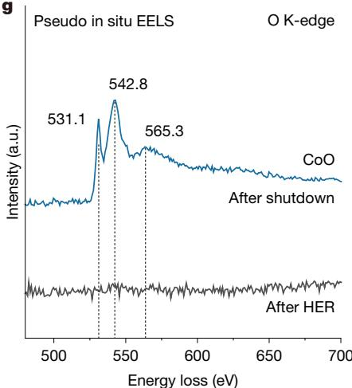

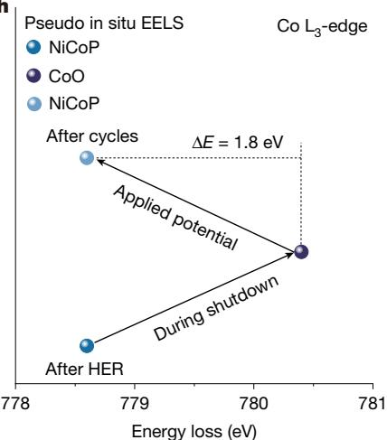
h
Fig. 4 | Structural evolution during intermittent electrolysis. a, Schematic showing the passivation formation and recovery process during intermittent electrolysis. b, HAADF-STEM image of NiCoP– $\mathbf { C r } _ { 2 } \mathbf { O } _ { 3 }$ after HER and the corresponding elemental mappings. Scale bars, 5 nm (main), 1 nm (elements). c, HAADF-STEM image of NiCoP– $\mathbf { \cdot } \mathbf { C r } _ { 2 } \mathbf { O } _ { 3 }$ after shutdown. Scale bars, 10 nm (main), 2 nm (insets). Atomic HAADF-STEM image and the corresponding atomic [EVID: EVID_FIG004]
structure of NiCoP (d; grey, Ni; blue, Co; purple, P) and CoO (e; blue: Co, red: O). Scale bars, 2 nm. EELS spectrum of $\mathrm { C o L } _ { 2 } / \mathrm { L } _ { 3 }$ -edge (f) and O K-edge (g) recorded after HER and after shutdown. h, Peak position of ${ \bf C o L } _ { 3 }$ -edge collected from the EELS spectra of NiCoP– $\mathbf { \cdot C r } _ { 2 } \mathbf { O } _ { 3 }$ after HER, after shutdown and after cycles. a.u., arbitrary units.

a
I

II

III

IV

V

VI

c
I

II

III

IV

V

VI

e
I

II

III

IV

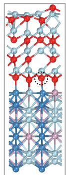
V

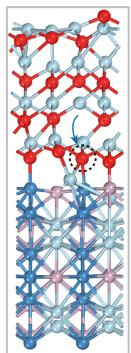
VI
Fig. 5 | Theoretical calculation. a–f, Oxygen migration procedure and the corresponding free energy diagrams from CoO to the interface of CoO and $\mathsf { C o P O } _ { 4 }$ (a,b; light blue, Co; red, O; purple, P; orange, O in CoPOx), from $\mathbf { C o P O _ { 4 } }$ [EVID: EVID_FIG005]

f
to the interface of $\mathsf { C o P O } _ { 4 }$ and CoO (c,d; light blue, Co; red, O; purple, P; orange, O in CoPO ) and from CoO to the interface of CoO and NiCoP (e,f; light blue, Co; red, O; purple, P; blue, Ni).

# Theoretical insight

To explore the oxidation process of NiCoP– ${ \bf \cdot C r } _ { 2 } { \bf O } _ { 3 }$ under shutdown condition, we performed adsorption energy calculations for OH− on different sites to assess the propensity of each element to undergo oxidation (Supplementary Fig. 56a). The calculation results show that Co exhibits the lowest binding energy to OH− $\Delta G = - 0 . 5 4 \mathrm { e V } )$ ), followed by $\mathsf { P } ( \Delta G = - 0 . 3 1 \mathrm { e V } )$ ) and then Ni $\Delta G = - 0 . 0 6 \mathrm { e V }$ ) (Supplementary Fig. 56b), indicating a decreasing oxidation tendency. When $\mathrm { O H ^ { - } }$ attacks the surface and diffuses to the interior of NiCoP– ${ \mathrm { C r } } _ { 2 } \mathbf { O } _ { 3 }$ , Co will be oxidized first, followed by P, whereas Ni is less susceptible to oxidation under the protection of Co and P. Our theoretical findings align well with the TOF-SIMS, HAADF-STEM and XPS results: Co was found oxidized within the surface and inner layer of the catalyst to form CoO, followed by a progressive oxidation of P, resulting in the formation of a passivation layer, protecting Ni from oxidation. To further demonstrate how the multilayered passivation structure resists oxidation and preserves active sites for recovery during the next hydrogen evolution cycle, we have constructed three multilayer structure models based on the crystal structure observed in HAADF-STEM and simulated the dynamic

procedure of oxygen diffusion from the bulk phase to the interface in each model (Fig. 5). The results show that the energy barrier for oxygen migrating from CoO to ${ \mathsf { C o P O } } _ { 4 }$ is relatively low (0.31 eV); this is attributed to the greater stability of $\mathrm { C o P O _ { 4 } }$ as compared with CoO, which can facilitate oxygen accumulation at the interface of CoO and $\mathrm { C o P O _ { 4 } }$ during O migration, leading to further oxidation and enrichment of $\mathrm { C o P O _ { 4 } } ,$ , thereby increasing the thickness of the passivation layer (Fig. 5a,b). However, once ${ \mathsf { C o P O } } _ { 4 }$ is formed, the energy barrier increases sharply, making it difficult for oxygen to further migrate through the ${ \mathsf { C o P O } } _ { 4 }$ layer (3.41 eV). This is because of the higher coordination number of P with O, which impedes oxygen migration (Fig. 5c,d). Finally, the permeation of oxygen from CoO to the interface of CoO and NiCoP is also challenging (1.79 eV), thereby providing overall protection to the Ni sites from excessive oxidation (Fig. 5e,f) and benefit for the recovery during the next hydrogen evolution cycle. [EVID: EVID013]

To understand the protective effect of phosphate generated on NiCoP– $\mathbf { \cdot C r } _ { 2 } \mathbf { O } _ { 3 }$ during shutdown against chloride ion adsorption, we constructed pure Ni, NiCoP, NiCoP– ${ \bf \cdot C r } _ { 2 } { \bf O } _ { 3 }$ and NiCoP– ${ \bf \cdot C r } _ { 2 } { \bf O } _ { 3 }$ with surface-attached phosphate models (Supplementary Fig. 56c) and calculated their adsorption energy to Cl− . Supplementary Fig. 56d

shows that, when P is oxidized to phosphate on the surface of NiCoP– $\mathrm { C r } _ { 2 } \mathrm { O } _ { 3 } ,$ the adsorption energy of Cl− on Ni sites turns positive, indicating unfavourable Cl− adsorption to the Ni sites, which may prevent Cl− adsorption to protect the catalyst and nickel foam substrate23,25 under shutdown condition.

# Discussion

We have shown that intermittent water electrolysis powered by renewable electricity possesses challenges such as electrode oxidation and halide ion corrosion (when seawater is used as feedstock) at the cathode during the shutdown period, which have been previously overlooked. By introducing non-metal species with a wide range of oxidation states and high oxygen coordination numbers, such as phosphorus, along with metal oxides to in situ create a passivation layer, we show that deactivation of cathode during shutdown periods in intermittent electrolysis can be greatly attenuated. When seawater is used as the feedstock, the in situ-formed phosphate on the cathode can resist halide ions’ adsorption/corrosion to the cathode catalyst and substrate during shutdown periods. Following this strategy, we have developed a NiCoP– $\mathbf { C r } _ { 2 } \mathbf { O } _ { 3 }$ HER electrocatalyst and achieved 10,000-h intermittent electrolysis in seawater at $0 . 5 \mathsf { A c m } ^ { - 2 }$ with a small voltage decay rate of less than $0 . 5 \% \mathsf { k h r ^ { - 1 } }$ . Our work paves a direction in addressing degradation of HER electrocatalysts during intermittent electrolysis, which may directly resolve the issue in AEM electrolysers and alkaline electrolysers coupled with fluctuating renewable energy sources. [EVID: EVID014]

# Online content

Any methods, additional references, Nature Portfolio reporting summaries, source data, extended data, supplementary information, acknowledgements, peer review information; details of author contributions and competing interests; and statements of data and code availability are available at https://doi.org/10.1038/s41586-025-08610-1.

# Methods

# Materials

Nickel(ii) nitrate hexahydrate $( \mathsf { N i } ( \mathsf { N O } _ { 3 } ) _ { 2 } { \cdot } 6 \mathsf { H } _ { 2 } \mathsf { O }$ , $98 \%$ , Tianjin Fuchen Chemical Reagent Factory), iron(iii) nitrate nine-hydrate $\left( \mathrm { F e } ( \mathsf { N O } _ { 3 } ) _ { 3 } { \cdot } 9 \mathsf { H } _ { 2 } \mathbf { O } \right.$ , $9 8 \%$ , Sigma-Aldrich), cobalt(ii) nitrate hexahydrate $( { \bf C o } ( { \bf N O } _ { 3 } ) _ { 2 } { \cdot } 6 { \sf H } _ { 2 } { \bf O } _ { 3 }$ , $9 8 . 5 \%$ , Xilong Chemical Industry Incorporated Co., Ltd.), chromium nitrate nine-hydrate $( \mathrm { C r } ( \mathsf { N O } _ { 3 } ) _ { 3 } { \cdot } 9 \mathsf { H } _ { 2 } \mathsf { O } _ { }$ , AR, Xilong Chemical Industry), ammonium fluoride $\mathrm { ( N H } _ { 4 } \mathrm { , }$ , $96 \%$ , Xilong Chemical Industry), urea $\mathrm { C H } _ { 4 } \mathsf { N } _ { 2 } \mathsf { O }$ , $9 9 . 5 \%$ , Sigma-Aldrich), sodium monophosphate $( \mathsf { N a P O } _ { 2 } \mathsf { H } _ { 2 } { \cdot } \mathsf { H } _ { 2 } \mathsf { O } _ { }$ - $9 9 . 5 \%$ , Sigma-Aldrich), sodium hydroxide (NaOH, AR, Tianjin Fuchen Chemical Reagent Factory), sodium chloride (NaCl, $9 9 . 5 \%$ , Tianjin Fuchen Chemical Reagent Factory) and ethanol $( { \bf C } _ { 2 } { \sf H } _ { 5 } { \bf O } { \sf H } _ { ☉ }$ , AR, FUYU Chemical) were used as received. Seawater was taken from the Yellow Sea, China. Deionized water with resistivity $\geq 2$ MΩ was used to prepare all aqueous solutions.

# Synthesis of NiCo–LDH

NiCo–LDH was synthesized on nickel foam through a hydrothermal method. In a typical synthesis, a piece of commercial Ni foam $( 3 \times 4 \mathrm { c m } ^ { 2 } )$ was cleaned by ultrasonication with ethanol and deionized water for 15 min, respectively, and the substrate was then transferred into a Teflon-lined stainless-steel autoclave $( 4 0 \mathrm { m l } )$ ) containing a homogenous solution of $3 6 \mathrm { m l }$ deionized water, ${ \sf N i } ( { \sf N O } _ { 3 } ) _ { 2 } { \cdot } 6 { \sf H } _ { 2 } { \sf O }$ (0.5 mmol), $\mathrm { C o } ( \mathsf { N O } _ { 3 } ) _ { 2 } { \cdot } 6 \mathsf { H } _ { 2 } \mathrm { O }$ (0.5 mmol), $\mathsf { N H } _ { 4 } \mathsf { F }$ (4 mmol) and urea $\left( \mathbf { C H } _ { 4 } \mathbf { N } _ { 2 } \mathbf { O } , 5 \mathbf { m m o l } \right)$ ). Afterwards, the autoclave was sealed and maintained at $1 0 0 ^ { \circ } \mathrm { C }$ for 8 h. After reaction, the sample was taken out and washed three times with deionized water and ethanol, respectively, and dried at $6 0 ^ { \circ } \mathrm { C }$ for $^ \mathrm { { 1 0 h } }$ under vacuum.

# Synthesis of NiCoP

NiCoP was synthesized by phosphorization of NiCo–LDH in a tube furnace. Briefly, 0.5 g of ${ \bf N a H } _ { 2 } { \bf P } { \bf O } _ { 2 } { \bf \cdot H } _ { 2 } { \bf O }$ was placed upstream in a quartz tube to serve as the phosphorous source, whereas the obtained NiCo– LDH was placed at the centre of the quartz tube and then the quartz tube was heated at $3 0 0 ^ { \circ } \mathrm { C }$ for 2 h with a heating rate of $2 ^ { \circ } \mathrm { C } \mathsf { m i n } ^ { - 1 }$ in Ar atmosphere. After reaction, the furnace was turned off and naturally cooled to room temperature under Ar atmosphere to obtain NiCoP. The amount of ${ \sf N a H } _ { 2 } { \sf P O } _ { 2 } { \cdot } { \sf H } _ { 2 } { \cal O }$ depends on the NiCo–LDH surface area; specifically, $\mathbf { 0 . 5 8 }$ of ${ \mathsf { N a H } } _ { 2 } { \mathsf { P O } } _ { 2 } { \cdot } { \mathsf { H } } _ { 2 } { \mathsf { O } }$ corresponds to a NiCo–LDH area of $3 \times 4 \mathsf { c m } ^ { 2 }$ .

# Synthesis of NiCoP– $\mathbf { { C r } _ { 2 } 0 } _ { 3 }$

NiCoP– $\mathbf { \cdot C r } _ { 2 } \mathbf { O } _ { 3 }$ was prepared by electrodepositing chromium hydroxide onto NiCoP, followed by dehydration and calcination. First, chromium hydroxide was electrodeposited onto NiCoP using a two-electrode system, with NiCoP as the working electrode $( 1 \mathsf { c m } ^ { 2 } )$ and a stainless-steel mesh as the counter electrode, and the electrolyte solution contained 6 mmol $\Gamma ^ { - 1 } { \bf C r } ( \Gamma ( \Gamma ( { \bf N O } _ { 3 } ) _ { 3 } { \cdot } 9 { \bf H } _ { 2 } { \bf O }$ . The electrodeposition current was set as $- 1 0 \mathsf { m A } \mathsf { c m } ^ { - 2 }$ , with deposition time ranging from 10 to 1,800 s. After electrodeposition, the electrode was placed in a quartz tube, which was heated at $3 0 0 ^ { \circ } \mathrm { C }$ for 2 h in a tube furnace under Ar atmosphere. The obtained electrode is labelled as NiCoP– $C \Gamma _ { 2 } 0 _ { 3 } { - } x ,$ in which x represents the duration of chromium hydroxide electrodeposition. Unless otherwise specified, NiCoP– $\mathbf { C r } _ { 2 } \mathbf { O } _ { 3 }$ refers to NiCoP– $\mathbf { C r } _ { 2 } \mathbf { O } _ { 3 }$ –10 in the manuscript.

# Synthesis of NiCoFeP

First, NiCoFe hydroxide was synthesized on nickel foam using a hydrothermal method. A piece of commercial Ni foam $( 3 \times 4 \thinspace \mathrm { c m } ^ { 2 } )$ was cleaned by ultrasonication with ethanol and deionized water for 15 min, respectively, and the substrate was then transferred to a Teflon-lined stainless-steel autoclave $( 4 0 \mathrm { m l } )$ ) containing a homogenous solution of $3 6 \mathrm { m l }$ deionized water, $\mathrm { C o } ( \mathsf { N O } _ { 3 } ) _ { 2 } { \cdot } 6 \mathsf { H } _ { 2 } \mathrm { O }$ (3 mmol), $\mathsf { F e } ( \mathsf { N O } _ { 3 } ) _ { 3 } { \cdot } 9 \mathsf { H } _ { 2 } \mathsf { O }$ (1 mmol), $\mathsf { N H } _ { 4 } \mathsf { F }$ (4 mmol) and urea $\mathrm { C H } _ { 4 } \mathsf { N } _ { 2 } \mathsf { O }$ , 5 mmol).

Afterwards, the autoclave was sealed and maintained at $1 2 0 { ^ \circ \mathrm { C } }$ for 6 h. After reaction, the sample was taken out and washed three times with deionized water and ethanol, respectively, and dried at $6 0 ^ { \circ } \mathrm { C }$ for 10 h under vacuum. NiCoFeP was synthesized by phosphorization of NiCoFe hydroxide. Briefly, $\mathbf { 0 . 5 8 }$ of ${ \mathsf { N a H } } _ { 2 } { \mathsf { P O } } _ { 2 } { \cdot } { \mathsf { H } } _ { 2 } { \mathsf { O } }$ was placed upstream in a quartz tube to serve as the phosphorous source, whereas the obtained NiCoFe hydroxide was placed at the centre of the quartz tube and then the quartz tube was heated at $3 0 0 ^ { \circ } \mathrm { C }$ for 2 h with a heating rate of $2 ^ { \circ } \mathrm { C } \mathsf { m i n } ^ { - 1 }$ in Ar atmosphere. The amount of ${ \mathsf { N a H } } _ { 2 } { \mathsf { P O } } _ { 2 } { \cdot } { \mathsf { H } } _ { 2 } { \mathsf { O } }$ depends on the NiCoFe hydroxide surface area; specifically, $0 . 5 { \bf g }$ of ${ \mathsf { N a H } } _ { 2 } { \mathsf { P O } } _ { 2 } { \cdot } { \mathsf { H } } _ { 2 } { \mathsf { O } }$ corresponds to a NiCoFe hydroxide area of $3 \times 4 \mathrm { c m } ^ { 2 }$ . After reaction, the furnace was turned off and naturally cooled to room temperature under Ar atmosphere to obtain NiCoFeP.

# Synthesis of NiFeP

NiFeP was synthesized by the same method as for NiCoFeP but using ${ \mathsf { N i } } ( { \mathsf { N O } } _ { 3 } ) _ { 2 } { \cdot } 6 { \mathsf { H } } _ { 2 } { \mathsf { O } }$ (0.66 mmol), $\mathsf { F e } ( \mathsf { N O } _ { 3 } ) _ { 3 } { \cdot } 9 \mathsf { H } _ { 2 } \mathsf { O }$ (0.33 mmol) and urea $\mathrm { C H } _ { 4 } \mathsf { N } _ { 2 } \mathsf { O }$ , 5 mmol) to prepare NiFe–LDH.

# Synthesis of Ni $/ \mathbf { N i O } / \mathbf { C r } _ { 2 } \mathbf { O } _ { 3 }$

${ \sf N i } / { \sf N i O } / { \sf C r } _ { 2 } { \sf O } _ { 3 }$ electrode was prepared by means of electrodeposition followed by vacuum calcination. First, an electrodeposition solution was prepared by dissolving 5 mmol ${ \mathsf { N i } } ( { \mathsf { N O } } _ { 3 } ) _ { 2 } { \cdot } 6 { \mathsf { H } } _ { 2 } { \mathsf { O } }$ and 0.6 mmol $\mathrm { C r } ( \mathsf { N O } _ { 3 } ) _ { 3 } { \cdot } 9 \mathsf { H } _ { 2 } \mathrm { O }$ in $1 5 0 \mathrm { m l }$ of water. A piece of commercial Ni foam $( 2 \times 3 \mathrm { c m } ^ { 2 } )$ was cleaned by ultrasonication with ethanol and deionized water for 15 min, respectively. Using a three-electrode system, the nickel foam served as the working electrode $( 2 \times 3 \mathsf { c m } ^ { 2 } )$ ), a stainless-steel mesh as the counter electrode and a saturated calomel electrode as the reference electrode. Electrodeposition was carried out at $- 1 . 2 \nu$ until a charge of $5 0 \mathsf { C } \mathsf { c m } ^ { - 2 }$ was reached. After reaction, the electrode was taken out and washed three times with deionized water and ethanol, respectively, and dried at $6 0 ^ { \circ } \mathrm { C }$ for $^ \mathrm { 1 0 \hbar }$ under vacuum. Afterwards, the dried electrode was placed in a quartz tube, which was heated at $3 0 0 ^ { \circ } \mathrm { C }$ for 1 h under $5 \% \mathsf { H } _ { 2 }$ atmosphere to obtain $\mathsf { N i } / \mathsf { N i O } / \mathsf { C r } _ { 2 } \mathbf { O } _ { 3 }$ electrode.

# Electrochemical measurement

All electrochemical measurements were performed on a threeelectrode setup using a CHI660E electrochemical workstation (Shanghai Chenhua Instrument Co., Ltd.). The as-prepared NiCoP– ${ \bf \cdot C r } _ { 2 } { \bf O } _ { 3 }$ served as a working electrode $\scriptstyle \mathbf { 1 } \mathbf { c m } ^ { 2 }$ working area) and a NiCoFeP electrode and a $\mathsf { H g / H g O }$ electrode served as the counter electrode and the reference electrode, respectively. Cyclic voltammetry was measured at a scan rate of $2 \mathsf { m } \mathsf { V } \mathsf { s } ^ { - 1 }$ after 40 cycles of cyclic voltammetry activation with a scan rate of $1 0 0 \mathrm { \ m V s ^ { - 1 } }$ . Electrochemical impedance spectroscopy was measured by applying an AC voltage of $5 \mathsf { m } \mathsf { V }$ with a frequency from $1 , 0 0 0 \mathsf { k H z }$ to $0 . 1 \mathsf { H z }$ . All polarization curves were corrected for ohmic drop compensation with ohmic resistance obtained by electrochemical impedance spectroscopy. The Hg/HgO reference electrode against the RHE scale was directly measured by a two-electrode setup, consisting of a RHE and a $\mathsf { H g / H g O }$ reference electrode to be calibrated. An open circuit potential measurement was applied after RHE saturation of high-purity ${ \sf H } _ { 2 }$ gas, obtaining a stable potential. This potential is the difference between RHE and the $\mathsf { H g / H g O }$ reference electrode (Supplementary Figs. 58 and 59).

# AEM electrolyser measurement

The AEM electrolyser was assembled with NiFe–LDH as anode $( 4 \thinspace { \mathrm { c m } } ^ { 2 } )$ , NiCoP– $\mathbf { \cdot C r } _ { 2 } \mathbf { O } _ { 3 }$ as cathode $( 4 \thinspace { \mathrm { c m } } ^ { 2 } )$ ) and a PiperION A20 AEM (Versogen). The performance of the AEM electrolyser was assessed using a Zahner XC electrochemical workstation (Zahner) in 1 M KOH at $6 0 ^ { \circ } \mathrm { C }$ and $8 0 ^ { \circ } \mathrm { C }$ , respectively. Linear sweep voltammetry measurements were performed at a scan rate of $1 0 \mathrm { m V } \mathsf { s } ^ { - 1 }$ after 40 cycles of cyclic voltammetry activation (scan rate $1 0 0 \mathrm { m V s ^ { - 1 } }$ ). Electrochemical impedance

spectroscopy was measured by applying an AC voltage of 5 mV with a frequency from 1,000 kHz to 0.1 Hz. The intermittent stability test was conducted at 1 A cm−2 in 1 M KOH (at $6 0 ^ { \circ } \mathrm { C } )$ and 1 M NaOH + seawater (at $6 0 ^ { \circ } \mathrm { C } )$ ) with Ni foam/NiFeP as anode and NiCoP– ${ \mathrm { { C r } } _ { 2 } } { \bf { O } } _ { 3 }$ as cathode, respectively.

# Operando Raman characterization

The operando Raman spectra were collected on a LabRAM ARA-MIS (HORIBA Jobin Yvon) using a PSU-H-FDA 532-nm laser source (Changchun New Industries Optoelectronics Technology Co., Ltd.). A LMPlanFLN $5 0 \times$ microscope objective lens with a numerical aperture of 0.5 (Olympus) was used for Raman microscopy. Operando electrochemical Raman experiments were performed in an operando Raman cell (Tianjin Aida Hengsheng Technology Development Co., Ltd.). NiCoP– $\mathrm { C r } _ { 2 } \mathrm { O } _ { 3 } ,$ , Hg/HgO and Pt foil were used as the working electrode, reference electrode and counter electrode, respectively. A CHI660E electrochemical workstation (Shanghai Chenhua Instrument Co., Ltd.) was used to control the potential at which the applied potential was increased from open circuit potential to −0.1 V versus RHE. Each spectrum was obtained at least three times with a measurement time of 30 s.

# Operando ATR-SEIRAS characterization

The operando attenuated total reflectance surface-enhanced infrared absorption spectroscopy (ATR-SEIRAS) spectra were recorded on a Nicolet iS50 FTIR Spectrometer equipped with a mercury cadmium telluride detector cooled by liquid nitrogen and a PIKE VeeMAX III variable angle ATR sampling accessory. The spectral resolution was set to $8 \mathrm { c m ^ { - 1 } }$ and 64 interferograms were obtained for each spectrum. The spectra are shown in absorption units defined as $\mathbf { A } = - \mathrm { l o g } { \left( R / R _ { 0 } \right) }$ , in which $R$ and $R _ { 0 }$ represent the reflected infrared intensities corresponding to the sample and the reference single-beam spectrum, respectively. Ultrathin Au film was deposited chemically for infrared signal enhancement and conduction of electrons. The NiCoP– ${ \bf \cdot C r } _ { 2 } { \bf O } _ { 3 }$ electrocatalyst was dropped onto the Au film to serve as a working electrode for SEIRAS experiments with a loading of $0 . 0 5 \mathsf { m g c m } ^ { - 2 }$ . A platinum wire and a saturated calomel electrode were used as the counter and reference electrodes, respectively. 1 M KOH was used as the electrolyte. The chronopotentiometry method was adopted at different potentials (−1.02 to −1.52 V versus saturated calomel electrode). The SEIRAS spectra were collected during the chronopotentiometry test. The reference single-beam spectrum was collected at 0 V versus RHE.

# Material characterization

Scanning electron microscopy (SEM) images were obtained on a Zeiss SUPRA 55 scanning electron microscope, which was operated at $2 0 \mathrm { k V } .$ X-ray powder diffraction patterns were recorded on an X-ray diffractometer (Rigaku D/Max 2500) in the diffraction angle range from $1 0 ^ { \circ }$ to $9 0 ^ { \circ }$ at a scan rate of $5 ^ { \circ } \mathsf { m i n } ^ { - 1 }$ . XPS spectra were recorded on an ESCALAB 250 (ThermoFisher Scientific USA) photoelectron spectrometer using monochromate Al Kα 150-W X-ray beam. All binding energies were referenced to the C 1 s peak (284.8 eV). IC measurement was recorded on a ICS- $5 0 0 0 +$ (ThermoFisher Scientific USA).

# HAADF-STEM characterization

The HAADF-STEM images were acquired using a Thermo Fisher Spectra 300 microscope equipped with an aberration corrector for the probe-forming lens, operated at $3 0 0 \mathsf { k V } .$ . Before imaging, the as-prepared sample was dispersed into anhydrous ethanol under ultrasonication to form a dilute colloidal suspension. Then $2 0 \mu \mathrm { l }$ of suspension was dripped onto a 230 mesh Cu grid coated with ultrathin carbon. The beam current was lower than 40 pA and the STEM convergence semiangle was approximately 25 mrad, which provided a probe size of about $\overset { \smile } { 0 . 6 } \mathring { \mathbf { A } }$ at $3 0 0 \mathsf { k V } .$

# TOF-SIMS measurement

The TOF-SIMS spectra were obtained on a TOF.SIMS 5-100 (ION-TOF GmbH). For TOF-SIMS depth profiling, a ${ \mathsf { C } } { \mathsf { s } } ^ { + }$ ion beam (≈120 nA, 2 keV) was used to sputter a $2 0 0 \times 2 0 0 \mu \mathrm { m } ^ { 2 }$ area. Cs was chosen to decrease the work function of the surface $( \approx 2 \mathsf { e V } )$ to increase the ionization probability of negatively charged secondary ions, whereas a $\mathsf { B i } _ { 3 } ^ { + }$ analysis beam (0.75 pA, 30 keV) was raster scanned over a $5 0 \times 5 0 \mu \mathrm { m } ^ { 2 }$ area, centred within the ${ \mathsf { C } } { \mathsf { s } } ^ { + }$ sputtered area, segmented into $2 5 6 \times 2 5 6$ pixels in high current mode. The sputter rate was about 2.52 nm s−1 on GaN.

# Computational methods

All the spin polarized calculations were performed in the framework of the density functional theory (DFT) as implemented in the Vienna ab initio simulation package (VASP)26,27. The nuclei–core electron interactions were treated by the projector augmented wave potentials, and the exchange-correlation interactions were described by the Perdew–Burke–Ernzerhof functional28,29. In the structure optimization of NiCoP– $\mathbf { C r } _ { 2 } \mathbf { O } _ { 3 }$ , the plane-wave basis set with the energy cutoff at 400 eV was employed, and the Monkhorst–Pack k-point samplings were set as $3 \times 3 \times 3 .$ . The model consisted of four layers with a $3 \times 3 \times 1$ k-point grid and a 18 Å vacuum layer. To correct for the on-site Coulomb interaction of the 3d orbitals, the U-values for the transition metals Ni, Cr and Co were chosen as 6.4, 3.3 and 3.5, respectively. The calculation of oxygen migration procedure is based on the method of climbing image nudged elastic band (CI-NEB)30,31. The Perdew–Burke–Ernzerhof form of the generalized gradient approximation is chosen as the exchange correlation functionals32. The energy cut-off was 500 eV. The $5 \times 2 \times 1$ and $5 \times 4 \times 1 \mathrm { k }$ -points were used for amorphous $\mathsf { C o P O _ { 4 } / C o O }$ and NiCoP/ CoO, respectively. All interface structures were relaxed with energy and force relaxation criteria of $1 0 ^ { - 5 }$ eV and $0 . 0 2 \mathrm { e V } \mathring { \mathbf { A } } ^ { - 1 }$ . The amorphous ${ \mathsf { C o P O } } _ { 4 }$ (Pna2 ) structure was created with the typical melt quenching method: the ${ \mathrm { C o P O } } _ { 4 }$ structure (containing 48 atoms) was melted and equilibrated from 3,000 K to 300 K for 20 ps. This process was performed with ab initio molecular dynamics. In the CI-NEB calculation, we found three diffusion paths with diffusion distances all around $2 \mathring { \mathsf { A } }$ , corresponding to oxygen atoms crossing the CoO/amorphous $\mathrm { C o P O } _ { 4 } ,$ amorphous CoPO /CoO and CoO/NiCoP interfaces, respectively. Each path produces four intermediate images for optimization. Owing to the complexity of the system, the force convergence criterion was relaxed to $0 . 0 3 \mathrm { e V } \mathring { \mathbf { A } } ^ { - 1 }$ .

# Data availability

The data that support the findings of this study have been included in the main text and the Supplementary Information.

financial support from the Young Elite Scientists Sponsorship Program by CAST (2022QNRC001). B.L. acknowledges financial support from the City University of Hong Kong startup fund (9020003), ITF-RTH-Global STEM Professorship (9446006) and JC STEM lab of Advanced $\mathsf { C O } _ { 2 }$ Upcycling (9228005).

Author contributions X.S., B.L. and D.Z. supervised the project. Q.S. and S.W. conceived the idea and carried out the experiments and also conducted materials synthesis and electrochemical measurements. Q.S. wrote the paper. X.G., T.L. and Z. Zhuang helped with the anion exchange membrane test. L.Y., S.L. and X.G. helped with the stability test. H.L., Y.F. and Z. Zhang performed the density functional theory calculations.

Competing interests The authors declare no competing interests.

# Additional information

Supplementary information The online version contains supplementary material available at https://doi.org/10.1038/s41586-025-08610-1.

Correspondence and requests for materials should be addressed to Daojin Zhou, Bin Liu or Xiaoming Sun.

Peer review information Nature thanks Xiaoqiang Du and the other, anonymous, reviewer(s) for their contribution to the peer review of this work.

Reprints and permissions information is available at http://www.nature.com/reprints.
