# Probing Electrode Transformation under Dynamic Operation for Alkaline Water Electrolysis

Guanzhi Wang, Haoyi Li, Finn Babbe, Andrew Tricker, Ethan J. Crumlin, Junko Yano, Rangachary Mukundan,* and Xiong Peng*

Alkaline water electrolyzers (AWEs) play a pivotal role in the realm of large-scale hydrogen production. However, AWEs face significant challenges in electrode degradation particularly under dynamic operating conditions, induced by reverse current phenomenon during frequent startup/shutdown. Herein, this study aims to rationalize the degradation mechanisms of AWEs under these conditions. A three-electrode membrane electrode assembly (MEA) setup is first utilized to decouple polarization behaviors of anode and cathode in AWEs. Following a proposed accelerated stress testing protocol, the setup allows for tracking individual electrode performance transformations during frequent reverse current operation. Integrating operando cell studies with in situ and post-mortem characterizations, it is showed that continuous formation of highly active species, nickel (oxy)hydroxides, improves the anode performance for oxygen evolution reaction. On the contrary, irreversible oxidation of nickel to $\beta$ -nickel hydroxide results in a severe degradation of cathode, leading to material dissolution, poor electrical conductivity and loss of catalytic activity for hydrogen evolution reaction. These results provide insights in nickel-based electrode transformation mechanisms for alkaline water electrolysis and indicate that cathode with higher redox reversibility can potentially improve durability of AWEs under dynamic conditions.

# 1. Introduction

Alkaline water electrolyzers are among one of the most wellestablished technologies for industrial $\mathrm { H } _ { 2 }$ production, having

been deployed since the last century.[1] AWEs offer advantages such as costeffectiveness, longevity, and scalability.[2] However, AWEs are often not viewed as the most promising technology to achieve low-cost hydrogen productions. A key aspect to reduce the levelized cost of produced hydrogen is to operate AWEs in a dynamic mode, where cheaper electricity can be leveraged. However, application of AWE systems in dynamic operation is limited by their susceptibility to load fluctuations resulting from intermittent power supply.[3] A major challenge to reconcile AWEs with load variation is gas impurity and safety issues at low loads (typically $2 5 \% - 4 5 \%$ of rated full load), which primarily arises from gas crossover between anode and cathode.[4] To prevent formation of a flammable $\mathrm { H } _ { 2 } / \mathrm { O } _ { 2 }$ gas mixture, a safety shutdown is often required, particularly when $\mathrm { H } _ { 2 }$ content in $\mathrm { O } _ { 2 }$ exceeds $2 \ \mathrm { \ v o l \% }$ on the anode, corresponding to ${ \approx } 5 0 \%$ of the lower explosive limit.[5] Consequently, AWEs are subject to frequent startup

and shut down operations to ensure system safety, which imposes additional stress on electrodes/electrocatalysts, potentially shortening service lifetime of AWE system.[6,7] In particular, electrode degradation caused by reverse current (RC)

G. Wang, F. Babbe, A. Tricker, R. Mukundan, X. Peng

Energy Storage and Distributed Resources Division

Lawrence Berkeley National Laboratory

Berkeley, CA 94720, USA

E-mail: rmukundan@lbl.gov; xiongp@lbl.gov

H. Li, J. Yano

Liquid Sunlight Alliance

Lawrence Berkeley National Laboratory

Berkeley, CA 94720, USA

The ORCID identification number(s) for the author(s) of this article can be found under https://doi.org/10.1002/aenm.202500886

$\circledcirc$ 2025 The Author(s). Advanced Energy Materials published by Wiley-VCH GmbH. This is an open access article under the terms of the Creative Commons Attribution License, which permits use, distribution and reproduction in any medium, provided the original work is properly cited.

DOI: 10.1002/aenm.202500886

H. Li, E. J. Crumlin

Chemical Sciences Division

Lawrence Berkeley National Laboratory

Berkeley, CA 94720, USA

E. J. Crumlin

Advanced Light Source

Lawrence Berkeley National Laboratory

Berkeley, CA 94720, USA

J. Yano

Molecular Biophysics and Integrated Bioimaging Division

Lawrence Berkeley National Laboratory

Berkeley, CA 94720, USA

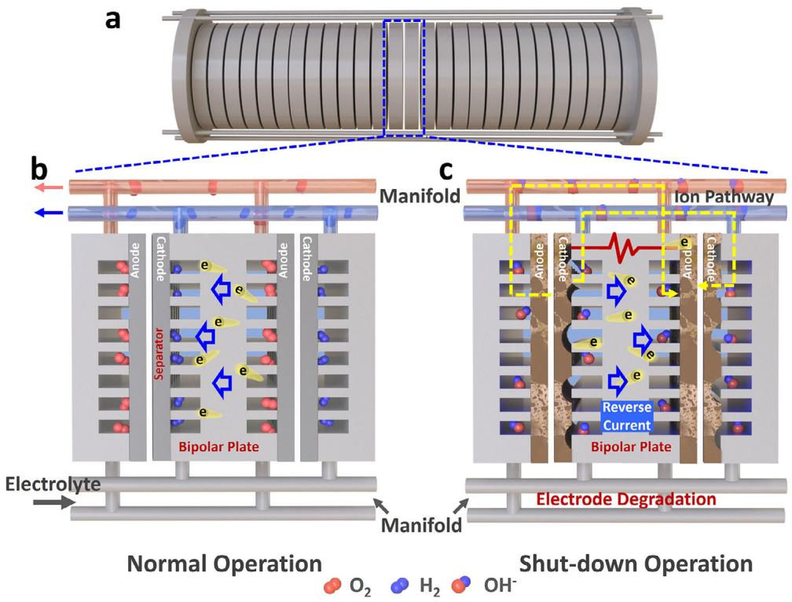
Figure 1. Schematic illustration of the current flow during normal and shutdown operation of AWEs. a) A typical bipolar-type multi-cell AWEs stack configuration. b) Operating process during normal electrolysis condition and c) reverse current flow between cathode and anode during the shutdown condition in AWEs.

phenomenon in AWE stack system is one of the most challenging issues.[6]

Most AWEs operate in a stack configuration consisting of multiple zero-gap cells and are of bipolar type, where anode and cathode are directly connected by a bipolar plate between each adjacent cell ( a). In a typical bipolar-Figure 1type AWE stack, electrolyte is fed via manifolds to anode or cathode chambers of the cells, which are electrically connected in series.[8] Due to this design, each anode and cathode of the next cell is not only electrically connected through metallic structure of bipolar plate but also ionically connected through electrolyte in the manifold. Under normal operation, cathodes and anodes undergo reduction and oxidation, facilitating hydrogen evolution reaction (HER) and oxygen evolution reaction (OER), respectively (Figure 1b). During AWE system shut-down, bipolar plate acts as a galvanic cell with an electromotive force (emf) equal to the potential difference between the respective anode and cathode, initiating a spontaneous selfdischarge process (Figure 1c).[9] Accordingly, a RC flows in the opposite direction of standard electrolysis current between anode and cathode of each bipolar plate, continuing until a potential equilibrium is eventually reached between these two electrodes. This results in reverse redox reactions, i.e., reduction on anode and oxidation on cathode, of electrodes of each bipolar plate.[10,11] Repetitive startup/shutdown operations of AWEs can lead to oxidation/reduction cycles at cathode/anode, ultimately causing performance deterioration of electrodes. In practice, this issue is often mitigated by equipping AWEs with an additional power source to provide a low protective current during system

shutdowns.[12] Although being effective, such engineering solutions can negatively impact balance of plants, leading to additional operating costs, as well as concerns of flammable gas mixing as illustrated before. Therefore, a comprehensive understanding of the RC phenomenon and its detrimental effects on electrodes is essential for developing effective mitigation strategies to minimize electrode degradation during shutdown operations and enable dynamic operation of AWEs.

Several studies have explored degradation mechanisms associated with RC phenomenon in AWEs. Mitsushima et al. examined the impact of operational and shutdown parameters on RC phenomenon in AWEs.[9,13,14] Kim et al. developed a simplified RC simulation model and proposed cathodic protection methods using sacrificial metal to enhance RC tolerance.[15] However, these studies were conducted in two-electrode cell configurations without a reference electrode, making it challenging to isolate the electrochemical processes at a specific electrode (anode or cathode), which is vital for a thorough investigation of degradation mechanisms in AWEs under RC conditions. Moreover, it could be challenging to investigate RC phenomenon in conventional lab-scale AWEs, as the corresponding experimental setups struggle to replicate complex interactions and operational conditions that induce RC in industrial AWE stacks. Therefore, designing experiments that can consistently induce RCs in a controllable manner to simulate the phenomenon could bridge the gap between intrinsic properties of electrode materials and performance transformations under realistic operations, which is important to advance fundamental insights in degradation mechanism.

Herein, we first utilize a custom-built three-electrode MEA setup, by incorporating a reference electrode that is ionically connected to the separator, to decouple electrochemical behaviors of anode and cathode during the RC process induced by shutdown of AWEs. Then, we propose an accelerated stress testing (AST) protocol to simulate RC phenomenon in lab-scale zero-gap AWE single cell. By tracking anode and cathode performance transformation at various cycling stages using the three-electrode MEA setup, we quantify impact of RC on electrode performance and stability of AWEs. Leveraging a series of post-mortem and in situ characterizations, we elucidate detailed degradation mechanisms of AWE systems under repetitive startup/shutdown operations. This insight is instrumental in adapting AWEs to dynamic operations and thus expanding the application of AWEs as well as other emerging electrochemical devices for decarbonization applications.

# 2. Results and Discussion

# 2.1. Quantify Electrochemical Behaviors in Reverse Current Process

The schematic depicted in  a illustrates primary compo-Figure 2nents of the custom-built three-electrode MEA setup for a zerogap AWE, featuring a main cell (left) and an external reference cell (right). The main cell was assembled in a zero-gap configuration with commonly used nickel (Ni) felt electrodes for both anode and cathode, complemented by commercial Zirfon separators (Agfa Perl UTP 500) and other cell components arranged in single cell hardware. 7 m KOH $( 8 0 ~ ^ { \circ } \mathrm { C } )$ aqueous electrolyte was fed to both anode and cathode at $2 0 \mathrm { m l } \mathrm { m i n } ^ { - 1 }$ while the cell was also heated to $8 0 ~ ^ { \circ } \mathrm { C }$ (see details in Figure S1, Supporting Information and Experimental Section). An anion exchange membrane (AEM) strip extends from the inactive portion on cathode side of the Zirfon separator into the external reference cell. This strip serves as an ionic conductor, linking a leakless Ag/AgCl reference electrode with polyether ether ketone (PEEK) housing to anode/cathode. Deionized (DI) water saturated the reference cell to ensure AEM hydration and a robust ionic connection with the main cell.[16] Ideally, this AEM strip configuration allows reference electrode to function similarly to a Luggin capillary in electrochemistry, enabling it to sense the electrolyte potential along an equipotential surface between the two electrodes.[17] This is effective as long as reference electrode is positioned at a distance more than three times of the separator’s thickness from the edge of the active electrodes.[18] As shown in Figure 2b, reference electrode was placed ${ \approx } 6 . 5 ~ \mathrm { c m }$ away from the edge of cathode, well beyond three times of the separator thickness of $0 . 1 5 ~ \mathrm { c m }$ . One possible limitation of this setup is the edge effect caused by electrode misalignment, which significantly affects reference sensing point, leading to inconsistency between different measurements.[19] Nevertheless, if the electrode misalignment factor, $( d / \delta$ , where $d$ is the electrode misalignment and $\delta$ is the electrolyte thickness) exceeds 5 (Figure S2, Supporting Information), the reference sensing point becomes less sensitive to the misalignment factor and cell voltage or current.[20] The measured potential consistently matches the potential at the protruding electrode/membrane interface.[21] To capitalize on this, we deliberately employed an oversized cathode, $6 . 2 5 \mathrm { c m } ^ { 2 }$ , creating a large

misalignment factor, 5.2, thereby stabilizing the position of reference sensing point at cathode/separator interface during testing. This arrangement ensures that ohmic overpotentials from electrolyte and separator are mostly measured on anode side, allowing for independent monitoring of anode and cathode potentials relative to the reference electrode.

The polarization curves of the anode (upper) and cathode (lower) relative to reversible hydrogen electrode (RHE) are presented in Figure 2c. The voltage breakdown derived from anode and cathode polarization curves and electrochemical impedance spectroscopy (EIS), as shown in Figure 2d, highlights several crucial aspects of zero-gap AWE performance. The primary overpotentials of AWEs predominantly come from kinetic losses on both anode and cathode using Ni as electrodes, registering $3 1 0 \mathrm { m V }$ on cathode and $4 2 0 \mathrm { m V }$ on anode at a current density of $2 \mathrm { A c m } ^ { - 2 }$ . Meanwhile, residual overpotential, which is primarily a combination of mass transport and electrode ionic resistance loss, is not insignificant for AWEs, especially for anode side $1 4 3 ~ \mathrm { m V }$ at $2 \mathrm { A c m } ^ { - 2 }$ ). This indicates a potential pathway to further improve AWE efficiencies by optimizing electrode structure for efficient electrolyte supply and bubble management.[22,23] As illustrated previously, the measured anode ohmic overpotential exceeds that of cathode, due to the fact that reference sensing point is closer to cathode side, which is also corroborated by Nyquist plots for both anode and cathode (Figure S3, Supporting Information). The full cell impedance is a sum of impedances from each electrode at their respective frequencies, with cathode exhibiting a much lower high-frequency resistance (HFR) compared to anode, aligning with earlier inferences.[18]

Before addressing issues of electrode degradation induced by RC, it’s essential to comprehend the thermodynamics and possible electrochemical reactions of electrodes during self-discharge process triggered by RC flow under startup/shutdown conditions. Thus, we began by developing a RC simulation protocol in a single AWE cell, aiming at designing experiments to induce RC in a controllable manner. Under normal operation, electrolyzer was connected to one potentiostat (PS1) and operated under a constant current for 5 min. To simulate shutdown condition where electrode at each side of a bipolar plate would quickly depolarize and reach equal potential in AWEs stack, a constant voltage of 0 V was applied between anode and cathode using a chronoamperometry (CA) technique for 5 min, thereby inducing RC. Concurrently, electrolyzer was connected to the second potentiostat (PS2) to enable synchronous monitoring of anode and cathode potentials against the reference electrode, as previously described. The potential profiles are depicted in Figure 2e for anode and cathode during repetitive startup/shutdown operations at varying current densities. Under normal electrolysis operation at constant currents, potentials of anode and cathode, as well as the overall cell voltage, align with polarization curves depicted in Figure 2c, for instance, ${ \approx } 1 . 7 ~ \mathrm { V }$ versus RHE for anode and ${ \approx } \mathrm { - } 0 . 2 \ \mathrm { V }$ versus RHE for cathode, and overpotentials for both anode and cathode increase with current densities (Figure S4, Supporting Information). Without applying 0 V between anode and cathode after shutdown, anode and cathode exhibited notably slow depolarization behavior, maintaining potentials above 1.2 V versus RHE and below 0 V versus RHE for a long period with no reverse current detected, respectively (Figure S5, Supporting Information). In contrast, once 0 V was applied, potentials for

a
h

C
d

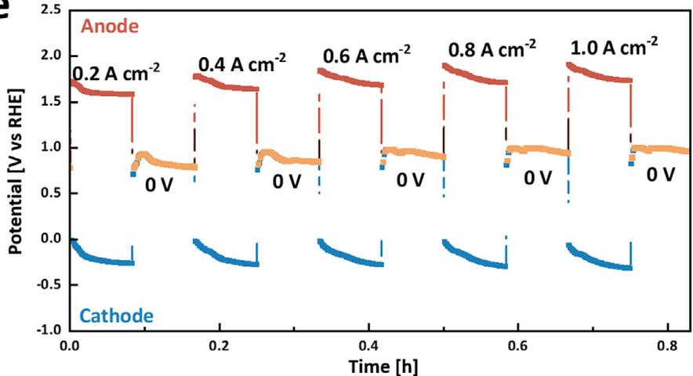
e

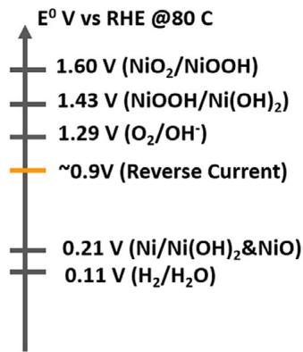

Figure 2. Three electrode MEA setup and electrochemical behaviors of Ni electrodes under reverse current process. a) Schematic view of the threeelectrode MEA of zero-gap AWE cell, including the main cell (left) and the ionically connected external reference electrode (right) through the AEM strip. b) Illustration of the dimension and reference electrode sensing point of the 3-electrode MEA set-up to obtain decoupled anode/cathode potentials and full cell voltage. c) Polarization curves for the anode (top) and cathode (bottom). d) Applied-voltage breakdown of the zero-gap AWE. e) Potential profiles of anode (red) and cathode (blue) under normal operation with different currents applied and under shutdown where zero voltage (orange) is applied to mimic the reverse current. f) Diagram of the expected redox potentials for the nickel-water phase in alkaline environment (not drawn at scale).

anode and cathode rapidly declined and increased, respectively, covering to equal potential simultaneously. This results in a transient current density of $- 2 . 4 \mathrm { ~ A ~ c m } ^ { - 2 }$ before rapidly diminishing to zero within seconds. These negative currents, moving in opposite directions compared to the normal electrolysis current flow,

confirm a successful induction of reverse-current process in a single AWE cell (Figure S4, Supporting Information). Note that the induced reverse current in this single cell will be likely to be higher than actual reverse current in an AWE stack, as electrolyte resistance passing through the separator in this single

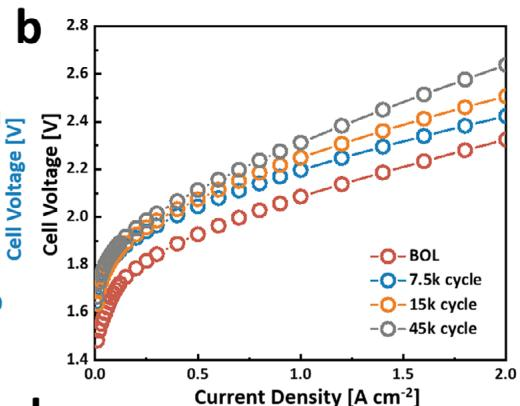

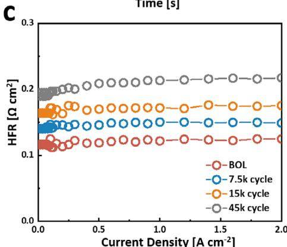

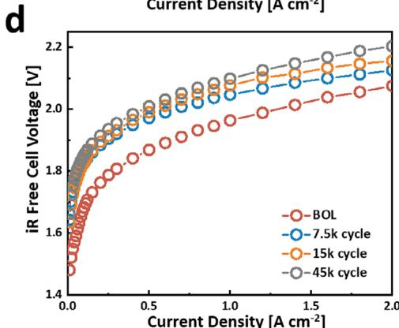
Figure 3. Full cell electrochemical performance under repetitive startup/shutdown process for AWEs. a) Reverse-current AST protocol employing load cycle between $1 \mathsf { A c m } ^ { - 2 }$ and 0 V. b) Full cell polarization curves, c) HFRs and d) iR-free polarization curves of AWE using Ni felt electrodes as both anode and cathode during $4 5 ~ \mathrm { k }$ of the reverse-current ASTs.

cell is much lower than that through manifolds in cell stacks. During shutdown operation, anode and cathode potentials remain equal and stabilize at ${ \approx } 0 . 9 \mathrm { ~ V ~ }$ versus RHE after brief fluctuations. Drawing from redox potential diagram for reactions of the Ni-water phase (Figure 2f), possible electrochemical reactions occurring on electrode during startup/shutdown operations can be deduced.[24] During normal electrolysis operation, anode facilitates the OER, continuously turning metallic Ni to oxidized species such as nickel dioxide $( \mathrm { N i O } _ { 2 } )$ or nickel (oxy)hydroxide NiOOH.[25] While HER occurs mostly on metallic Ni surface on cathode. During electrolyzer shutdown, anode potential shifts to 0.9 V versus RHE, likely corresponding to reduction of surface oxidized species from $\mathrm { N i O } _ { 2 }$ to NiOOH or from NiOOH to nickel hydroxide $\mathrm { ( N i ( O H ) } _ { 2 } )$ ), and reduction of dissolved $\mathrm { O } _ { 2 }$ to hydroxide ions $\left( \mathrm { O H ^ { - } } \right)$ . The cathode is likely to undergo oxidation of surface metallic Ni to $\mathrm { N i } ( \mathrm { O H } ) _ { 2 }$ or nickel oxide (NiO) and the possible oxidation of dissolved $\mathrm { H } _ { 2 }$ to $\mathrm { H } _ { 2 } \mathrm { O }$ . Although these reactions can occur, the dominant factor and mechanism leading to AWEs degradation have not been well understood.

# 2.2. Reverse Current Accelerated-Stress Testing (AST)

To probe how frequent startup/shutdown could induce electrode degradation and mechanism behind, we propose an AST protocol for single-cell AWEs to simulate reverse current behaviors. As illustrated in a, the AST protocol consists of an operation at $1 \mathrm { A c m } ^ { - 2 }$ Figure 3to represent normal load operation followed by apply-

ing 0 V between anode and cathode to mimic the shutdown process, therefore inducing reverse current behavior.[26] The rapid cycling between normal operating conditions and shutdown typically imposes greater stress on electrodes, thus accelerating their degradation. This approach allows for shorter experimental durations and minimizes confounding effects from degradation of other components and factors. To examine its effectiveness, a $5 \mathrm { c m } ^ { 2 }$ AWE equipped with reference electrode was deployed to follow the proposed AST protocol for a total of 45k cycles, with polarization curves and EIS recorded at various stages of cycling.

Notable performance loss was observed when comparing the beginning-of-life (BOL) and post- $4 5 \mathrm { k }$ cycle performance, with overpotential increased by $1 0 0 \mathrm { m V }$ after $7 . 5 \mathrm { k }$ cycles, $1 8 0 ~ \mathrm { m V }$ after 15k cycles, and ultimately over $3 0 0 \mathrm { m V }$ (from 2.32 to 2.64 V) after $4 5 \mathrm { k }$ cycles at $2 \mathrm { A c m } ^ { - 2 }$ compared to BOL (Figure 3b). Analysis of polarization curves and HFR values at different cycling stages reveals several trends. First, HFRs of AWE cell at various current, derived from EIS, demonstrates a continuous increase as AST progresses (Figure 3c), indicating that ohmic loss is one of the primary sources of overall performance loss, amounting to $\approx 1 8 5 ~ \mathrm { m V }$ overpotential increase at $2 \mathrm { ~ A ~ c m } ^ { - 2 }$ after $4 5 \mathrm { ~ k ~ }$ cycles. Second, iR-free polarization curves indicate considerable kinetic and transport overpotential losses during the first $7 . 5 \mathrm { k }$ cycles; however, these increases are minor in the subsequent cycles (Figure 3d). Nyquist plots, as shown in Figure S6 (Supporting Information), reaffirm these findings, showing larger charge transfer resistances and a noticeable mass transport impedance at low frequency regions beginning from $7 . 5 \mathrm { k }$ cycles compared

a

b

C

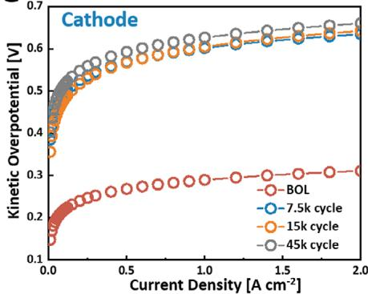
C

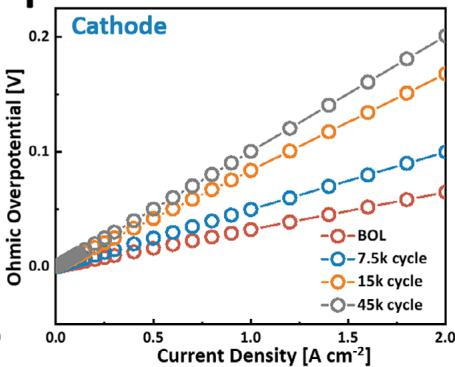

Figure 4. Tracking anode and cathode electrochemical performance for OER and HER, respectively during RC ASTs. a,d) Polarization curves, b,e) kinetic overpotentials, and c,f) ohmic overpotentials for anode and cathode measured at various cycles through reverse-current ASTs, respectively.

to BOL. These results show that RC process degrades AWE cell performance through various mechanisms, including increased system ohmic resistance, diminished electrodes catalytic activities, as well as impaired mass transport.

# 2.3. Electrochemical Behaviors of Anode and Cathode during Reverse Current AST

Thanks to the three-electrode MEA setup, we were able to quantify how RC AST cycles could impact anode and cathode polarization and impedance behaviors. A corresponding voltage breakdown analysis was also conducted to evaluate the relative role of ohmic resistance, kinetics and transport in cell performance degradation for both anode and cathode. Surprisingly, for anode, there was significant performance improvement after the initial $7 . 5 \mathrm { ~ k ~ }$ cycles compared to BOL, with about a $2 5 0 ~ \mathrm { m V }$ decrease in overpotential at $2 \mathrm { ~ A ~ c m } ^ { - 2 }$ (from 2.045 V vs RHE to $1 . 8 0 0 \mathrm { V }$ vs RHE, a). Over the subsequent $3 7 . 5 \mathrm { k }$ cycles, an-Figure 4ode performance remained relatively stable. The primary source of performance improvement comes from reduction of kinetic overpotential, with about a $2 0 0 { \cdot } \mathrm { m V }$ decline in kinetic overpotential at $2 \mathrm { ~ A ~ c m } ^ { - 2 }$ compared to that of the BOL (from 420 to $2 2 0 \mathrm { m V } ,$ Figure 4b). The improvement in apparent electrode kinetics is also evident from Tafel plots, where a reduction in Tafel slopes is observed $( 1 0 2 ~ \mathrm { m V ~ d e c ^ { - 1 } }$ at BOL vs 66 mV dec−1 after $4 5 \mathrm { ~ k ~ }$ cycles, Figure S7a, Supporting Information). Additionally, residual overpotential also decreased following RC AST operation (Figure S7b, Supporting Information), which could be related to improved electrode surface bubble management due to

enhanced surface roughness after RC AST,[27] while inappreciable changes in ohmic resistance-based losses for anode were observed during AST cycling (Figure 4c). To examine the validity and reliability of these analytical conclusions derived from threeelectrode MEA measurements, OER electrocatalytic activities of the post-AST anode and a pristine anode were measured in a beaker cell, respectively, with comparisons presented in Figure S8 (Supporting Information). The post-AST anode demonstrates enhanced OER performance compared to pristine anode, with a smaller Tafel slope and a substantially increased electrochemical double-layer capacitance $( \mathrm { C _ { \mathrm { e d l } } } )$ , which is consistent with previous analysis of considerable improvement of anode toward OER during RC AST.

On the contrary, cathode exhibited a severe performance deterioration after the initial $7 . 5 \mathrm { ~ k ~ }$ cycles of RC AST, with a notable overpotential increase of $3 4 4 ~ \mathrm { m V }$ at $2 \mathrm { ~ A ~ c m } ^ { - 2 }$ compared to BOL $( - 0 . 2 8 0 \mathrm { \ V }$ vs RHE to $- 0 . 6 2 4 \mathrm { ~ V ~ }$ vs RHE). In the following cycles, repetitive startup/shutdown AST continues to degrade cathode performance, eventually resulting in a $5 1 4 ~ \mathrm { m V }$ increase in overpotential at $2 \mathrm { A c m } ^ { - 2 }$ $( - 0 . 7 9 4 \mathrm { V }$ vs RHE, Figure 4d). The deteriorating performance primarily stems from cathode kinetic loss, evident from nearly $3 5 0 ~ \mathrm { m V }$ increase in kinetic overpotential at $2 \mathrm { A c m } ^ { - 2 }$ (0.311 $\mathrm { \Delta V _ { B O L } }$ to $0 . 6 6 0 \mathrm { V } _ { 4 5 \mathrm { k } }$ in Figure 4e) and enhanced Tafel slop for HER (81 mV dec −1 vs $1 1 6 \mathrm { m V } \mathrm { d e c } ^ { - 1 }$ , Figure S9, Supporting Information). Unlike the relatively small changes in ohmic loss for anode, cathode experiences a continuous increase in ohmic losses throughout AST cycling, amounting to a $1 3 6 \mathrm { m V }$ increase in ohmic overpotential at $2 \mathrm { A c m } ^ { - 2 }$ $( 0 . 0 6 5 \mathrm { V } _ { \mathrm { B O L } }$ to $0 . 2 0 1 \mathrm { V } _ { 4 5 \mathrm { k } }$ $\mathrm { V } _ { 4 5 \mathrm { k } }$ , Figure 4f). To verify the above analysis, beaker cell testing for post-AST cathode was also conducted. As shown in

a

b

C

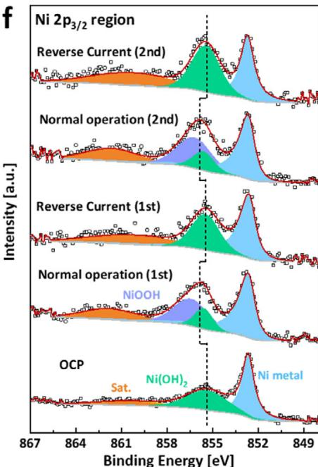

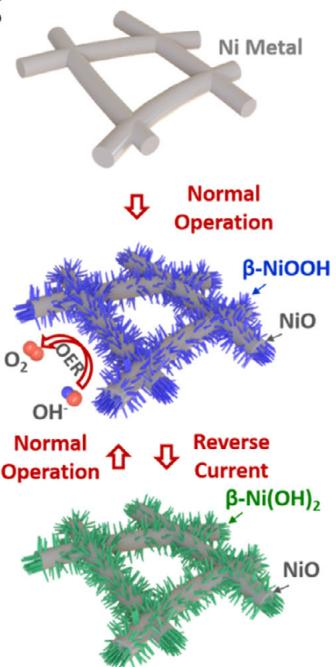
g

Figure 5. Anode Ni electrode transformation mechanism under continuous RC AST cycles. a–c) SEM images of Ni anode after 45k AST cycles. d) XRD pattern and e, Raman spectra Ni anode after $4 5 \mathrm { k }$ AST cycles. f) In situ APXPS measurements of Ni anode under two cycles of normal and reverse current operations. g) Schematic illustration of the reaction process for the anode during the AST cycles.

Figure S10 (Supporting Information), post-AST cathode shows deteriorated HER activity, with a significantly higher Tafel slope of $5 1 6 \mathrm { m V } \mathrm { d e c } ^ { - 1 }$ compared to $1 1 2 \mathrm { m V } \mathrm { d e c } ^ { - 1 }$ of a pristine cathode, and a slight reduction in $\mathrm { C _ { \mathrm { e d l } } }$ .

Therefore, one can conclude that RC phenomenon induced by frequent AWE startup/shutdown operation may have opposite effects on Ni-based anode and cathode. While RC leads to performance enhancement for Ni anode, it results in extreme performance deterioration for Ni cathode. However, degradation of cathode far outweighs improvement seen on anode, leading to severe overall full cell performance loss for AWE after RC AST cycling.

# 2.4. Unravel the Degradation Mechanism

To investigate the underlying mechanism of activity transformations of Ni electrodes during RC AST operations, a series of post-

mortem and in situ characterizations were conducted on both anode and cathode. The morphology of post-AST anode was first examined by scanning electron microscopy (SEM) ( a–c). Figure 5While the original porous structure of Ni electrode is preserved for post-AST anode (Figures S11 and S12, Supporting Information), surface morphology of Ni fibers has been roughened significantly. Notably, the entire surface of Ni fibers is homogeneously covered by vertically arranged nanoneedles, rendering a dense surface coating layer (highlighted in red dotted box, Figure 5b,c; Figure S13a–c, Supporting Information), which is consistent with increase of $\mathrm { C _ { \mathrm { e d l } } }$ of post-AST anode (Figure S8, Supporting Information). The enhancement in surface area could also reduce bubble-induced overpotential, as shown by the reduction in residual overpotential (Figure S7a, Supporting Information). Energy-dispersive X-ray spectroscopy (EDS) mapping in Figure S14 (Supporting Information) indicates that these nanoneedles primarily consist of Ni and O. It should also be noted that a different morphology is observed in the region of Ni fibers that is in

direct contact with separator (highlighted in yellow dotted box of Figure 5a), consisting of numerous nanoparticles and polymeric substances (Figure S13d,e, Supporting Information). SEM-EDS mapping indicates a mixture of $\mathrm { Z r O } _ { 2 }$ particles and polymer, likely to be detached from Zirfon separator and subsequently transferred to Ni anode surface (Figure S15, Supporting Information). The well-defined diffraction peaks in X-ray diffraction (XRD) pattern at $4 4 . 5 ^ { \circ }$ , $5 1 . 8 ^ { \circ }$ , and $7 6 . 4 ^ { \circ }$ align well with metallic Ni (JCPDS No. 04–0850) and are attributed to residual metallic Ni phase beneath the oxidized dense layer on Ni anode (Figure 5d). Most of the signature diffraction peaks coincide well with standard XRD patterns of nickel oxide hydroxide compounds, $\mathrm { N i } _ { 2 } \mathrm { O } _ { 3 } \mathrm { H }$ , JCPDS No. 40–1179 and NiOOH, JCPDS No. 27–0956. The absence of $\mathrm { Z r O } _ { 2 }$ diffraction peaks is due to the fact that only small quantity of $\mathrm { Z r O } _ { 2 }$ particles is present on the surface is beyond the detection limit of XRD.

Raman spectroscopy measurements were further performed to analyze surface elemental composition and detailed chemical environment. The strong Raman peaks observed at 483 and $5 6 0 \mathrm { c m } ^ { - 1 }$ are assigned to $\mathrm { e _ { g } }$ bending vibration and $\mathbf { A } _ { 1 \mathrm { g } }$ stretching vibration modes of Ni-O in NiOOH (Figure 5e), respectively.[28,29] Additionally, a broad peak at $8 9 2 ~ \mathrm { c m ^ { - 1 } }$ attributed to “active oxygen” in the oxyhydroxide structure is identified. The other two strong Raman peaks at 447 and $5 0 4 ~ \mathrm { c m ^ { - 1 } }$ are related to $\mathsf { A } _ { 1 \mathrm { g } }$ stretching modes of Ni-OH and Ni-O in $\mathrm { N i } ( \mathrm { O H } ) _ { 2 }$ , respectively.[30] The three Raman peaks at $\approx 3 5 0 \ c m ^ { - 1 }$ are ascribed to $\mathrm { Z r O } _ { 2 }$ particles from separator (Figure S16, Supporting Information). Compared to the large amount of metal phase in pristine Ni felt (Figure S17, Supporting Information), The Ni 2p region of Xray photoelectron spectroscopy (XPS) in Figure S18 (Supporting Information) displays typical characteristics for Ni oxide hydroxide, consisting of NiO, $\mathrm { N i } ( \mathrm { O H } ) _ { 2 }$ , and NiOOH, consistent with results of XRD patterns and Raman spectrum.[31] The result shows that dense coating layer of uniformly and vertically arranged nanoneedles formed on Ni fiber electrode surface during RC AST cycling are primarily composed of oxidized Ni compounds of $\mathrm { N i ( O H ) _ { 2 } / N i O O H }$ .

To further investigate the chemical dynamics of Ni anode during normal and subsequent RC operations, synchrotron radiation-based in situ ambient pressure XPS (in situ APXPS) with tender X-rays (photon energy $= 4 \mathrm { \ k e V } _ { i }$ ) was employed to study oxidation states of electrocatalytic Ni sites (Figure 5f).[32,33] The Ni $2 \mathsf { p } _ { 3 / 2 }$ region was monitored during each operational stage, with a Ni metal foil serving as working electrode. Under opencircuit potential (OCP) operation, metallic Ni and $\mathrm { N i } ( \mathrm { O H } ) _ { 2 }$ coexisted on electrode surface. As the applied potential was increased to operational potential for OER (1.6 V vs RHE), a significant amount of NiOOH formed, accompanied by a decrease in ${ \mathrm { N i } } ( { \mathrm { O H } } ) _ { 2 }$ , indicating the transformation of ${ \mathrm { N i } } ( { \mathrm { O H } } ) _ { 2 }$ to electrocatalytically active $\mathrm { N i } ^ { 3 + }$ sites for OER. Upon switching to RC operation, where anode potential was set to $0 . 9 \mathrm { ~ V ~ }$ versus RHE, the absence of NiOOH peak accompanied by enhancement of $\mathrm { N i } ( \mathrm { O H } ) _ { 2 }$ peak was observed, showing complete reduction of NiOOH back to $\mathrm { N i } ( \mathrm { O H } ) _ { 2 }$ . A similar Ni redox dynamics between $\mathrm { N i } ( \mathrm { O H } ) _ { 2 }$ and NiOOH was also observed in the second cycle from APXPS. These results imply that a relatively reversible transformation of $\mathrm { N i } ( \mathrm { O H } ) _ { 2 }  \mathrm { N i O O H }$ upon continuous RC cycles, which is likely to preserve the formed dense layer mentioned above.

Therefore, we propose the following transformation processes occurring on anode during RC AST cycling (Figure 5g). At the beginning of AST operation, under normal operating conditions where anode potential is above 1.6 V versus RHE, metallic phase on the surface of Ni fibers undergo irreversible oxidation and conversion to $\beta { \mathrm { - N i } } ( \mathrm { O H } ) _ { 2 }$ nanoneedles either through a two-step pathway $( \mathrm { N i } \to \alpha { \cdot } \mathrm { N i } ( \mathrm { O H } ) _ { 2 } \to \beta { \cdot } \mathrm { N i } ( \mathrm { O H } ) _ { 2 } )$ or direct oxidation $( \mathrm { N i }  \beta$ - $\mathrm { N i } ( \mathrm { O H } ) _ { 2 } )$ (Figure S19, Supporting Information), possibly accompanied by formation of NiO thin layer sandwiched between Ni and $\beta { \mathrm { - N i } } ( \mathrm { O H } ) _ { 2 }$ according to previous reports.[34,35] Subsequently, surface $\beta { \mathrm { - N i } } ( \mathrm { O H } ) _ { 2 }$ $\beta$ is further oxidized, eventually converting to $\beta$ -NiOOH. When AST is switched to RC step, where anode potential is approximately at 0.9 V versus RHE, the reduction of $\beta$ - NiOOH to $\beta { \mathrm { - N i } } ( \mathrm { O H } ) _ { 2 }$ could occur.[36] At early stages of RC AST cycling, Ni anode repetitively undergo these reactions, continuously generating $\beta { \cdot } \mathrm { N i } ( \mathrm { O H } ) _ { 2 } / \beta$ -NiOOH nanoneedles until surface of Ni fibers is completely covered by oxidized layer. As AST cycling further progresses, electrode surface reaches a relatively steady composition thanks to a more reversible oxidation and reduction processes between $\beta { \mathrm { - N i } } ( \mathrm { O H } ) _ { 2 }$ $\beta$ and $\beta$ -NiOOH indicated by in situ APXPS results. This deduction and the observed electrochemical performance at various stages of RC AST mutually corroborate each other. It has been shown that Ni-based hydroxides and oxyhydroxides exhibit superior OER catalytic activities compared to metallic Ni.[37] Thus, continuous formation of $\mathrm { N i } ( \mathrm { O H } ) _ { 2 }$ and NiOOH at early stage of AST cycling provides more active OER sites, enhancing OER performance of anode during the first $7 . 5 \mathrm { k }$ cycles. The relatively stable performance in the subsequent $3 7 . 5 \mathrm { k }$ cycles corresponds to aforementioned steady state, where a dynamic reversible process between the OER-active species is established (Figure 5g).

Post-mortem characterizations were also performed and analyzed for post-AST cathode, as shown in . Unlike anode, Figure 6which retains its original skeletal structure of Ni felt, SEM imaging of cathode reveals severe structural deterioration, including fracture, exfoliation, delamination and dissolution/deposition (Figure 6a–c; Figure S20, Supporting Information). SEM-EDS mapping confirms that post-AST cathode is primarily composed of Ni and O (Figure S21, Supporting Information). Notably, large amounts of hexagon-like micron-sized plates are observed on the surface of fibers, which could be easily detached from cathode (Figure 6c), with powders collected for high-resolution transmission electron microscopy (HR-TEM) (Figure 6d–e; Figure S22, Supporting Information). The HR-TEM image displays two sets of lattice spacing at 0.233 nm, corresponding to (101) planes of $\beta$ - $\mathrm { N i } ( \mathrm { O H } ) _ { 2 }$ (JCPDS No. 14–0117) and (111) planes of metallic Ni.[38] The Fast Fourier transform (FFT) electron diffraction pattern of selected area reveals a more distinct crystallographic structure of $\beta { \mathrm { - N i } } ( \mathrm { O H } ) _ { 2 }$ , with two sets of diffraction patterns corresponding to (101) and (110) lattice planes. In addition to diffraction peaks ascribed to residual metallic Ni phase, post-AST cathode shows well-defined diffraction peaks that correspond well with standard XRD pattern of $\beta { \mathrm { - N i } } ( \mathrm { O H } ) _ { 2 }$ $\beta$ (JCPDS No. 14–0117) (Figure 6f), indicating a primary composition of $\beta { \mathrm { - N i } } ( \mathrm { O H } ) _ { 2 }$ . The Raman spectrum also supports this finding, displaying three characteristic Raman peaks at 318, 449, and $3 5 8 0 ~ \mathrm { c m ^ { - 1 } }$ , corresponding to $\mathrm { E _ { g } }$ and $\mathsf { A } _ { 1 \mathrm { g } }$ modes of Ni-O(H) lattice vibrations, and symmetric stretching vibration of hydroxyl groups $( \mathrm { A } _ { 1 \mathrm { g } }$ mode) of $\beta { \mathrm { - N i } } ( \mathrm { O H } ) _ { 2 }$ , 1g 2respectively (Figure 6g).[39,40] The Ni 2p XPS spectrum further

a

b

C

d
e

h

k

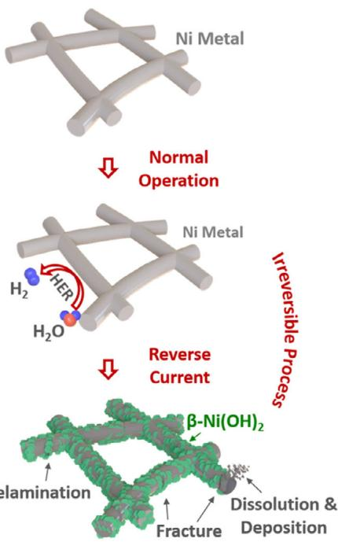

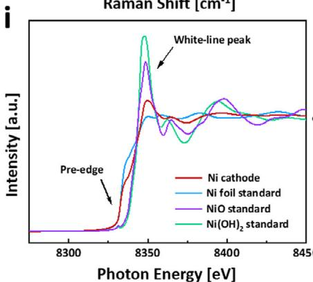

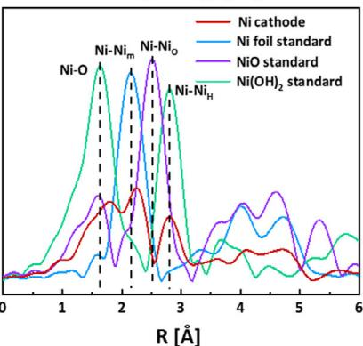
Figure 6. Cathode Ni electrode degradation mechanism under continuous RC AST cycles. a–c) SEM images of Ni cathode after $4 5 ~ \mathrm { k }$ AST cycles. d,e) HR-TEM images and fast Fourier transform pattern (inset of e) of selected area for Ni cathode after $4 5 ~ \mathrm { k }$ AST cycles. f) XRD, g) Raman, h) Ni $2 { \mathsf { p } } _ { 3 / 2 }$ region of XPS, and i) XANES and j) FT-EXAFS in R space collected on Ni cathode after $4 5 \mathrm { k }$ AST cycles. The bonding peaks were marked as Ni-O, Ni- $\mathsf { N i } _ { \mathsf { m } }$ , $N i - N i _ { 0 }$ , and $\mathsf { N i - N i _ { H } }$ , representing the bonding distance between Ni and O in NiO and $N i ( \mathsf { O H } ) _ { 2 }$ , as well as the bonding distances between Ni-Ni in Ni metal foil, NiO and $N i ( \mathsf { O H } ) _ { 2 }$ , respectively. k) Schematic illustration on the reaction process for the Ni cathode during the AST cycles.

confirms a primary composition of $\mathrm { N i } ( \mathrm { O H } ) _ { 2 }$ on surface of cathode, alongside a small amount of metallic Ni (Figure 6h).

Additionally, synchrotron radiation-based X-ray absorption spectroscopy (XAS) was employed to characterize oxidation state of Ni species and chemical composition of post-AST cathode. According to X-ray absorption near-edge spectroscopy (XANES) results, pre-edge feature indicates average oxidation state of Ni in post-AST cathode is closer to metallic state (Figure 6i), suggesting preservation of bulk Ni metal. However, the white-line peak suggests formation of oxidized Ni species after cycling operations, as compared to standard NiO and $\mathrm { N i } ( \mathrm { O H } ) _ { 2 }$ .[41] Fourier transform of extended X-ray absorption fine structure (FT-EXAFS) analysis in R space (Figure 6j) further confirms presence of NiO and $\mathrm { N i } ( \mathrm { O H } ) _ { 2 }$ in bulk phase of post-AST cathode (Figure S23 and Table S1, Supporting Information), consistent with post-mortem results. The absence of $\mathrm { N i - N i _ { O } }$ from FT-EXAFS shows possible amorphous phase of NiO, as crystalline NiO is periodically interconnected through edge-sharing of $[ \mathrm { N i O _ { 6 } } ]$ octahedron unit cell.[42]

As a result, we propose electrode transformation process and degradation mechanism occurring on cathode during RC AST cycling as illustrated in Figure 6k. Under normal operation, with cathode potential being negative, Ni maintains its metallic phase and HER occurs on cathode. Under RC operation, cathode potential rises to ${ \approx } 0 . 9 \mathrm { ~ V ~ }$ versus RHE, leading to formation of $\beta$ - $\mathrm { N i } ( \mathrm { O H } ) _ { 2 }$ . However, in the subsequent cycle of normal operation, formed $\beta { \mathrm { - N i } } ( \mathrm { O H } ) _ { 2 }$ cannot be completely reduced to metallic Ni.[34] This irreversibility facilitates continuous conversion from metallic Ni phases toward $\beta { \mathrm { - N i } } ( \mathrm { O H } ) _ { 2 }$ as RC AST cycling progresses, resulting in accumulation of $\beta { \mathrm { - N i } } ( \mathrm { O H } ) _ { 2 }$ on the surface. The underlying reason of irreversibility is likely due to a high thermodynamic and kinetic barrier to electrochemically reduce $\beta { \mathrm { - N i } } ( \mathrm { O H } ) _ { 2 }$ to metallic Ni. Typically, $\beta { \mathrm { - N i } } ( \mathrm { O H } ) _ { 2 }$ exhibits a stable layered structure with each $\mathrm { N i } ^ { 2 + }$ surrounded by $6 \mathrm { O H ^ { - } }$ , forming edge-sharing $\mathrm { N i ( O H ) _ { 6 } }$ octahedra unit cell. Thus, thermodynamic barrier comes from the need to break all Ni-O bonds and completely rearrange of layered structure into a face-centered-cubic unit cell for metallic Ni. The kinetic barrier is due to the fact that reduction of $\beta { \mathrm { - N i } } ( \mathrm { O H } ) _ { 2 }$ to metallic N $\mathrm { ~ I i ~ } ( \beta { \cdot } \mathrm { N i } ( \mathrm { O H } ) _ { 2 } + 2 \mathrm { e } ^ { - }  \mathrm { N i } +$ $2 \mathrm { O H ^ { - } } )$ ) is a multi-electron transfer process, which is more sluggish compared to the one-electron transfer process of $\beta$ -NiOOH $+ \ \mathrm { H } _ { 2 } \mathrm { O } + \mathrm { e } ^ { - }  \beta { \cdot } \mathrm { N i } ( \mathrm { O H } ) _ { 2 } + \mathrm { O H } ^ { - }$ on anode. Collectively, these two factors impose significant barrier and require more negative reductive potential for the reaction to occur. To verify this assumption, we exposed post-AST cathode under a few different reductive potentials (Figure S24, Supporting Information). Results indicate that sample reduced at $\mathbf { \varepsilon } _ { - 0 . 2 \mathrm { ~ V ~ } }$ versus RHE exhibits a similar composition compared to the post-AST cathode, indicating a longer exposure (3600s vs 5s) at -0.2 V cannot reduce the formed $\beta { \mathrm { - N i } } ( \mathrm { O H } ) _ { 2 }$ , while ${ \approx } 1 0 \%$ $\beta { \mathrm { - N i } } ( \mathrm { O H } ) _ { 2 }$ reduction $( 7 6 . 9 \mathrm { a t \% } \to 7 0 . 2 \mathrm { a t \% } )$ is achieved when the reductive potential is increased to -0.5 V versus RHE for 3600s. However, we would like to point out the challenge of achieving more negative reductive potential on cathode in liquid alkaline water electrolyzer stacks due to limitations in equipped balance-of-plants (such as power electronics). As a result, formation of $\beta { \mathrm { - N i } } ( \mathrm { O H } ) _ { 2 }$ on cathode under RC condition is still a major concern. The generated $\beta { \mathrm { - N i } } ( \mathrm { O H } ) _ { 2 }$ would exhibit lower intrinsic electrical conductivity compared to metallic Ni. Besides, a lattice difference between

metallic Ni and $\beta { \mathrm { - N i } } ( \mathrm { O H } ) _ { 2 }$ (0.203 nm vs. $0 . 2 3 3 \ \mathrm { n m }$ , Figure 6e) indicates that a mechanical stressor induced by constant lattice expansion is likely to result in severe electrode structural failure of fracture, exfoliation and laminarization (Figure 6a–c), which would create micro-gaps between cathode and separator, trapping gas bubbles during operation.[23] Thus, combination of poor conductivity of $\beta { \mathrm { - N i } } ( \mathrm { O H } ) _ { 2 }$ and electrode mechanical failures are the primary sources of ever-increasing ohmic losses observed during AST operation (Figure 4e). Additionally, as $\beta { \mathrm { - N i } } ( \mathrm { O H } ) _ { 2 }$ has significantly lower catalytic activity for HER compared to metallic Ni, continuous formation of $\beta { \mathrm { - N i } } ( \mathrm { O H } ) _ { 2 }$ leads to deterioration of catalytic activity and electrode kinetic loss for HER during RC AST cycling (Figure 4f). Although it has been argued that HER can be enhanced via the bifunctionally of $\mathrm { N i ( O H ) } _ { 2 }$ /metal catalysts by promoting the Volmer step,[43,44] an overwhelming accumulation of $\mathrm { N i } ( \mathrm { O H } ) _ { 2 }$ could lead to a significant deterioration in catalytic activity toward HER by limiting the Tafel step. In essence, these three main factors lead to severe material failure of Ni felt, poor conductivity and low catalytic activity of $\beta { \cdot } \mathrm { N i } ( \mathrm { O H } ) _ { 2 }$ $\beta$ collectively contribute to the performance degradation of cathode.

# 3. Conclusion

In summary, this work elaborates nickel electrode transformation and degradation mechanisms for alkaline water electrolysis under dynamic operating conditions, specifically during transient startup/shutdown operations. A three-electrode MEA setup integrating a reference electrode in AWEs was designed. This setup, coupled with a RC AST protocol to simulate the startup/shutdown operations, allows for decoupling of anode and cathode polarization behaviors impacted by RC phenomenon. As a result, changes in anode and cathode performance were tracked during the RC AST cycling. The anode exhibited performance enhancement, primarily due to enhanced electrode kinetics toward OER, and eventually reached a relatively steady state. In contrast, cathode showed continuous degradation throughout AST cycling, resulting from ever-increasing ohmic and kinetic overpotentials. Combined with a series of post-mortem and in situ measurements, it is demonstrated that the improved performance of anode during RC operation is due to formation of Ni (oxy)hydroxides on surface of Ni fibers, providing more active species for OER. Conversely, severe degradation observed on cathode results from irreversible conversion of Ni metal to $\beta$ - $\mathrm { N i } ( \mathrm { O H } ) _ { 2 }$ , leading to significant material failure issues, poor conductivity, and deteriorated activity toward HER. Thus, it is speculated that a cathode material (such as platinum) with higher redox reversibility of $\mathsf { M } \gets \to \mathsf { M } ( \mathsf { O } ) _ { \mathrm { x } } ( \mathrm { O H } ) _ { \mathrm { y } }$ (M represents metal) could potentially improve the dynamic operation of AWEs, though future work is needed for demonstration. Overall, this research provides a thorough analysis of electrode degradation mechanisms in AWEs, offering crucial insights to improve their adaptability to dynamic operations, and therefore broader adoption for hydrogen production through electrolysis. Besides, we believe similar experimental approaches can be extended to analyze other emerging electrochemical devices encountering analogous challenges, such as anion-exchange membrane water and $\mathrm { C O } _ { 2 }$ electrolyzers.

# 4. Experimental Section

Materials: Nickel felt electrodes were purchased from Bekaert (2Ni18- 0.25). Potassium hydroxide (KOH, ${ > } 8 5 . 0 \% )$ ) was purchased from Fisher Chemical. Ethylene tetrafluoroethylene (ETFE) materials for gasket were purchased from CS Hyde.

AWE Cell Assembly: A standard Fuel Cell Technology cell with two $5 \mathsf { c m } ^ { 2 }$ Ni serpentine flow field for both anode and cathode were used for AWE single cell construction. Commercial Ni felt electrodes mentioned above were used on the cathode and anode sides accordingly. A commercial Zirfon (AGFA Perl UTP 500) was used as the separator. When assembling, ETFE gaskets with different thickness were added around the electrodes and separator (typically 10 mil for both anode and cathode, $2 0 ~ \mathrm { m i l }$ for separator) used to seal the cell. The cell was compressed to 40 in-lbs in 10 in-lbs increments, following a star pattern. Hot 7 m KOH $( 8 0 ~ ^ { \circ } \mathsf { C } )$ at $2 0 m \mathsf { m i n ^ { - 1 } }$ was fed to both anode and cathode when the cell was heated to ${ 8 0 ~ ^ { \circ } \mathsf C }$ .

In the three-electrode MEA set-up, a custom-designed reference cell was attached to the side of the main cell. A $4 0 \ \mu \mathsf { m }$ PiperION A anion-exchange membrane (AEM) extended from the main cell into the reference cell, which housed a completely leakless $\mathsf { A g } / \mathsf { A g C l }$ reference electrode (eDAQ) (filling solution: $3 . 4 ~ \mathsf { M } ~ \mathsf { K C l } _ { }$ ) in contact with the membrane. According to the manufacturer, the reference electrode was designed to withstand extreme operating conditions such as high pH (https://www.edaq.com/wiki/Frequently_Asked_Questions_ Electrodes#Effect_of _high_pH_values). The reference electrode was pressed against the AEM strip to ensure sufficient contact. Deionized water was fed to the reference cell to ensure hydration of AEM stip. The reference cell temperature was probed to be $6 0 ~ ^ { \circ } \mathsf { C }$ by a thermocouple inserted into the reference cell. The $\mathsf { A g } / \mathsf { A g C l }$ reference electrode was calibrated against a dynamic hydrogen electrode in KOH solution $( \mathsf { p H } = 1 4$ ) at 60 °C before usage to obtain its potential EAg/AgCl, cali. $6 0 ~ ^ { \circ } \mathsf { C }$ $E _ { A g / A g C l , }$

The MEA was disassembled through a stepwise process, commencing with the removal of the end plates and external fixtures, followed by the gentle separation of the anode and cathode sides. After removing the gaskets, and the Ni anode and cathode were carefully removed from the Zirfon separator. To remove residual KOH, each component, including the separator, Ni anode, and Ni cathode, was immersed in deionized (DI) water for $^ { 1 2 \mathrm { ~ h ~ } }$ . Following soaking, the components were dried in air and stored in a clean, dry environment to prevent contamination and damage, thereby preserving their integrity for subsequent analysis.

Electrochemical Measurements: All electrochemical tests were conducted using a Biologic potentiostat (VSP 300). Polarization curves were obtained using the chronopotentiometric technique, with each constant current applied for $^ { 2 0 \ \mathsf { s } . }$ . The average potential over the last 5 s of each current was used to determine the potential reported in the polarization curves. Galvanostatic electrochemical impedance spectroscopy (GEIS) was performed at each current to assess ohmic resistance and charge transfer characteristics. The measurements were taken over a frequency range of 1 Hz to $7 0 0 \mathsf { k H z }$ , with a signal amplitude set to $5 \%$ of the applied current or 200 mA (lesser of the two). High frequency resistance (HFR) was determined by the GEIS fitting with equivalent circuit including a series combination of a resistor and two RCPEs.

The OER, HER activities and electrochemical active specific area (ECSA) estimation in beaker tests were conducted in a three-electrode system in $0 . 5 ~ \mathsf { ~ M ~ }$ KOH solution at room temperature, where the pristine or post-AST Ni electrodes was used as working electrode (precut into 1 $\mathsf { c m } ^ { * } 0 . 5 ~ \mathsf { c m }$ dimension) and Pt mesh $( 0 . 5 \mathsf { c m } ^ { 2 } )$ ) was used as counter electrode and the leakless $\mathsf { A g } / \mathsf { A g C l }$ reference electrode. The ECSA of electrodes were determined by the electrochemical double layer capacitance $( \mathsf { C } _ { \mathrm { d l } } )$ estimation from the cyclic voltammogram (CV) curves in the non-Faradic region at various scan rates. The $\mathsf { C } _ { \mathrm { d } \mid }$ was calculated according to Equation (1):

$$
C _ {d l} = i / \nu \tag {1}
$$

where i is the double layer current densities collected from CV curves at the same potential, and $\nu$ is the corresponding scan rate.

Voltage Breakdown Analysis: The measured anode potential $E _ { a , }$ , measured was converted to be versus reversible hydrogen electrode using the equation of:

$$
E _ {a, \text {m e a s u r e d}} = E _ {\mathrm {A g} / \mathrm {A g C l}, \text {c a l i}} + \frac {2 . 3 0 3 \cdot \mathrm {R} \cdot (\mathrm {T} + 2 7 3 . 1 5)}{F} \cdot (p H - 1 4) \tag {2}
$$

The thermodynamic reversible potentials for OER at anode and HER at cathode were defined as:[45]

$$
\begin{array}{l} E _ {O E R} ^ {0} = 0. 4 0 1 - \frac {2 . 3 0 3 \mathrm {R} (\mathrm {T} + 2 7 3 . 1 5)}{F} \cdot \left(p H - 1 4\right) + \frac {\log \left(p _ {O _ {2}}\right)}{4} - \\ 0. 0 0 1 6 8 1 6 \cdot (T - 2 5) \tag {3} \\ \end{array}
$$

$$
\begin{array}{l} E _ {H E R} ^ {0} = - 0. 8 2 8 - \frac {2 . 3 0 3 \mathrm {R} (\mathrm {T} + 2 7 3 . 1 5)}{F} \cdot \left(p H - 1 4\right) - \frac {\log \left(p _ {H _ {2}}\right)}{2} - \\ 0. 0 0 0 8 3 6 \cdot (T - 2 5) (4) \\ \end{array}
$$

Ohmic overpotential $\eta _ { o h m i c }$ was calculated from HFR measurements using GEIS:

$$
\eta_ {o h m i c} = i \cdot H F R \tag {5}
$$

where i is the applied current density $[ \mathsf { A c m } ^ { - 2 } ]$ ].

Kinetic overpotential $\eta _ { k i n e t i c }$ was calculated by fitting a Tafel model to the iR-free overpotential below $\mathsf { 1 0 0 m A c m ^ { - 2 } }$

$$
\eta_ {\text {k i n e t i c}} = b \cdot \log \left(\frac {i}{i _ {0}}\right) \tag {6}
$$

where $b$ is the measured Tafel slope $[ \mathsf { V \ d e c ^ { - 1 } } ]$ and $i _ { 0 }$ is the apparent exchange-current density.

The remaining residual potential on each electrode were obtained by subtracting the reversible potential, ohmic overpotential, and kinetic overpotential. An identical voltage breakdown method was applied to the cathode hydrogen evolution reaction.

Material Characterization: The surface morphology and composition of the electrodes were characterized by scanning electron microscopy and energy-dispersive spectroscopy (FEI Quanta FEG 250). Fresh samples were placed into the specimen chamber under high vacuum conditions $( < 2 \times 1 0 ^ { - 5 }$ Torr). The energy level of the beam was set to 10 kV.

The X-ray diffraction (XRD) was collected via a Rigaku Smartlab X-ray diffractometer equipped with a HyPix-3000 high energy resolution 2D multidimensional semi-conductor detector. The electrodes were placed on the sample holder directly. The XRD measurements were performed by setting the same Rigaku SmartLab diffractometer to Bragg-Brentano mode at room temperature. High resolution transmission electron microscopy (HR-TEM) measurements were conducted using a $2 0 0 \kappa \up$ FEI monochromated F20 UT Tecnai. The surface compositions of sample were investigated by X-ray photoelectron spectroscopy (XPS, Kratos Axis Ultra DLD) at takeoff angles of $0 ^ { \circ }$ and $6 0 ^ { \circ }$ relative to the surface normal. The measurements were carried out under room temperature and ultrahigh vacuum of $7 . 5 \times 1 0 ^ { - 9 }$ Torr. A monochromatic Al K?? source $( \mathsf { h } \mathsf { v } = 7 4 8 6 . 6$ eV) was used to excite the core level electrons of the material. Spectral analysis was conducted using CasaXPS analysis software. Raman spectra were collected using a confocal microscope (Horiba LabRAM HR800) utilizing a $5 0 \times$ micro-objective. A $5 3 2 ~ \mathsf { n m }$ laser was used for excitation with an average excitation power of $6 \mathsf { m } \mathsf { W }$ at the sample position. Spectra were resolved using a 1800 line grating and detected using a 1024 pixel line detector. Spectral windows of $4 0 0 { - } 5 0 0 ~ \mathsf { c m } ^ { - 1 }$ were recorded in sequence and

stitched together with an overlap of ten percent on both sides. Each window was measured 6 to 12 times with an exposure time of 5 s each. The system was calibrated using the A1 mode of a silicon reference sample.

In Situ Ambient Pressure X-Ray Photoelectron Spectroscopy (APXPS): The experiment was conducted at beamline 9.3.1 at Advanced Light Source, Lawrence Berkeley National Laboratory in the United States. A Si (111) double crystal monochromator was set to adjust the photon energy from 2.0 to $6 . 0 \mathrm { k e V }$ (denoted as tender X-ray range). The pass energy of the Scienta analyzer (R4000 HiPP-2) was set to 100 eV. A step size of 100 meV and a dwell time of 300 ms were employed. A three-electrode system, including the working electrode, reference electrode (RE, $\mathsf { A g } / \mathsf { A g C l } )$ , and counter electrode (CE, Pt metal foil), was mounted in a electrode housing. The multi-axis manipulator was electrically connected to a potentiostat (Bio-Logic SP 300) to conduct electrochemical measurements. The WE and the analyzer front cone were commonly grounded. Before experiments, the WE, Ni metal foil $( 1 \times 5 ~ \mathsf { c m } )$ was cleaned, by polishing to remove the residual impurity on the electrode. The electrolyte, $0 . 5 ~ \mathsf { M } ~ \mathsf { K O H }$ aqueous solution, was degassed offline in a vacuum chamber at low pressure (≈8 Torr) before the electrolyte was transferred into the experimental chamber of the endstation. After placing the electrode system and the outgassed electrolyte into the experimental chamber, the pressure of the main chamber was carefully and slowly lowered to the water vapor pressure at room temperature $\approx 1 8$ Torr). Then all three electrodes were immersed into the electrolyte and then deployed for electrochemical operation. Prior to the functional operations, the repeated cycling voltammetry (CV) was carried out to actively age the electrode surface and CV was conducted until two adjacent curves looked similar. Next, open-circuit potential scans were performed before OER. The normal operations for OER were held at 1.6 V versus RHE for 30 min. And the RC operation for OER was held at 0.9 V versus RHE for 30 min. After each operational stage, the electrodes were raised out of the electrolyte by the manipulator for in situ APXPS measurements. The WE was then moved to the focal point of the X-ray beam, $0 . 3 5 ~ \mathsf { m m }$ away from the front cone. The in situ XPS spectra were then collected on the WE with an incident photon energy of 4 keV. Almost all spectra were fitted with Gaussian–Lorentzian peaks after the Shirley background was applied; the sole exception was the Lorentzian Asymmetric shape for the metallic Ni peak, as it showed an obvious asymmetric feature in the Ni 2p region.

X-Ray Absorption Spectroscopy (XAS): XAS at Ni K-edge was measured at the beamline 9-3 of the Stanford Synchrotron Radiation Lightsource, SLAC National Accelerator Laboratory in the United States. The X-ray was monochromatized by a double-crystal Si (111) monochromator. The energy was calibrated with Ni metal foil at the Ni K-edge. Higher harmonics were removed by detuning the monochromator. The XAS data were processed to obtain the X-ray absorption near-edge spectroscopy (XANES) and the extended X-ray absorption fine structure (EXAFS) spectra with the Athena software. The fitting results were obtained based on the Artemis module in the IFEFFIT software packages.[46,47]

# Supporting Information

Supporting Information is available from the Wiley Online Library or from the author.

# Acknowledgements

The authors acknowledge the Department of Energy-Office of Energy Efficiency and Renewable Energy-Hydrogen and Fuel Cell Technologies Office (DOE-EERE-HFTO) and the ${ \sf H } _ { 2 }$ from Next-generation Electrolyzers of Water (H2NEW) consortium for funding under Contract No. DE-AC02- 05CH11231. This work used resources of the Advanced Light Source (ALS), a DOE Office of Science User Facility under contact No. DE-AC02- 05CH11231. This manuscript is partially based on work performed by the Liquid Sunlight Alliance, which is supported by the U.S. Department of Energy, Office of Science, Office of Basic Energy Sciences, Fuels from Sunlight Hub under Award Number DE-SC0021266. This research used re-

sources of the Advanced Light Source in Lawrence Berkeley National Laboratory, which is a DOE Office of Science User Facility under Contract No. DE-AC02-05CH11231. Use of the Stanford Synchrotron Radiation Light source, SLAC National Accelerator Laboratory, is supported by the U.S. Department of Energy, Office of Science, Office of Basic Energy Sciences under Contract No. DE-AC02-76SF00515. Work at the Molecular Foundry was supported by the Office of Science, Office of Basic Energy Sciences, of the U.S. Department of Energy under contract no. DE-AC02-05CH11231. The views expressed in the article do not necessarily represent views of the DOE or the U.S. Government.

# Conflict of Interest

The authors declare no conflict of interest.

# Author Contributions

G.W. performed most of the electrode fabrication, characterization, cell assembly, testing, and data analysis. A.W.T. designed the 3-electrode setup and helped with the cell testing and data analysis. H.L. performed in situ APXPS and ex situ XAS measurements and data analysis under the supervision of E.J.C. and J.Y.F.B. carried out the Raman measurements. G.W., H. L., and X.P. wrote the original draft. X.P. and R.M. conceived this project and reviewed the manuscript. All authors discussed the results and revised the manuscript.

# Data Availability Statement

The data that support the findings of this study are available on request from the corresponding author. The data are not publicly available due to privacy or ethical restrictions.

# Keywords

alkaline water electrolyzers, degradation mechanism, hydrogen, reverse current

Received: February 13, 2025

Revised: March 25, 2025

Published online: April 17, 2025

[1] S. Shiva Kumar, H. Lim, Energy Rep. 2022, 8, 13793.
[2] F. Yang, M. J. Kim, M. Brown, B. J. Wiley, Adv. Energy Mater. 2020, 10, 202001174.
[3] H. Kojima, K. Nagasawa, N. Todoroki, Y. Ito, T. Matsui, R. Nakajima, Int. J. Hydrogen Energy 2023, 48, 4572.
[4] J. C. Ehlers, A. A. Feidenhans’l, K. T. Therkildsen, G. O. Larrazábal, ACS Energy Lett. 2023, 8, 1502.
[5] Y. Xia, H. Cheng, H. He, W. Wei, Commun. Eng. 2023, 2, 22.
[6] Y. Uchino, T. Kobayashi, S. Hasegawa, I. Nagashima, Y. Sunada, A. Manabe, Y. Nishiki, S. Mitsushima, Electrochemistry 2018, 86, 138.
[7] Y. Kuroda, T. Nishimoto, S. Mitsushima, Electrochim. Acta. 2019, 323, 134812.
[8] I. K-S. Kim, H.-S. Cho, M. Kim, H.-J. Oh, S.-Y. Lee, Y.-K. Lee, C. Lee, J. H. Lee, W. C. Cho, S.-K. Kim, J. H. Joo, C.-H. Kim, J. Mater. Chem. A. 2021, 9, 16713.
[9] A. A. Haleem, J. Huyan, K. Nagasawa, Y. Kuroda, Y. Nishiki, A. Kato, T. Nakai, T. Araki, S. Mitsushima, J. Power Sources 2022, 535, 231454.
[10] S. Sebbahi, A. Assila, A. Alaoui Belghiti, S. Laasri, S. Kaya, E.l K. Hlil, S. Rachidi, A. Hajjaji, Int. J. Hydrogen Energy 2024, 82, 583.

[11] R. A. Marquez, M. Espinosa, E. Kalokowski, Y. J. Son, K. Kawashima, T. V. Le, C. E. Chukwuneke, C. B. Mullins, ACS Energy Lett. 2024, 9, 547.
[12] N. Guruprasad, J. van der Schaaf, M. T. de Groot, J. Power Sources 2024, 613, 234877.
[13] Y. Uchino, T. Kobayashi, S. Hasegawa, I. Nagashima, Y. Sunada, A. Manabe, Y. Nishiki, S. Mitsushima, Electrocatalysis 2017, 9, 67.
[14] A. A. Haleem, K. Nagasawa, Y. Kuroda, Y. Nishiki, A. Zaenal, S. Mitsushima, Electrochemistry 2021, 89, 186.
[15] Y. Kim, S.-M. Jung, K.-S. Kim, H.-Y. Kim, J. Kwon, J. Lee, H.-S. Cho, Y.-T. Kim, JACS Au 2022, 2, 2491.
[16] A. W. Tricker, J. K. Lee, J. R. Shin, N. Danilovic, A. Z. Weber, X. Peng, J. Power Sources 2023, 567, 232967.
[17] Q. Xu, S. Z. Oener, G. Lindquist, H. Jiang, C. Li, S. W. Boettcher, ACS Energy Lett. 2020, 6, 305.
[18] S. B. Adler, J. Electrochem. Soc. 2002, 149, E166.
[19] S. B. Adler, B. T. Henserson, M. A. Wilson, D. M. Taylor, R. E. Richards, Solid State Ionics 2000, 134, 35.
[20] O. Sorsa, J. Nieminen, P. Kauranen, T. Kallio, J. Electrochem. Soc. 2019, 166, F1326.
[21] W. He, T. V. Nguyen, J. Electrochem. Soc. 2004, 51, A185.
[22] T. Kou, S. Wang, R. Shi, T. Zhang, S. Chiovoloni, J. Q. Lu, W. Chen, M. A. Worsley, B. C. Wood, S. E. Baker, E. B. Duoss, R. Wu, C. Zhu, Y. Li, Adv. Energy Mater. 2020, 10, 2002955.
[23] G. Wang, A. Tricker, J. T. Lang, J. Wang, I. Zenyuk, D.-J. Liu, R. Mukundan, X. Peng, J. Electrochem. Soc. 2024, 171, 064501.
[24] R. G. Bates, J. Phys. Chem. Ref. Data 1989, 18, 1.
[25] L. F. Huang, M. J. Hutchison, R. J. Santucci, J. R. Scully, J. M. Rondinelli, J. Phys. Chem. C. 2017, 121, 9782.
[26] A. W. Tricker, T. Y. Ertugrul, J. K. Lee, J. R. Shin, W. Choi, D. I. Kushner, G. Wang, J. Lang, I. V. Zenyuk, A. Z. Weber, X. Peng, Adv. Energy Mater. 2024, 14, 202303629.
[27] F. Rocha, R. Delmelle, C. Georgiadis, J. Proost, J. Environ. Chem. Eng. 2022, 10, 107648.
[28] O. Diaz-Morales, D. Ferrus-Suspedra, M. T. M. Koper, Chem. Sci. 2016, 7, 2639.

[29] Z. Yan, H. Sun, X. Chen, H. Liu, Y. Zhao, H. Li, W. Xie, F. Cheng, J. Chen, Nat. Commun. 2018, 9, 2373.
[30] S. Tao, Q. Wen, W. Jaegermann, B. Kaiser, ACS Catal. 2022, 12, 1508.
[31] N. Weidler, J. Schuch, F. Knaus, P. Stenner, S. Hoch, A. Maljusch, R. Schäfer, B. Kaiser, W. Jaegermann, J. Phys. Chem. C. 2017, 121, 6455.
[32] H. Su, Y. Ye, K.-J. Lee, J. Zeng, E. J. Crumlin, J. Phys. D Appl. Phys. 2021, 54, 374001.
[33] O. Q. Carvalho, E. J. Crumlin, K. A. Stoerzinger, J. Vac. Sci. Technol. A. 2021, 39, 040802.
[34] M. Alsabet, M. Grden, G. Jerkiewicz, Electrocatalysis 2013, 5, 136.
[35] M. Alsabet, M. Grden, G. Jerkiewicz, Electrocatalysis 2011, 2, 317.
[36] M. Alsabet, M. Grden, G. Jerkiewicz, ´ Electrocatalysis 2014, 6, 60.
[37] C. Kuai, Z. Xu, C. Xi, A. Hu, Z. Yang, Y. Zhang, C.-J. Sun, L. Li, D. Sokaras, C. Dong, S.-Z. Qiao, X.-W. Du, F. Lin, Nat. Catal. 2020, 3, 743.
[38] Z. Hao, L. Xu, Q. Liu, W. Yang, X. Liao, J. Meng, X. Hong, L. He, L. Mai, Adv. Funct. Mater. 2019, 29, 201808470.
[39] D. S. Hall, D. J. Lockwood, S. Poirier, C. Bock, B. R. MacDougall, ACS Appl. Mater. Interfaces 2014, 6, 3141.
[40] D. S. Hall, D. J. Lockwood, S. Poirier, C. Bock, B. R. MacDougall, ACS Appl. Mater. Interfaces 2014, 6, 3141.
[41] H. Li, S. Chen, X. Jia, B. Xu, H. Lin, H. Yang, L. Song, X. Wang, Nat. Commun. 2017, 8, 15377.
[42] R. Li, S. Yang, Y. Zhang, G. Yu, C. Wang, C. Chen, G. Wu, R. Sun, G. Wang, X. Zheng, W. Yan, G. Wang, D. Rao, X. Hong, Cell Rep. Phys. Sci. 2022, 3, 100788.
[43] R. Subbaraman, D. Tripkovic, K.-C. Chang, D. Strmcnik, A. P. Paulikas, P. Hirunsit, M. Chan, J. Greeley, V. Stamenkovic, N. M. Markovic, Nat. Mater. 2012, 11, 550.
[44] N. Danilovic, R. Subbaraman, D. Strmcnik, K.-C. Chang, A. P. Paulikas, V. R. Stamenkovic, N. M. Markovic, Angew. Chem., Int. Ed. Engl. 2012, 51, 12495.
[45] R. G. Bates, J. Phys. Chem. Ref. Data 1989, 18, 1.
[46] M. Newville, J. Synchrotron Radiat. 2001, 8, 322.
[47] J. J. Rehr, R. C. Albers, Rev. Mod. Phys. 2000, 72, 621.
