# Heterointerface-Enabled Anti-Reverse-Current Electrodes for Alkaline Water Electrolyzers at $1000\mathrm{mAcm}^{-2}$

Wenjun He, $^{\diamond}$ Yueshuai Wang, $^{\diamond}$ Yilong Zhao, $^{\diamond}$ Cheng Tang, $^{*}$ Linchuan Cong, Changli Wang, Yue Lu, Xin Liu, Juncai Dong, Serhiy Cherevko, Qingsong Hua, and Qiang Zhang $^{*}$

Cite This: https://doi.org/10.1021/jacs.5c17603

Read Online

ACCESS

Metrics & More

Article Recommendations

Supporting Information

ABSTRACT: Achieving stable and efficient alkaline water electrolysis (AWE) under fluctuating renewable energy inputs is essential for large-scale green hydrogen production. However, frequent shutdown-induced reverse current (RC) effects pose significant challenges to electrode durability. Here, we introduce a gradient interlayer engineering strategy to develop robust AWE electrodes that intrinsically resist both electrochemical reconstruction and mechanical fatigue. By constructing a dense interlayer with $\mathrm{Ni}(11\overline{2}) / \mathrm{Ni}_3\mathrm{S}_2(\overline{1} 20)$ heterointerfaces, the electrode demonstrates high catalytic activity (1.79 V @1000 mA cm $^{-2}$ —meeting the U.S. DOE 2026 target), excellent operational stability (>1500 h at 1000 mA cm $^{-2}$ in 30 wt % KOH at $80^{\circ}\mathrm{C}$ ), and exceptional RC resistance for 3600 accelerated startup/shutdown cycles. Mechanistic studies through cross-sectional characterizations and theoretical calculations reveal that the seamless interlayer at the catalyst—substrate interface enhances interfacial adhesion, mitigates lattice mismatch, and facilitates

charge redistribution, ensuring robust stability and integrity even under operational strains and potential reversals. This work establishes interface crystallography as a design paradigm for durable electrodes, potentially overcoming the stability-activity dilemma toward industrially relevant electrolyzers coupled with fluctuating renewable energy sources.

# 1. INTRODUCTION

Green hydrogen, produced through renewable-powered water electrolysis, stands as a cornerstone for decarbonizing hard-to-abate sectors and balancing grid intermittency. $^{1,2}$ Among various technologies, alkaline water electrolysis (AWE) has dominated industrial deployment ( $>80\%$ ) owing to its century-long development history, high technological maturity, and capital cost advantages. $^{3-5}$ However, this established technology faces intensifying scrutiny due to critical bottlenecks in both low operating current density (typically $<400\mathrm{mAcm}^{-2}$ at $1.8\mathrm{V}$ ) and poor load flexibility ( $>40\%$ minimum threshold), both rooted in inherent design and material constraints. $^{6-8}$

Central to addressing this challenge is the development of high-performance electrodes capable of accelerating the oxygen and hydrogen evolution reactions (OER and HER) under industrial-grade current densities $(\geq 1000\mathrm{mAcm}^{-2})$ and fluctuating operating conditions.9-12 While recent academic efforts have yielded numerous advanced catalysts with promising activities at such high current densities,13,14 their practical adoption remains hindered by a critical yet often overlooked factor: operational stability.8,10,15

The stability—activity dichotomy underscores a fundamental gap in catalyst design principles, which intensifies under real-world operational conditions.16 Industrial AWE operates under aggressive conditions (30 wt % KOH, 80–90 °C), where electrodes endure chemical corrosion from prolonged alkali

exposure, mechanical fatigue from bubble turbulence, and structural collapse under high oxidative potentials. $^{17,18}$ These issues are exacerbated in fluctuating renewable-coupled systems, which frequently cycle between startup and shutdown operations due to gas crossover and safety issues at low loads. $^{19,20}$ Crucially, such dynamic operation triggers the reverse current (RC) phenomenon as a paramount yet overlooked failure mechanism for AWE electrodes. $^{6,21-23}$ RC originates from the AWE's stack design: bipolar plates electrically bridge adjacent cells, while circulating electrolyte forms ionic pathways, creating unintended short circuits between anodes and cathodes during shutdowns (Figure 1a). $^{20,24}$ This transient reverse polarity drives cathodic oxidation (e.g., $\mathrm{Ni} \rightarrow \beta\text{-Ni(OH)}_2$ ) and anodic reduction (e.g., $\mathrm{NiOOH} \rightarrow \mathrm{Ni(OH)}_2$ ), $^{8,22,25}$ destabilizing electrode interfaces through rapid phase reconstruction, accelerated corrosion, and interfacial delamination (Figure 1b). $^{9,22,26}$ Existing mitigation strategies—external polarized rectifiers $^{27,28}$ and sacrificial anodes $^{29,30}$ —impose prohibitive efficiency

Received: October 8, 2025

Revised: November 21, 2025

Accepted: December 3, 2025

Published: December 11, 2025

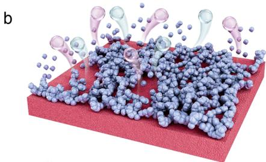

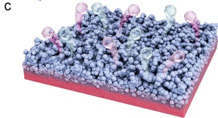
Figure 1. Reverse current effect and electrode degradation under startup/shutdown cycles. (a) Schematic of the reverse current flow in a bipolar electrolyzer following shutdown. (b) Schematic of the catalyst layer detachment and electrode corrosion during shutdown. (c) Schematic of the gradient interlayer engineering and the suppression of electrode degradation.

a

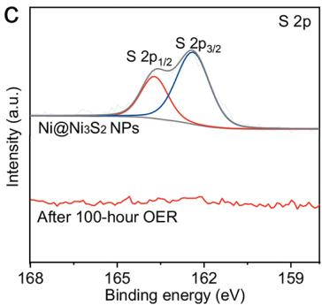

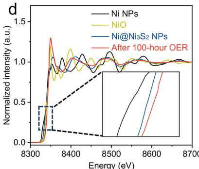

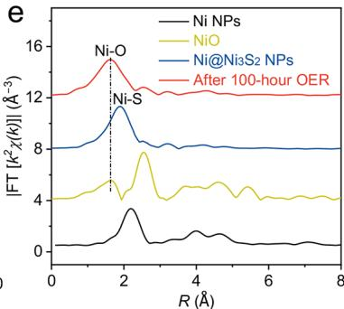
Figure 2. Chemical stability and in situ reconstruction of $\mathrm{Ni}_3\mathrm{S}_2$ (a) IL-TEM images of $\mathrm{Ni@Ni_3S_2}$ at $1.3\mathrm{V}$ (vs RHE): TEM images of (a1) pristine $\mathrm{Ni@Ni_3S_2}$ NPs, (a2) after $10\mathrm{h}$ OER, and (a3) after $20\mathrm{h}$ OER. Selected area electron diffraction (SAED) of (a4) pristine $\mathrm{Ni@Ni_3S_2}$ NPs, (a5) after $10\mathrm{h}$ OER, and (a6) after $20\mathrm{h}$ OER. (b) Energy dispersive spectroscopy (EDS) quantitative results of Ni, S, and O elements for $\mathrm{Ni@Ni_3S_2}$ NPs before and after $10$ and $20\mathrm{h}$ OER. (c) High-resolution S 2p XPS spectra for $\mathrm{Ni@Ni_3S_2}$ NPs before and after $100\mathrm{h}$ OER. (d) Ni K-edge XANES spectra and (e) FT of Ni K-edge EXAFS spectra of Ni NPs, NiO reference, and $\mathrm{Ni@Ni_3S_2}$ NPs before and after $100\mathrm{h}$ OER.

penalties or escalate system complexity, rendering them impractical for industrial deployment.[31,32] Consequently, material-centric solutions that intrinsically enhance the electrocatalytic activity and RC resistance are urgently needed to unlock AWE's full potential in renewable energy systems—a research frontier that remains underexplored.

In this contribution, we address this challenge through a gradient interlayer engineering approach that decouples stability-activity trade-offs (Figure S1). By in situ growing a $\mathrm{Ni}_3\mathrm{S}_2$ catalytic layer on nickel mesh (NM) with a dense Ni/ $\mathrm{Ni}_3\mathrm{S}_2$ heterointerface buffer through a thermal injection protocol, we create a self-supported electrode that resists

a

b
C

d

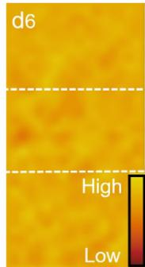

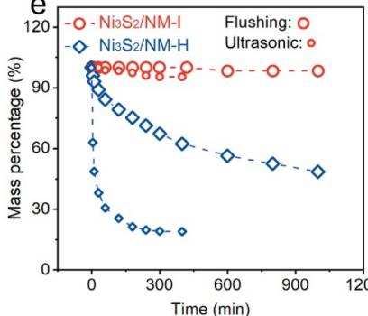
e

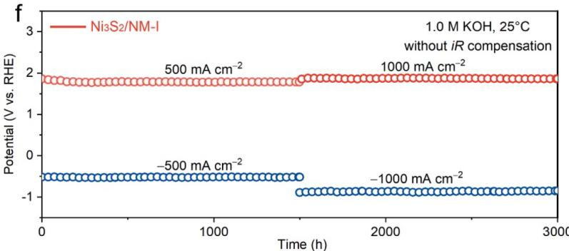
Figure 3. Structure and stability characterization of $\mathrm{Ni}_3\mathrm{S}_2 / \mathrm{NM}$ I. (a) The element mapping of an individual nickel wire coated with the catalyst. (b) Cross-sectional TEM image of $\mathrm{Ni}_3\mathrm{S}_2 / \mathrm{NM}$ I. (c) Cross-sectional element mapping of $\mathrm{Ni}_3\mathrm{S}_2 / \mathrm{NM}$ I. (d1) HAADF-STEM image and (d2-d4) corresponding EELS spectra. (d5) DPC-STEM phase mapping reconstructed from 4D-STEM data, where blue indicates the Ni substrate, green indicates the $\mathrm{Ni}_3\mathrm{S}_2$ catalytic layer, and the transition color between them corresponds to the composition-gradient interlayer. (d6) Charge distribution image of $\mathrm{Ni}_3\mathrm{S}_2 / \mathrm{NM}$ I. (e) Mechanical stability tests under ultrasonic or flushing treatments in $1.0\mathrm{M}$ KOH for $\mathrm{Ni}_3\mathrm{S}_2 / \mathrm{NM}$ H and $\mathrm{Ni}_3\mathrm{S}_2 / \mathrm{NM}$ I. (f) Long-term stability test of $\mathrm{Ni}_3\mathrm{S}_2 / \mathrm{NM}$ I for HER and OER in $1.0\mathrm{M}$ KOH at $25^{\circ}\mathrm{C}$ .

dynamic phase evolution and interfacial delamination to maintain structural integrity under RC effects (Figure 1c). The seamlessly bonded gradient heterointerface mitigates lattice mismatch while facilitating charge redistribution, enabling robust adhesion even during drastic potential reversals and at high current densities. When tested under industrial conditions, the as-synthesized electrode achieves industrial-grade efficiency (1.79 V @1000 mA cm $^{-2}$ , meeting the U.S. DOE 2026 target) and unprecedented durability (>2000 h at 500 and 1000 mA cm $^{-2}$ with zero degradation; 3600 startup/shutdown cycles). The origin of the enhanced activity and durability has been comprehensively elucidated by advanced cross-sectional characterizations and theoretical calculations. This work underscores the crucial role of gradient heterointerface stabilization under RC effects and affords a scalable approach for developing durable AWE electrodes with enhanced performance.

# 2. RESULTS AND DISCUSSION

2.1. Chemical Stability of $\mathrm{Ni}_3\mathrm{S}_2$ . The stability of catalytic electrodes is governed by a complex interplay of chemical, mechanical, and structural factors. $^{10,33,34}$ To decouple these effects, we initially investigated the intrinsic chemical stability of the powdery catalysts. We employed $\mathrm{Ni}@\mathrm{Ni}_3\mathrm{S}_2$ core-shell nanoparticles (NPs), synthesized via one-step in situ sulfidation of nickel NPs, as a model system to investigate the chemical evolution during alkaline water splitting. As shown in Figure S2, the thermal injection of 2-mercaptoethanol as the sulfur source at $180^{\circ}\mathrm{C}$ enables rapid interfacial sulfurization of nickel NPs while preserving their structural integrity. The X-ray diffraction (XRD) pattern of $\mathrm{Ni}@\mathrm{Ni}_3\mathrm{S}_2$ NPs exhibits a set of diffraction peaks that are indexed to the heazlewoodite phase $\mathrm{Ni}_3\mathrm{S}_2$ in addition to metallic nickel (Figure S2). The obtained $\mathrm{Ni}@\mathrm{Ni}_3\mathrm{S}_2$ NPs catalyst demonstrates substantially enhanced bifunctional activity for both HER and OER compared to pristine Ni NPs (Figure S3), consistent with previous reports. $^{35,36}$ During a $100\mathrm{h}$ chronopotentiometry test of catalyst-coated carbon paper (CP) electrodes at $100\mathrm{mAcm}^{-2}$

a

e

f

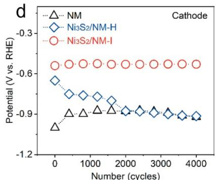
g

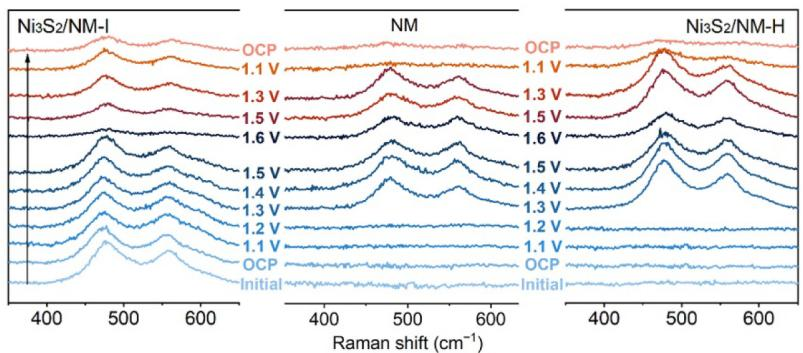
Figure 4. ADT and structural stability characterization of $\mathrm{Ni}_3\mathrm{S}_2 / \mathrm{NM}$ I. (a) Schematic of a single cycle of the ADT protocol. (b) ADT curves of $\mathrm{Ni}_3\mathrm{S}_2 / \mathrm{NM}$ I as the anode. The potential corresponding to (c) OER at $500\mathrm{mAcm}^{-2}$ and (d) HER at $-500\mathrm{mAcm}^{-2}$ during the chronopotentiometry steps of the ADT. Cross-sectional HRTEM images and SAED pattern of $\mathrm{Ni}_3\mathrm{S}_2 / \mathrm{NM}$ I after 4000 ADT cycles as (e) the cathode and (f) the anode. (g) In situ Raman spectra of $\mathrm{Ni}_3\mathrm{S}_2 / \mathrm{NM}$ I, NM, and $\mathrm{Ni}_3\mathrm{S}_2 / \mathrm{NM}$ H after 4000 ADT cycles as the anode. All tests are conducted in $1.0\mathrm{M}$ KOH at $25^{\circ}\mathrm{C}$ .

in $1.0\mathrm{M}$ KOH, both HER and OER performances exhibit initial stability in model system tests, with decay rates of ca. 2.1 and ca. $0.9\mathrm{mV}\mathrm{h}^{-1}$ , respectively. Post-HER characterization through XRD, transmission electron microscopy (TEM), and X-ray photoelectron spectroscopy (XPS) verifies the chemical and structural preservation of the $\mathrm{Ni@Ni_3S_2NPs}$ (Figure S4). Moreover, the intrinsic activity of $\mathrm{Ni@Ni_3S_2NPs}$ remains unchanged, whereas scanning electron microscopy (SEM) and mass change analyses reveal an obvious detachment from the CP substrate (Figure S5). These results demonstrate that the performance decay is primarily caused by binder failure-induced catalyst detachment rather than chemical instability.

In contrast, distinct reconstruction behavior emerges under the anodic OER process. In situ Raman spectra tests directly capture the dynamic formation of $\mathrm{Ni}^{\mathrm{III}}$ -O vibrational peaks at a potential of $1.3\mathrm{V}$ vs reversible hydrogen electrode (RHE) (Figure S6), diagnostic of catalytically active NiOOH species.[37,38] Identical location transmission electron microscopy (IL-TEM) experiments conducted at $1.3\mathrm{V}$ (vs RHE) in $1.0\mathrm{M}$ KOH further reveal time-dependent surface amorphiza

tion concurrent with oxygen incorporation and sulfur depletion (Figures 2a,b and S7). High-resolution XPS spectra demonstrate complete S 2p signal attenuation after $100\mathrm{h}$ of OER (Figure 2c), accompanied by a $\sim 0.66$ eV positive shift in Ni 2p binding energy (Figure S8). Besides, the X-ray absorption near-edge spectra (XANES) of $\mathrm{Ni@Ni_3S_2}$ NPs after $100\mathrm{h}$ of OER exhibit a positively shifted absorption edge, higher than that of the NiO reference (Figure 2d). In the Fourier transform (FT) of Ni K-edge extended X-ray absorption fine structure (EXAFS) spectra (Figure 2e), the main peak of $\mathrm{Ni@Ni_3S_2}$ NPs after OER changes from the Ni-S bond at $\sim 1.85\AA$ to the Ni-O bond at $\sim 1.63\AA$ .[39,40] All these results confirm the irreversible conversion of crystalline $\mathrm{Ni}_3\mathrm{S}_2$ to amorphous NiOOH with sulfur leaching during the long-term OER process.

Nevertheless, this reconstruction itself is beneficial for enhancing the OER activity through increased $\mathrm{Ni}^{\mathrm{III}}$ content and defect-rich surfaces, and the detachment of the catalyst from the substrate is the main factor affecting electrode longevity (Figures S3a and S9). Additionally, an accelerated

durability test (ADT) protocol was designed to further monitor the stability of $\mathrm{Ni@Ni_3S_2}$ NPs/CP during the RC flow (Figure S10a). Compared to steady-state OER, the ADT induces significantly more severe degradation, with nearly complete catalyst detachment and activity reverting to that of the bare CP substrate after $100\mathrm{h}$ (Figures S10 and S11). This direct comparison reveals that RC flow imposes extreme interfacial stress, and thus interlayer engineering with strong catalyst-substrate adhesion must be prioritized to ensure electrode stability during intermittent operation.

2.2. Integrated Electrode with Composition-Gradient Interlayer Engineering. Guided by degradation mechanism analysis, we proposed an integrated $\mathrm{Ni}_3\mathrm{S}_2 / \mathrm{NM}$ -I electrode with strong interfacial binding via in situ sulfidation of NM using the above-mentioned thermal injection protocol. Unlike the hydrothermally synthesized $\mathrm{Ni}_3\mathrm{S}_2 / \mathrm{NM}$ -H, which exhibits interfacial delamination (Figure S12), this approach enables conformal growth of a seamless $\mathrm{Ni}_3\mathrm{S}_2$ layer on NM (Figures S13 and S14). The interfacial nanostructure was further characterized by SEM and TEM after focused ion beam (FIB) processing. The elemental mapping of $\mathrm{Ni}_3\mathrm{S}_2 / \mathrm{NM}$ -I exhibits uniform distribution of the S element on the surface of an individual nickel wire (Figure 3a), and the cross-sectional TEM image confirms the seamless interfacial binding between the $\mathrm{Ni}_3\mathrm{S}_2$ layer and the nickel substrate (Figure 3b). Both systems crystallize in the heazlewoodite $\mathrm{Ni}_3\mathrm{S}_2$ phase (Figures S12a and S14a). The $\mathrm{Ni}_3\mathrm{S}_2 / \mathrm{NM}$ -I displays a distinctive $\sim 80$ nm dense interlayer at the catalyst-substrate interface (Figure 3b), forming a composition-gradient architecture (Figure 3c).

To decipher the interlayer's structural and electronic roles, electron energy loss spectroscopy (EELS) characterization was carried out. Figure 3d1 presents the high-angle annular darkfield scanning transmission electron microscopy (HAADF-STEM) image of the interfacial region of $\mathrm{Ni}_3\mathrm{S}_2 / \mathrm{NM - I}$ . The corresponding EELS mappings clearly identify three components: (i) the metallic Ni substrate with $\mathrm{Ni}^0$ EELS signals, (ii) the $\mathrm{Ni}_3\mathrm{S}_2$ top layer enriched with $\mathrm{Ni}^{\delta +}$ and $S^{2 - }$ signals, and (iii) a transitional zone populated by metallic Ni NPs infilling $\mathrm{Ni}_3\mathrm{S}_2$ vacancies (Figure 3d2-d4). The differential phase contrast (DPC) image obtained by 4D-STEM further confirms the formation of crystallographic interfaces across these regions (Figure 3d5), while charge distribution analysis indicates a minimized interfacial electric field and barrier-free electron transport from substrate to catalyst (Figure 3d6). By integrating a dense interlayer, this gradient structure not only strengthens mechanical adhesion, ensuring long-term durability, but also accelerates charge transfer, sustaining high catalytic activity. This dual-function design demonstrates the unique and broadly applicable advantages of gradient interlayer engineering.

Mechanical stability testing under aggressive ultrasonic agitation (400 W, 1.0 M KOH, $25^{\circ}\mathrm{C}$ ) demonstrates exceptional robustness: $\mathrm{Ni}_3\mathrm{S}_2/\mathrm{NM}-\mathrm{I}$ retains $97.4\%$ mass after $400\mathrm{min}$ versus catastrophic failure ( $81.1\%$ loss) for $\mathrm{Ni}_3\mathrm{S}_2/$ NM-H (Figure 3e). Post-test XRD and SEM characterizations confirm the structural integrity of $\mathrm{Ni}_3\mathrm{S}_2/\mathrm{NM}-\mathrm{I}$ (Figure S15), whereas $\mathrm{Ni}_3\mathrm{S}_2/\mathrm{NM}-\mathrm{H}$ suffers serious delamination with undetectable XRD signals for $\mathrm{Ni}_3\mathrm{S}_2$ (Figure S16). High-flow electrolyte flushing treatment further validates these trends (Figures 3e and S17). Critically, $\mathrm{Ni}_3\mathrm{S}_2/\mathrm{NM}-\mathrm{I}$ serving as bifunctional OER and HER electrodes, maintains $>3000\mathrm{h}$ stable water splitting at $500 - 1000\mathrm{mA cm}^{-2}$ with negligible activity decay in three-electrode configurations (Figure 3f),

despite sulfur leaching and surface amorphization to $\mathrm{NiOOH}$ during OER (Figures S18-S22). It is notable that the Ni dissolution during $600\mathrm{h}$ of the OER test at $500\mathrm{mAcm}^{-2}$ is nearly zero (Figure S22), further indicating that the performance degradation of powdery samples originates from catalyst detachment (Figure S3). The persistent interlayer adhesion facilitates reconstruction-enhanced kinetics via increased electrochemical active surface area (ECSA) and reduced charge transfer resistance $(R_{\mathrm{ct}})$ (Figure S23).[41,42] Besides, the performance of $\mathrm{Ni}_3\mathrm{S}_2 / \mathrm{NM - I}$ is well maintained during the HER process (Figure S24). Therefore, the elaborate design of a seamless gradient heterointerface between the catalytic layer and substrate, rather than mere catalyst optimization, is pivotal for reconciling the inherent tension between reconstruction-driven activity enhancement and mechanical degradation in alkaline electrolysis.

2.3. Reverse Current Resistance. To simulate the operational stresses of frequent startup/shutdown cycles, we designed an ADT protocol to evaluate the RC resistance of $\mathrm{Ni}_3\mathrm{S}_2 / \mathrm{NM}$ as both cathode and anode in AWEs. $^{43}$ Figure 4a illustrates a single ADT cycle combining chronopotentiometry and chronoamperometry operations: cathodes are subjected to $-500\mathrm{mAcm}^{-2}$ (60 s) followed by $0.8\mathrm{V}$ vs RHE (60 s), while anodes undergo $500\mathrm{mAcm}^{-2}$ (60 s) and $0.3\mathrm{V}$ vs RHE (60 s). $^{43}$ To ensure robustness, the ADT was conducted for 4000 cycles ( $\sim133.3\mathrm{h}$ , Figures S25 and S26). For anode testing (Figure 4b), $\mathrm{Ni}_3\mathrm{S}_2 / \mathrm{NM}$ -I demonstrates exceptional stability over 4000 ADT cycles, with activity enhancement contrasting sharply with $\mathrm{Ni}_3\mathrm{S}_2 / \mathrm{NM}$ -H and NM, both of which exhibit significant degradation (Figure 4c).

Post-ADT analyses reveal that $\mathrm{Ni}_3\mathrm{S}_2 / \mathrm{NM - I}$ retains the highest ECSA and the lowest $R_{\mathrm{ct}}$ whereas $\mathrm{Ni}_3\mathrm{S}_2 / \mathrm{NM - H}$ approaches NM-like ECSA and $R_{\mathrm{ct}}$ values (Figure S27), consistent with catalyst delamination (Figure S28). Similar trends emerge for cathodes (Figures 4d and S29), where $\mathrm{Ni}_3\mathrm{S}_2 / \mathrm{NM - I}$ maintains near-zero activity loss, while $\mathrm{Ni}_3\mathrm{S}_2 / \mathrm{NM - H}$ degrades to NM levels due to severe catalyst detachment (Figure S30). Mechanistic studies reveal that $\mathrm{Ni}_3\mathrm{S}_2 / \mathrm{NM - I}$ 's gradient architecture and robust interfacial bonding ensure structural integrity during prolonged ADT. For cathodes, the $\mathrm{Ni} / \mathrm{Ni}_3\mathrm{S}_2$ interlayer structure remains intact during the reduction-oxidation-reduction cycles (Figures S31a, S32, and S33), and the overall morphology is preserved after 4000 cycles (Figures 4e and S34-S36).

In contrast, the anode undergoes a controlled $\mathrm{Ni}_3\mathrm{S}_2 \rightarrow$ $\mathrm{NiOOH} \rightarrow \mathrm{Ni(OH)}_2 \rightarrow$ NiOOH reconstruction pathway during the oxidation-reduction-oxidation process (Figures S31b, S37, and S38). No catalytic Ni species are lost during this transformation (Figure S37b), and the electrode eventually evolves into a fully NiOOH-active surface and a Ni/NiOOH interlayer (Figures 4f and S39-S41). In-situ Raman spectroscopy of post-ADT $\mathrm{Ni}_3\mathrm{S}_2/\mathrm{NM}-\mathrm{I}$ anodes shows stable peaks at 480 and $559~\mathrm{cm}^{-1}$ (Figure 4g), characteristic of NiOOH, which remain unchanged during the potential increase. In contrast, $\mathrm{Ni}_3\mathrm{S}_2/\mathrm{NM}-\mathrm{H}$ displays potential-dependent structural evolution identical to bare NM, with reconstruction initiating at $1.3\mathrm{V}$ vs RHE, signaling catalyst detachment and substrate exposure. This spectral signature aligns with ECSA, $R_{\mathrm{ct}}$ , and mass change, confirming that the gradient interlayer enforces mechanical/electronic coupling and stabilizes the catalyst surface under RC stress, even amid inevitable in situ reconstruction.

a

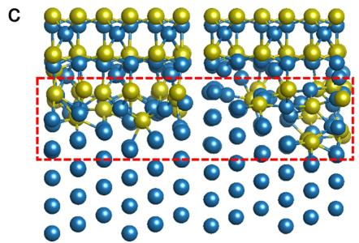

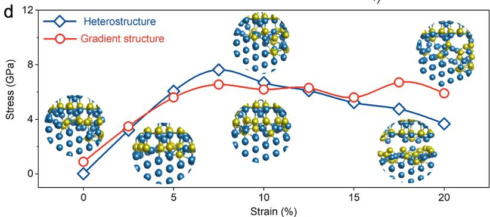

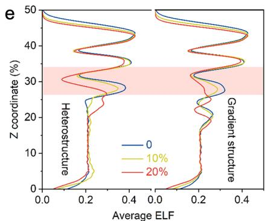
Figure 5. Theoretical insights into structural stability. (a) HAADF-STEM image of the interlayer for $\mathrm{Ni}_3\mathrm{S}_2 / \mathrm{NM - I}$ . (b) Histogram of the calculated interfacial adhesion work. (c) Side-view atomic model diagrams of the heterostructure (left) and gradient structure (right) for $\mathrm{Ni}(11\overline{2}) / \mathrm{Ni}_3\mathrm{S}_2(\overline{1}20)$ . The blue and yellow balls represent Ni and S atoms, respectively. Calculated (d) strain-stress and (e) electron localization function curves of different structures.

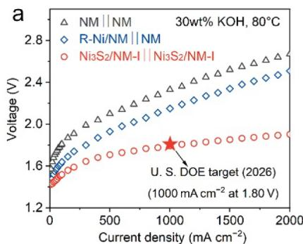

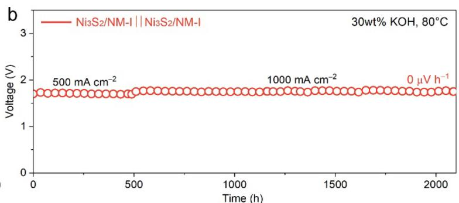

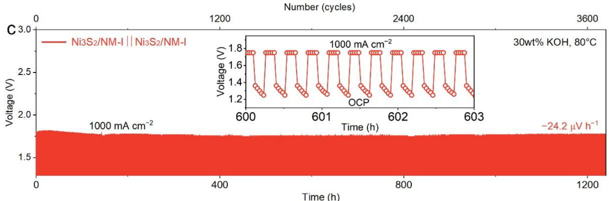
Figure 6. Alkaline water electrolyzer performance. (a) Polarization curves of $\mathrm{Ni}_3\mathrm{S}_2 / \mathrm{NM - I}\parallel \mathrm{Ni}_3\mathrm{S}_2 / \mathrm{NM - I},$ R-Ni/NM $\parallel$ NM, and NM $\parallel$ NM in 30 wt $\%$ KOH at $80^{\circ}\mathrm{C}$ . (b) Long-term stability of $\mathrm{Ni}_3\mathrm{S}_2 / \mathrm{NM - I}\parallel \mathrm{Ni}_3\mathrm{S}_2 / \mathrm{NM - I}$ at current densities of 500 and $1000\mathrm{mAcm}^{-2}$ in 30 wt $\%$ KOH at $80^{\circ}\mathrm{C}$ . (c) Intermittent stability test of $\mathrm{Ni}_3\mathrm{S}_2 / \mathrm{NM - I}\parallel \mathrm{Ni}_3\mathrm{S}_2 / \mathrm{NM - I}$ with 10 min startup/shutdown cycles at $1000\mathrm{mAcm}^{-2}$ in 30 wt $\%$ KOH at $80^{\circ}\mathrm{C}$ .

2.4. Theoretical Insights into Structural Stability. To elucidate the exceptional interfacial stability of the $\mathrm{Ni}_3\mathrm{S}_2 / \mathrm{NM - I}$ system, we performed a multiscale theoretical investigation correlated with the experimental observations. HAADF-STEM

images identify the lattice spacings of 0.41 and $0.20\mathrm{nm}$ corresponding to the $\mathrm{Ni}_3\mathrm{S}_2$ (101) plane for the surface catalytic layer and the Ni (111) plane for the NM substrate, respectively (Figure S42). Notably, the simultaneous presence of both

planes at the interfacial region (Figure 5a) motivates us to construct a $\mathrm{Ni}(11\overline{2}) / \mathrm{Ni}_3\mathrm{S}_2(120)$ heterostructure model based on crystallographic orientation matching (Figure S43). Interfacial bonding strength was quantitatively evaluated through adhesion work $(W_{\mathrm{ad}})$ calculations.44,45 The $\mathrm{Ni}(111) / \mathrm{Ni}_3\mathrm{S}_2(101)$ interface exhibits a $W_{\mathrm{ad}}$ of $0.19\mathrm{eV}\AA^{-2}$ , exceeding the homogeneous $\mathrm{Ni}_3\mathrm{S}_2(101) / \mathrm{Ni}_3\mathrm{S}_2(101)$ interface $(0.14\mathrm{eV}\AA^{-2})$ . Notably, the engineered $\mathrm{Ni}(11\overline{2}) / \mathrm{Ni}_3\mathrm{S}_2(120)$ interface achieves a $W_{\mathrm{ad}}$ of $0.23\mathrm{eV}\AA^{-2}$ , demonstrating $21\%$ enhancement over the direct face-to-face heterostructure (Figures 5b and S44). In the case of OER, the $W_{\mathrm{ad}}$ of the generated $\mathrm{Ni}(11\overline{2}) / \mathrm{NiOOH}(001)$ interface $(0.24\mathrm{eV}\AA^{-2})$ remains significantly higher than that of the $\mathrm{NiOOH}(001) / \mathrm{NiOOH}(001)$ interface $(0.03\mathrm{eV}\AA^{-2})$ (Figure S45). These results indicate the crucial role of crystallographic orientation-dependent reinforcement by interlayer engineering.

Mechanical resilience of the $\mathrm{Ni}(11\overline{2}) / \mathrm{Ni}_3\mathrm{S}_2(\overline{1} 20)$ heterostructure under operational stresses was further probed through strain-dependent analyses (Figure 5c). Upon $20\%$ tensile strain, the conventional interface displays a stress concentration followed by catastrophic fracture, whereas the gradient architecture maintains structural continuity with higher stress tolerance (Figures 5d and S46). Complementary electron localization function (ELF) analysis reveals critical differences in bond evolution under strain (Figure 5e). For the conventional heterostructure, the ELF value around $30\%$ Z-coordinate drops sharply from $\sim 0.2$ ( $0\%$ strain) to $\sim 0.1$ ( $20\%$ strain), signaling bond weakening at stress-concentrated regions.[46,47] In contrast, the gradient architecture maintains stable ELF across all strain levels, demonstrating its effectiveness in maintaining both structural and electronic stability under strain.[48,49] Collectively, the stabilization mechanism involves: (1) a crystallographically optimized $\mathrm{Ni}(11\overline{2}) / \mathrm{Ni}_3\mathrm{S}_2(\overline{1} 20)$ heterostructure interlayer with enhanced chemical bonding, and (2) gradient-induced continuous lattice matching that dissipates mechanical energy, suppressing crack nucleation. These synergistic effects enable the exceptional resistance to the RC effect and $>3000\mathrm{h}$ stability in alkaline water splitting, establishing new design principles for durable heterostructured electrodes.

2.5. Alkaline Water Electrolyzer Performance. The performance of the $\mathrm{Ni}_3\mathrm{S}_2 / \mathrm{NM}$ electrode is significantly better than that of the previously reported $\mathrm{Ni}_3\mathrm{S}_2$ electrode (Table S1), which has great potential for commercial electrode applications. To validate the industrial viability of $\mathrm{Ni}_3\mathrm{S}_2 / \mathrm{NM}$ I, we constructed a homemade zero-gap AWE equipped with $\mathrm{Ni}_3\mathrm{S}_2 / \mathrm{NM}$ I bifunctional electrodes $(2\mathrm{cm} \times 2\mathrm{cm})$ and a ZIRFON PERL UTP 500 composite diaphragm. At $80^{\circ}\mathrm{C}$ in 30 wt $\%$ KOH, the $\mathrm{Ni}_3\mathrm{S}_2 / \mathrm{NM}$ I II $\mathrm{Ni}_3\mathrm{S}_2 / \mathrm{NM}$ I system achieves low cell voltages of 1.72 and $1.79\mathrm{V}$ at 500 and $1000\mathrm{mA}\mathrm{cm}^{-2}$ , respectively (Figure 6a), surpassing routine Raney nickel/NM (R-Ni/NM) II NM (1.92 and $2.14\mathrm{V}$ ) and NM II NM (2.10 and $2.33\mathrm{V}$ ) systems. Crucially, this performance meets the U.S. DOE 2026 target $(1.80\mathrm{V} @1000\mathrm{mA}\mathrm{cm}^{-2})$ for liquid alkaline electrolysis, while outperforming most reported bifunctional electrodes (Table S2). Long-term stability tests under industrial operating conditions $(1000\mathrm{mA}\mathrm{cm}^{-2}, 80^{\circ}\mathrm{C})$ reveal zero voltage decay over $1500\mathrm{h}$ (Figure 6b), demonstrating outstanding durability under high-current-density operation. To further assess the practical applicability of electrodes in fluctuating renewable-coupled systems, intermittent stability tests with frequent $10\mathrm{min}$ startup/shutdown intervals were conducted. As shown in Figure 6c, the

$\mathrm{Ni}_3\mathrm{S}_2 / \mathrm{NM - I}$ $\mathrm{Ni}_{3}\mathrm{S}_{2} / \mathrm{NM - I}$ system exhibits remarkable fluctuating resistance, maintaining stable operation for over $1200\mathrm{h}$ (3600 startup/shutdown cycles) without any attenuation at a current density of $1000\mathrm{mAcm}^{-2}$ under industrial operating conditions. Scalability is also confirmed through thermal injection synthesis, producing large-area electrodes $(10\times 10~\mathrm{cm})$ with uniform $\mathrm{Ni}_3\mathrm{S}_2$ coverage (Figure S47). Considering its attractive advantages, such as a unique gradient structure, low cost, high activity, and excellent stability, the as-synthesized $\mathrm{Ni}_3\mathrm{S}_2 / \mathrm{NM - I}$ electrode exhibits great potential as an industrial AWE electrode for hydrogen production.

# 3. CONCLUSIONS

We demonstrate a gradient interlayer engineering strategy to construct a $\mathrm{Ni}_3\mathrm{S}_2 / \mathrm{NM - I}$ heterostructured electrode with exceptional bifunctional activity, anti-RC durability, and industrial-grade stability for alkaline water electrolysis. By tailoring a crystallographically matched $\mathrm{Ni}(11\overline{2}) / \mathrm{Ni}_3\mathrm{S}_2(\overline{1} 20)$ heterointerface with gradient lattice strain buffering, the electrode achieves seamless mechanical adhesion and accelerated charge transfer kinetics, as validated by cross-sectional microscopy and spectroscopic analyses. The $\mathrm{Ni}_3\mathrm{S}_2 / \mathrm{NM - I}$ II $\mathrm{Ni}_3\mathrm{S}_2 / \mathrm{NM - I}$ system delivers industrially relevant current densities of 500 and $1000~\mathrm{mA~cm^{-2}}$ at low voltages of 1.72 and $1.79\mathrm{V}$ , respectively, while maintaining $2000\mathrm{h}$ of stability without decay. Crucially, the electrode exhibits unprecedented resilience to intermittent renewable energy inputs, enduring 3600 aggressive startup/shutdown cycles with negligible activity loss, a critical metric for practical renewable-coupled hydrogen production. This work shifts the paradigm of catalyst design from conventional electronic modulation to interface crystallography engineering, offering a universal route to mitigate mechanical/electrochemical degradation in heterostructured systems and ultimately bridge the gap between atomic-scale structural control and industrial device requirements. The mechanistic insights into RC-driven degradation and the rational design of anti-RC strategies establish a universal roadmap for enabling various next-generation electrocatalytic devices, e.g., anion-exchange membrane electrolyzers and $\mathrm{CO}_{2}$ -to-fuel systems) to operate reliably under fluctuating renewable energy inputs. By addressing the critical bottleneck of renewable intermittency, it advances global decarbonization efforts across hard-to-abate sectors while setting a precedent for material innovation in fluctuating electrochemical environments.

# 4. EXPERIMENTAL SECTION

4.1. Chemicals and Materials. Ethanol $(\geq 99.7\%)$ , triethylene glycol (TEG), and potassium hydroxide (KOH, $95\%$ ) were purchased from Aladdin. 2-Mercaptoethanol $(\geq 99\%)$ was provided by Sigma-Aldrich. Nickel nitrate $\left(\mathrm{Ni}(\mathrm{NO}_3)_2 \cdot 6\mathrm{H}_2\mathrm{O}, 99.99\%\right)$ , urea $(99\%)$ , ammonium fluoride $\left(\mathrm{NH}_4\mathrm{F}, 99\%\right)$ , and nickel nanoparticles (Ni NPs, $99.9\%$ ) were obtained from Macklin. Nickel mesh (NM, $1.0~\mathrm{mm}$ thickness, $\geq 99.5\%$ ) was purchased from Hebei Chaochuang Metal Mesh Industry Co., Ltd. NM was ultrasonically cleaned in pure water, dilute hydrochloric acid (36% concentrated hydrochloric acid and pure water were mixed evenly in a volume ratio of 1:3), acetone, and alcohol, and then dried at $60^{\circ}\mathrm{C}$ under vacuum for $8\mathrm{h}$ to obtain clean NM.

4.2. Synthesis of $\mathrm{Ni@Ni_3S_2}$ NPs. The Ni NPs $(0.3\mathrm{g})$ and TEG solvent $(20~\mathrm{mL})$ were introduced into a three-necked flask. When the temperature reached $180^{\circ}\mathrm{C}, 2\mathrm{mL}$ of 2-mercaptoethanol was injected into it, and then the temperature was maintained for $20\mathrm{min}$ . After the

reaction, the product was washed with ethanol and dried at $60^{\circ}\mathrm{C}$ under vacuum to gain the $\mathrm{Ni@Ni_3S_2}$ NPs.

4.3. Synthesis of $\mathrm{Ni}_3\mathrm{S}_2 / \mathrm{NM}$ I. The synthesis method of $\mathrm{Ni}_3\mathrm{S}_2/$ NM-I was the same as that of $\mathrm{Ni}@\mathrm{Ni}_3\mathrm{S}_2$ NPs, requiring only the replacement of Ni NPs with a piece of clean NM (1 cm × 3 cm). The $\mathrm{Ni}_3\mathrm{S}_2 / \mathrm{NM}$ I catalyst used in the AWE exhibited a size of 2 cm × 2 cm or larger. The synthesis method was consistent, requiring only proportional amplification of the amount of TEG and 2- mercaptoethanol.
4.4. Synthesis of $\mathrm{Ni}_3\mathrm{S}_2 / \mathrm{NM - H}$ . 2.25 mmol of $\mathrm{Ni(NO_3)_2\cdot 6H_2O}$ , 10 mmol of urea, 4 mmol of $\mathrm{NH_4F}$ , and $35~\mathrm{mL}$ of pure water were mixed to form a uniform solution and poured into an autoclave with a volume of $45~\mathrm{mL}$ . Two pieces of NM (1 cm × 3 cm) were also added to it and maintained at $120^{\circ}\mathrm{C}$ for 6 h to synthesize the $\mathrm{Ni(OH)}_2/$ NM precursor. Then, a piece of $\mathrm{Ni(OH)}_2 / \mathrm{NM}$ was added into a 45 mL autoclave containing a solution of $25~\mathrm{mL}$ of alcohol and $2.5~\mathrm{mL}$ of 2-mercaptoethanol, followed by heating at $150^{\circ}\mathrm{C}$ for 5 h. Finally, the $\mathrm{Ni}_3\mathrm{S}_2 / \mathrm{NM - H}$ sample was obtained after cleaning with pure water and drying under vacuum.
4.5. Electrochemical Measurements. The electrochemical test was performed on a CS310X electrochemical workstation with a three-electrode configuration. The working, reference, and counter electrodes were the prepared sample, the $\mathrm{Hg / HgO}$ electrode, and the platinum plate, respectively. A cyclic voltammetry (CV) scan was carried out at a scan rate of $100\mathrm{mV}s^{-1}$ , and then a linear sweep voltammetry (LSV) test was performed at a scan rate of $2\mathrm{mV}s^{-1}$ , accompanied by an $iR$ compensation of $60\%$ . The potential $(E)$ vs RHE was derived from the Nernst equation:

$$
E (\mathrm {v s R H E}) = E (\mathrm {v s H g / H g O}) + 0. 0 5 9 2 \times \mathrm {p H} + 0. 0 9 8
$$

Double layer capacitance $(C_{\mathrm{dl}})$ was obtained by measuring CVs at a scan rate of 5 to $150~\mathrm{mV~s^{-1}}$ . Electrochemical impedance spectroscopy (EIS) was obtained at $5\mathrm{mV}$ amplitude with a frequency range from $0.1\mathrm{Hz}$ to $1\mathrm{MHz}$ (at $-0.15\mathrm{V}$ vs RHE for HER and $1.38\mathrm{V}$ vs RHE for OER). The long-term stability of HER and OER in $1.0\mathrm{M}$ KOH at $25^{\circ}\mathrm{C}$ was tested under a current density of $-500$ and $-1000$ or $500$ and $1000\mathrm{mA~cm}^{-2}$ without iR compensation. An AWE was constructed using a large-area $\mathrm{Ni}_3\mathrm{S}_2/\mathrm{NM - I}$ electrode $(2\mathrm{cm}\times 2$ cm) as the cathode and anode, and ZIRFON PERL UTP 500 from Agfa as the separator in a zero-gap electrolyzer. All electrochemical tests of the AWE were conducted on CS310X electrochemical workstation with CS2020B power booster at $80^{\circ}\mathrm{C}$ in $30\mathrm{wt}\%$ KOH (circulated with a flow rate of $6.25~\mathrm{mL~min}^{-1}$ ).
4.6. Characterizations. XRD was carried out on a Bruker D8 Advance with a $\mathrm{CuK}_{\alpha}$ radiation source at $40.0\mathrm{kV}.$ SEM was performed on a JEOL JSM 7401F at $3.0\mathrm{kV}.$ TEM, HRTEM, IL-TEM, HAADF-STEM, and SAED were carried out using an FEI Titan G2 at $300\mathrm{kV}$ accelerating voltage, which was also equipped with an EDS system. The FIB double beam system (FEI, Helios Nano Lab 600i) was operated at a voltage of $30\mathrm{kV}$ (gallium ion beam) to slice the samples at a micronano scale. All specimens were thinned to less than $50~\mathrm{nm}$ .EELS and 4D-STEM were taken using a JEM-ARM 300F spherical aberration-corrected transmission electron microscope equipped with a Gatan K3 spectrometer. Among them, the DPC result was obtained by C-A+D-B of the 4D-STEM result. The corresponding charge distribution image was obtained by further calculating the DPC result by GMS software. XPS was performed on a Thermo Scientific K-Alpha instrument with Al $\mathbf{K}_{\alpha}$ radiation (1486 eV). The Raman spectra were performed by using a Raman microscope (532 nm, LabRAM HR800).Inductively coupled plasma-mass spectrometry (ICP-MS) was measured on an Agilent 7800. X-ray absorption spectroscopy (XAS) was processed at the Beijing Synchrotron Radiation Facility (BSRF) in fluorescence mode, equipped with the 1W1B beamline and a Si (111) double-crystal monochromator.
4.7. Theoretical Calculations. The calculations in this study were performed using density functional theory (DFT) as implemented in the Vienna Ab-Initio Simulation Package (VASP).[50,51] The core electrons were treated using the projector-augmented wave (PAW) pseudopotential, while the exchange

correlation effects were described using the Perdew-Burke-Ernzerhof (PBE) functional within the generalized gradient approximation (GGA). $^{52,53}$ A plane-wave basis set with an energy cutoff of $500\mathrm{eV}$ was employed. For the dispersion interaction, van der Waals correction was applied using Grimme's D3 scheme. $^{54}$ To mitigate spurious interactions between periodic images, a $20\AA$ vacuum layer was introduced along the $Z$ -axis. The reciprocal space was sampled using a Monkhorst-Pack grid with a maximum allowed distance of $0.03\AA^{-1}$ between adjacent $k$ -points, ensuring an appropriate $k$ -point density. Geometry optimization was carried out until the total energy converged to within $10^{-5}\mathrm{eV}$ and the residual forces were less than $0.02\mathrm{eV}\AA^{-1}$ .

The stability of the $\mathrm{Ni} / \mathrm{Ni}_3\mathrm{S}_2$ interface was evaluated by calculating the adhesion work $(W_{\mathrm{ad}})$ , which is defined as the reversible work required to separate an interface into two free surfaces.55 The adhesion work is expressed by the following formula:

$$
W _ {\mathrm {a d}} = \frac {E _ {\mathrm {s l a b} 1} + E _ {\mathrm {s l a b} 2} - E _ {\mathrm {t o t a l}}}{S}
$$

where $E_{\mathrm{slab1}}$ and $E_{\mathrm{slab2}}$ are the total energies of two surface models, respectively, and $E_{\mathrm{total}}$ represents the total energy of the heterostructure. $S$ represents the interfacial area of the heterostructure. A positive value of $W_{\mathrm{ad}}$ indicates that the heterostructure formed is stable.

To analyze how the interface fractures, the tensile stress-strain curve along the $Z$ -direction was obtained by performing uniaxial tensile tests on the heterostructure supercells. Displacement-controlled deformation was applied, with the strain incrementally increased along the $Z$ -direction, which is normal to the interface. For each strain step, the atomic positions were relaxed, while the $Z$ -coordinates of the outermost atomic layer were fixed to maintain the appropriate boundary conditions. The strain was applied in increments of $2.5\%$ along the $Z$ -direction, ensuring a smooth and accurate stress-strain curve. Once the tensile stress exceeds the tolerance threshold of the interface, the interface supercell undergoes fracture.

To further explain the fracture mechanism of the interface, the analysis was carried out using the ELF. The calculation formula for ELF is as follows:

$$
\mathrm {E L F} = \frac {1}{1 + \left(\frac {D}{D _ {\mathrm {h}}}\right) ^ {2}}
$$

where $D$ is the kinetic energy density of the system, and $D_{\mathrm{h}}$ is the corresponding value for a uniform electron gas. An ELF value close to 1 indicates a highly localized electron density, typically found in covalent bonds, whereas an ELF value close to 0 suggests more delocalized electron density, often found in metallic bonding or free-electron states.[58]

# ASSOCIATED CONTENT

# Supporting Information

The Supporting Information is available free of charge at https://pubs.acs.org/doi/10.1021/jacs.Sc17603.

Additional XRD, SEM, TEM, XPS, Raman, electrochemical, and DFT data (PDF)

# AUTHOR INFORMATION

# Corresponding Authors

Cheng Tang - Tsinghua Center for Green Chemical Engineering Electrification, Department of Chemical Engineering, Tsinghua University, Beijing 100084, P. R. China; State Key Laboratory of Chemical Engineering and Low-Carbon Technology, Tsinghua University, Beijing 100084, P. R. China; orcid.org/0000-0002-5167-1192; Email: cheng-net0@tsinghua.edu.cn

Qiang Zhang - Tsinghua Center for Green Chemical Engineering Electrification, Department of Chemical Engineering, Tsinghua University, Beijing 100084, P. R. China; State Key Laboratory of Chemical Engineering and Low-Carbon Technology, Tsinghua University, Beijing 100084, P. R. China; orcid.org/0000-0002-3929-1541; Email: zhang-qiang@mails.tsinghua.edu.cn

# Authors

Wenjun He - Tsinghua Center for Green Chemical Engineering Electrification, Department of Chemical Engineering, Tsinghua University, Beijing 100084, P. R. China

Yueshuai Wang - State Key Laboratory of Materials Low-Carbon Recycling, College of Materials Science and Engineering, Beijing University of Technology, Beijing 100124, P. R. China

Yilong Zhao - School of Electrical and Electronic Engineering, Key Laboratory of Engineering Dielectric and Applications (Ministry of Education), Harbin University of Science and Technology, Harbin 150080, P. R. China

Linchuan Cong - Tsinghua Center for Green Chemical Engineering Electrification, Department of Chemical Engineering, Tsinghua University, Beijing 100084, P. R. China

Changli Wang - Tsinghua Center for Green Chemical Engineering Electrification, Department of Chemical Engineering, Tsinghua University, Beijing 100084, P. R. China

Yue Lu - State Key Laboratory of Materials Low-Carbon Recycling, College of Materials Science and Engineering, Beijing University of Technology, Beijing 100124, P. R. China; orcid.org/0000-0001-9800-3792

Xin Liu - School of Electrical and Electronic Engineering, Key Laboratory of Engineering Dielectric and Applications (Ministry of Education), Harbin University of Science and Technology, Harbin 150080, P. R. China; orcid.org/0000-0003-1871-9323

Juncai Dong - Beijing Synchrotron Radiation Facility, Institute of High Energy Physics, Chinese Academy of Sciences, Beijing 100049, P. R. China; orcid.org/0000-0001-8860-093X

Serhiy Cherevko - Forschungszentrum Jülich GmbH, Helmholtz Institute Erlangen-Nürnberg for Renewable Energy (IET-2), Erlangen 91058, Germany; orcid.org/0000-0002-7188-4857

Qingsong Hua - Key Laboratory of Beam Technology of Ministry of Education, School of Physics and Astronomy, Beijing Normal University, Beijing 100875, P. R. China

Complete contact information is available at: https://pubs.acs.org/10.1021/jacs.5c17603

# Author Contributions

$\spadesuit$ W.H., Y.W., and Y.Z. contributed equally to this work.

# Notes

The authors declare no competing financial interest.

# ACKNOWLEDGMENTS

We acknowledge funding from the National Key Research and Development Program of China (2024YFE0211400, 2024YFB4006500), the National Natural Science Foundation of China (22478221), the Huaneng Group Science and

Technology Research Project (HNKJ23-H71), and the Tsinghua University Initiative Scientific Research Program.

# REFERENCES

(1) Odenweller, A.; Ueckerdt, F. The green hydrogen ambition and implementation gap. Nat. Energy 2025, 10 (1), 110-123.
(2) Zhao, H.; Yuan, Z. -Y. Progress and perspectives for solar-driven water electrolysis to produce green hydrogen. Adv. Energy Mater. 2023, 13 (16), 2300254.
(3) Tüysüz, H. Alkaline water electrolysis for green hydrogen production. Acc. Chem. Res. 2024, 57 (4), 558-567.
(4) David, M.; Ocampo-Martinez, C.; Sanchez-Pena, R. Advances in alkaline water electrolyzers: A review. J. Energy Storage 2019, 23, 392-403.
(5) Luo, X.; Xu, N.; Zhou, Y.; Yang, X.; Yang, W.; Liu, G.; Lee, J. K.; Qiao, J. Porous PVA skin-covered thin Zirfon-type separator as a new approach boosting high-rate alkaline water electrolysis beyond $1000\mathrm{h}$ lifespan. eScience 2024, 4 (6), 100290.
(6) Ehlers, J. C.; Feidenhansl, A. A.; Therkildsen, K. T.; Larrazabal, G. O. Affordable green hydrogen from alkaline water electrolysis: Key research needs from an industrial perspective. ACS Energy Lett. 2023, 8 (3), 1502-1509.
(7) Zhao, P.; Wang, J.; Sun, L.; Li, Y.; Xia, H.; He, W. Optimal electrode configuration and system design of compactly-assembled industrial alkaline water electrolyzer. Energy Convers. Manag 2024, 299, 117875.
(8) Esfandiari, N.; Aliofkhazraei, M.; Colli, A. N.; Walsh, F. C.; Cherevko, S.; Kibler, L. A.; Elnagar, M. M.; Lund, P. D.; Zhang, D.; Omanovic, S.; Lee, J. Metal-based cathodes for hydrogen production by alkaline water electrolysis: Review of materials, degradation mechanism, and durability tests. Prog. Mater. Sci. 2024, 144, 101254.
(9) Sha, Q.; Wang, S.; Yan, L.; Feng, Y.; Zhang, Z.; Li, S.; Guo, X.; Li, T.; Li, H.; Zhuang, Z.; Zhou, D.; Liu, B.; Sun, X. 10,000-h-stable intermittent alkaline seawater electrolysis. Nature 2025, 639 (8054), 360-367.
(10) Li, Z.; Lin, G.; Wang, L.; Lee, H.; Du, J.; Tang, T.; Ding, G.; Ren, R.; Li, W.; Cao, X.; Ding, S.; Ye, W.; Yang, W.; Sun, L. Seed-assisted formation of NiFe anode catalysts for anion exchange membrane water electrolysis at industrial-scale current density. Nat. Catal. 2024, 7 (8), 944-952.
(11) Luo, Y.; Zhang, Z.; Chhowalla, M.; Liu, B. Recent advances in design of electrocatalysts for high-current-density water splitting. Adv. Mater. 2022, 34 (16), 2108133.
(12) Luo, Y.; Zhang, Z.; Yang, F.; Li, J.; Liu, Z.; Ren, W.; Zhang, S.; Liu, B. Stabilized hydroxide-mediated nickel-based electrocatalysts for high-current-density hydrogen evolution in alkaline media. Energy Environ. Sci. 2021, 14 (8), 4610-4619.
(13) Liu, W.; Yu, J.; Li, T.; Li, S.; Ding, B.; Guo, X.; Cao, A.; Sha, Q.; Zhou, D.; Kuang, Y.; et al. Self-protecting CoFeAl-layered double hydroxides enable stable and efficient brine oxidation at $2\mathrm{Acm}^{-2}$ . Nat. Commun. 2024, 15 (1), 4712.
(14) Yu, Q.; Zhang, Z.; Qiu, S.; Luo, Y.; Liu, Z.; Yang, F.; Liu, H.; Ge, S.; Zou, X.; Ding, B.; et al. A Ta-TaS $_2$ monolith catalyst with robust and metallic interface for superior hydrogen evolution. Nat. Commun. 2021, 12 (1), 6051.
(15) Zeng, F.; Mebrahtu, C.; Liao, L.; Palkovits, R.; Beine, A. K. Stability and deactivation of OER electrocatalysts: A review. J. Energy Chem. 2022, 69, 301-329.
(16) Chen, F. Y.; Wu, Z. Y.; Adler, Z.; Wang, H. Stability challenges of electrocatalytic oxygen evolution reaction: From mechanistic understanding to reactor design. Joule 2021, 5 (7), 1704-1731.
(17) Li, L.; Laan, P. C. M.; Yan, X.; Cao, X.; Mekkering, M. J.; Zhao, K.; Ke, L.; Jiang, X.; Wu, X.; Li, L.; et al. High-rate alkaline water electrolysis at industrially relevant conditions enabled by superaerophobic electrode assembly. Adv. Sci. 2023, 10 (4), 2206180.
(18) Lohmann-Richters, F. P.; Renz, S.; Lehnert, W.; Mueller, M.; Carmo, M. Review-challenges and opportunities for increased current density in alkaline electrolysis by increasing the operating temperature. J. Electrochem. Soc. 2021, 168 (11), 114501.

(19) Kojima, H.; Nagasawa, K.; Todoroki, N.; Ito, Y.; Matsui, T.; Nakajima, R. Influence of renewable energy power fluctuations on water electrolysis for green hydrogen production. Int. J. Hydrogen Energy 2023, 48 (12), 4572-4593.
(20) Haleem, A. A.; Huyen, J.; Nagasawa, K.; Kuroda, Y.; Nishiki, Y.; Kato, A.; Nakai, T.; Araki, T.; Mitsushima, S. Effects of operation and shutdown parameters and electrode materials on the reverse current phenomenon in alkaline water analyzers. J. Power Sources 2022, 535, 231454.
(21) Ehlers, J. C.; Feidenhans', A. A.; Therkildsen, K. T.; Larrazábal, G. O. Affordable green hydrogen from alkaline water electrolysis: key research needs from an industrial perspective. ACS Energy Lett. 2023, 8 (3), 1502-1509.
(22) Todoroki, N.; Nagasawa, K.; Enjoji, H.; Mitsushima, S. Suppression of catalyst layer detachment by interfacial microstructural modulation of the $\mathrm{NiCo_2O_4 / Ni}$ oxygen evolution electrode for renewable energy-powered alkaline water electrolysis. ACS Appl. Mater. Interfaces 2023, 15 (20), 24399-24407.
(23) Kuang, W.; Cui, Z.; Wang, C.; Chen, T.; Wang, Q.; Li, S.; Yang, T.; Liu, J. Self-supported $\mathrm{Ni} / \mathrm{Ni}(\mathrm{OH})_2$ electrodes for high-performance alkaline and AEM water electrolysis. Adv. Energy Mater. 2022, 15 (14), 2406080.
(24) Uchino, Y.; Kobayashi, T.; Hasegawa, S.; Nagashima, I.; Sunada, Y.; Manabe, A.; Nishiki, Y.; Mitsushima, S. Dependence of the reverse current on the surface of electrode placed on a bipolar plate in an alkaline water electrolyzer. Electrochemistry 2018, 86 (3), 138-144.
(25) Grden, M.; Klimek, K. EQCM studies on oxidation of metallic nickel electrode in basic solutions. J. Electroanal. Chem. 2005, S81 (1), 122-131.
(26) Diao, S.; Wang, T.; Kuang, W.; Yan, S.; Zhang, X.; Chen, M.; Liu, Y.; Tan, A.; Yang, T.; Liu, J. Highly durable porous NiO-derived electrodes with superior bifunctional activity for scalable alkaline water electrolysis. Chem. Eng. J. 2025, 504, 158738.
(27) Holmin, S.; Naslund, L. A.; Ingason, A. S.; Rosen, J.; Zimmerman, E. Corrosion of ruthenium dioxide based cathodes in alkaline medium caused by reverse currents. Electrochim. Acta 2014, 146, 30-36.
(28) Doughty, R. L.; Ionata, V. J.; Dye, T. E.; Wirant, J. A. Optimum electrical system design for a modern chlor-alkali plant. IEEE Trans. Ind. Appl. 1989, 25 (5), 928-938.
(29) Kim, Y.; Jung, S. M.; Kim, K. S.; Kim, H. Y.; Kwon, J.; Lee, J.; Cho, H. S.; Kim, Y. T. Cathodic protection system against a reverse-current after shut-down in zero-gap alkaline water electrolysis. JACS Au 2022, 2 (11), 2491-2500.
(30) Kim, I. S.; Cho, H. S.; Kim, M.; Oh, H. J.; Lee, S. Y.; Lee, Y. K.; Lee, C.; Lee, J. H.; Cho, W. C.; Kim, S. K.; Joo, J. H.; Kim, C. H. Sacrificial species approach to designing robust transition metal phosphide cathodes for alkaline water electrolysis in discontinuous operation. J. Mater. Chem. A 2021, 9 (31), 16713-16724.
(31) Jung, S. M.; Yun, S. W.; Kim, J. H.; You, S. H.; Park, J.; Lee, S.; Chang, S. H.; Chae, S. C.; Joo, S. H.; Jung, Y.; Lee, J.; Son, J.; Snyder, J.; Stamenkovic, V.; Markovic, N. M.; Kim, Y. T. Selective electrocatalysis imparted by metal-insulator transition for durability enhancement of automotive fuel cells. Nat. Catal. 2020, 3 (8), 681-681.
(32) Jung, S.- M.; Kim, Y.; Lee, B.-J.; Jung, H.; Kwon, J.; Lee, J.; Kim, K. -S.; Kim, Y. -W.; Kim, K. -J.; Cho, H. -S.; et al. Reverse-current tolerance for hydrogen evolution reaction activity of lead-decorated nickel catalysts in zero-gap alkaline water electrolysis systems. Adv. Funct. Mater. 2024, 34 (27), 2316150.
(33) Li, S.; Liu, T.; Zhang, W.; Wang, M.; Zhang, H.; Qin, C.; Zhang, L.; Chen, Y.; Jiang, S.; Liu, D.; et al. Highly efficient anion exchange membrane water electrolyzers via chromium-doped amorphous electrocatalysts. Nat. Commun. 2024, 15 (1), 3416.
(34) Bai, X.; Zhang, M.; Shen, Y.; Liang, X.; Jiao, W.; He, R.; Zou, Y.; Chen, H.; Zou, X. Room-temperature, meter-scale synthesis of heazlewoodite-based nanoarray electrodes for alkaline water electrolysis. Adv. Funct. Mater. 2024, 34 (34), 2400979.

(35) Liu, X.; Wang, J.; Liao, H.; Chen, J.; Zhang, S.; Tan, L.; Zheng, X.; Chu, D.; Tan, P.; Pan, J. Cationic oxidative leaching engineering modulated in situ self-reconstruction of nickel sulfide for superior water oxidation. Nano Lett. 2023, 23 (11), 5027-5034.
(36) Fu, H. Q.; Zhou, M.; Liu, P. F.; Liu, P.; Yin, H.; Sun, K. Z.; Yang, H. G.; Al-Mamun, M.; Hu, P.; Wang, H. F.; Zhao, H. Hydrogen spillover-bridged Volmer/Tafel processes enabling ampere-level current density alkaline hydrogen evolution reaction under low overpotential. J. Am. Chem. Soc. 2022, 144 (13), 6028–6039.
(37) Xia, L.; Gomes, B. F.; Jiang, W.; Escalera-Lopez, D.; Wang, Y.; Hu, Y.; Faid, A. Y.; Wang, K.; Chen, T.; Zhao, K.; Zhang, X.; Zhou, Y.; Ram, R.; Polesso, B.; Guha, A.; Su, J.; Lobo, C. M. S.; Haumann, M.; Spatschek, R.; Sunde, S.; Gan, L.; Huang, M.; Zhou, X.; Roth, C.; Lehnert, W.; Cherevko, S.; Gan, L.; Garcia de Arquer, F. P.; Shviro, M. Operando-informed precatalyst programming towards reliable high-current-density electrolysis. Nat. Mater. 2025, 24 (5), 753-761.
(38) Chen, L.; Dong, X.; Wang, Y.; Xia, Y. Separating hydrogen and oxygen evolution in alkaline water electrolysis using nickel hydroxide. Nat. Commun. 2016, 7, 11741.
(39) He, W.; Han, L.; Hao, Q.; Zheng, X.; Li, Y.; Zhang, J.; Liu, C.; Liu, H.; Xin, H. L. Fluorine-anion-modulated electron structure of nickel sulfide nanosheet arrays for alkaline hydrogen evolution. ACS Energy Lett. 2019, 4 (12), 2905-2912.
(40) Huang, Y.; Kong, F.; Yu, X.; Yang, T.; Wu, P.; Shen, R.; Zhuo, S.; Cui, X.; Shi, J. Stabilizing the Fe species of nickel-iron double hydroxide via chelating asymmetric aldehyde-containing THB ligand for long-lasting water oxidation. Adv. Mater. 2025, 37 (7), 2419887.
(41) Jia, B.; Zhang, B.; Cai, Z.; Yang, X.; Li, L.; Guo, L. Construction of amorphous/crystalline heterointerfaces for enhanced electrochemical processes. eScience 2023, 3 (2), 100112.
(42) Abraham Gebreslase, G.; Victoria Martinez-Huerta, M.; Jesus Lazaro, M. Recent progress on bimetallic NiCo and CoFe based electrocatalysts for alkaline oxygen evolution reaction: A review. J. Energy Chem. 2022, 67, 101-137.
(43) Abdel Haleem, A.; Nagasawa, K.; Kuroda, Y.; Nishiki, Y.; Zaenal, A.; Mitsushima, S. A new accelerated durability test protocol for water oxidation electrocatalysts of renewable energy powered alkaline water electrolyzers. Electrochemistry 2021, 89 (2), 186-191.
(44) He, Y.; Sun, H. Mechanical strength and band alignment of BAs/GaN heterojunction polar interfaces: A first-principles calculation study. Phys. Rev. Mater. 2022, 6 (3), 034603.
(45) Liu, X.; Cai, Z.; Wan, L.; Xiao, P.; Che, B.; Yang, J.; Niu, H.; Wang, H.; Zhu, J.; Huang, Y. -T.; et al. Grain engineering of $\mathrm{Sb}_2\mathrm{S}_3$ thin films to enable efficient planar solar cells with high open-circuit voltage. Adv. Mater. 2024, 36 (1), 2305841.
(46) Mortazavi, B.; Silani, M.; Podryabinkin, E. V.; Rabczuk, T.; Zhuang, X.; Shapeev, A. V. First-principles multiscale modeling of mechanical properties in graphene/borophene heterostructures empowered by machine-learning interatomic potentials. Adv. Mater. 2021, 33 (35), 2102807.
(47) Cao, F. H.; Wang, Y. J.; Dai, L. H. Novel atomic-scale mechanism of incipient plasticity in a chemically complex CrCoNi medium-entropy alloy associated with inhomogeneity in local chemical environment. Acta Mater. 2020, 194, 283-294.
(48) Zhang, G.; Chen, G.; Panwisawas, C.; Teng, X.; An, R.; Cao, J.; Huang, Y.; Dong, Z.; Leng, X. Uncovering the fracture mechanism of Laves (111)/ $\mathrm{Ni}_6\mathrm{Nb}_7$ (0001) interfaces by first-principles calculations. Acta Mater. 2024, 281, 120426.
(49) Silvi, B.; Savin, A. Classification of chemical bonds based on topological analysis of electron localization functions. Nature 1994, 371 (6499), 683-686.
(50) Zhang, B.; Wang, J.; Liu, G.; Weiss, C. M.; Liu, D.; Chen, Y.; Xia, L.; Zhou, P.; Gao, M.; Liu, Y.; Chen, J.; Yan, Y.; Shao, M.; Pan, H.; Sun, W. A strongly coupled $\mathrm{Ru - CrO_x}$ cluster-cluster heterostructure for efficient alkaline hydrogen electrocatalysis. Nat. Catal. 2024, 7 (4), 441-451.
(51) Zhang, J.; Fu, X.; Kwon, S.; Chen, K.; Liu, X.; Yang, J.; Sun, H.; Wang, Y.; Uchiyama, T.; Uchimoto, Y.; Li, S.; Li, Y.; Fan, X.; Chen, G.; Xia, F.; Wu, J.; Li, Y.; Yue, Q; Qiao, L.; Su, D.; Zhou, H.

Goddard, W. A.; Kang, Y. Tantalum-stabilized ruthenium oxide electrocatalysts for industrial water electrolysis. Science 2025, 387 (6729), 48-55.
(52) He, W.; Zhang, R.; Liu, H.; Hao, Q.; Li, Y.; Zheng, X.; Liu, C.; Zhang, J.; Xin, H. L. Atomically dispersed silver atoms embedded in NiCo layer double hydroxide boost oxygen evolution reaction. Small 2023, 19 (34), 2301610.
(53) Zheng, C.; Zhang, X.; Zhou, Z.; Hu, Z. A first-principles study on the electrochemical reaction activity of 3d transition metal single-atom catalysts in nitrogen-doped graphene: Trends and hints. eScience 2022, 2 (2), 219–226.
(54) Grimme, S.; Antony, J.; Ehrlich, S.; Krieg, H. A consistent and accurate ab initio parametrization of density functional dispersion correction (DFT-D) for the 94 elements H-Pu. J. Chem. Phys. 2010, 132 (15), 154104.
(55) Lipkin, D. M.; Clarke, D. R.; Evans, A. G. Effect of interfacial carbon on adhesion and toughness of gold-sapphire interfaces. Acta Mater. 1998, 46 (13), 4835-4850.
(56) Tian, Z. X.; Yan, J. X.; Xiao, W.; Geng, W. T. Effect of lateral contraction and magnetism on the energy release upon fracture in metals: First-principles computational tensile tests. Phys. Rev. B 2009, 79 (14), 2305841.
(57) Savin, A.; Jepsen, O.; Flad, J.; Andersen, O. K.; Preuss, H.; Vonschnering, H. G. Electron localization in solid-state structures of the elements: The diamond structure. Angew. Chem., Int. Ed. 1992, 31 (2), 187-188.
(58) Song, W.; He, Q.; Rao, L.; Zhang, S.; Wang, J.; Ren, X.; Yang, Q. Heterogeneous nucleation interface between $\mathrm{LaAlO}_3$ and niobium carbide: First-principles calculation. Appl. Surf. Sci. 2022, 606, 154731.

# NOTE ADDED AFTER ASAP PUBLICATION

Due to a production error, this paper was published ASAP on December 11, 2025, with corrupted versions of Figures 1 and 2. The corrected version was reposted on December 15, 2025.

CAS BIOFINDER DISCOVERY PLATFORM™

PRECISION DATA

FOR FASTER

DRUG

DISCOVERY

CAS BioFinder helps you identify targets, biomarkers, and pathway

Unlock insights

CAS

A division of the American Chemical Society
