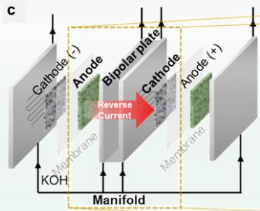
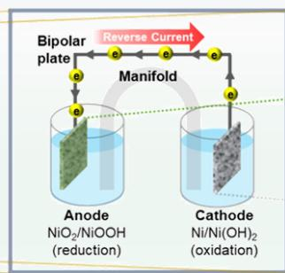
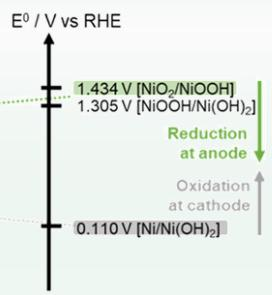
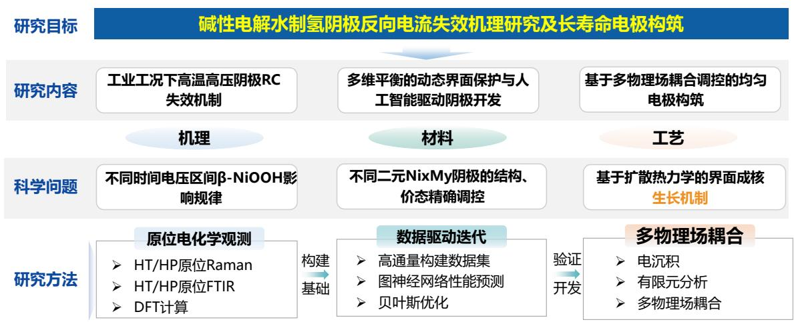
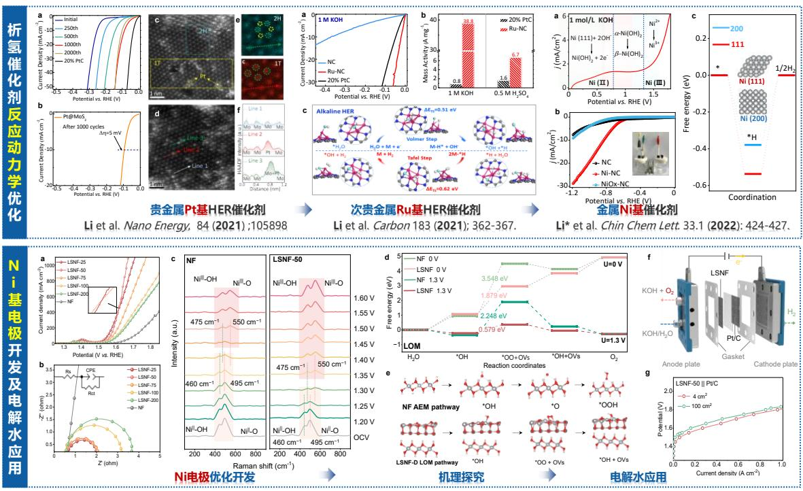

# 报告正文（2026 版）

参照以下提纲撰写，要求内容翔实、清晰，层次分明，标题突出。申请书正文原则上不超过 30 页，鼓励简洁表达。请勿删除或改动下述提纲标题及括号中的文字。

# （一）立项依据：

（为什么要开展此项研究，研究的科学技术价值如何）

# 1.1 抗反向电流研究的背景与意义

氢能作为新质生产力，具有热值高（ $. 1 4 3 \mathrm { k J / g }$ ）、来源丰富、绿色低碳等特点，是第四次能源革命的载体。2022 年 3 月，国家发改委、国家能源局联合印发《氢能产业发展中长期规划（2021-2035 年）》中明确氢能是未来国家能源体系的重要组成部分[1]。可再生能源驱动的电解绿氢制备技术作为战略性新性产业，对构建清洁低碳安全高效的能源体系、实现碳达峰碳中和目标，具有重要意义[2, 3]。目前传统电解制氢技术包括，碱性水电解（ALK）、质子交换膜电解（PEM）、碱性阴离子交换膜电解（AEM）和固体氧化物电解（SOEC）技术[4, 5]。其中，ALK 技术最为成熟，自 2023年以来，可再生能源制氢项目规模达 898 MW，ALK 占比达到$9 4 \% [ 6 ]$ 。然而，碱性电解槽对波动负载的敏感性，尤其是在启停阶段发生的反向电流（RC）（图1-1）[7]，对系统电极的长期稳定性和可扩展性构成了重大挑战。

图 1-1（a-b）双极板式ALK 电解槽结构示意图; （c） 反向电流失效示意[7]

发展抗波动性、安全、稳定、高效运行的阴极电极是行业发展的重点需求。经长期探索，产业界和学术界已经清晰地认识到，波动性载荷对电极稳定性的影响[8, 9]。当 ALK 反应停止时，阴极和阳极通过双极板发生电连接，用于循环电解质溶液的歧管诱发额外离子通路，形成了反向电流，进而导致了析氢（HER）阴极的氧化（图 1-1），且波动工况会加速这种电解衰减过程[10-12]。开发极化整流设备可以在一定程度上缓解反向电流的影响，但会带来额外的运行成本[13, 14]。且当前研究多聚焦于技术层面，鲜有深入剖析电极材料的原位演化过程，系统性地探讨电极失效机制与抗波动机制的构建。因此，基于启停工况，探究电极的失效机制、构建耐 RC调控策略并开发高稳定电极，成为行业发展的前沿课题。

# 1.2 国内外研究现状及发展动态分析

国内外针对 ALK 反向电流开展的研究已有近 15 年，主要涵盖反向电流诱导的材料失效机制[15, 17]、抗反向电流电极材料的开发[7]及其机理解析等方面。近年来，机器学习和人工智能的快速发展，也显著加速了相关功能材料的研发进程。

2013

2022

2025
图1-2 反向电流研究回顾与展望及机器学习新材料探索。（i）RC 失效机制[15, 17]；

（ii）抗 RC 电极开发及机理解析 [7, 11, 18]；（iii）机器学习加速材料开发[19, 20]

# 1.2.1 反向电流失效机制研究

Uchino团队针对反向电流机制进行了系列研究[15, 16]。研究发现停机状态下测得的自然反向电流量与停机前加载的电流值呈正比，电荷量的增加源于双极板阳极侧氧化物的累积。当电解槽强制停机时，工况下的电池电压均高于 $1 . 4 \mathrm { V }$ 。基于氧化还原电对的分析，反向电流的主要氧化还原电对为[NiO₂/NiOOH]与 $\mathrm { [ H _ { 2 } / H _ { 2 } O ] }$ 。

开路状态下，阴极电池电压逐渐衰减至 $0 . 3 \mathrm { ~ V ~ }$ ，而阳极末端电池电压仍维持在 1.1 V以上。因此，在反向电流流通时，双极板阳极侧的 Ni基氧化物将被还原，而双极板阴极侧的 $\mathrm { H } _ { 2 }$ 及 Ni 等物质则被氧化。最终，当双极板两侧的氧化还原状态趋于一致时，反向电流将停止（图 1-3）。然而，现有技术仍缺乏对电极/电解液界面动态演化规律的原子级认知，难以建立反向电流强度与材料衰减动力学之间的本征构-效关系, 缺乏融合材料与工业高温高压工况条件的多维数据，制约了高稳定、抗 RC 电极材料的精准构筑。

图 1-3 （a-c）反向电流机理研究[16]; （d-f）原位 Raman 原位探究 HER 机理[23]

在剖析电极反应机理和失效机制方面，近年来发展的原位电化学谱学，如原位拉曼（Raman）和原位红外（FTIR）表征技术发挥了重要作用。通过原位谱学技术能够实时捕捉电极材料在电化学反应过程中发生的变化，包括电极晶体的重构、化学键的断裂与形成等（图 1-4）[18, 21]。Hu 等人通过原位 Raman 揭示了 $\mathrm { N i } ( \mathrm { O H } ) _ { 2 }$ 析氧反应（OER）中侧位 Ni-OO-Ni 的生成[22], 谱学数据表明， OH 对 Ni(III)-O 的攻击是反应的决速步，Ni-OO-Ni的生成驱动了OER反应，该研究为理解Ni的OER机理提供了新的视角。Lau等人通过原位Raman观测到在反应过程中NiSe2向NiSe的转变，生成的 NiSe 作为真正的活性位点增强了 HER 活性[23]。然而，目前大多的原位表征通常在室温常压下进行，未能反应工业电极槽的真实运行工况（温度$\mathbf { 4 0 - 9 0 ^ { \circ } C }$ ；压力 0.1-5.0 MPa），限制了对高温、高压下失效机制探索。因此，从实际应用出发，发展高温、高压原位电化学谱学技术，对揭示真实工业工况波动性能源下阴极活性及寿命的影响机制具有重要意义。

# 1.2.2 构建抗反向电流阴极电极

基于前期对电极失效机制的理解，开发高活性和高稳定性的抗 RC 腐蚀的阴极催化电极，对于碱槽的抗波动、稳定运行至关重要。针对抗RC 电极设计策略目前主要包括外接牺牲阳极保护[24]、构建动态牺牲[7, 11]和缓冲界面层[25, 26]的方法。

Kim 等人构建了系列二元 NixMy 合金（ $\mathbf { M } { = } \mathrm { P b }$ ，Zn，Sn，Al，Fe 等），通过牺牲金属的溶解来维持 Ni 电极的电位小于 $0 . 6 \mathrm { ~ V _ { R H E } }$ ，以此满足稳定性要求[7]。该团队进一步系统研究了 Pb 修饰的 Ni 阴极催化剂（Pb/Ni）的耐 RC 机制, 研究发现RC对Pb/Ni的氧化降低了反向电流的电动势，从而提高了阴极电极的耐受性[12]。基于构建二元 NixMy 合金，牺牲金属的策略能够有效提高电极耐受性，但不同金属的选择和比例控制有待进一步优化，以此提高电极导电性、催化活性和稳定性。

北京化工大学孙晓明教授团队构建了 NiCoP– ${ \mathrm { C r } } _ { 2 } { \mathrm { O } } _ { 3 }$ 抗 RC 电极，反向电流初期，Co、P 等元素优先迁移并被氧化，在表面形成 $\mathrm { C o O _ { x } / P O _ { x } / C r _ { 2 } O _ { 3 } }$ 复合钝化层；在析氢工况下，该钝化层可被还原，体系恢复初始活性（图1-4）[26]。 CoP、RuO2、NiMoN 等体系中，表层首先形成磷酸盐/氧羟化物，这些相在热力学上比 Ni 更易被氧化，在动力学上阻挡进一步反应。掺杂 Pb、W、Mo 等，改变 Ni 周围电子密度，抑制 Ni⁰→Ni²⁺的快速跃迁，促进形成可逆 NiOOH 而非疏松 Ni(OH)2。

图1-4 抗 RC电极开发。（a-d）异元金属牺牲策略[7,11]；（e-g）缓冲界面层策略[26]

为构筑抗 RC 腐蚀的长寿命二元 NixMy 电极，需从热力学、动力学及结构学角度多维协同调控：i. 构建合理的氧化电势梯度，确保 M 比 Ni 更易优先氧化，且该氧化层能被还原，实现动态界面保护与自修复；ii. 需保证界面相容性，避免

M 氧化产物与 Ni基体因晶格失配导致结构坍塌；iii. 需设计连续的电子导电通道，协同实现高导电性与梯度界面效应，提升电极在复杂工况下的服役稳定性。

# 1.2.3 电极的高效构筑与筛选迭代

电沉积是一种通过在电极表面沉积金属、合金的电化学方法，可以快速实现二元 NixMy 合金的制备。但受电沉积基底的几何形状、电场的分布、温度梯度、电极间距等因素影响，导致在电极放大制备过程中面临着电沉积不均匀的挑战[27, 28]（图1-5）。近些年来，基于多物理场的有限元分析可以模拟电场分布、离子传输、物质扩散和电极表面沉积行为，为有效优化工艺参数提供指导。Garcia等人通过仿真模拟实现了锂离子沉积情况的观测[29]；Xia等人通过仿真实现了可再生能源低载和高载情况下电极表面电场的分布预测[30]。由此可见，基于有限元分析的模拟仿真有望加速电沉积放大工艺优化，提高二元合金沉积均匀性、减少缺陷。

图1-5（a-d）电沉积基础理论和原子论[27]；（e-i）机器学习加速抗氧化 Ru电极[31]和非晶高熵 OER催化剂开发[20]

二元 NixMy 合金的构筑能有效调控电极的形貌结构与价态，然而人工探索多组分催化剂的最优配比时间成本较高，降低了催化剂的开发效率。数据驱动的机器学习策略近年来在电化学领域得到了应用研究，加速了催化领域的发展（图1-5）[32]。Abed 等人针对酸性PEM 电解槽阳极钌（Ru）替代铱（Ir）时，不耐酸氧化问

题通过开源数据库 Materials Project收集氧化物数据晶格缩放进一步通过训练模型[31]。以 ${ \mathrm { R u O } } _ { 2 }$ 结构数据为模板替换元素，通过晶格缩放，得到 2070 种待选择元素通过 DFT 计算 676 个（ $34 \%$ ）材料与模型预测对比。最终筛选了掺杂 Mn 后的催化剂，Ru 的溶解速率降低 10 倍以上。

Lei等人利用合成系统，在碱性析氧反应（OER）的全组分设计空间内，发现并优化了非晶高熵羟基氧化物电催化剂[20]。通过从涉及OER反省的文献调研中筛选出前16 的候选金属元素，从中选取 6种非贵金属元素构建了超薄二维配位聚合物，进而通过原位转化衍生出非晶高熵羟基氧化物（图1-5）。借助机器学习技术，建立了组分-活性关系，从而遍历了整个设计空间（逾 190 万种组分组合），并识别出最优组分群。机器学习模型通过高活性区的 100 种组分和低活性区的 588 种组分进行了验证，召回率接近 $\cdot$ 。经预测的最优非晶高熵电催化剂，在 1 M KOH中、 $\_$ 的电流密度下，碱性 OER表现出 $\cdot$ 的超低过电位；在 6 M KOH中、 $\cdot$ 的实际应用电流密度下，展现出 10,218 小时的超长耐久性。

因此，基于电沉积结合机器学习可以进一步扩展到二元抗波动的 NixMy电极开发中，有望实现抗 RC电极的快速开发与迭代优化。

# 1.3 课题提出

面向可再生能源稳定电解制氢的重大需求，本项目以二元 NixMy 催化剂为研究对象，围绕启停过程中失效机理复杂的难题，拟解决 Ni基催化剂配位环境/氧化态的精确调控和动态结构演变机理的关键科学问题。本研究首先开发基于数据驱动的电化学自动化制备平台，实现 NixMy 的高通量制备、评估和筛选；进一步基于实际工况下高温、高压的原位表征技术，从原子、分子水平揭示催化反应路径，重点揭示 NixMy 基电极的在反向电流存在下失效机制；将材料的晶体结构、电化学性能、原位表征结合理论计算模拟，探究 HER 反应路径及失效机制，建立构-效关系；最后基于扩散热力学和电沉积动力学，通过有限元可视化电场分布，优化规模化电极制备工艺参数，实现高效、高稳定及抗波动阴极电极的制备。

图 1-6 研究假说示意图

# 1.4创新性及研究意义

本项目在科学思想、研究方法与技术路径三个层面具有创新性。科学思想创新层面，将电极失效研究从“静态防护”拓展至“动态响应”。突破传统电极稳定性研究基于“静态稳态腐蚀”的模式，提出ALK 制氢阴极在启停工况下的“动态界面保护”概念。利用 NixMy 二元合金中 M 金属的梯度氧化特性，使电极在反向氧化电位时形成可逆氧化保护层，在正常电解负电位恢复高活性，实现“活性-稳定性”的动态平衡。研究方法创新层面，引入数据驱动的“制备-表征-筛选”闭环迭代模式。将传统试错法升级为基于高斯过程与贝叶斯优化的智能迭代，通过构建高通量电沉积平台与电化学性能数据库，结合机器学习建立构效模型，可实现在多金属、多参数构成的无限空间中自主寻优，将大幅提升抗RC 电极的研发效

率。技术路径创新层面，将“电场可视化分布优化”引入大尺寸电极均一性调控。融合有限元电场模拟与电沉积动力学理论，通过多物理场模拟指导工艺放大，破解实验室高性能工艺难以转化为工业化稳定制备技术瓶颈。

本项目研究具有重要的科学价值与工程应用意义。ALK 阴极在启停工况下的RC 失效是制约其寿命的关键工程问题，然而现有研究多聚焦于稳态 HER 活性，对工业 HT/HP 启停过程中电极表面动态氧化行为及其原子级演化机制认识不清。本项目通过构建 HT/HP 原位光谱电化学平台，实时追踪电极在电位反转时的物相演变与界面反应，有望揭示“反向电流冲击-表面氧化-活性衰减”的本征关联机制，丰富电化学腐蚀与催化领域的理论基础，为电极材料设计提供科学依据。本项目开发的基于“动态界面保护”的长寿命 NixMy 合金阴极，可显著提升电极在波动工况下的服役寿命，降低电解槽运维成本。同时，所建立的数据驱动高通量筛选平台与电场模拟放大技术，可推广至其他电极材料体系，为我国 ALK 技术的性能提升与产业化应用提供技术支撑，助力“双碳”目标下绿氢规模化发展。

碱性电解水制氢阴极反向电流失效机理研究及长寿命电极构筑
图 1-7 立项依据整体思路图

# 主要参考文献

[1] 国家发展改革委. 氢能产业发展中长期规划（2021-2035 年）[R]. 北京, 2022.
[2] 夏杨红, 韦巍, 程浩然, 等. 大规模可再生能源直接电解碱液制氢关键科学问题[J]. 太阳能学报, 2024, 45(07): 224-31.
[3] 张盛, 郑津洋, 戴剑锋, 等. 可再生能源大规模制氢及储氢系统研究进展 [J].太阳能学报, 2024, 45(01): 457-65.
[4] 张文韬, 周家辉, 张润之, 等. 计及能耗特性的风光制氢碱性电解槽集群优化策略[J]. 化工进展, 2024, 1: 1-13.
[5] 孙浩, 吴维宁, 陈丽杰, 等. 新能源电解水制氢技术发展研究综述 [J]. 电源学报: 2024, 1; 1-18.
[6] 仲蕊. 电解槽向“大型化”迈进 [N]. 中国能源报,2023-10-16(019).[2024-09-18]
[7] Kim Y, Jung S-M, Kim K-S, et al. Cathodic Protection System against a Reverse-Current after Shut-Down in Zero-Gap Alkaline Water Electrolysis [J]. JACS Au. 2022, 2(11): 2491-500.
[8] Kojima H, Nagasawa K, Todoroki N, et al. Influence of renewable energy power fluctuations on water electrolysis for green hydrogen production [J]. International Journal of Hydrogen Energy, 2023, 48(12): 4572-93.
[9] Haoran C, Xia Y, Wei W, et al. Safety and efficiency problems of hydrogen production from alkaline water electrolyzers driven by renewable energy sources [J]. International Journal of Hydrogen Energy, 2024, 54: 700-12.
[10] Holmin S, Näslund L-Å, Ingason Á S, et al. Corrosion of ruthenium dioxide based cathodes in alkaline medium caused by reverse currents [J]. Electrochim Acta, 2014, 146: 30-6.
[11] Jung S-M, Kim Y, Lee B-J, et al. Reverse-current tolerance for hydrogen evolution reaction activity of lead-decorated Nickel catalysts in Zero-gap alkaline water electrolysis systems [J]. Advanced Functional Materials, 2024, 34(27): 2316150.
[12] Abdel Haleem A, Huyan J, Nagasawa K, et al. Effects of operation and shutdown parameters and electrode materials on the reverse current phenomenon in alkaline water analyzers [J]. Journal of Power Sources, 2022, 535: 231454.
[13] Xia Y, Cheng H, He H, et al. Efficiency and consistency enhancement for alkaline electrolyzers driven by renewable energy sources [J]. Communications Engineering, 2023, 2(1): 22.
[14] Doughty RL, Ionata VJ, Dye TE, et al. Optimum electrical system design for a modern chlor-alkali plant [J]. IEEE Transactions on Industry Applications, 1989, 25(5): 928-38.
[15] Uchino Y, Kobayashi T, Hasegawa S, et al. Relationship between the redox reactions on a bipolar plate and reverse current after alkaline water electrolysis [J]. Electrocatalysis 2018, 9 (1): 67-74.
[16] Uchino Y, Kobayashi T, Hasegawa S, et al. Dependence of the reverse current on the surface of electrode placed on a bipolar plate in an alkaline water electrolyzer [J]. Electrochemistry 2018, 86(3):138-44.
[17] Hall DS, Lockwood DJ, Bock C, et al. Nickel hydroxides and related materials: a review of their structures, synthesis and properties. Proceedings of the Royal Society A: Mathematical [J]. Physical and Engineering Sciences, 2015, 471

(2174): :20140792
[18] Hu C, Hu Y, Zhang B, et al. Advanced catalyst design strategies and in-situ characterization techniques for enhancing electrocatalytic activity and stability of oxygen evolution reaction [J]. Electrochemical Energy Reviews, 2024, 7(1):19.
[19] Shields BJ, Stevens J, Li J, et al. Bayesian reaction optimization as a tool for chemical synthesis [J]. Nature 2021, 590(7844):89-96.
[20] Lei Z, Huang Y, Zhu Y, Zhou D, et al. Automatic discovery and optimal Generation of amorphous high-entropy electrocatalysts [J]. Journal of the American Chemical Society, 2025, 147 (25): 21743-21753.
[21] Li Q, Chen C, Luo W, Yu X, Chang Z, Kong F, et al. In Situ Active Site Refreshing of Electro-Catalytic Materials for Ultra-Durable Hydrogen Evolution at Elevated Current Density [J]. Advanced Energy Materials, 2024, 14(17):2304099.
[22] Lee S, Chu Y-C, Bai L, et al. Operando identification of a side-on nickel superoxide intermediate and the mechanism of oxygen evolution on nickel oxyhydroxide [J]. Chem Catalysis, 2023, 3(1):100475.
[23] Zhai L, Benedict Lo TW, Xu Z-L, et al. In Situ Phase Transformation on Nickel-Based Selenides for Enhanced Hydrogen Evolution Reaction in Alkaline Medium [J]. ACS Energy Letters, 2020, 5(8):2483-91.
[24] Peng Z, Zhang H, Zhang Y, et al. Strategies and countermeasures against reverse current for enhanced durability in water electrolysis systems [J]. Small Methods, 2025, 9 (12): e01816.
[25] Son H, Lee H, Lee J, et al. Enhancing durability of Raney-Ni-based electrodes for hydrogen evolution reaction in alkaline water electrolysis: Mitigating reverse current and $\mathrm { H } _ { 2 }$ bubble effects using a NiP protective layer [J]. Journal of Power Sources, 2026, 661, 238580.
[26] Sha Q, Wang S, Yan L, et al. 10,000-h-stable intermittent alkaline seawater electrolysis [J]. Nature 2025, 639 (8054): 360-367.
[27] Chaudhuri S, Maurer RJ, Challenges in the Theory and atomistic simulation of metal electrodeposition [J]. ACS Electrochemistry, 2025, 1 (7): 1014-1032.
[28] Kale MB, Borse RA, Gomaa AM, et al. Electrocatalysts by electrodeposition: recent advances [J], Synthesis Methods, and Applications in Energy Conversion. 2021, 31 (25)：2101313.
[29] Jana A, Woo SI, Vikrant KS, et al. Electrochemomechanics of lithium dendrite growth [J], Energy & Environmental Science, 2019, 12 (12): 3595-3607.
[30] Xia Y, Wei W, Cheng H, et al. Current bunching effect of large-scale alkaline hydrogen evolution driven by renewable energy sources [J]. Cell Reports Physical Science, 2024, 5:102018.
[31] Abed J, Heras-Domingo J, Sanspeur RY, et al. Pourbaix machine learning framework identifies acidic water oxidation catalysts exhibiting suppressed ruthenium dissolution [J]. Journal of the American Chemical Society, 2024, 146 (23): 15740-15750.
[32] Suvarna M, Pérez-Ramírez J, Embracing data science in catalysis research [J], Nature Catalysis，2024, 7 (6)：624-635.

# （二）研究内容：

（提纲不做限制，请按照研究工作的自身逻辑撰写。应提炼出特色与创新点、年度研究计划）

# 2.1 研究目标

本项目以构建抗波动耐反向电流腐蚀的阴极电极为目标。首先开展高通量电极的制备、评估、筛选和优化：基于贝叶斯优化和高斯过程回归的混合数据驱动策略，开发二元 NixMy 抗波动阴极电极；基于电化学性能评估和电极的配位机构和电子结构表征，解析该类催化剂结构与电化学性能的构-效关系；进一步结合高温高压原位电化学表征技术和理论计算，阐明波动工况下阴极电极失效机制；形成析氢电极的抗波动优化策略，构筑耐反向电流侵蚀的阴极电极；最后基于扩散热力学和电沉积动力学结合有限元分析，实现耐方向电流电极的均一、规模化制备。以期达到以下目标：

（1）建立基于原子、分子尺度的高温/高压原位表征方法，探明催化剂波动工况下动态表界面结构变化机制, 为调控析氢电极价态及配位结构提供理论支撑；
（2）搭建基于数据驱动的高通量电化学制备、评估一体化平台，建立标准化波动性工况稳定性测试流程系统，实现析氢电极的高通量制备和高效筛选；
（3）探明反向电流对电极稳定性影响规律，揭示二元 NixMy 基析氢催化剂构-效关系，建立析氢电极抗波动性优化策略，开发耐反向电流的阴极电极。
（4）明晰电沉积动力学与电流分布的关系，揭示电沉积过程中成核和生长机制，优化调控电沉积条件参数，实现规模化、均一化阴极电极制备。

图2-1 研究内容、关键科学问题及研究目标的关系

# 2.2 研究内容

本项目采用由微观到宏观、从现象到机理的研究方法，高效开发抗波动性、耐反向电流腐蚀的阴极电极。具体研究内容如下：

# 研究内容一： 高温高压工况下阴极在反向电流失效机理及动态演化过程

基于前期工业碱槽高温、高压实际运行工况，对原位电化学反应池进行针对性的改装，建立基于原子、分子尺度的高温、高压原位电化学界面表征方法；调节波动输入参数，模拟实际工作中的催化剂所承受的载荷变化，实时、高效地捕获析氢电极在高温、高压环境中产生的光谱特征并进行分析，进而从分子、原子水平揭示实际波动工况电极表界面的动态演化过程。

# 研究内容二：数据驱动的电化学高通量制备、评估和筛选及构效关系

针对二元 NixMy 基多组分催化剂开发周期长、实验成本高等问题，基于贝叶斯优化和高斯过程回归的混合策略，搭建数据驱动的高通量电化学制备和测试一体化平台；依据数据反馈和模型迭代进行快速制备，实现高效 NixMy 析氢电极的高效筛选；建立波动性工况测试模块，对制备的电极进行性能验证，并反馈电极筛选和设计，最终获得最优化耐反向电流的 NixMy 析氢催化电极。揭示二元 NixMy析氢催化剂构-效关系基于高通量电极筛选结果和电极晶体结构表征，明晰二元NixMy析氢催化剂价态及配位结构，进而明确催化剂的活性位点和结构调控策略；基于非原位、原位表征结果、电化学性能结合 DFT 计算，进一步明确二元 NixMy基催化剂的活性来源、在高温、高压下动态失效机制及其构-效关系。

# 研究内容三：基于多物理场耦合调控的均匀电极构筑

针对电沉积放大制备过程中面临着沉积不均匀的问题，通过 COMSOLMultiphysics有限元分析构建多物理场模型来实现大面积电极制备过程中的电场分布可视化。基于电沉积动力学和扩散热力学，耦合电化学、电场分布、流体力学、热传导等多物理场的结合，以确保模拟的电沉积工艺在大面积电极上的均匀性，最终实现抗反向电流的阴极电极的高质量、大规模制备。

# 2.3 拟解决的关键科学问题

# 科学问题一：波动工况下催化反应机理与动态结构演变规律

二元 Ni基材料其反应过程中动态的价态及配位结构变化，影响着催化反应活性及催化生命窗口。结合波动性工况，开展高温/高压原位谱学表征，建立配位结构-氧化态-原位电化学分析方法，确定二元 Ni 基反应活性位点及生命窗阐明反应机理，是解析本研究根本科学问题并升华研究理论高度的关键。

# 科学问题二：基于二元 NixMy 的 HER 催化剂配位环境精准构筑和价态调控

二元 NixMy 基催化剂因其晶体结构及氧化态复杂多样，且在催化反应过程中易发生动态演变，其原子的配位环境及价态均可影响催化剂在波动性电解水反应中的选择性及反应路径。因此，如何通过调控合成参数对其配位结构及价态的进行精准构筑和调控，从而实现高效、稳定二元 Ni基催化剂的可控制备是本项目拟解决的关键问题之一。

# 科学问题三：基于扩散热力学和电沉积动力学的成核-生长机制

电沉积过程中，电沉积过程中的电流分布不均会导致沉积速率在不同区域产生差异，且金属的形核和生长行为对电极表面的微观结构有重要影响。如何通过调控沉积条件（如电流密度、电解液浓度、温度等）优化形核过程，使得沉积层的生长更加均匀，是提高电极均一性的关键。

# 2.4 研究方法

本项目的基本研究思路为搭平台、探机理、建联系、构方法。采用由微观到宏观的分析方法，具体研究方法如下。

# 研究方法一：基于多尺度表征与理论计算构效关系解析及动态失效机理研究

针对高通量筛选出的特征电极，本部分将建立“宏观性能-微观结构-电子态-理论模型”的完整解析链条。首先，采用高功率 X 射线衍射（XRD）系统分析 Ni基合金的物相结构随沉积参数的变化规律，结合透射电子显微镜（TEM）及扫描透射电子显微镜（STEM）对典型样品进行原子尺度形貌观察和晶格衍射分析，明确相界面晶格匹配度与缺陷分布。X 射线光电子能谱（XPS）与 X 射线近边吸收光谱（XANES）联用，精准解析元素价态、配位环境和化学键合状态随合成条件变量的演变机制，结合晶体结构计算，阐明 Ni中心原子配位环境的调控本质。

为探究工况下的动态演变，引入高温高压原位光谱电化学技术。利用配备蓝宝石窗口的原位 Raman电解池，模拟工业电解温度，在不同施加电位（ $\mathrm { 0 . 0 \sim 0 . 7 V }$

vs. RHE）及时间下实时追踪催化剂表面结构的变化，捕捉氧化物种的生成与消失。同时，采用原位傅里叶变换红外光谱（FTIR）监测反应中间体（如 $^ { * } \mathrm { H }$ ）的吸附行为。最后，基于上述实验确定的原子构型，构建密度泛函理论（DFT）计算模型，计算 Ni 基催化剂的能带结构、氢吸附自由能（ $\Delta \mathrm { G } _ { \mathrm { H } * }$ ）及反应能垒，将理论计算结果与原位光谱捕捉的中间体信息相互印证，最终在电子/原子尺度揭示电极在波动工况下的动态演化路径与失效机制。

# 研究方法二：基于数据驱动的高通量电沉积平台与电极快速筛选

本研究首先构建一套集自动化控制与机器学习于一体的高通量电沉积制备与评估平台，旨在高效探索Ni基二元合金 NixMy 的广阔组分与参数空间。从氧化电位梯度、界面晶格匹配和导电通道三个层面协同调控，选定 Ni 为基底，引入 Pb、Fe、Mo、Co、P 等异质元素，通过精确调控还原电流和沉积时间，实现 Ni配位结构和价态的初步调控。平台采用自主研发的 MicroHySeeker 实现电沉积制备、电化学测试及反向电流加速模拟实验的全流程自动化控制。制备的电极立即进行标准化电化学测试和反向电流加速模拟实验，建立包含沉积参数、元素组成及电化学性能在内的多维数据库。基于高斯过程回归与贝叶斯优化的闭环算法，根据上一轮次电极的析氢活性与抗反向电流稳定性表现，自主推荐下一轮次的沉积参数组合，针对活性与稳定性的多目标协同优化采用帕累托前沿策略进行筛选。通过制备、评估、建模、推荐的闭环迭代，系统能够智能导航至最优性能区间，避免传统试错法对高维参数空间的盲目遍历。该平台的核心优势在于将材料合成速率与评价效率提升 1-2个数量级，为后续深入的构效关系解析提供高质量、多样本的电极材料库，确保研究起点的高效性与统计学意义。

# 研究方法三：基于有限元电场模拟的电极均一性调控与规模化制备工艺优化

在明确高性能活性组分及其失效机制后，本部分旨在解决实验室成果向大尺寸工业化电极转化的关键科学问题—沉积层的均一性。本研究将基于 COMSOLMultiphysics 等有限元软件，建立耦合电极几何结构、电解液流动及电场分布的多物理场模型。模型将以扩散热力学和电沉积动力学为理论框架，导入前期实验获得的电解液物性参数（如扩散系数、迁移数）及电极反应动力学参数。通过有限元模拟，重点研究以下物理场的空间分布规律：一次/二次电流分布：模拟不同电极构型（如平板、网状、泡沫）下电场强度在电极表面的分布情况，识别边缘效应和局部电流“热点”区域。离子浓度场分布：结合流体力学模块，分析强制对

流对阴极表面耗尽层厚度及离子补充速率的影响。基于模拟结果，定量评估电流密度、极板间距、电解液流速等宏观工艺参数对沉积层厚度及成分均一性的影响。通过虚拟实验优化迭代放大参数，筛选出能够实现高度均一电场分布的工艺窗口。最终将优化后的工艺参数应用于大面积电极（如 $1 0 \ : \mathrm { c m } \ \times \ 1 0 \ : \mathrm { c m } ,$ ）的电沉积制备，通过截面 SEM 和元素面分布验证沉积层的均一性。通过仿真指导实验，实验验证模型的闭环，大幅减少试错成本，为高均一性、高稳定性大规模阴极的工业化生产提供可靠的工艺方法。

# 2.5 技术路线

本项目将综合运用实验数据分析、数值模拟、理论分析相结合的研究手段，实现ALK 长寿命电极的构筑。i. 基于自主开发的 HP/HT电化学界面分析零配件，分析HP/HT工业工况下电解槽反复启停阴极失效机制；ii. 通过建立的数据驱动高通量电化学制备筛选平台，构筑二元 NixMy基多维平衡的HER催化剂，明析电化学特性与 NixMy 催化剂的构-效关系，基于机器学习完成成分的多目标优化；iii. 探索电沉积制备参数对电极成核的影响规律，并结合有限元分析模拟不同脉冲占空比优化制备工艺，形成构筑大面积均匀电极的工艺方法（图2-2）。

图 2-2 技术路线图

# 2.6 实验手段

实验手段一：基于启停工况下电化学光谱学探究催化剂动态演变与失效机制

(i) 高温高压原位 Raman 研究：原位拉曼测量在一个定制的流动池组件中进行，该组件的设计与用于加速退化测试（ADT）的简化电解槽类似。该电解池配备有四个 Raney-镍电极（几何面积均为 $1 . 5 \mathrm { c m } ^ { 2 }$ ），同时用作阳极和阴极。运行期间， $3 0 \ \mathrm { w t . \% }$ 的 KOH 电解质持续循环通过系统。拉曼光谱使用 inVia-Reflex 光谱仪（雷尼绍公司）采集，激发光源为 $5 3 2 ~ \mathrm { n m }$ 激光器，功率为 $5 0 ~ \mathrm { m W }$ ，光谱覆盖范围为 $1 0 0 { - } 4 0 0 0 ~ \mathrm { c m } ^ { - 1 }$ 。高压环境通过高压平流泵和液体背压阀共同实现：高压平流泵安装在电解液入口处，液体背压阀安装在电解液出口处。反应温度通过贴附于流动池表面的加热片和内置温度传感器进行控制。在进行光谱监测前，利用氮气对流动池进行吹扫，并使用电化学工作站（CHI 660E）在 $5 0 0 \mathrm { m A } \mathrm { c m } ^ { - 2 }$ 的恒定电流密度下对电解池进行极化。电极电位达到稳态后，设置液体背压阀目标压力，并开启高压平流泵开始加压；待流动池内部达到目标压力后静置 $2 0 \ \mathrm { m i n }$ 进行保压测试。加压的同时开启加热片提升反应温度，待流动池温度达到设定值且反应压力稳定后开始拉曼测试。拉曼测试过程中启动时间分辨采集，以追踪反向电流条件下阴极表面物种的演变。在监测特征 Ni-O 振动谱带的同时，将曝光时间从5 s 降至 0.05 s，直至信噪比降至可靠的检测阈值以下。确定最低可用曝光时间为0.5 s，这进而确定了后续脉冲电流实验的脉冲周期（1 s）。在这些优化条件下，采用连续拉曼采集来解析两脉冲间歇性方案（TPIR）过程中电极表面的可逆氧化还原转变，该方案由交替的 0.5 s 高电流脉冲和 0.5 s 低电流脉冲组成，频率为 $1 \ : \mathrm { H z }$ 。

(ii) 高温高压原位 FTIR 研究：原位 FTIR 测试在 Bruker INVENIO 型红外光谱仪上进行，配备液氮冷却的 MCT 检测器，设定扫描次数为 32 次，分辨率为 $4 \mathrm { c m } ^ { - 1 }$ , 扫描范围为 $4 0 0 0 { \cdot } 4 0 0 \ \mathrm { c m ^ { - 1 } }$ 。高压反应环境利用高压平流泵和液体背压阀系统实现，反应温度利用贴附于原位反应池外部的加热片和内部的温度传感器进行精确控制。每次测试前，先用 $1 0 0 ~ \mathrm { m L / m i n }$ 的 ${ \Nu } _ { 2 }$ 吹扫红外测试室和管线 $0 . 5 \mathrm { h }$ 。将 Ni 基阴极压平装入原位反应池中，压实，连接监测系统与程序升温装置，抽真空后以 $3 0 0 \mathrm { ~ \textdegree C }$ 恒温处理1 h，以除去催化剂表面吸附的杂质和气体。随后，设置背压阀压力，打开高压平流泵，开启升温装置，待反应池压力和温度达到目标值后进行FTIR 测试。测试前先调整红外检测器信号，待稳定后扣除背景；在连续通入 $\Nu _ { 2 }$ 的条件下，采集不同氧化电压及不同反应时间下的红外光谱，实时监测电极

表面反应中间体的动态变化，并对数据进行处理与分析。

# (iii) 基于材料晶体结构学与电化学性能的构-效关系解析

基于筛选的高活性、高稳定性催化剂，建立标准化的分析表征流程是其相结构及配位环境精确调控的基础。（a）采用高功率 XRD 分析 Ni 物相结构特征随合成条件变量的变化；（b）采用 TEM、STEM 及晶格衍射，对某些经过精细划分后不同合成参数的典样品进行结构分析；（c）采用 XPS 和 XANES 分析元素价态和化学键随合成条件变量的变化；（d）结合晶体结构计算，确定 Ni 基材料配位环境及价态随合成条件的演变机制。系统总结 Ni基催化活性的结构与电化学活性的构效关系。

# （iv）DFT 计算

密度泛函理论（DFT）计算在第一性原理模拟包（VASP）中执行，采用Perdew-Burke-Ernzerhof（PBE）和（PAW）方法。在所有 DFT 模拟中，自洽场收敛精度设置为每原子 $1 \times 1 0 ^ { - 5 } \mathrm { e V }$ ，离子弛豫设置为 $0 . 0 3 ~ \mathrm { e V } / \mathrm { \AA }$ 。计算模型基于 XRD等表征测试的结果构建。在对 Raney Ni 进行切片处理后，进行了详细的结构优化。此外，电子波函数的截断能设为 $4 8 0 \ \mathrm { e V }$ ，对于面内杂化模型的 k 点网格设为 $2 \times$ $2 \times 1$ 。差分电荷密度通过以下方程获得： $\Delta { \mathrm { ~  ~ \rho ~ } } = \mathrm { \ p A B - \ p A - \ p B }$ ，其中 ρAB、ρA和 ρB 分别代表整体及两个子部分的电荷密度。 $\Delta$ G 可表示为 $\Delta \mathrm { G } = \Delta \mathrm { E D F T } +$ ΔZPE - TΔS，其中 EDFT、ZPE 和 S 分别代表来自 DFT 计算的总能量、零点能和熵。

# 实验手段二：基于数据驱动的高通量电沉积制备和评估平台的建立

电沉积作为一种高效、简便、可扩展的电化学制备方法，可以实现多元合金的制备和元素调控。本项目通过调控异质元素的类型和比例，实现二元NixMy金属中Ni配位结构和价态的调控。选定Ni为基底，引入Pb、Fe、Mo、Co、P等前驱体，通过调控还原电流和沉积时间进行电沉积制备，协同实现氧化电位梯度的构建、界面晶格匹配度的优化及导电通道的保留。采用自主研发的 MicroHySeeker平台，实现电沉积全过程的自动化控制。完成制备的电极首先采用 CV、LSV 和EIS等电化学测试手段表征其析氢活性与电荷转移动力学；然后交替循环采用计时电位CP（ $- 2 5 0 \mathrm { m A } / \mathrm { c m } ^ { 2 }$ ）与计时电流CA（1.5V）的方法来实现反向电流加速模拟实验（ADT），重现启停工况下的反向电流冲击，对比加速实验前后电化学性能的变化，获取电极抗反向电流的稳定性数据。在此基础上，将活性、动力学及稳

定性数据作为多维优化目标，首轮实验采用拉丁超立方采样在沉积参数空间中生成初始实验方案，获取初始数据集；利用高斯过程回归构建沉积参数与电化学性能之间的代理模型，该模型可同时给出性能预测值与预测不确定度，对已探索区域实现高精度预测，对未探索区域则反映较大的不确定性。结合贝叶斯优化算法，基于预测不确定度在探索未知参数区域与开发已知高性能区域之间进行平衡，自主推荐下一轮沉积参数组合，避免搜索陷入局部最优。随着迭代轮次的推进，实验数据持续积累，模型预测精度逐步提升，搜索范围逐轮聚焦至高性能区域。针对活性与稳定性之间的多目标协同优化，采用帕累托前沿筛选兼具高催化活性、优导电性与强抗反向电流耐受性的解集。通过制备、评估、建模与推荐的闭环迭代，精准定位满足多维性能平衡的最优 NixMy 成分区域

# 实验手段三：基于有限元电场可视化分布优化规模化电极制备工艺

对 5x5cm 大小的泡沫铜，通入 $3 0 \mathrm { m A } / \mathrm { c m } ^ { 2 }$ 的平均电密，电解一小时后利用 SEM、XRD 表征其边缘效应不均匀氧化的表面形貌与物质构成。利用 COMSOLMultiphysics 软件构建瞬态电化学模型，针对不同占空比工况，设置了包含 10 个完整脉冲周期的仿真时长。利用周期平均法求得电极表面每个节点周期平均电流密度。通过统一颜色标尺下的云图及周期平均电密的均值、标准差和变异系数对比，展示不同脉冲参数下电场分布的整体演变规律，为调整脉冲参数实现沉积薄膜成分和厚度的原子级调控奠定基础（图3-3）。

# 2.7 本项目的特色与创新之处

本项目聚焦碱性电解水制氢阴极在波动工况下的反向电流失效难题，拟通过构建高温高压原位光谱电化学平台揭示电极动态氧化失效机制，创新性地提出基于“氧化电位梯度平衡-界面晶格匹配-导电通道保留”多维要素的 NixMy 二元合金动态界面保护策略；同时，融合数据驱动的高通量闭环优化算法与有限元电场模拟，实现多参数空间下电极“制备-表征-筛选”的智能迭代与规模化均一性调控，旨在建立一套从“机理揭示-材料创制-智能筛选-放大验证”的全链条研究范式，为长寿命、高活性制氢阴极的开发提供理论与技术支撑。

# 创新点一：构建高温高压、波动电源共同作用的原位探测方法

传统的原位机理探究通常在常温常压情况下，未能还原工业电解槽中高温高压的实际工况。本项目通过搭建高温高压（0.1MPa-3.0MPa）的原位 Raman 和原位 FTIR 电化学表征平台，能够更加真实地模拟 HER 工作电极的电化学环境，系

统探究随着压力和温度的变化，导致 HER失效的关键影响因素，为高效稳定 HER催化剂的设计提供坚实的理论基础。

# 创新点二：构建高通量、数据驱动的自动化电化学制备平台

构建二元 $\mathrm { N i } _ { x } \mathrm { M } _ { y }$ 催化剂能有效抵抗 Ni 被启停过程中的方向电流氧化。然而，在二元金属变量复杂的系统中，探索空间也会随之呈指数级增长。本项目中构建基于贝叶斯算法驱动的自动化实验平台，能够实现对高效稳定催化剂的高效探索。高通量电极筛选与过程智能评价系统搭建，可以使实验者从繁杂材料制备和电化学测试实验中解放出来。

# 创新点三：应用人工智能-过程装备-材料-电化学的学科交叉

本项目基于机器学习的贝叶斯优化算法，结合了过程装备学，创新开发了数据驱动的自动化电化学制备平台，实现了高效的二元 NixMy 催化剂的制备与电化学评估，并构建了构-效关系。进一步结合材料学中的晶体结构分析、原位电化学谱学探究与过渡态计算和分子动力学模拟，实现了多学科交叉揭示 HER催化剂的失效机制及高性能 HER 电极的开发。

# 2.8 年度研究计划

<table><tr><td>时间</td><td>年度计划</td></tr><tr><td rowspan="2">2027</td><td>机理初探与构效关系建立</td></tr><tr><td>• 原位电化学平台：基于前期HP/HT电化学谱学（Raman、FTIR）测试平台的调试，追踪ALK电解Ni基电极在HP/HT和RC况下的动态演变；理论计算：开展DFT模型构建，对Ni电极动力学和热力学初步计算；失效机制研究：结合高温高压原位Raman、原位FTIR及DFT计算结果，深入揭示工业电极失效机制，总结反馈机理用于指导催化剂的设计与制备。</td></tr><tr><td rowspan="2">2028</td><td>数据驱动初步筛选</td></tr><tr><td>• 高通量平台初步性能评估：基于高通量电化学制备平台，实现NixMγ析氢催化电极的快速制备并性能评估和快速筛选，建立初步成分-活性图谱；• 高效筛选与表征：基于前期搭建的高通量电化学评估平台和结构分析流程，总结和筛选高催化活性、高稳定性催化剂，建立初步的“构-效关系”；算法初步迭代：基于数据初步优化算法，促进数据驱动的自动化制备做准备。</td></tr><tr><td rowspan="2"></td><td>机理深化、失效机制与长周期验证</td></tr><tr><td>• 抗波动性能验证：利用优化后的算法和失效机制反馈，制备高性能、高稳定性HER抗波动性电极。</td></tr><tr><td>2029</td><td>·长周期测试：基于筛选的高活性、高稳定性 HER 电极，开展碱槽长周期的波动启停测试，验证长期稳定性；
·应用探索启动：模拟启停工况，监测关键运行参数（电压、电流、温度等），初步探索上述研究成果在电解槽平台可再生能源制氢体系中的应用潜力。</td></tr><tr><td rowspan="2">2030</td><td>放大工艺、应用验证与项目总结</td></tr><tr><td>·精准调控与放大工艺：基于前期信息反馈，优化 Ni 基催化剂的微观形貌精准调控。结合电化学电沉积动力学与有限元分析，优化电沉积放大工艺，探索大面积、高均一性、高稳定性电极制备；
·系统性应用验证：将优化后的大面积电极应用于模拟或小试规模的制氢体系中，系统评估其在可再生能源输入下的综合性能；
·全面数据监测：对电解槽的电解电压、电流、温度、运行寿命等关键参数进行实时监测，收集完整的工艺包数据；
·成果总结与推广：对四年课题进行全面总结，撰写结题报告。整理各部分研究内容对应的论文和专利申请（贯穿4年，本年度重点收尾）。参加国际会议8人次，邀请1-2名境外知名电催化领域专家来华访问交流。</td></tr></table>

# （三）研究基础：

1．研究基础与可行性分析（与本项目相关的研究工作积累和已取得的研究工作成绩，研究风险的应对措施等）；

# 3.1 研究基础

本项目团队长期聚焦电解制氢装备的失效机理研究。在机理研究方面，开展了一系列基于原子、分子时空的原位机理的探究；在工程应用方面，积极与国家电网等企业开展合作研究，探究工业电解槽失效机制和安全边界。本项目是在申请人前期理论与研究的基础上，深入开展波动性电源接入对电极响应特性研究，以从本质上探明基于高温、高压、低/高载荷共同作用下阴极 HER电极的失效机制。本项目的研究成果可为后续的阴极电极优化设计以及动态失效结果分析提供指导，对申请人长期开展的高能效、高安全性制氢技术发展具有重要理论指导意义。

申请人主持在研国家自然科学青年基金项目 1 项，主持 3 项包括省市及在内的纵横向课题，具有较为丰富的主持承担基础研究项目的经验。申请人近 3 年来取得的与本项目相关的研究成果在 Nat. Commnuni eSicene Nano Energy 等期刊发表SCI 收录论文20余篇(其中第一/通讯作者发表SCI 论文16 篇），授权发明专利10项，参与制氢可再生能源制氢相关国家标准3项。本项目所提到的思路和

方案也已经被前期预研验证（参见研究基础部分）。

与本项目相关的工作基础

# 研究基础 1：电极反应电化学反应动力学优化及失效机理研究

i．析氢电极开发：申请人在博士期间专注于高效稳定碱性 HER 催化剂的制备，结合原子数调控 $d$ 带中心的策略，设计了 5 原子配位的 Ru-NC 催化剂用于碱性析氢。该原子配位结构有效加快 Volmer 步骤（碱性析氢的决速步），实现了Volmer-Tafel 高效析氢路径（图 3-1）。相关工作发表在国际著名期刊 Carbon（Li,Yang, et al. Carbon 183 (2021); 362-367.）。
ii. Ni 基阳极过氧化失效机制研究：阳极侧，我们发现 Ni 在 $0 . 6 \mathrm { V } { \sim } 1 . 3 \mathrm { V } \nu s .$ RHE 的氧化区间，Ni 首先氧化为 $\mathrm { N i ( O O H ) } _ { 2 }$ , 后 $\mathrm { N i } ^ { 2 + }$ 氧化为 $\mathrm { N i } ^ { 3 + }$ ，伴随着$\begin{array} { r } { a \mathrm { - N i ( O H ) } _ { 2 } } \end{array}$ 不可逆的转化为 $\beta { \mathrm { - N i } } ( \mathrm { O H } ) _ { 2 }$ $\beta$ 大大降低了催化活性。上述工作发表在 ChinChem Lett. (Xu et al. Chin Chem Lett. 33.1 (2022): 424-427.)，本人为共同通讯作者。

图3-1 阴极催化剂开发及动力学优化

# 研究基础 2：电极失效机理研究

i. 反向电流机理研究：建立了 RC的测试方法，通过在低负荷运行调节电解槽供电模式有效抑制 RC引起的阴极氧化；探究了氧化后阴极 $\beta { \mathrm { - N i } } ( \mathrm { O H } ) _ { 2 }$ 剥落失效的机制。原位电化学结合 DFT 计算验证 TPIR 有效抑制了 Ni 向 $\mathrm { N i } ( \mathrm { O H } ) _ { 2 }$ 的转化；经

500h 加速运行后，相较于启停模式，TPIR 调控策略将电压衰减降低了 $6 \%$ ; 该工作为本项目的研究内容的开展奠定了良好的基础（图3-2）。

ii. 原位电化学表界面机理研究：就本项目中涉及到的催化剂原位动态机理研究，申请人团队熟练掌握了电化学原位表征技术。在前期基于Cu 基上述工作发表在 Nat. Commun (Li Yang, et al. Nat. Commun, 15(2024):176 )，本人为第一作者。

#

#

No. 22308322)

图3-2 碱性电解失效机理原位 Raman 及原位FTIR探究反应机理

# 研究基础 3：Ni基电极成核规律及形貌优化

i. 成核机理研究： $\mathrm { M o O } _ { 4 } ^ { - }$ 的浓度可作为关键调节因子，通过调控反应物的电解离解度（ α）与过饱和度（S）之间的平衡，实现对材料形貌及电子结构的优化调控。基于此机制，成功合成了高效二维 NiFeMo 纳米片催化剂与一维 NiFeMo

纳米棒催化剂。

ii. 电极均一性研究：对不同占空比用瞬态仿真 10个完整脉冲周期对电极表面每个点的电流密度进行积分平均观察相同标尺下周期平均电密分布情况，计算平均电密的均值、标准差、变异系数。通过调控脉冲幅度和脉宽，可以实现对沉积薄膜成分和厚度的原子级调控（图 3-3）。

图 3-3 电极形貌调控及均匀性优化

# 研究基础 4：数据驱动的高通量电化学平台优化与搭建

i. 基于文献挖掘与深度学习的候选元素预筛选：针对二元NixMy 合金中异质金属的选择问题，申请人团队已完成基于数据驱动的候选元素预筛选工作。系统检索了 HER、OER 及反向电流三个方向的相关文献摘要约 4.8 万篇，通过文本挖掘提取元素种类并进行频率统计，识别出高频出现的候选元素；收集开源数据库中的晶体结构数据与吸附能数据（ $^ { * } \mathrm { H }$ 、*O、*OH），结合元素固有描述符构建特征空间，并通过相关性分析筛选关键特征变量；在此基础上，训练图神经网络（GNN）模型用于预测 H、 $\mathrm { { * O H } }$ 、O 的吸附能，模型在域内测试集上 MAE 达到$0 . 1 3 4 ~ \mathrm { e V }$ ，在域外Ni体系预测MAE 为 $0 . 1 5 8 \ \mathrm { e V }$ ，在域外H、 $^ { * } \mathrm { O }$ 、 $\mathrm { { * O H } }$ 吸附能预测 MAE 分别为 0.096、0.203、0.156 eV，表现出良好的泛化能力；利用训练好的

GNN 模型对新构建的候选材料结构进行吸附能预测与筛选，确定了 6 种具有潜力的实验候选元素。该预筛选工作将后续高通量实验的元素搜索空间从盲目遍历压缩至重点区域，显著提升了研发效率。

ii. 数据驱动的高通量电化学平台开发：就本项目中涉及的高通量电化学制备与评估需求，申请人组建跨学科团队并主导技术迭代，自主搭建了集自动化控制与机器学习于一体的高通量电化学制备与评估平台 MicroHySeeker。硬件层面，平台集成了电化学工作站、可编程电源及高并发自动移液系统，可实现电沉积制备、电化学性能测试及反向电流加速模拟实验的全流程自动化；软件层面，基于 Python开发了集设备控制、数据采集与算法推荐于一体的运行界面，嵌入高斯过程回归与贝叶斯优化的闭环算法，可根据上一轮次电极的预设性能指标，如析氢活性、析氧活性、抗反向电流稳定性等，自主推荐下一轮次的沉积参数组合。在前期验证实验中，以 Ni、Fe、Cu 三元素体系的 HER 催化剂为对象，该平台已实现 2 天内完成96 组实验的高通量制备与性能评估，验证了制备、评估、建模、推荐闭环迭代的可行性与高效性。

HER OER RC

30

4.8W

Gμ+ GoH+ Go

6

Bayesian optimization

1

HU

Wit(HERSRC)

1B

Bayesian op

$

48h
图 3-4 基于贝叶斯优化的高通量电化学制备平台

# 研究基础 5：基于可再生能源耦合的碱性电解制氢工程实践基础

i. 可再生能源耦合的 50kW 碱性电解槽运行：申请人负责开展了国家电网波动能源下碱槽能效和安全研究项目，项目就 $1 0 0 0 \mathrm { N m } ^ { 3 }$ 工业电解槽单元为研究对象，研究单元电解槽在启停过程中反向电流对阴极 HER电极的影响机制。研究证实了阴极电极在反向氧化电流的作用下发生了氧化，导致了电极的脱落和失效。
ii. 基于碱性阴离子交换电解制氢系统高原应用示范：申请人负责开展了高原高海拔制氢制氧项目，针对高海拔地区低气压环境，通过电极和流道优化解决了气泡脱附难的瓶颈，实现了材料-器件-装备的应用落地（图3-5）。

ALK

IR

图3-5 碱性电解水制氢的相关应用示范

# 3.2 可行性分析

理论可行性分析：i. 针对ALK 阴极的启停失效问题，现有电化学理论指出，断电后阴极与阳极电势差消失导致的“反向电流”会使阴极电位正向移动，进入 Ni的钝化/析氧区，引发剧烈氧化腐蚀。基于此，项目提出引入第二金属 M 构建NixMy二元合金，利用“牺牲氧化”或“调控氧化膜导电性”的原理，在热力学上平衡不同金属的氧化电位梯度，使电极在电位波动时形成具有保护性的氧化层而非疏松层，这符合混合电位理论与高温电化学腐蚀的基本规律。ii. 界面工程方面，基于异质

外延生长理论，通过调控 M 金属种类优化相界面的晶格匹配度，可以显著降低界面应力，防止因晶格失配导致的微裂纹和剥落，同时利用金属间化合物的本征导电性保留电子通道，符合固体物理与界面科学的基本原理。iii. 引入数据驱动方法,基于电化学沉积的扩散热力学与电结晶成核动力学（Scharifker-Hills 模型），沉积参数与形貌结构之间存在明确的映射关系。通过机器学习建立该映射的构效模型，并利用闭环算法寻优，是多参数空间下高效开发的成熟路径，具备充分的理论可行性。

研究方案可行性分析：在工况模拟表征方面，采用高温高压电解池进行原位电化学测试已是成熟技术。课题组前期已自主搭设计和搭建了高温高压原位电化学Raman电解池和 FTIR电解池（图3-6），能够准确模拟工业电解条件（ $\leq 8 0 ^ { \circ } \mathrm { C }$ ，${ \geqslant } 2  { \mathrm { M P a } }$ ），并利用循环伏安、计时电位及在线电化学阻抗谱捕捉启停过程中的电极界面演化，确保失效机理研究的准确性。在材料制备与表征方面：电沉积 NixMy合金技术工艺简单、成本低、易于放大。实验室自主研发的多通道电化学工作站足以支持多种沉积参数的精确控制。通过设计正交实验并结合物理表征手段（SEM对形貌、EDS 对成分、XRD 对物相及晶格常数分析、XPS 对表面氧化态分析），能够系统解析“沉积参数-微观结构-性能”的构效关系。构建电沉积材料数据库所需的硬件与软件（Python环境及机器学习库）条件均已具备。在闭环优化方面：基于 Python 的开源机器学习库为构建闭环算法提供了成熟的工具包。通过将电化学工作站与沉积电源集成，并编写控制脚本，完全可以实现“制备-快速表征-模型更新-参数调整”的自动化迭代，显著加速高性能长寿命电极的开发进程。

研究基础完备：申请人聚焦电解制氢方向，致力于制氢领域中的电极材料-电化学机理-高效稳定装备的研究，包括先进电极材料的开发与表征、电化学性能的评估、电化学原位装备的搭建、电极失效机理研究、电化学器件与装备的开发等研究工作。在波动性电源制氢领域基于理论模型与实验数据结合，初步探究了启停工况情况下反向电流对阴极电极氧化不可逆地氧化为 $\beta { \mathrm { - N i } } ( \mathrm { O H } ) _ { 2 }$ $\beta \mathrm { . }$ 失效机理研究。从2022年入职以来，申请人与国家电网、卧龙英耐德等企业合作系统开展了可再生能源电解制氢研究和示范，授权发明专利 10余项。

因此，本项目提出的理论和方案基于申请人团队长期的研究基础、经验累积和前期验证试验，总体上是科学合理和可行的。

图 3-6面向工业HP/HT工况自主设计的设计零配件件和高通量装备

2．工作条件（包括已具备的实验条件，尚缺少的实验条件和拟解决的途径，包括利用国家实验室、全国重点实验室和部门重点实验室等研究基地的计划与落实情况）；

申请人团队组织构架合理，近 3年来组建了材料学-电化学-数智过程装备学科交叉团队。团队成员包括工程师 1 名，科研助理 1 名，博士研究生 3 名，硕士研究生 6 名，是一支年富力强、充满活力、富有责任心的团队。团队近 3年在可再生能源制氢、电极开发、失效机制研究方面都进行了大量的研究，在相关方面先后承担国家级、省市级科研项目 3 项，具有一定的项目管理和实践经验。申请人团队为能源高效清洁利用全国重点实验室、氢能储输装备与技术浙江省重点实验室、高压过程装备与安全教育部工程研究中心、氢能装备与安全浙江省工程研究中心的主要成员，拥有大量与本项目相关的电化学、材料学、装备等相关分析测试设备、数值计算工作站与各类加工制造设备及实验平台。

申请人工作单位拥有丰富的公共资源条件。学校分析检测中心拥有材料成分、结构及性能分析的完整科研体系，包括：SEM、XPS、TEM、XRD、TGA、ICP-OES等结构和成分表征设备。目前，团队已具备了项目开展所必须的材料合成与制备、高通量测试装备、原位FTIR、原位 Raman、气相色谱（GC）、高相液相色谱（HPLC）等（图3-7）。同时，学校材料计算资源丰富，有利支撑储能机制研究相关的计算。综上，本项目所需的实验条件已具备，将为项目的顺利实施提供有力的平台保障。

图3-7 依托浙江大学可直接用于支撑本项目研究的主要实验设备

3．正在承担的与本项目相关的科研项目情况（申请人和主要参与者正在承担的与本项目相关的科研项目情况，包括国家自然科学基金的项目和国家其他科技计划项目，要注明项目的资助机构、项目类别、批准号、项目名称、获资助金额、起止年月、与本项目的关系及负责的内容等）；

承担项目：国家自然基金委员会，国家自然科学基金青年项目（22308322）：构 建 Cu 基催 化 剂低能 耗双 极制 氢及其 动态 催化 机理研 究，30 万元，2024.1~2026.12，项目负责人，在研。

研究内容：该项目聚焦阳极 Cu基电极开发，旨在通过用热力学更易氧化的有机物替代析氧反应，从而降低制氢能耗。围绕催化过程中选择性低和稳定性差的两大难题，解决 Cu 基催化剂配位环境/氧化态的精确调控及动态催化机理的关键科学问题。系统探索了合成条件对 Cu配位结构及价态的调控机制；进一步通过原位表征技术，重点揭示Cu 的生命窗口及动态活性位点；最后将电化学合成、电化学性能测试、原位表征结合理论计算模拟，探究醛基氧化、C-H 解离、电子转移和双质子耦联路径，从原子水平揭示催化反应机理，建立催化剂结构-性能-机理之间的内在联系，为构筑高选择性、稳定的 Cu基双极制氢体系提供实验和理论指导。

研究进展：在该项目的支持下，通过研究发现：通过调控电氧化的电流密度可实现 $\mathrm { C u ( O H ) } _ { 2 }$ 形貌和价态的精准调控。基于原位电化学谱学的观察和分析，发

现 $\scriptstyle \ast _ { \mathrm { C = O } }$ 是醛基氧化的关键中间体，当反应电位 $> 0 . 2 5 \ : \mathrm { V }$ 时可以被明显的观测到。在 0.35 V 的反应电位下，中间体更容易吸附在 Cu 表面，进而表现出更高的 FOR活性。基于该材料制备方法进一步结合有限元仿真分析，通过优化脉冲电氧化参数的占空比，实现了 Cu 基电极的均匀制备。研究期间，在 Nat. Commun., eScience等期刊发表 SCI 论文 4 篇，授权发明专利 3 项。

与本项目的关系：申请人一直致力于电解制氢领域研究，以解决工程中面临的实际问题为导向，围绕可再生能源制氢中降低能效和电极失效机制开展研究。差异：前期项目聚焦阳极 Cu基电极开发从而降低制氢能耗，而本项目目标是延长阴极 Ni 基电极寿命，旨在解决在启停工况下因反向电流冲击导致的阴极失效问题。关联：前者通过原位光谱追踪 Cu 基电极在有机物氧化过程中的动态演变, 本项目进一步通过 HT/HP原位光谱探究阴极在启停工况下氧化失效过程。前项目开发的电沉积工艺可直接用于本项目电极构筑，形成从“高性能”到“长寿命”的技术延伸。Cu 基催化剂的 d 带中心调控与中间体吸附能优化思路，可迁移至本项目NixMy 合金的氧化电位梯度设计，用于理解 M 金属如何调控界面电子结构以平衡氧化行为与导电性。因此，申请人当前申请项目与正在开展的研究项目无内容雷同，但研究范式协同，相关理论和技术可以共同服务于电解制氢技术的整体提升。

4．完成国家自然科学基金项目情况（对申请人负责的前一个已资助期满的科学基金项目（项目名称及批准号）完成情况、后续研究进展及与本申请项目的关系加以详细说明。另附该项目的研究工作总结摘要（限 500字）和相关成果详细目录）

无

# （四）其他需要说明的情况：
