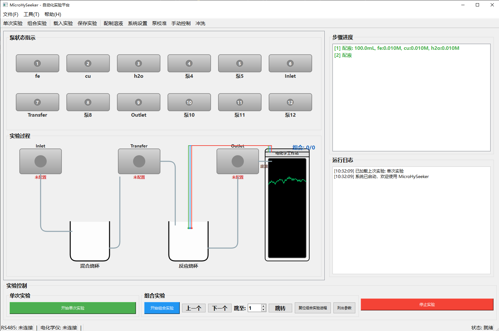
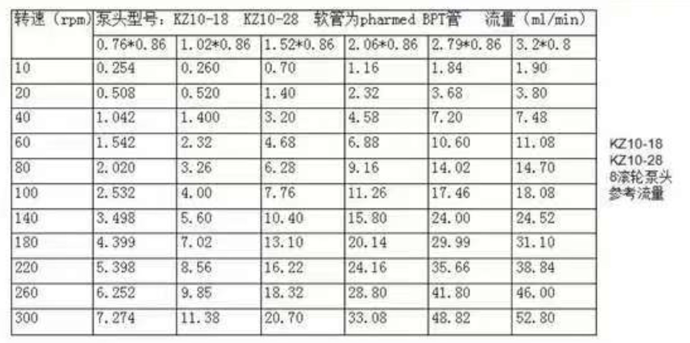

## 1.2026.02.08

### Todo：

- 修改主界面实验过程部分的排布与形状
- **制定并实行校准策略**
- 解决多管路输入问题

### 1.修改主界面实验过程部分的排布与形状

修改前：

修改后：

### 2.制定并实行校准策略

存在问题：

- 圈数问题，测多少圈
  - K系列泵参数：

    
  - J系列泵参数
  - 
  - 量筒5ml（精度0.1ml），10ml（精度0.2ml），25ml（精度0.5ml），50ml（精度0.5ml）
- 

### 3.解决多管路输入问题
