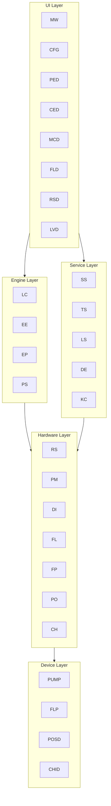
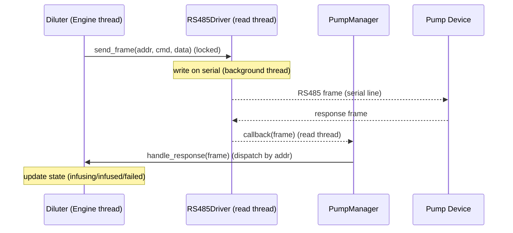
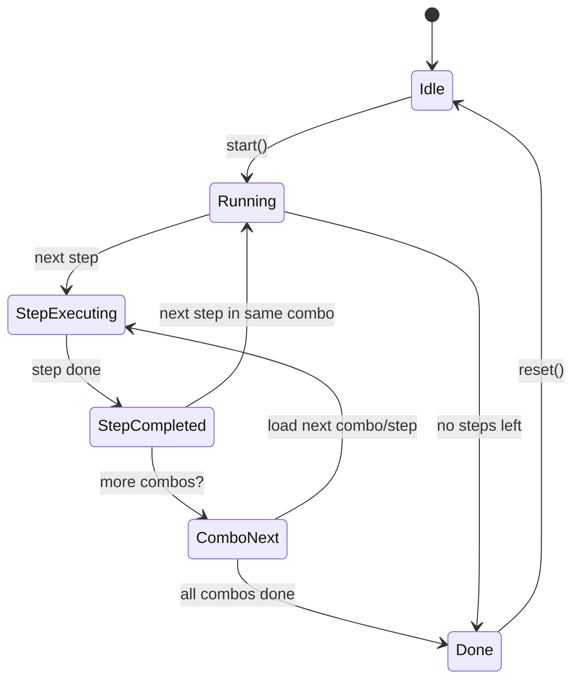

# 全栈系统架构蓝图（Mermaid）

## 1. 全局架构总览（flowchart）
```mermaid
flowchart LR
    subgraph UI[UI Layer (PySide6)]
        MW[MainWindow]
        CFG[ConfigDialog]
        PED[ProgramEditorDialog]
        CED[ComboEditorDialog]
        MCD[ManualControlDialog]
        FLD[FlusherDialog]
        RSD[RS485TestDialog]
        LVD[LogViewerDialog]
    end
    subgraph SV[Service Layer]
        SS[SettingsService]
        LS[LoggerService (QtSignal)]
        TS[TranslatorService]
        DE[DataExporter]
        KC[KafkaClient (optional)]
    end
    subgraph CTX[Context / Engine]
        LC[LibContext]
        EE[ExperimentEngine (tick)]
        EP[ExpProgram]
        PS[ProgStep]
    end
    subgraph HW[Hardware Layer]
        RS[RS485Driver (threaded)]
        PM[PumpManager]
        DI[Diluter*]
        FL[Flusher]
        FP[FlusherPump*]
        PO[Positioner (optional)]
        CH[CHIInstrument (real/mock)]
    end
    subgraph DEV[Device Layer]
        PUMP[RS485 Pumps (addr 1..N)]
        FLP[Flusher Pumps (inlet/outlet/transfer)]
        POSD[Positioner Device]
        CHID[CHI Device]
    end

    MW -->|run/stop/config| EE
    MW -->|config edit| CFG
    MW -->|prog edit| PED
    PED -->|combo edit| CED
    MW -->|manual| MCD
    MW -->|flush debug| FLD
    MW -->|RS485 debug| RSD
    MW -->|logs| LVD

    CFG --> SS
    PED --> EP
    CED --> EP
    EE --> EP
    EE --> PS
    LC --> EE

    LC --> RS
    LC --> PM
    PM --> DI
    PM --> FP
    LC --> FL
    LC --> PO
    LC --> CH

    RS --> PUMP
    RS --> FLP
    PO --> POSD
    CH --> CHID

    LS --> MW
    LS --> LVD
    TS --> MW
    TS --> CFG
    TS --> PED
    TS --> CED
    TS --> MCD
    TS --> FLD
    TS --> RSD
    TS --> LVD

    KC -. optional .-> MW
    DE -. export .-> MW

    EE -->|call| DI
    EE -->|call| FL
    EE -->|call| PO
    EE -->|call| CH

    RS -->|callback| PM
    PM -->|dispatch| DI
    PM -->|dispatch| FP

    note right of DI: *Dynamic pumps (6-12), config-driven<br/>mock mode supported
```

## 2. 模块分层架构（block diagram）


## 3. 动态泵通信流程（sequence）


## 4. 实验引擎状态机（stateDiagram）


## 5. 前端核心信号流（sequence）
```mermaid
sequenceDiagram
    participant RS as RS485Driver (read thread)
    participant PM as PumpManager
    participant DEV as Device (Diluter/FP)
    participant LS as LoggerService
    participant MW as MainWindow (UI thread)
    participant LVD as LogViewer (UI thread)

    RS-->>PM: frame callback (bg thread)
    PM->>DEV: handle_response (bg thread, device-safe)
    DEV-->>LS: log(status) (thread-safe)
    LS-->>MW: log_signal(LogRecord)
    LS-->>LVD: log_signal(LogRecord)
    MW->>MW: update UI via QtSlot (UI thread)
    RS-->>MW: (optional) status_signal via QtSignal
    Note over MW: UI thread only; no direct HW thread access
```

## 6. 类关系图（classDiagram）

```mermaid
classDiagram
    class ExperimentEngine {
        -context: LibContext
        -program: ExpProgram
        -current_step: ProgStep
        -running: bool
        -combo_running: bool
        -tick_interval: float
        +load_program(ep)
        +prepare_steps()
        +start(combo: bool)
        +stop()
        +tick()
        +execute_step(step)
        +advance_step()
        +get_progress(): dict
    }

    class ExpProgram {
        -steps: List~ProgStep~
        -param_cur_values: dict
        -param_end_values: dict
        -param_intervals: dict
        -param_matrix: list~dict~
        -param_index: int
        -combo_enabled: bool
        +fill_param_matrix()
        +load_param_values(index)
        +next_combo()
        +select_combo(index)
        +serialize()
        +deserialize(data)
    }

    class ProgStep {
        -operation: OperationType
        -state: StepState
        -params: dict
        -duration: float
        +prepare(context)
        +start(context)
        +update_state(context, elapsed): StepState
        +get_desc(): str
        +reset()
    }

    class RS485Driver {
        -serial: Serial
        -lock: RLock
        -read_thread: Thread
        -callback: Callable
        -last_comm_time: datetime
        +open()
        +close()
        +send_frame(addr, cmd, data)
        +read_loop()
        +set_callback(cb)
        +discover_devices(): list~int~
        +encode_frame(...)
        +decode_frame(...)
    }

    class PumpManager {
        -driver: RS485Driver
        -diluters: dict~int,Diluter~
        -flusher_pumps: dict~int,FlusherPump~
        -address_map: dict~int,Any~
        -lock: RLock
        +register_diluters(cfg_list)
        +register_flusher(cfg)
        +register_device(addr, dev)
        +unregister_device(addr)
        +dispatch_frame(frame)
        +get(addr)
        +list_devices(): dict
    }

    class Diluter {
        -address: int
        -driver: RS485Driver
        -rpm: int
        -microstep: int
        -volume_per_rev: float
        -steps_per_rev: int
        -is_running: bool
        -has_infused: bool
        +infuse(volume_ml, forward=True)
        +stop()
        +is_infusing(): bool
        +has_infused(): bool
        +compute_steps(volume_ml): int
        +handle_response(frame)
    }

    class Flusher {
        -inlet: FlusherPump
        -outlet: FlusherPump
        -transfer: FlusherPump
        -cycle_count: int
        -current_cycle: int
        -current_phase: str
        -is_running: bool
        +set_cycles(n)
        +start()
        +stop()
        +advance_phase()
        +start_evacuate()
        +start_fill()
        +start_transfer()
        +get_phase()
    }

    class FlusherPump {
        -address: int
        -driver: RS485Driver
        -pump_rpm: int
        -direction: str
        -cycle_duration: float
        -is_running: bool
        +run()
        +stop()
        +is_pumping(): bool
        +handle_response(frame)
    }

    class CHIInstrument {
        -connected: bool
        -mock: bool
        -running: bool
        -technique: str
        -worker: Thread
        -data_points: list
        +initialize()
        +set_experiment(step: ProgStep)
        +run()
        +stop()
        +is_running(): bool
        +get_latest_points(): list
        +handle_real_data()
        +handle_mock_data()
        +export(path)
    }

    class SettingsService {
        -defaults_path: Path
        -user_path: Path
        -lock: RLock
        +load_defaults(): dict
        +load_user_settings(): dict
        +save_user_settings(settings)
        +merge_defaults(d,u): dict
        +validate_settings(raw): dict
        +get(key, default)
        +set(key, value)
    }

    class TranslatorService {
        -translations_dir: Path
        -locale: str
        -translations: dict
        -callbacks: list
        -lock: RLock
        +load_translations(locale)
        +gettext(key): str
        +set_locale(locale)
        +available_locales(): list
        +bind_reload_callback(cb)
    }

    class LoggerService {
        -logger: logging.Logger
        -handlers: list
        -ui_callback: Callable
        -queue: Queue
        +log(level,msg)
        +info/warning/error/debug/exception(...)
        +bind_ui_callback(cb)
        +add_file_handler(path)
        +add_console_handler()
    }
```

备注：类图突出关键字段与主要方法，细节以任务书为准。Dynamic pumps（Diluter/FlusherPump）由配置驱动，PumpManager 负责路由；mock 模式需在 RS485Driver/CHI/Positioner 层支持。 
